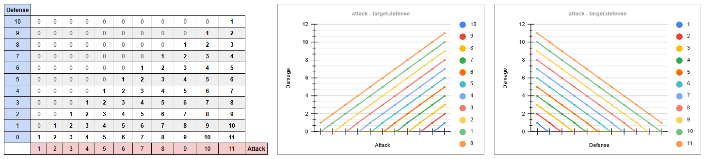
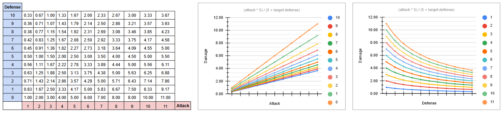
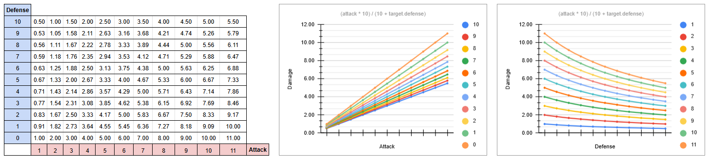
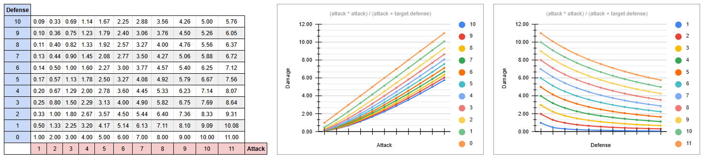

# Appendix 1: Damage Formulas

Combat numbers are not only balance data. The formula itself decides how readable combat feels, how useful defense is, and how hard it is to keep enemies relevant across several dungeon levels.

This appendix compares several damage formulas used in, or inspired by, video game combat systems. The goal is not to find a universal best formula, but to understand what each one does mathematically and what kind of game experience it tends to create.

The most important design question is how combat should feel, and in particular whether a hit may ever land for zero damage. That is a property of the formula itself, not of how large the numbers are: pure subtraction can reach zero at any scale. Stat scale still matters, since a formula that behaves well with `attack = 8` and `target.defense = 3` can become brittle when both numbers grow to three digits, but it is a secondary concern once you have decided how defense should behave.

!!! tip "Where to experiment"
    The damage formula in the tutorial lives in `Fighter.melee_attack()` in `game/entities/components/fighter.py`. `attack` in the formulas below corresponds to `self.attack`, and `target.defense` to `target.fighter.defense`. To try an alternative, replace the `damage` line in that method.

---

## 1. Simple Linear Formula

```python
damage = max(0, attack - target.defense)
```

This is the simplest formula, and the one most tutorials reach for first: easy to read and easy to debug. If the attacker has `5` attack and the defender has `2` defense, the result is `3` damage. There is no hidden curve. This tutorial started here too, but moved to the attacker-scaled formula in section 3 once defense could grow past attack; the worked example and "Choosing a Formula" below explain why.

Many traditional roguelikes favor small, readable mitigation systems over large percentage curves. This formula fits that design style: numbers stay small, outcomes are easy to inspect, and players can reason about armor quickly.



### Intuition

The target's defense subtracts directly from incoming damage. Every point of defense prevents exactly one point of damage.

That makes equipment and stats very transparent: `+1 defense` means "take one less damage from each hit." For a teaching project, this clarity is valuable.

### Advantages

- Very easy for players and designers to understand.
- Very easy to implement and inspect in a debugger.
- Works well when attacker and target stats stay small.
- Makes each point of defense feel concrete and predictable.

### Disadvantages

- Damage reaches `0` when `target.defense` equals or exceeds `attack`.
- Scales poorly when stats grow a lot.
- Can create harsh thresholds where an enemy goes from dangerous to harmless after one or two defense upgrades.

### Scaling Behavior

The formula is sensitive to absolute differences. `attack = 10` against `target.defense = 8` deals `2` damage, while `attack = 100` against `target.defense = 98` also deals `2` damage.

Mathematically that is consistent, but game-feel can be strange. A high-attack character fighting a high-defense target may still produce tiny damage numbers if both stats grow at the same pace. The problem compounds when HP scales alongside attack and defense, as it usually does. Two high-level characters dealing 2 damage per hit while each sitting on 200 HP means a hundred turns to resolve a single fight. The formula has not broken, but the gameplay has.

The opposite problem also appears: if attacker power grows faster than target defense, damage grows without resistance. There is no diminishing return or ratio-based control.

[Cross-Formula Adjustments](#cross-formula-adjustments) at the end of this appendix covers additional rules that apply to any formula: minimum damage, rounding, caps, critical hits, and more.

---

## 2. Smoothed Formula with a Scale Constant

```python
damage = (attack * K) / (K + target.defense)
```

This formula makes defense reduce damage by a percentage-like curve instead of subtracting a fixed amount. A version of this pattern appears in many commercial RPGs and online games: rather than blocking a fixed number of points, armor reduces a fraction of incoming damage. It became common in games where stats grow across dozens of levels and pure subtraction would make high-defense characters completely immune to weak enemies.

The constant `K` gives the curve an easy reference point: when `target.defense = K`, damage is half of `attack`. Multiples of `K` continue that pattern: `2 * K` defense reduces damage to one third of `attack`, `3 * K` defense reduces it to one quarter, and so on.

In general:

```text
target.defense = N * K  ->  damage = attack / (N + 1)
```

**K = 5**:


**K = 10**:



### Intuition

`K` defines the defense scale of the game. It answers this question:

> How much defense should cut incoming damage roughly in half?

If `K = 10`, then `10` defense halves damage. If `K = 50`, then `50` defense halves damage.

`K` must be a positive number. A value at or below zero does not describe a useful defense scale: `K = 0` makes every hit against a positive defense deal nothing and divides by zero when `target.defense = 0`, and a negative `K` produces meaningless results.

Defense always helps, but it has diminishing returns. Going from `0` to `10` defense matters a lot when `K = 10`; going from `100` to `110` matters much less.

### Advantages

- Defense never naturally reduces damage to zero.
- Damage changes smoothly instead of hitting hard thresholds.
- `K` gives designers a direct tuning knob for the whole curve.
- Works better than the linear formula when defense can grow over time.

### Disadvantages

- Less intuitive than direct subtraction.
- A poorly chosen `K` can make defense feel either useless or overpowering.
- Needs rounding if we use integer damage.
- If attacker power grows a lot but `K` stays fixed, defense may stop matching the intended scale unless defense values grow too.

For example, with `attack = 20`, the same defense value means very different things depending on `K`:

| Target defense | `K = 5` | `K = 10` | `K = 25` |
| ---: | ---: | ---: | ---: |
| `0` | `20.0` | `20.0` | `20.0` |
| `5` | `10.0` | `13.3` | `16.7` |
| `10` | `6.7` | `10.0` | `14.3` |
| `25` | `3.3` | `5.7` | `10.0` |
| `50` | `1.8` | `3.3` | `6.7` |

A small `K` makes defense bite early. A large `K` makes the same defense value feel softer.

### Scaling Behavior

A low `K` makes defense reduce damage very quickly. For example, with `K = 5`, even modest defense values have a strong effect.

A high `K` makes defense softer. With `K = 50`, the defender needs much larger defense values before damage is heavily reduced.

The important point is that `K` is an explicit assumption about stat scale. If your game uses attack and defense values around `5` to `20`, then `K = 10` can be reasonable. If your game uses values around `200`, `K = 10` will make defense behave very aggressively unless defense values are tuned carefully.

[Cross-Formula Adjustments](#cross-formula-adjustments) at the end of this appendix covers additional rules that apply here too: minimum damage, rounding, damage caps, critical hits, and more.

---

## 3. Attacker-Scaled Formula

```python
damage = (attack * attack) / (attack + target.defense)
```

This is the formula `Fighter.melee_attack()` uses in the tutorial's main path, from Part 6 onward (`target.defense` is `target.fighter.defense` in the actual code). It is similar to the previous one, but replaces the fixed constant `K` with the attacker's own `attack` value.

Starting from:

```python
damage = (attack * K) / (K + target.defense)
```

If we set:

```python
K = attack
```

We get:

```python
damage = (attack * attack) / (attack + target.defense)
```

The key idea is that the relevant question is no longer "how much defense do you have?" but "how much defense do you have *relative to your attacker*?" This makes the formula appealing in games where enemies span a wide power range and a single global constant would struggle to stay calibrated across all of them.



### Intuition

The defense scale follows the attacker. A high-attack creature requires proportionally high defense to reduce its damage. A low-attack creature is affected strongly by even modest defense.

When `target.defense` equals `attack`, damage is cut in half:

```text
damage = attack / 2 when target.defense = attack
```

This makes the formula relative. Defense is not judged against a global constant, but against the offensive level of the attacker.

### Advantages

- Automatically adapts to different attacker scales.
- Avoids hard zero-damage thresholds.
- Keeps defense meaningful relative to the attacker.
- Reduces the need to pick a global `K`.
- Works well when attacker values vary widely across enemies or levels.

### Disadvantages

- Harder to explain than linear subtraction.
- Still needs rounding if we use integer damage.
- Very high attack values can partially overpower moderate defense because the curve scales with attack.
- Designers lose the simple global tuning knob that `K` provided.

Because the formula is relative to `attack`, the same percentages work at any stat scale:

| Target defense | Damage result |
| ---: | ---: |
| `0%` of attack | `100%` of attack |
| `25%` of attack | `80%` of attack |
| `50%` of attack | `67%` of attack |
| `100%` of attack | `50%` of attack |
| `200%` of attack | `33%` of attack |

So an enemy with `10` attack deals about `5` damage against `10` defense, while an enemy with `100` attack deals about `50` damage against `100` defense.

### Scaling Behavior

The key behavior is proportional scaling:

- When the attack value is high, the target needs proportionally high defense to reduce damage heavily.
- When the attack value is low, even small defense values have impact.
- The reduction stays relative to the attacker's offensive level.
- When `target.defense` equals `attack`, damage is divided by `2`.

This is useful when enemies across the game have very different attack values. A troll with high attack is not neutralized by the same flat defense value that shuts down an orc.

[Cross-Formula Adjustments](#cross-formula-adjustments) at the end of this appendix covers additional rules that apply here too: minimum damage, rounding, critical hits, armor types, and more.

---

## Cross-Formula Adjustments

The rules in this section are independent of which formula you choose. They can be layered on top of any of the formulas above.

### Minimum Damage

All formulas discussed here can produce zero damage: the linear formula when `target.defense >= attack`, and the smoothed formulas when defense grows large relative to the attacker and the result is rounded down to zero. Whether to guarantee a minimum hit is a design decision.

Consider a horde of weak enemies. There are so many of them that they should be able to hurt you, but if their attack is too low to overcome your defense, every hit deals zero and the threat disappears entirely. A minimum damage rule keeps weak enemies relevant without changing the base formula.

Treat the minimum as a named constant, not a magic number embedded directly in the formula.

- **Fixed minimum** keeps every successful hit relevant:

    ```python
    damage = max(MIN_DAMAGE, formula_result)
    ```

    `MIN_DAMAGE = 1` is the most common choice. It prevents complete shutdown but lets very weak attackers chip away at very strong defenders indefinitely.

- **Percentage-based minimum** scales with the attacker:

    ```python
    damage = max(MIN_DAMAGE_RATIO * attack, formula_result)
    ```

    `MIN_DAMAGE_RATIO = 0.1` guarantees at least 10% of the attacker's `attack` always gets through. The floor grows with the attacker, so it stays proportional across a wide range of values.

    This is usually the better choice when attack values can vary a lot.

### Rounding

This tutorial stores both damage and HP as floats and shows one decimal (`{damage:.1f}`), so it never rounds: the decimal value is the result. Rounding is only a question if you prefer whole-number damage. It matters most for the smoothed formulas, whose division produces non-integer results; the linear formula with integer stats never produces decimals, though rounding can still appear there once you add multiplicative variance.

- **Round down** (`int()` or `math.floor()`): predictable, slightly favors the defender. The most common default.

- **Round up** (`math.ceil()`): keeps attacks more threatening, slightly favors the attacker.

- **Round to nearest** (`round()`): smoother on average, but less transparent to the player.

!!! warning "Python's `round()` uses bankers' rounding"
    Exact `.5` values do not always round up. They round to the nearest **even** number, so the direction depends on the neighbor:

    ```python
    round(1.5) == 2
    round(2.5) == 2
    round(3.5) == 4
    round(4.5) == 4

    round(1.4999) == 1
    round(2.4999) == 2
    ```

    This rarely affects gameplay, but it can surprise you when checking examples by hand.

    If you specifically want the familiar "round half up" rule, and since damage is never negative, a one-liner is enough (these are not safe for negative inputs):

    ```python
    def round_half_up_positive(x):
        return math.floor(x + 0.5)

    def round_half_down_positive(x):
        return math.ceil(x - 0.5)
    ```

    Now the same `.5` cases behave predictably:

    ```python
    round_half_up_positive(1.5) == 2
    round_half_up_positive(2.5) == 3
    round_half_up_positive(3.5) == 4
    round_half_up_positive(4.5) == 5

    round_half_down_positive(1.5) == 1
    round_half_down_positive(2.5) == 2
    round_half_down_positive(3.5) == 3
    round_half_down_positive(4.5) == 4
    ```

    For game damage this is rarely worth it; reach for it only if exact `.5` ties are visible and bother players.

A common pattern combining rounding with a minimum:

```python
damage = max(MIN_DAMAGE, round(formula_result))
```

### Damage Variance

Adding variance makes repeated attacks feel less mechanical. The same attacker against the same defender produces slightly different results each time.

- **Multiplicative variance** scales with the result:

    ```python
    variance = random.uniform(0.85, 1.15)
    damage = max(MIN_DAMAGE, round(formula_result * variance))
    ```

- **Additive spread** uses a fixed range:

    ```python
    spread = random.randint(-SPREAD, SPREAD)
    damage = max(MIN_DAMAGE, formula_result + spread)
    ```

Multiplicative variance stays proportional at any damage level. Additive spread has more relative impact at low damage values than at high ones.

Some games tie the variance range to attacker skill: a character with high dexterity or long experience with a weapon type produces more consistent damage, while an untrained character swings wildly. In practice this means replacing the fixed bounds (`0.85, 1.15`) with values that narrow as the relevant skill increases. Both stats can contribute at once, or either one alone.

**The trade-off is transparency**:

Variance makes individual hits harder to predict, which adds surprise but reduces the player's ability to plan. Turn-based games with small HP pools, like this tutorial, often skip variance because each hit matters and predictability helps the player understand cause and effect.

### Other Adjustments

These rules can be combined with any of the formulas discussed here:

- **Maximum damage**: cap the result to prevent extreme attack values from one-shotting. Useful when attack can grow without a natural ceiling.
- **Armor penetration**: subtract only a fraction of `target.defense`, or ignore it entirely on special attacks.
- **Hit chance separation**: let defense reduce damage while a separate stat controls whether the attack lands at all (dodge, parry, block). Splits defensive utility across two distinct mechanics.
- **Critical hits**: apply a multiplier to the damage after the base formula. Adds a high-damage outcome without changing the defense side of the formula.
- **Separate armor types**: use different defense values depending on damage source (physical, magical, elemental). Each source then has its own effective defense.

---

## Comparative Summary

| Formula | Clarity | Zero-damage risk | Scaling behavior | Main tuning knob | Best fit |
| --- | --- | --- | --- | --- | --- |
| Simple linear | Highest | High (needs a minimum) | Strong hard thresholds | Stat values themselves | Teaching and fully transparent combat |
| Fixed-`K` smoothed | Medium | Low | Smooth, tied to one global scale | `K` | Smooth mitigation with one tuning knob |
| Attacker-scaled | Lowest | Low | Smooth, relative to each attacker | Attack-to-defense ratios | Enemies across a wide power range |

### Simple Linear Formula

Use when:

- You want combat to be fully transparent and easy to debug, as a teaching project does.
- You want defense to feel direct and tactical: each point blocks exactly one point.
- You want the player to understand the result without a calculator.
- You are willing to add a minimum damage rule to stop hits from landing for zero.

Avoid it, or add extra rules, when:

- Attacker and target stats can grow into high values.
- You need smooth progression across many tiers of gear.
- You want weak enemies to remain at least slightly threatening.

### Fixed-K Smoothed Formula

Use when:

- You want defense to reduce damage smoothly.
- You want to avoid zero-damage thresholds.
- You know the approximate scale of defense values in advance.
- You want one designer-facing constant to tune the whole curve.

Avoid it, or revisit `K`, when:

- Your stat scale changes dramatically across the game.
- Different enemy families use very different stat ranges.
- You do not want designers to reason about curves or ratios.

### Attacker-Scaled Formula

Use when:

- Attacker values span a wide range.
- You want defense to scale naturally with enemy strength.
- You want fewer global tuning constants.
- You want smoother behavior than `attack - defense`.

Be careful when:

- You want defense to represent a fixed amount of protection.
- You want low-level enemies to remain dangerous against high-defense targets.
- You need very transparent numbers for players.

### A Worked Example with Tutorial Numbers

It helps to see the three formulas side by side at the scale this tutorial actually uses. The player has `attack = 5` (or `9` with the best weapon equipped), the Orc has `defense = 1`, and the Troll has `defense = 0`. The smoothed column uses `K = 10`.

| Matchup | Linear | Fixed-`K` (`K = 10`) | Attacker-scaled |
| --- | ---: | ---: | ---: |
| attack `5` vs Orc (`defense 1`) | `4` | `4.5` | `4.2` |
| attack `5` vs Troll (`defense 0`) | `5` | `5.0` | `5.0` |
| attack `9` vs Orc (`defense 1`) | `8` | `8.2` | `8.1` |

The numbers are almost identical. At this starting scale the three formulas barely disagree, so if defense could never grow, the extra machinery of the smoothed versions would buy very little.

But this tutorial's equipment system (Part 13) does let defense grow, through `defense_bonus` on armor, and the linear formula's floor is exactly what breaks once `target.defense` catches up to `attack`: a monster the player used to fight becomes permanently unable to hurt them, not because the fight got harder, but because subtraction hit zero. That is why the tutorial uses the attacker-scaled formula (section 3) instead: at floor-1 stats it plays almost identically to the linear formula, and it keeps behaving sensibly once defense grows later. The differences only become visually decisive once stats grow or defense can approach attack, which is the situation the rest of this appendix is about.

---

## Choosing a Formula

Two questions drive the choice, and they matter in this order.

### First: is a zero-damage result acceptable?

The most important property is not the stat scale, it is whether the formula can drop to zero damage and whether that fits the game you want.

Reaching zero is a structural property of subtraction, not a side effect of large numbers. The linear formula deals nothing whenever `target.defense >= attack`, and that happens with tiny values just as easily as with big ones: `attack = 1` against `target.defense = 1` already deals zero. The scale only changes how often you cross that threshold, not whether the threshold exists.

For most games this is the deciding factor. A fight where one side deals zero, or takes zero, usually stops being interesting: weak enemies become harmless, high-defense targets become walls, and the player has no reason to keep attacking. A level-1 fighter losing to a level-100 one is fair, but landing a hit for literally zero rarely feels good.

There are two ways to handle it:

- Keep the linear formula and add a [minimum damage](#minimum-damage) rule. This is the most common choice and works well with small, readable stats.
- Use a smoothed formula (2 or 3), where defense reduces damage by a fraction and never naturally reaches zero. Rounding can still floor a result to zero, so a minimum damage rule is often layered on anyway.

Either way, deciding what zero means in your game comes before tuning any single number.

### Second: subtraction or a smooth curve?

This is a structural choice, and it is not really about stat scale. The same dungeon can run any of the three formulas at the same numbers; what changes is how defense behaves, not how big the values are.

For most games, the two smoothed formulas (2 and 3) are the better default:

- Defense never collapses to a hard zero threshold. It always does something, with diminishing returns.
- Damage changes gradually instead of flipping an enemy from dangerous to harmless after a single defense upgrade.
- Weak attackers stay at least slightly threatening, and high-defense targets never become fully immune.
- The attacker-scaled formula goes one step further and keeps defense meaningful relative to each attacker, which helps when enemies span a wide power range.

This tutorial uses the attacker-scaled formula (section 3), for exactly that last reason: monsters range from a floor-1 troll to a deep-dungeon ogre, and the player's own defense grows through equipment, so a formula where defense can quietly become an absolute wall was not an option.

The linear formula is still a fair choice for many projects, mostly for what it teaches rather than how it plays:

- It is the easiest to read, debug, and explain: each point of defense blocks exactly one point of damage.
- It keeps numbers small and outcomes fully predictable.
- It pairs naturally with a [minimum damage](#minimum-damage) rule, which patches its main weakness.

So the honest recommendation is: prefer a smoothed formula whenever defense can grow over the course of the game, which is why this tutorial does, and reach for the linear one only when you can guarantee defense stays comfortably below attack, or you are willing to add a minimum damage rule to cover the gap.

The formula is part of the game's progression model. Revisit it whenever you change how combat is meant to feel, not only when the numbers grow. Balance problems often come not from individual values, but from a formula whose behavior no longer matches the game, most often a zero-damage gap where the design needed a guaranteed hit.
