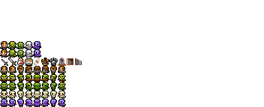
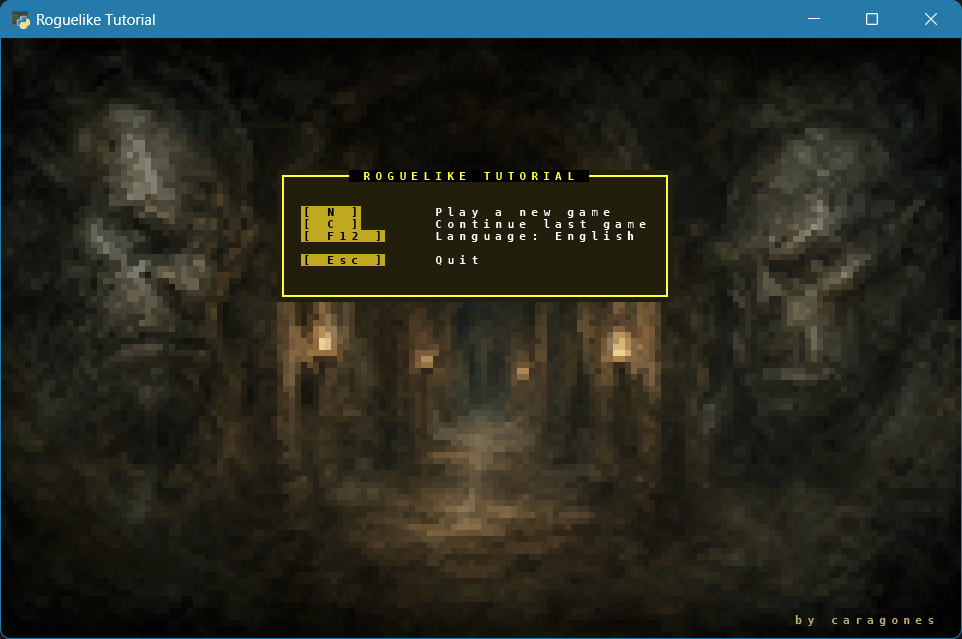
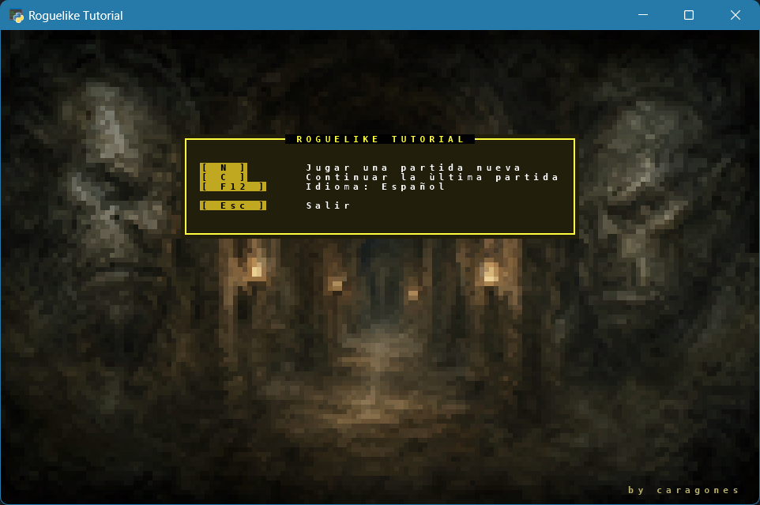
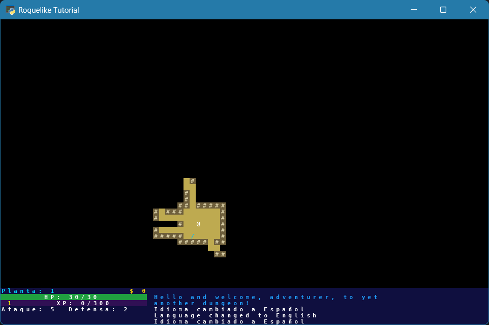

# Appendix 10: Localization

This appendix is meant to be read after Part 13. It touches the font, the menu, the HUD, the message log, entity names, item names, save-file compatibility, and a few places where Python's import timing can quietly fool you.

Localization is not the flashiest feature in a roguelike, but it is a useful stress test for the codebase. It asks a simple question: how many places did we let player-facing text leak into gameplay code? By the end of this appendix the answer should be: almost none.

We will build four small pieces:

1. Extra glyphs in the tileset, so letters such as `ñ`, `á`, `ç`, `ø`, `ł`, and `ș` can actually render.
2. One message class per language, with English as the base language and Spanish as the first translation.
3. A single active-language pointer, `Messages.current`, picked from the OS locale at startup and switchable at runtime with `F12`.
4. Dynamic entity names, so items, monsters, stairs, and corpses follow the active language instead of freezing whatever language happened to be active when `factories.py` was imported.

The last point is the part that makes this more than a find-and-replace exercise. Text printed into the `MessageLog` is history, so it stays as it was written. Entity names are live game data, so they should keep up.

---

## Letters First

Python strings are already Unicode. `console.print(x, y, "¿Dónde está el orco?")` accepts that text just fine. The problem is lower down: the tcod tileset can only draw codepoints that have been mapped to real cells in the image.

The sheet used by the tutorial, `CHARMAP_TCOD`, covers ASCII, box drawing, blocks, and a few symbols. It does not include every Latin letter a translated game might need. If you print an unmapped `ñ`, tcod does not raise an exception. It simply draws nothing for that tile. Missing glyphs are silent bugs, so always look at the window, not just at the terminal output.

Spanish needs `ñ`, accented vowels, `ü`, `¡`, and `¿`. Nearby languages need more: French `œ`, Portuguese `ã`, Nordic `ø` and `å`, Polish `ł`, Romanian `ș` and `ț`, Turkish `ğ`, Hungarian `ő`, and so on.

The two font files below add the glyph art in unused cells of the existing sheets:


[Download dejavu12x12_gs_tc_loc.png](images/dejavu12x12_gs_tc_loc.png){ download }

Save it over `res/dejavu12x12_gs_tc.png`, keeping the original name.

If you completed Appendix 7 and still use sprite mode, also save the sheet below: it carries the same accented letters, painted into the sprite version of the tileset.



[Download dejavu12x12_gs_tc_ex_loc.png](images/dejavu12x12_gs_tc_ex_loc.png){ download }

Save it over `res/dejavu12x12_gs_tc_ex.png`, keeping the original name. `main.py` already chooses between those names based on `sprites.USE_SPRITES`.

### Where The New Glyphs Fit

The important rule is the same one Appendix 7 used for sprites: never paint over a cell that another character already uses.

Here the useful free space is:

- Column 25 of row 2, used for `ß`.
- Columns 26 to 31 of rows 2 to 7, used for Spanish punctuation, `ñ`, `ç`, and accented vowels.
- Columns 10 to 25 of rows 5 to 7, used for the larger European set.

Rows 5 to 7 exist in both sheets: the plain 8-row sheet and the extended 13-row sprite sheet. That matters. `add_chars` runs no matter which sheet is loaded, so every row it touches must exist in both modes. If you remap to row 9, sprite mode might work, but non-sprite mode will crash with an out-of-range tile.

### Mapping Codepoints To Cells

Painting the art into the PNG is only half the job. The other half is telling tcod which Unicode codepoint belongs to which cell:

```python
def add_chars(tileset: tcod.tileset.Tileset) -> None:
    # pylint: disable=too-many-statements

    tileset.remap(ord('ß'), 25, 2)
    tileset.remap(ord('Ñ'), 26, 2)
    tileset.remap(ord('ñ'), 26, 3)
    tileset.remap(ord('Ç'), 26, 4)
    tileset.remap(ord('ç'), 26, 5)
    tileset.remap(ord('¡'), 26, 6)
    tileset.remap(ord('¿'), 26, 7)

    tileset.remap(ord('Á'), 27, 2)
    tileset.remap(ord('É'), 28, 2)
    tileset.remap(ord('Í'), 29, 2)
    tileset.remap(ord('Ó'), 30, 2)
    tileset.remap(ord('Ú'), 31, 2)
    tileset.remap(ord('á'), 27, 3)
    tileset.remap(ord('é'), 28, 3)
    tileset.remap(ord('í'), 29, 3)
    tileset.remap(ord('ó'), 30, 3)
    tileset.remap(ord('ú'), 31, 3)
```

That is the shape of the whole function: one honest remap per letter. It is not clever code, and it should not be. A data structure plus a loop would save lines, but it would make the sheet harder to audit by eye.

??? example "Full `add_chars` body"
    ```python
    def add_chars(tileset: tcod.tileset.Tileset) -> None:
        # pylint: disable=too-many-statements

        tileset.remap(ord('ß'), 25, 2)
        tileset.remap(ord('Ñ'), 26, 2)
        tileset.remap(ord('ñ'), 26, 3)
        tileset.remap(ord('Ç'), 26, 4)
        tileset.remap(ord('ç'), 26, 5)
        tileset.remap(ord('¡'), 26, 6)
        tileset.remap(ord('¿'), 26, 7)

        tileset.remap(ord('Á'), 27, 2)
        tileset.remap(ord('É'), 28, 2)
        tileset.remap(ord('Í'), 29, 2)
        tileset.remap(ord('Ó'), 30, 2)
        tileset.remap(ord('Ú'), 31, 2)
        tileset.remap(ord('á'), 27, 3)
        tileset.remap(ord('é'), 28, 3)
        tileset.remap(ord('í'), 29, 3)
        tileset.remap(ord('ó'), 30, 3)
        tileset.remap(ord('ú'), 31, 3)

        tileset.remap(ord('À'), 27, 4)
        tileset.remap(ord('È'), 28, 4)
        tileset.remap(ord('Ì'), 29, 4)
        tileset.remap(ord('Ò'), 30, 4)
        tileset.remap(ord('Ù'), 31, 4)
        tileset.remap(ord('à'), 27, 5)
        tileset.remap(ord('è'), 28, 5)
        tileset.remap(ord('ì'), 29, 5)
        tileset.remap(ord('ò'), 30, 5)
        tileset.remap(ord('ù'), 31, 5)

        tileset.remap(ord('Ä'), 27, 6)
        tileset.remap(ord('Ë'), 28, 6)
        tileset.remap(ord('Ï'), 29, 6)
        tileset.remap(ord('Ö'), 30, 6)
        tileset.remap(ord('Ü'), 31, 6)
        tileset.remap(ord('ä'), 27, 7)
        tileset.remap(ord('ë'), 28, 7)
        tileset.remap(ord('ï'), 29, 7)
        tileset.remap(ord('ö'), 30, 7)
        tileset.remap(ord('ü'), 31, 7)

        # Hungarian Ő/ő and Ű/ű share the umlaut art of Ö/ö and Ü/ü: at 12x12
        # the double acute and the umlaut dots are not visually distinguishable.
        tileset.remap(ord('Ő'), 30, 6)
        tileset.remap(ord('ő'), 30, 7)
        tileset.remap(ord('Ű'), 31, 6)
        tileset.remap(ord('ű'), 31, 7)

        tileset.remap(ord('Ă'), 10, 5)
        tileset.remap(ord('Â'), 11, 5)
        tileset.remap(ord('Ê'), 12, 5)
        tileset.remap(ord('Î'), 13, 5)
        tileset.remap(ord('Ô'), 14, 5)
        tileset.remap(ord('Û'), 15, 5)
        tileset.remap(ord('ă'), 10, 6)
        tileset.remap(ord('â'), 11, 6)
        tileset.remap(ord('ê'), 12, 6)
        tileset.remap(ord('î'), 13, 6)
        tileset.remap(ord('ô'), 14, 6)
        tileset.remap(ord('û'), 15, 6)

        tileset.remap(ord('Ã'), 11, 7)
        tileset.remap(ord('ã'), 12, 7)
        tileset.remap(ord('Õ'), 14, 7)
        tileset.remap(ord('õ'), 15, 7)

        tileset.remap(ord('Œ'), 16, 5)
        tileset.remap(ord('œ'), 17, 5)
        tileset.remap(ord('Å'), 18, 5)
        tileset.remap(ord('å'), 19, 5)
        tileset.remap(ord('Ø'), 20, 5)
        tileset.remap(ord('ø'), 21, 5)
        tileset.remap(ord('Æ'), 22, 5)
        tileset.remap(ord('æ'), 23, 5)
        tileset.remap(ord('Ș'), 24, 5)
        tileset.remap(ord('ș'), 25, 5)
        # Turkish Ş/ş share the Romanian Ș/ș art: at 12x12 the cedilla and the
        # comma-below are not visually distinguishable, so one glyph serves both.
        tileset.remap(ord('Ş'), 24, 5)
        tileset.remap(ord('ş'), 25, 5)

        tileset.remap(ord('Ț'), 16, 6)
        tileset.remap(ord('ț'), 17, 6)
        tileset.remap(ord('Ł'), 18, 6)
        tileset.remap(ord('ł'), 19, 6)
        tileset.remap(ord('Č'), 20, 6)
        tileset.remap(ord('č'), 21, 6)
        tileset.remap(ord('Š'), 22, 6)
        tileset.remap(ord('š'), 23, 6)
        tileset.remap(ord('Ž'), 24, 6)
        tileset.remap(ord('ž'), 25, 6)

        tileset.remap(ord('Ć'), 16, 7)
        tileset.remap(ord('ć'), 17, 7)
        tileset.remap(ord('Ń'), 18, 7)
        tileset.remap(ord('ń'), 19, 7)
        tileset.remap(ord('Ř'), 20, 7)
        tileset.remap(ord('ř'), 21, 7)
        tileset.remap(ord('Ğ'), 22, 7)
        tileset.remap(ord('ğ'), 23, 7)
        tileset.remap(ord('İ'), 24, 7)
        tileset.remap(ord('ı'), 25, 7)
    ```

The comments about shared art are intentional. `Ş` and `Ș` are different Unicode letters, and `Ő` is not the same as `Ö`. At 12 pixels tall, those distinctions are too small to draw well, so the tutorial chooses a readable approximation and says so. On a larger font, those are the first compromises you would undo.

Add `add_chars` to `main.py`, right above `main()`: that is where the tileset already gets loaded, so the remap call belongs next to it. Then call it after loading the tileset:

```diff
 tileset = tcod.tileset.load_tilesheet(
     config.RES_DIR / "dejavu12x12_gs_tc.png",
     32,
     8,
     tcod.tileset.CHARMAP_TCOD,
 )
+add_chars(tileset)
```

!!! note "If you completed Appendix 7"
    Your tileset loading already branches on `sprites.USE_SPRITES` and ends with a `sprites.init_sprites(tileset)` call. `add_chars(tileset)` still goes right before that last line:

    ```diff
     tileset = tcod.tileset.load_tilesheet(
         config.RES_DIR / ("dejavu12x12_gs_tc_ex.png" if sprites.USE_SPRITES else "dejavu12x12_gs_tc.png"),
         32,
         (13 if sprites.USE_SPRITES else 8),
         tcod.tileset.CHARMAP_TCOD,
     )
    +add_chars(tileset)
     sprites.init_sprites(tileset)
    ```

!!! tip "Run it now"
    Add a throwaway line at the end of `MainMenuState.on_render`, such as `console.print(0, 0, "< ñÑáéíóú¡¿ >", fg=colors.WHITE)`, and start the game. You should see those letters drawn, not blank cells. Remove the line once you have confirmed it.
    The `<` and `>` are anchors, not test characters: they belong to `CHARMAP_TCOD` and always render. That makes a missing glyph easy to spot, since a blank cell between two visible brackets stands out far more than a blank cell alone at the start of the line.

    Remove the line once you have confirmed it.

---

## A Home For Text

Create `game/data/messages.py`. This file is the one place a translator should be able to open and say, "Here is the game's text."

Like every other file in the project, it starts with the future-annotations import, plus the standard library module that reports which language and region the operating system is configured for:

```python
from __future__ import annotations

import locale
```

The base language is English:

```python
class MessagesEN:
    TEST = "_ ÑñÇç¡¿ ÁÉÍÓÚáéíóú ÀÈÌÒÙàèìòù ÄËÏÖÜäëïöü ÂÊÎÔÛâêîôû ÃãÕõ Œœ ß Åå Øø Ææ Șș Țț Łł Čč Šš Žž Ćć Ńń Řř Ğğ İı Ăă ŐőŰű Şş"

    MENU_NEW_GAME    = "Play a new game"
    MENU_CONTINUE    = "Continue last game"
    MENU_LANGUAGE    = "Language: {language}"
    MENU_QUIT        = "Quit"
    LANGUAGE_ENGLISH = "English"
    LANGUAGE_SPANISH = "Spanish"
    LANGUAGE_CHANGED = "Language changed to {language}"

    NAME_PLAYER        = "Player"
    NAME_ORC           = "Orc"
    NAME_HEALTH_POTION = "Health Potion"
    CORPSE_NAME        = "remains of {name}"

    WELCOME_MESSAGE = "Hello and welcome, adventurer, to yet another dungeon!"
    ITEM_PICKED_UP  = "You picked up the {name}!"
    ATTACK_HIT      = "{attacker} attacks {target} for {damage:.1f} hit points"
```

The Spanish class inherits from it and overrides what has been translated:

```python
class MessagesES(MessagesEN):
    MENU_NEW_GAME    = "Jugar una partida nueva"
    MENU_CONTINUE    = "Continuar la última partida"
    MENU_LANGUAGE    = "Idioma: {language}"
    MENU_QUIT        = "Salir"
    LANGUAGE_ENGLISH = "Inglés"
    LANGUAGE_SPANISH = "Español"
    LANGUAGE_CHANGED = "Idioma cambiado a {language}"

    NAME_PLAYER        = "Jugador"
    NAME_ORC           = "Orco"
    NAME_HEALTH_POTION = "Poción de salud"
    CORPSE_NAME        = "restos de {name}"

    WELCOME_MESSAGE = "¡Hola y bienvenido, aventurero, a otra mazmorra más!"
    ITEM_PICKED_UP  = "¡Has recogido {name}!"
    ATTACK_HIT      = "{attacker} ataca a {target} causando {damage:.1f} puntos de daño"
```

The classes above are a starting excerpt, enough to see the shape of the pattern. The finished file defines more than a hundred message keys, one for every player-facing string used later in this appendix: menus, HUD, inventory, level-up, targeting prompts, and combat. Copy the full classes from the collapsible below now, so the call sites shown in the rest of this appendix have something to resolve against.

??? example "Full `MessagesEN` and `MessagesES`"
    ```python
    class MessagesEN:
        TEST                         = "_ ÑñÇç¡¿ ÁÉÍÓÚáéíóú ÀÈÌÒÙàèìòù ÄËÏÖÜäëïöü ÂÊÎÔÛâêîôû ÃãÕõ Œœ ß Åå Øø Ææ Șș Țț Łł Čč Šš Žž Ćć Ńń Řř Ğğ İı Ăă ŐőŰű Şş"

        MENU_NEW_GAME                = "Play a new game"
        MENU_CONTINUE                = "Continue last game"
        MENU_LANGUAGE                = "Language: {language}"
        MENU_QUIT                    = "Quit"
        LANGUAGE_ENGLISH             = "English"
        LANGUAGE_SPANISH             = "Spanish"
        LANGUAGE_CHANGED             = "Language changed to {language}"

        NO_SAVED_GAME                = "No saved game to load"
        FAILED_TO_LOAD_SAVE          = "Failed to load save:\n{error}"

        POPUP_TITLE                  = "Message"
        POPUP_HINT                   = "Press any key"

        GAME_OVER_TITLE              = "GAME OVER"
        GAME_OVER_FLAVOR             = "The dungeon claims another adventurer"
        RETURN_TO_MENU               = "Return to menu"
        STAT_TURNS                   = "Turns:"
        STAT_KILLS                   = "Kills:"
        STAT_GOLD                    = "Gold:"

        HUD_HP                       = "HP"
        HUD_FLOOR                    = "Floor"
        HUD_ATTACK                   = "Attack"
        HUD_DEFENSE                  = "Defense"
        HUD_XP                       = "XP"
        ENTITY_DETAILS               = "{name} (HP: {hp:.1f}/{max_hp:.1f}, ATK: {attack:.1f}, DEF: {defense:.1f})"

        NAME_PLAYER                  = "Player"
        NAME_ORC_DAGGER              = "Orc Dagger"
        NAME_ORC                     = "Orc"
        NAME_TROLL                   = "Troll"
        NAME_GHOUL                   = "Ghoul"
        NAME_OGRE                    = "Ogre"
        NAME_STAIRS                  = "Stairs"
        NAME_HEALTH_POTION           = "Health Potion"
        NAME_BACKPACK_GROWING_SCROLL = "Backpack Growing Scroll"
        NAME_CONFUSION_SCROLL        = "Confusion Scroll"
        NAME_FIREBALL_SCROLL         = "Fireball Scroll"
        NAME_LIGHTNING_SCROLL        = "Lightning Scroll"
        NAME_MAPPING_SCROLL          = "Mapping Scroll"
        NAME_DRAIN_SCROLL            = "Drain Scroll"
        NAME_TELEPORT_SCROLL         = "Teleport Scroll"
        NAME_CHEST                   = "Chest"
        NAME_DAGGER                  = "Dagger"
        NAME_SWORD                   = "Sword"
        NAME_LEATHER_ARMOR           = "Leather Armor"
        NAME_CHAIN_MAIL              = "Chain Mail"
        CORPSE_NAME                  = "remains of {name}"

        LEVEL_UP_TITLE               = "Level Up"
        LEVEL_UP_CONGRATS            = "Congratulations! You level up!"
        SELECT_ATTRIBUTE_PROMPT      = "Select an attribute to increase:"
        ATTRIBUTE_CONSTITUTION       = "Constitution"
        ATTRIBUTE_STRENGTH           = "Strength"
        ATTRIBUTE_AGILITY            = "Agility"
        BONUS_HP                     = "+{amount} HP"
        BONUS_ATTACK                 = "+{amount:g} attack"
        BONUS_DEFENSE                = "+{amount:g} defense"
        FROM_CURRENT_VALUE           = "from {value}"

        INVENTORY_EMPTY              = "Your pack is empty"
        HEADER_EQUIPPED              = "Equipped"
        HEADER_EQUIPPABLE            = "Equippable"
        HEADER_ITEMS                 = "Items"
        SLOT_COUNT                   = "({used} / {capacity} slots)"

        USE_ITEM_TITLE               = "Use Item"
        SELECT_ITEM_TO_USE           = "Select an item to use:"
        DROP_ITEM_TITLE              = "Drop Item"
        SELECT_ITEM_TO_DROP          = "Select an item to drop:"

        WELCOME_MESSAGE              = "Hello and welcome, adventurer, to yet another dungeon!"

        BLOCKED_BY_ENTITY            = "The {name} blocks your way"
        ITEM_PICKED_UP               = "You picked up the {name}!"
        ITEM_USE_KEY_HINT            = "Press {key} to use it"
        ITEM_DROPPED                 = "You dropped the {name}"
        DESCEND_XP_REWARD            = "You descend deeper into the dungeon. You gain {xp} XP"
        DESCEND_STAIRCASE            = "You descend the staircase"
        ASCEND_STAIRCASE             = "You ascend the staircase"

        EXPLORATION_MESSAGES = (
            "You have explored 25% of this floor. You gain {xp} XP",
            "You have explored half of this floor. You gain {xp} XP",
            "You have explored 75% of this floor. You gain {xp} XP",
            "You have fully explored this floor! You gain {xp} XP",
        )

        INVALID_ENTRY                = "Invalid entry"

        INVENTORY_FULL               = "Your inventory is full"
        NOTHING_TO_PICK_UP           = "There is nothing here to pick up"
        NO_STAIRS_HERE               = "There are no stairs here"

        SELECT_TARGET                = "Select a target"
        SELECT_TARGET_LOCATION       = "Select a target location"
        SELECT_ENEMY                 = "Select an enemy"
        SELECT_TARGET_TO_DRAIN       = "Select a target to drain"
        SELECT_DESTINATION           = "Select a destination"

        HEALTH_FULL                  = "Your health is already full"
        BACKPACK_FULL                = "Your backpack cannot grow any larger"
        NO_ENEMY_CLOSE_ENOUGH        = "No enemy is close enough to strike"
        NEED_TARGET                  = "You need to select a target"
        MUST_SELECT_ENEMY            = "You must select an enemy to target"
        CANNOT_TARGET_UNSEEN         = "You cannot target an area you cannot see"
        CANNOT_CONFUSE_SELF          = "You cannot confuse yourself!"
        NO_TARGETS_IN_RADIUS         = "There are no targets in the radius"
        TARGET_TOO_FAR               = "The target is too far away"
        NEED_DESTINATION             = "You need to select a destination"
        TELEPORT_OUTSIDE_MAP         = "You cannot teleport outside the map"
        TELEPORT_UNEXPLORED_AREA     = "You cannot teleport to an unexplored area"
        TELEPORT_WALL                = "You cannot teleport into a wall"
        TELEPORT_ACTOR               = "You cannot teleport onto another actor"

        ENEMY_FLEE                   = "The {name} panics and flees!"
        CONFUSION_ENDED              = "The {name} is no longer confused"

        HEALING_POTION_USED          = "You consume the {name}, and recover {amount:.1f} HP!"
        BACKPACK_GROWS               = "Your backpack grows by {amount} slots"
        LIGHTNING_STRIKE             = "A lightning bolt strikes the {name} for {damage:.1f} damage!"
        CONFUSION_APPLIED            = "The eyes of the {name} look vacant, as it starts to stumble around!"
        FIREBALL_DAMAGE              = "The {name} is engulfed in a fiery explosion, taking {damage:.1f} damage!"
        MAGIC_MAPPING                = "The scroll reveals the layout of this floor!"
        LIFE_DRAIN                   = "You drain {amount:.1f} HP from the {name}"
        HP_RECOVERED                 = "You recover {amount:.1f} HP"
        TELEPORTED                   = "You teleport!"
        GOLD_FOUND                   = "You found {amount} gold!"

        ITEM_EQUIPPED                = "You equip the {name}"
        ITEM_REMOVED                 = "You remove the {name}"

        PLAYER_DEATH                 = "You died!"
        ENEMY_DEATH                  = "The {name} is dead!"
        XP_GROWTH                    = "You feel your experience grow!"

        ATTACK_CRITICAL              = "{attacker} attacks {target} for {damage:.1f} hit points. Critical hit!"
        ATTACK_HIT                   = "{attacker} attacks {target} for {damage:.1f} hit points"
        ATTACK_MISS                  = "{attacker} attacks {target} but does no damage"

    class MessagesES(MessagesEN):
        MENU_NEW_GAME                = "Jugar una partida nueva"
        MENU_CONTINUE                = "Continuar la última partida"
        MENU_LANGUAGE                = "Idioma: {language}"
        MENU_QUIT                    = "Salir"
        LANGUAGE_ENGLISH             = "Inglés"
        LANGUAGE_SPANISH             = "Español"
        LANGUAGE_CHANGED             = "Idioma cambiado a {language}"

        NO_SAVED_GAME                = "No hay ninguna partida guardada"
        FAILED_TO_LOAD_SAVE          = "No se pudo cargar la partida:\n{error}"

        POPUP_TITLE                  = "Mensaje"
        POPUP_HINT                   = "Pulsa cualquier tecla"

        GAME_OVER_TITLE              = "FIN DE LA PARTIDA"
        GAME_OVER_FLAVOR             = "La mazmorra reclama a otro aventurero"
        RETURN_TO_MENU               = "Volver al menú"
        STAT_TURNS                   = "Turnos:"
        STAT_KILLS                   = "Bajas:"
        STAT_GOLD                    = "Oro:"

        HUD_FLOOR                    = "Planta"
        HUD_ATTACK                   = "Ataque"
        HUD_DEFENSE                  = "Defensa"
        ENTITY_DETAILS               = "{name} (HP: {hp:.1f}/{max_hp:.1f}, ATQ: {attack:.1f}, DEF: {defense:.1f})"

        NAME_PLAYER                  = "Jugador"
        NAME_ORC_DAGGER              = "Daga de orco"
        NAME_ORC                     = "Orco"
        NAME_TROLL                   = "Trol"
        NAME_GHOUL                   = "Necrófago"
        NAME_OGRE                    = "Ogro"
        NAME_STAIRS                  = "Escaleras"
        NAME_HEALTH_POTION           = "Poción de salud"
        NAME_BACKPACK_GROWING_SCROLL = "Pergamino de ampliación de mochila"
        NAME_CONFUSION_SCROLL        = "Pergamino de confusión"
        NAME_FIREBALL_SCROLL         = "Pergamino de bola de fuego"
        NAME_LIGHTNING_SCROLL        = "Pergamino de relámpago"
        NAME_MAPPING_SCROLL          = "Pergamino de cartografía"
        NAME_DRAIN_SCROLL            = "Pergamino de drenaje"
        NAME_TELEPORT_SCROLL         = "Pergamino de teletransporte"
        NAME_CHEST                   = "Cofre"
        NAME_DAGGER                  = "Daga"
        NAME_SWORD                   = "Espada"
        NAME_LEATHER_ARMOR           = "Armadura de cuero"
        NAME_CHAIN_MAIL              = "Cota de malla"
        CORPSE_NAME                  = "restos de {name}"

        LEVEL_UP_TITLE               = "Subida de nivel"
        LEVEL_UP_CONGRATS            = "¡Enhorabuena! ¡Subes de nivel!"
        SELECT_ATTRIBUTE_PROMPT      = "Elige un atributo para mejorar:"
        ATTRIBUTE_CONSTITUTION       = "Constitución"
        ATTRIBUTE_STRENGTH           = "Fuerza"
        ATTRIBUTE_AGILITY            = "Agilidad"
        BONUS_HP                     = "+{amount} HP"
        BONUS_ATTACK                 = "+{amount:g} ataque"
        BONUS_DEFENSE                = "+{amount:g} defensa"
        FROM_CURRENT_VALUE           = "desde {value}"

        INVENTORY_EMPTY              = "Tu mochila está vacía"
        HEADER_EQUIPPED              = "Equipado"
        HEADER_EQUIPPABLE            = "Equipable"
        HEADER_ITEMS                 = "Objetos"
        SLOT_COUNT                   = "({used} / {capacity} espacios)"

        USE_ITEM_TITLE               = "Usar objeto"
        SELECT_ITEM_TO_USE           = "Elige un objeto para usar:"
        DROP_ITEM_TITLE              = "Soltar objeto"
        SELECT_ITEM_TO_DROP          = "Elige un objeto para soltar:"

        WELCOME_MESSAGE              = "¡Hola y bienvenido, aventurero, a otra mazmorra más!"

        BLOCKED_BY_ENTITY            = "{name} te bloquea el paso"
        ITEM_PICKED_UP               = "¡Has recogido {name}!"
        ITEM_USE_KEY_HINT            = "Pulsa {key} para usarlo"
        ITEM_DROPPED                 = "Has dejado {name}"
        DESCEND_XP_REWARD            = "Desciendes más profundo en la mazmorra. Ganas {xp} XP"
        DESCEND_STAIRCASE            = "Desciendes por las escaleras"
        ASCEND_STAIRCASE             = "Subes por las escaleras"

        EXPLORATION_MESSAGES = (
            "Has explorado el 25% de esta planta. Ganas {xp} XP",
            "Has explorado la mitad de esta planta. Ganas {xp} XP",
            "Has explorado el 75% de esta planta. Ganas {xp} XP",
            "¡Has explorado completamente esta planta! Ganas {xp} XP",
        )

        INVALID_ENTRY                = "Entrada no válida"

        INVENTORY_FULL               = "Tu inventario está lleno"
        NOTHING_TO_PICK_UP           = "No hay nada aquí para recoger"
        NO_STAIRS_HERE               = "Aquí no hay escaleras"

        SELECT_TARGET                = "Elige un objetivo"
        SELECT_TARGET_LOCATION       = "Elige una ubicación objetivo"
        SELECT_ENEMY                 = "Elige un enemigo"
        SELECT_TARGET_TO_DRAIN       = "Elige un objetivo al que drenar"
        SELECT_DESTINATION           = "Elige un destino"

        HEALTH_FULL                  = "Ya tienes la salud al máximo"
        BACKPACK_FULL                = "Tu mochila no puede crecer más"
        NO_ENEMY_CLOSE_ENOUGH        = "No hay ningún enemigo lo bastante cerca"
        NEED_TARGET                  = "Tienes que elegir un objetivo"
        MUST_SELECT_ENEMY            = "Tienes que elegir un enemigo como objetivo"
        CANNOT_TARGET_UNSEEN         = "No puedes apuntar a una zona que no ves"
        CANNOT_CONFUSE_SELF          = "¡No puedes confundirte a ti mismo!"
        NO_TARGETS_IN_RADIUS         = "No hay objetivos en el radio"
        TARGET_TOO_FAR               = "El objetivo está demasiado lejos"
        NEED_DESTINATION             = "Tienes que elegir un destino"
        TELEPORT_OUTSIDE_MAP         = "No puedes teletransportarte fuera del mapa"
        TELEPORT_UNEXPLORED_AREA     = "No puedes teletransportarte a una zona sin explorar"
        TELEPORT_WALL                = "No puedes teletransportarte dentro de una pared"
        TELEPORT_ACTOR               = "No puedes teletransportarte encima de otro actor"

        ENEMY_FLEE                   = "¡{name} entra en pánico y huye!"
        CONFUSION_ENDED              = "{name} ya no está confuso"

        HEALING_POTION_USED          = "Consumes {name} y recuperas {amount:.1f} HP"
        BACKPACK_GROWS               = "Tu mochila crece en {amount} espacios"
        LIGHTNING_STRIKE             = "Un rayo golpea a {name} causando {damage:.1f} de daño"
        CONFUSION_APPLIED            = "Los ojos de {name} se quedan en blanco, ¡y empieza a tambalearse!"
        FIREBALL_DAMAGE              = "{name} queda envuelto en una explosión de fuego, recibiendo {damage:.1f} de daño"
        MAGIC_MAPPING                = "¡El pergamino revela el mapa de esta planta!"
        LIFE_DRAIN                   = "Drenas {amount:.1f} HP de {name}"
        HP_RECOVERED                 = "Recuperas {amount:.1f} HP"
        TELEPORTED                   = "¡Te teletransportas!"
        GOLD_FOUND                   = "¡Has encontrado {amount} monedas de oro!"

        ITEM_EQUIPPED                = "Equipas {name}"
        ITEM_REMOVED                 = "Te quitas {name}"

        PLAYER_DEATH                 = "¡Has muerto!"
        ENEMY_DEATH                  = "¡{name} ha muerto!"
        XP_GROWTH                    = "¡Sientes que tu experiencia crece!"

        ATTACK_CRITICAL              = "{attacker} ataca a {target} causando {damage:.1f} puntos de daño. ¡Golpe crítico!"
        ATTACK_HIT                   = "{attacker} ataca a {target} causando {damage:.1f} puntos de daño"
        ATTACK_MISS                  = "{attacker} ataca a {target} pero no causa daño"
    ```

Two details are doing useful work here.

First, messages with data are plain `str.format` templates. They are not f-strings, because the item, attacker, target, damage, and so on do not exist when `messages.py` is imported. They exist later, at the call site:

```python
MessageLog.add_message(Messages.current.ITEM_PICKED_UP.format(name=item.name))
```

Second, `MessagesES(MessagesEN)` is deliberate. A missing Spanish translation falls back to English through normal Python attribute lookup. That is a good failure mode while a translation is in progress: a half-translated game is better than a crash or an empty string.

!!! info "Why this is different from `SpriteGlyphs`"
    Appendix 7 avoided inheriting `SpriteGlyphs` from `CharGlyphs` because the values changed type: characters became integers. Here every language stores strings, or tuples of strings, so inheritance is type-safe and useful.

!!! tip "Why English is the base language"
    `MessagesEN` is the base class, and `MessagesES` inherits from it, not the other way around. That is a deliberate default, not a rule: English is close to a lingua franca in game development and programming, so it makes a fallback most readers can understand even before a translation exists. Pick whichever language fits your own project; the mechanism works the same no matter which one is the base.

### The Active Language

The rest of the game should not import `MessagesEN` or `MessagesES` directly. It should ask the active pointer:

```python
class Messages:
    """Holds the active language class; Messages.current.XXX always reflects it."""
    current: type[MessagesEN] = MessagesEN
    lang: str = "en"


_LANGUAGES = {
    "en": MessagesEN,
    "es": MessagesES,
}


def set_lang(lang: str) -> None:
    if lang not in _LANGUAGES:
        raise ValueError(f"Unsupported language: {lang}")

    Messages.lang = lang
    Messages.current = _LANGUAGES[lang]
```

`Messages.current` is the class the game reads from. `Messages.lang` is the small stable id, useful for toggling and for saving a user preference later if you choose to add one. This is the same shape Appendix 7 used for `CurrentGlyphs`: a name annotated `type[...]` that holds a class, not an instance, so the whole game can switch behavior by reassigning one pointer.

!!! tip "Run it now"
    Temporarily add `from game.data.messages import Messages` to `game_states.py`'s imports (the permanent import for this file lands later, in Menus And Popups), then add `MessageLog.add_message(Messages.current.TEST)` as the last line of `GameState.__init__`. Start the game, press `N` for a new game, and check the message log: every symbol from the earlier glyph test should still show correctly, this time routed through the real message log pipeline, word wrapping included, instead of a raw `console.print`. That confirms both that the hundred-plus keys you just pasted import cleanly and that the log itself renders every accented letter.

    Remove the line once you have confirmed it.

!!! note "One import, every file"
    From here on, any file that calls `Messages.current` needs `from game.data.messages import Messages` added to its imports. This appendix only spells out that import line explicitly where it is shown for the first time, in `setup_game.py` and `game_states.py`. Add the same line yourself wherever else a diff below adds a `Messages.current` call:

    - `actions.py`
    - `hud.py`
    - `engine.py`
    - `entities/entity.py`
    - `entities/components/ai.py`
    - `entities/components/consumable.py`
    - `entities/components/equipment.py`
    - `entities/components/fighter.py`.

### Startup Locale

The default language comes from the operating system locale:

```python
def get_default_lang() -> str:
    lang = "en"
    raw_locale = locale.getlocale()[0]
    if raw_locale:
        language = raw_locale.split("_")[0].lower()
        if language in ("es", "spanish"):
            lang = "es"

    return lang


def set_default_lang() -> None:
    set_lang(get_default_lang())
```

On many systems Spanish looks like `es_ES`; on Windows it can look like `Spanish_Spain`. Splitting at `_` and checking `es` or `spanish` covers both without relying on `locale.normalize()`. That function only recognizes POSIX-style codes, so it does not help on Windows: `locale.normalize(locale.getlocale()[0])` just returns the same Windows-style string unchanged, for example `'English_United States'`.

Call this early in `main()`:

```diff
 from game.data import config, sprites
+from game.data.messages import set_default_lang
 ...
 def main() -> None:
+    set_default_lang()
+
     tileset = tcod.tileset.load_tilesheet(...)
```

That chooses the first language before the menu is drawn.

---

## Runtime Switching

Choosing a language at startup is enough for many tutorials. It is not enough to test localization comfortably. You do not want to change your OS locale every time you tweak a line of Spanish.

Add a debug key in `game/data/keys.py`:

```python
DEBUG_KEY_LANGUAGE = tcod.event.KeySym.F12
```

The toggle itself belongs in `messages.py`, next to `set_lang`:

```python
def toggle_lang() -> str:
    set_lang("es" if Messages.lang == "en" else "en")
    return Messages.lang


def get_current_language_name() -> str:
    if Messages.lang == "es":
        return Messages.current.LANGUAGE_SPANISH

    return Messages.current.LANGUAGE_ENGLISH
```

`get_current_language_name()` returns the name in the currently active language, so the English menu says `Language: English`, while the Spanish menu says `Idioma: Español`. That is also why both classes define `LANGUAGE_ENGLISH` and `LANGUAGE_SPANISH` instead of a single name for themselves: a future language picker needs to list every available language in whichever one is active, not just its own name.

### Menus And Popups

`BaseGameState.dispatch` handles the language key for states that do not have a game engine, such as the main menu and popup messages:

```diff
+from game.data.messages import Messages, get_current_language_name, toggle_lang
 ...
 class BaseGameState:
     def dispatch(self, event: tcod.event.Event) -> Action | BaseGameState | None:
         match event:
             case tcod.event.Quit():
                 raise SystemExit()

+            case tcod.event.KeyDown() if event.sym == keys.DEBUG_KEY_LANGUAGE:
+                toggle_lang()
+                return self
+
             case tcod.event.KeyDown():
                 return self.event_keydown(event)
```

The main menu also advertises the key. Before this appendix, `menu_options` was built after the panel size and position were already fixed: the old sizing used a fixed guess for `width` (`console.width // 2 - 2`) and a plain `height = 9`, since it never needed to know the option text. Once the language row is added, that stops working, because the panel now has to size itself from the actual, translated strings. `menu_options` therefore climbs above the size computation, and gains a language row plus a spacer:

```diff
         title_text = "ROGUELIKE TUTORIAL"
-        width = max(len(title_text) + 4, console.width // 2 - 2)
-        height = 9
-        x = (console.width - width) // 2
-        y = console.height // 3 - 5
-
-        _draw_panel(
-            console,
-            x,
-            y,
-            width,
-            height,
-            colors.MENU_TITLE,
-            colors.MENU_ROW_BG,
-            shadow=False,
-        )
-
-        title = f" {title_text} "
-        console.print(
-            x=x + (width - len(title)) // 2,
-            y=y,
-            text=title,
-            fg=colors.MENU_TITLE,
-            bg=colors.MENU_BG,
-        )

         menu_options = [
-            (keys.KEY_NEW_GAME, "Play a new game", True),
-            (keys.KEY_CONTINUE, "Continue last game", config.SAVE_PATH.exists()),
-            (keys.KEY_QUIT_GAME, "Quit", True),
+            (keys.KEY_NEW_GAME,  Messages.current.MENU_NEW_GAME, True),
+            (keys.KEY_CONTINUE,  Messages.current.MENU_CONTINUE, config.SAVE_PATH.exists()),
+            (
+                keys.DEBUG_KEY_LANGUAGE,
+                Messages.current.MENU_LANGUAGE.format(language=get_current_language_name()),
+                True,
+            ),
+            (None, "", False),
+            (keys.KEY_QUIT_GAME, Messages.current.MENU_QUIT, True),
         ]
```

That `(None, "", False)` row is just a visual spacer. `key_label` needs to accept it:

```python
def key_label(sym: tcod.event.KeySym | None) -> str:
    if sym is None:
        return ""
```

Because translated menu lines have different lengths, let the layout measure the actual strings instead of guessing a fixed width. This block takes over where the old fixed `width`/`height` used to sit, and `_draw_panel` plus the title now render after it, once `width` is known:

```diff
         key_labels = [key_label(sym) for sym, _, _ in menu_options]
-        key_width = max(len(label) for label in key_labels) + 2
-        row_x = x + 4
+        key_width  = max(len(label) for label in key_labels) + 2
+        description_width = max(len(description) for _, description, _ in menu_options)
+        content_width = key_width + 2 + description_width
+
+        width = max(
+            len(title_text) + 4,
+            content_width + 4,
+        )
+        height     = len(menu_options) + 6
+        x          = (console.width - width) // 2
+        y          = console.height // 3 - 5
+
+        _draw_panel(
+            console,
+            x,
+            y,
+            width,
+            height,
+            colors.MENU_TITLE,
+            colors.MENU_ROW_BG,
+            shadow=False,
+        )
+
+        title = f" {title_text} "
+        console.print(
+            x    = x + (width - len(title)) // 2,
+            y    = y,
+            text = title,
+            fg   = colors.MENU_TITLE,
+            bg   = colors.MENU_BG,
+        )
+
+        row_x = x + (width - content_width) // 2

         for index, (label, (_, description, enabled)) in enumerate(
             zip(key_labels, menu_options)
         ):
```

This is one of the quiet wins of localization work: a layout measured from the text it draws survives longer words without special cases. One more small shift follows from centering: the row loop's label print moves from `row_x + 2` to a bare `row_x`, since `row_x` is now already the centered start of the content block.

!!! tip "Run it now"
    Start the game and press `F12` in the main menu. The language row should flip between "Language: English" and "Idioma: Español", and the whole menu, title aside, should redraw in the new language, sized to fit the new labels. This confirms the message classes, the active-language pointer, and the runtime toggle all work together, before the next section wires the same toggle into actual gameplay.

    

    

### In-Game Switching

In game states, we can do one extra thing: add a message to the log.

```python
case tcod.event.KeyDown() if event.sym == keys.DEBUG_KEY_LANGUAGE:
    toggle_lang()
    MessageLog.add_message(
        Messages.current.LANGUAGE_CHANGED.format(language=get_current_language_name()),
        colors.WHITE,
    )
    return self
```

This does not create an `Action`, so it does not spend a turn. It only changes the language and redraws.

The message log itself is intentionally not retranslated. A line that was written in English stays English. A line written after the switch uses the new language. That matches how logs usually behave: they are records of events, not live labels.

!!! tip "Run it now"
    Start a game and press `F12` while playing. The log should show "Language changed to Spanish" or "Idioma cambiado a Español", and no enemy should get a turn out of it. Everything else the game prints, item names, combat lines, HUD labels, is still hardcoded in English at this point; that is what the rest of this appendix moves over.

    

---

## Moving The Game Text

With `Messages.current` in place, most of what is left is repetitive: find a hardcoded string, look up its key in `messages.py`, and replace one with the other. The rest of this section walks through that swap across the files that print player-facing text.

`game/setup_game.py`:

```diff
+from game.data.messages import Messages
+
 def new_game() -> Engine:
     ...
     MessageLog.add_message(
-        "Hello and welcome, adventurer, to yet another dungeon!",
+        Messages.current.WELCOME_MESSAGE,
         colors.WELCOME_TEXT,
     )
```

`game/actions.py`, inside `PickupAction.perform`:

```diff
-MessageLog.add_message(f"You picked up the {item.name}!")
+MessageLog.add_message(Messages.current.ITEM_PICKED_UP.format(name=item.name))
```

`game/entities/components/consumable.py`:

```diff
-raise Impossible("Your health is already full.")
+raise Impossible(Messages.current.HEALTH_FULL)
```

`game/entities/components/fighter.py`:

The old code built the message in two pieces: a shared prefix such as `f"{attacker_name} attacks {target.name}"`, plus a suffix that depended on the outcome (a critical hit, a normal hit, or a miss). That trick does not survive translation. Word order changes between languages: Spanish needs `"{attacker} ataca a {target} causando..."`, with the preposition `a` inserted before the target and the verb moved earlier in the sentence. A localized message has to be one whole-sentence template per outcome, never a prefix glued to a suffix:

```diff
-attack_msg    = f"{self.entity.name.capitalize()} attacks {target.name}"
+attacker_name = self.entity.name.capitalize()
 attack_color  = colors.PLAYER_ATTACK if self.entity.ai is None else colors.ENEMY_ATTACK

 if damage > 0:
     if critical_hit:
         MessageLog.add_message(
-            f"{attack_msg} for {damage:.1f} hit points. Critical hit!",
+            Messages.current.ATTACK_CRITICAL.format(attacker=attacker_name, target=target.name, damage=damage),
             attack_color,
         )

     else:
         MessageLog.add_message(
-            f"{attack_msg} for {damage:.1f} hit points.",
+            Messages.current.ATTACK_HIT.format(attacker=attacker_name, target=target.name, damage=damage),
             attack_color,
         )

     target.fighter.take_damage(damage, attacker=self.entity)

     # Part-12. Exercise 2: New monster: Ghoul
     if self.lifesteal > 0:
         drained_life = damage * self.lifesteal
         self.heal(drained_life)

 else:
     MessageLog.add_message(
-        f"{attack_msg} but does no damage.",
+        Messages.current.ATTACK_MISS.format(attacker=attacker_name, target=target.name),
         colors.ATTACK_MISS,
     )
```

Three templates instead of one prefix: `ATTACK_CRITICAL`, `ATTACK_HIT`, and `ATTACK_MISS` each spell out a complete sentence, because each one needs its own word order once translated.

The pattern repeats through AI messages, equipment messages, scrolls, potions, targeting prompts, game-over stats, level-up text, inventory headings, and HUD labels. The code that decides *when* something happens stays where it is. Only the words move.

### Targeting Defaults

Two call sites are not a plain string swap. `SingleRangedTargetingAction` and `AreaRangedTargetingAction`, in `game/actions.py`, take a `prompt` argument with a literal English default. A default value is chosen once, when Python reads the function signature, the same freeze problem as a class body:

```diff
 class SingleRangedTargetingAction(TargetingAction):
-    def __init__(self, item: Item, prompt: str = "Select a target.") -> None:
+    def __init__(self, item: Item, prompt: str | None = None) -> None:
         self.item = item
-        self.prompt = prompt
+        self.prompt = prompt or Messages.current.SELECT_TARGET
         self.callback = lambda pos: ItemAction(item=item, target_pos=pos)
```

```diff
 class AreaRangedTargetingAction(TargetingAction):
     def __init__(
         self,
         item:   Item,
         radius: int,
         color:  Color,
-        prompt: str = "Select a target location.",
+        prompt: str | None = None,
     ) -> None:
         self.item     = item
         self.radius   = radius
         self.color    = color
-        self.prompt   = prompt
+        self.prompt   = prompt or Messages.current.SELECT_TARGET_LOCATION
         self.callback = lambda pos: ItemAction(item=item, target_pos=pos)
```

`prompt` becomes `str | None`, and the fallback moves inside `__init__`, resolved every time an action is built instead of once when Python reads the function signature. Every consumable that calls these two classes with its own `prompt=` (confusion, fireball, drain, teleport) keeps working unchanged: it only overrides the default, and the default is what changed.

### HUD Labels

HUD code already builds strings from live numbers, so only the labels move, in `game/hud.py`:

```diff
-hp_text = f"HP: {int(current_value)}/{maximum_value}"
+hp_text = f"{Messages.current.HUD_HP}: {int(current_value)}/{maximum_value}"
```

```diff
-text = f"Floor: {dungeon_floor}",
+text = f"{Messages.current.HUD_FLOOR}: {dungeon_floor}",
```

The remaining HUD spots follow the same shape: attack and defense together, the XP bar, and the entity details shown when hovering the mouse over an actor:

```diff
-text = f"Attack: {int(attack)}  Defense: {int(defense)}",
+text = (
+    f"{Messages.current.HUD_ATTACK}: {int(attack)}  "
+    f"{Messages.current.HUD_DEFENSE}: {int(defense)}"
+),
```

```diff
-xp_text = f"XP: {current_xp}/{xp_to_next_level}"
+xp_text = f"{Messages.current.HUD_XP}: {current_xp}/{xp_to_next_level}"
```

```diff
-names_at_location.append(
-    f"{entity.name} "
-    f"(HP: {entity.fighter.hp:.1f}/{entity.fighter.max_hp:.1f}, "
-    f"ATK: {entity.fighter.attack:.1f}, "
-    f"DEF: {entity.fighter.defense:.1f})"
-)
+names_at_location.append(
+    Messages.current.ENTITY_DETAILS.format(
+        name=entity.name,
+        hp=entity.fighter.hp,
+        max_hp=entity.fighter.max_hp,
+        attack=entity.fighter.attack,
+        defense=entity.fighter.defense,
+    )
+)
```

### Popups And The Game-Over Screen

`PopupMessageState` builds its title and hint at render time, so both move as plain local variables in `game/game_states.py`:

```diff
-title = " Message "
-hint  = "Press any key"
+title = f" {Messages.current.POPUP_TITLE} "
+hint  = Messages.current.POPUP_HINT
```

The two places `MainMenuState` opens that popup also localize:

```diff
 case keys.KEY_CONTINUE:
     if not config.SAVE_PATH.exists():
-        return PopupMessageState(self, "No saved game to load.")
+        return PopupMessageState(self, Messages.current.NO_SAVED_GAME)

     try:
         return load_game(config.SAVE_PATH)

     except FileNotFoundError:
-        return PopupMessageState(self, "No saved game to load.")
+        return PopupMessageState(self, Messages.current.NO_SAVED_GAME)

     except Exception as ex:  # pylint: disable=broad-exception-caught
-        return PopupMessageState(self, f"Failed to load save:\n{ex}")
+        return PopupMessageState(self, Messages.current.FAILED_TO_LOAD_SAVE.format(error=ex))
```

`GameOverState.TITLE` gets its own fix, in The Import-Time Trap section next. Its flavor text, return-to-menu hint, and stats labels have no such freeze problem, they are plain locals read inside `on_render` every frame, so they move exactly like the HUD labels above:

```diff
 title     = f" {self.TITLE} "
-message   = "The dungeon claims another adventurer"
+message   = Messages.current.GAME_OVER_FLAVOR
 hint_key  = key_label(keys.KEY_QUIT_GAME)
-hint_text = "Return to menu"
+hint_text = Messages.current.RETURN_TO_MENU
 hint      = f"{hint_key} {hint_text}"
 stats = [
-    ("Turns:", str(self.engine.turn_count)),
-    ("Kills:", str(self.engine.player.fighter.kill_count)),
-    ("Gold:", str(self.engine.player.inventory.gold)),
+    (Messages.current.STAT_TURNS, str(self.engine.turn_count)),
+    (Messages.current.STAT_KILLS, str(self.engine.player.fighter.kill_count)),
+    (Messages.current.STAT_GOLD, str(self.engine.player.inventory.gold)),
 ]
```

### Text That Was In `config.py`

Part 11 stored `EXPLORATION_MESSAGES` in `game/data/config.py`, next to the XP thresholds that choose when those messages fire. That made sense before localization. Now the XP thresholds stay in `config.py`, but the prose moves to `messages.py`. Delete the `EXPLORATION_MESSAGES` tuple from `config.py` and update the one place that read it, in `game/engine.py`:

```diff
 MessageLog.add_message(
-    config.EXPLORATION_MESSAGES[index].format(xp=xp_reward),
+    Messages.current.EXPLORATION_MESSAGES[index].format(xp=xp_reward),
     message_color,
 )
```

The rule is not "every string goes to `messages.py`." File paths and technical constants can stay where they are. Player-facing text moves.

### The Rest Of The Keys

Every remaining place that prints or raises text follows one of the shapes already shown above: a plain key, a `.format(...)` call, or, for `LevelUpState` and `InventoryState`, the same `@property` fix `GameOverState.TITLE` uses in The Import-Time Trap section next, applied to more titles and prompts. None of them teaches something new, so instead of one diff per line, here is where every remaining key lands:

??? example "Every remaining string, by file"
    | File | Old text | Key |
    |---|---|---|
    | `actions.py` (`MeleeAction`) | "The {name} blocks your way." | `BLOCKED_BY_ENTITY` |
    | `actions.py` (`PickupAction`) | "Your inventory is full." | `INVENTORY_FULL` |
    | `actions.py` (`PickupAction`) | "Press {key} to use it." | `ITEM_USE_KEY_HINT` |
    | `actions.py` (`PickupAction`) | "There is nothing here to pick up." | `NOTHING_TO_PICK_UP` |
    | `actions.py` (`DropItem`) | "You dropped the {name}." | `ITEM_DROPPED` |
    | `actions.py` (`TakeStairsAction`) | "There are no stairs here." (both checks) | `NO_STAIRS_HERE` |
    | `actions.py` (`TakeStairsAction`) | "You descend deeper into the dungeon. You gain {xp} XP." | `DESCEND_XP_REWARD` |
    | `actions.py` (`TakeStairsAction`) | "You descend the staircase." | `DESCEND_STAIRCASE` |
    | `actions.py` (`TakeStairsAction`) | "You ascend the staircase." | `ASCEND_STAIRCASE` |
    | `entities/components/ai.py` | "The {name} panics and flees!" | `ENEMY_FLEE` |
    | `entities/components/ai.py` | "The {name} is no longer confused." | `CONFUSION_ENDED` |
    | `entities/components/equipment.py` | "You equip the {name}." | `ITEM_EQUIPPED` |
    | `entities/components/equipment.py` | "You remove the {name}." | `ITEM_REMOVED` |
    | `entities/components/consumable.py` | "You consume the {name}, and recover {amount:.1f} HP!" | `HEALING_POTION_USED` |
    | `entities/components/consumable.py` | "Your backpack cannot grow any larger." | `BACKPACK_FULL` |
    | `entities/components/consumable.py` | "Your backpack grows by {amount} slots." | `BACKPACK_GROWS` |
    | `entities/components/consumable.py` | "No enemy is close enough to strike." | `NO_ENEMY_CLOSE_ENOUGH` |
    | `entities/components/consumable.py` | "Select an enemy." (confusion scroll prompt) | `SELECT_ENEMY` |
    | `entities/components/consumable.py` | "You need to select a target" (confusion, fireball, drain) | `NEED_TARGET` |
    | `entities/components/consumable.py` | "You must select an enemy to target." (confusion, drain) | `MUST_SELECT_ENEMY` |
    | `entities/components/consumable.py` | "You cannot target an area you cannot see." (confusion, fireball) | `CANNOT_TARGET_UNSEEN` |
    | `entities/components/consumable.py` | "You cannot confuse yourself!" | `CANNOT_CONFUSE_SELF` |
    | `entities/components/consumable.py` | "The eyes of the {name} look vacant, as it starts to stumble around!" | `CONFUSION_APPLIED` |
    | `entities/components/consumable.py` | "Select a target location." (fireball prompt) | `SELECT_TARGET_LOCATION` |
    | `entities/components/consumable.py` | "There are no targets in the radius." | `NO_TARGETS_IN_RADIUS` |
    | `entities/components/consumable.py` | "The {name} is engulfed in a fiery explosion, taking {damage:.1f} damage!" | `FIREBALL_DAMAGE` |
    | `entities/components/consumable.py` | "The scroll reveals the layout of this floor!" | `MAGIC_MAPPING` |
    | `entities/components/consumable.py` | "Select a target to drain." | `SELECT_TARGET_TO_DRAIN` |
    | `entities/components/consumable.py` | "The target is too far away." | `TARGET_TOO_FAR` |
    | `entities/components/consumable.py` | "You drain {amount:.1f} HP from the {name}." | `LIFE_DRAIN` |
    | `entities/components/consumable.py` | "You recover {amount:.1f} HP." | `HP_RECOVERED` |
    | `entities/components/consumable.py` | "Select a destination." (teleport prompt) | `SELECT_DESTINATION` |
    | `entities/components/consumable.py` | "You need to select a destination" | `NEED_DESTINATION` |
    | `entities/components/consumable.py` | "You cannot teleport outside the map." | `TELEPORT_OUTSIDE_MAP` |
    | `entities/components/consumable.py` | "You cannot teleport to an unexplored area." | `TELEPORT_UNEXPLORED_AREA` |
    | `entities/components/consumable.py` | "You cannot teleport into a wall." | `TELEPORT_WALL` |
    | `entities/components/consumable.py` | "You cannot teleport onto another actor." | `TELEPORT_ACTOR` |
    | `entities/components/consumable.py` | "You teleport!" | `TELEPORTED` |
    | `entities/components/consumable.py` | "You found {amount} gold!" | `GOLD_FOUND` |
    | `entities/components/fighter.py` | "You died!" | `PLAYER_DEATH` |
    | `entities/components/fighter.py` | "The {name} is dead!" | `ENEMY_DEATH` |
    | `entities/components/fighter.py` | "You feel your experience grow!" | `XP_GROWTH` |
    | `game_states.py` (`LevelUpState`) | "Constitution" / "Strength" / "Agility" | `ATTRIBUTE_CONSTITUTION` / `ATTRIBUTE_STRENGTH` / `ATTRIBUTE_AGILITY` |
    | `game_states.py` (`LevelUpState`) | "+20 HP" / "+1 attack" / "+1 defense" | `BONUS_HP` / `BONUS_ATTACK` / `BONUS_DEFENSE` |
    | `game_states.py` (`LevelUpState`) | "from {value}" | `FROM_CURRENT_VALUE` |
    | `game_states.py` (`LevelUpState`) | "Congratulations! You level up!" | `LEVEL_UP_CONGRATS` |
    | `game_states.py` (`LevelUpState`) | "Select an attribute to increase:" | `SELECT_ATTRIBUTE_PROMPT` |
    | `game_states.py` (`LevelUpState`, `InventoryState`) | "Invalid entry." | `INVALID_ENTRY` |
    | `game_states.py` (`InventoryState`) | "Equipped" / "Equippable" / "Items" | `HEADER_EQUIPPED` / `HEADER_EQUIPPABLE` / `HEADER_ITEMS` |
    | `game_states.py` (`InventoryState`) | "({used} / {capacity} slots)" | `SLOT_COUNT` |
    | `game_states.py` (`InventoryState`) | "+{amount:g} attack" / "+{amount:g} defense" (equipped-item bonus text) | `BONUS_ATTACK` / `BONUS_DEFENSE` |
    | `game_states.py` (`InventoryUseState`) | "Use Item" / "Select an item to use:" | `USE_ITEM_TITLE` / `SELECT_ITEM_TO_USE` |
    | `game_states.py` (`InventoryDropState`) | "Drop Item" / "Select an item to drop:" | `DROP_ITEM_TITLE` / `SELECT_ITEM_TO_DROP` |

    `LevelUpState.TITLE`, `InventoryState.EMPTY_TEXT`, `InventoryState.TITLE`/`PROMPT` (abstract, raising `NotImplementedError` in the base class), and `InventoryUseState`/`InventoryDropState`'s own `TITLE`/`PROMPT` all take the same `@property` treatment as `GameOverState.TITLE`: none of them is safe as a plain class attribute.

!!! tip "Run it now"
    Switch to Spanish, start a new game, and read the welcome message. Pick up an item and attack an enemy. Try loading a save that does not exist to see the popup, and let yourself die to see the game-over screen. Every one of those lines, plus the HP, Floor, Attack, Defense, and XP HUD labels, should read in Spanish now.

---

## The Import-Time Trap

This is the bug localization is very good at finding.

This looks reasonable:

```python
class GameOverState(GameState):
    TITLE = Messages.current.GAME_OVER_TITLE
```

It is wrong.

Class bodies run once, when Python imports the module. `main.py` imports `game_states.py` before `main()` calls `set_default_lang()`. So the class body reads the default English title once and stores a plain string. Changing `Messages.current` later cannot change that stored string.

The fix is to read the message at render time:

```python
class GameOverState(GameState):
    @property
    def TITLE(self) -> str:  # pylint: disable=invalid-name
        return Messages.current.GAME_OVER_TITLE
```

`LevelUpState.TITLE`, `InventoryState.EMPTY_TEXT`, and the inventory screen `TITLE` and `PROMPT` values use the same pattern.

!!! tip "A useful rule"
    If code reads `Messages.current` at module level or class-body level, it probably freezes too early. If it reads `Messages.current` inside a method or property, it follows the active language.

---

## Entity Names Are Not Log Lines

At first, it is tempting to treat names like every other string:

```python
orc = Actor(
    name = Messages.current.NAME_ORC,
    ...
)
```

That has the same import-time problem, but worse. `factories.py` builds prototypes at module level, and `Entity.spawn()` deep-copies those prototypes onto the map. If the prototype has the resolved string `"Orc"`, every spawned copy inherits `"Orc"`. Switching to Spanish later cannot turn those already-copied strings into `"Orco"`.

The safer version is to store the message key, not the translated value:

```python
orc = Actor(
    name_key = "NAME_ORC",
    ...
)
```

Then `Entity.name` resolves the key whenever someone asks for the name:

```python
@property
def name(self) -> str:
    name_key = getattr(self, "name_key", None)
    if name_key is not None:
        name = getattr(Messages.current, name_key)

    else:
        # Fallback keeps old save files and one-off custom names readable.
        name = getattr(self, "_name", self.__dict__.get("name", "<unnamed>"))

    if getattr(self, "is_corpse", False):
        return Messages.current.CORPSE_NAME.format(name=name)

    return name
```

`getattr(Messages.current, name_key)` reads an attribute by a computed name, the same trick Part 13 used to resolve equipment slots. Here the computed name is a translation key instead of a slot name.

`Entity.__init__` needs the parameter that property reads from:

```diff
         color: Color          = colors.DEFAULT_FG,
         name: str             = "<unnamed>",
+        name_key: str | None  = None,
         blocks_movement: bool = False,
         ...
     ) -> None:
         ...
         self._name    = name
+        self.name_key = name_key
```

The old `name` argument stays for two reasons:

- It keeps one-off custom names possible.
- It keeps older save files readable, since old pickles may still have a plain `name` value in `__dict__`.

`Actor`, `Item`, and `Stairs` all accept the same new parameter and pass it straight through to `Entity`:

```diff
 class Actor(Entity):
     def __init__(
         self,
         *,
         ...
         name: str            = "<unnamed>",
+        name_key: str | None = None,
         ai: BaseAI | None    = None,
         ...
     ) -> None:
         super().__init__(
             ...
             name            = name,
+            name_key        = name_key,
             blocks_movement = True,
             render_order    = RenderOrder.ACTOR,
         )
```

```diff
 class Item(Entity):
     def __init__(
         self,
         *,
         ...
         name: str                     = "<unnamed>",
+        name_key: str | None          = None,
         consumable: Consumable | None = None,
         ...
     ) -> None:
         super().__init__(
             ...
             name            = name,
+            name_key        = name_key,
             blocks_movement = False,
             render_order    = RenderOrder.ITEM,
         )
```

```diff
 class Stairs(Entity):
     def __init__(
         self,
         *,
         direction: StairsDirection,
         ...
         name: str            = "Stairs",
+        name_key: str | None = None,
     ) -> None:
         super().__init__(
             ...
             name            = name,
+            name_key        = name_key,
             blocks_movement = False,
             stays_visible   = True,
             render_order    = RenderOrder.ITEM,
         )
```

Every call in `factories.py` swaps `name="..."` for `name_key="NAME_..."`, matching the keys already defined in `MessagesEN`. Most keys mirror the template's variable name in upper case: `orc` becomes `NAME_ORC`, `health_potion` becomes `NAME_HEALTH_POTION`, and so on for every other template. Two entries break that pattern, so watch for them: `backpack_scroll` maps to `NAME_BACKPACK_GROWING_SCROLL`, not `NAME_BACKPACK_SCROLL`, and both `down_stairs` and `up_stairs` map to the same `NAME_STAIRS` key.

The setter clears the key on purpose:

```python
@name.setter
def name(self, value: str) -> None:
    self._name = value
    self.name_key = None
    self.is_corpse = False
```

If code explicitly assigns `entity.name = "Bob"`, that entity now has a literal custom name. It should not keep trying to translate through an old key.

### Corpses

Death used to overwrite the entity's name:

```python
self.entity.name = Messages.current.CORPSE_NAME.format(name=self.entity.name)
```

That freezes the language again. If an orc dies in English, the corpse is `"remains of Orc"` forever.

Now death changes state instead:

```diff
 self.entity.graphic         = StaticGraphic(sprites.CurrentGlyphs.CORPSE)
 self.entity.color           = colors.WHITE if sprites.USE_SPRITES else colors.CORPSE
 self.entity.blocks_movement = False
 self.entity.ai              = None
-self.entity.name            = Messages.current.CORPSE_NAME.format(name=self.entity.name)
+self.entity.is_corpse       = True
 self.entity.render_order    = RenderOrder.CORPSE
```

!!! note "If you skipped Appendix 7"
    The `graphic` and `color` lines above are shown only for context and are not new: they come from Appendix 7. Without it, this code sets `self.entity.char` and `self.entity.color` directly instead of wrapping a `Graphic`. Either way, the line that matters here is the one replacing `name` with `is_corpse`.

The `name` property sees `is_corpse` and formats the current language's `CORPSE_NAME`. Switch languages after a monster dies and the corpse name follows along.

This does not retranslate old save files that already stored a literal corpse name. The fallback keeps them readable, not magical.

!!! tip "Run it now"
    Kill an orc, switch language with `F12`, and look at its corpse. The name should read "restos de Orco" instead of "remains of Orc", confirming that entity names and corpses resolve live instead of freezing at spawn or death time.

---

## What This Still Does Not Solve

This system is intentionally small. It is enough for a tutorial roguelike, but it is not a professional localization engine.

**Grammar is mostly dodged, not solved.** Spanish has gender and agreement: `el cofre`, `la poción`, `un orco`, `una daga`, and adjectives or determiners that must match. The current translations often avoid articles entirely: `¡Has recogido {name}!` instead of `Has recogido la {name}`. That is a valid translator's trick, but it is not a grammar system. A fuller solution needs noun metadata, such as gender and number, plus templates that can ask for the right article.

**Pluralization is still simple.** The inventory can show `(x3)`, but it does not produce language-aware plural names. English, Spanish, Polish, Arabic, and many other languages have different plural rules. Once you need natural plural sentences, a flat string table starts to run out.

**The language choice is not persisted.** `set_default_lang()` chooses from the OS locale at startup, and `F12` toggles during the run. If you want the player's choice to survive a restart, save `Messages.lang` in a small preferences file and call `set_lang(saved_lang)` after reading it.

**The message log is history.** Old lines remain in the language they were created in. This is intentional, but it is worth testing so it does not surprise you.

These are not failures of the appendix. They are the boundary of the technique.

---

## Testing Checklist

- Start the game under an English locale and a Spanish locale, or temporarily replace the `set_default_lang()` call in `main()` with `set_lang("es")`, and confirm the menu, HUD, inventory, level-up screen, and game-over screen use the expected language.
- Press `F12` in the main menu and confirm the menu line changes between `Language: English` and `Idioma: Español`.
- Press `F12` during play and confirm the log receives a language-changed message without spending a turn.
- Pick up and drop an item after switching language; the item name should use the current language.
- Kill an enemy, switch language, and inspect the corpse name. New corpses should follow the active language.
- Temporarily add `console.print(0, 0, Messages.current.TEST)` at the end of `MainMenuState.on_render`, run the game, and confirm none of the letters render as blank cells. Remove the line afterwards.
- If you completed Appendix 7 (or something similar), set `sprites.USE_SPRITES = False` and confirm `add_chars` still works with the plain 8-row sheet.
- Load an older save if you have one. Literal old names should still display, even if they do not become dynamic.

---

## Summary

Localization starts with the tileset: Unicode strings are not enough if the font has no art for the letters. `add_chars` maps real Unicode codepoints to free cells painted into both tutorial font sheets.

On the code side, `MessagesEN` stores the base English strings and `MessagesES(MessagesEN)` overrides the Spanish ones, allowing unfinished translations to fall back to English. `Messages.current` is the one active-language pointer every call site reads, and `set_default_lang()` chooses its initial value from the OS locale.

Runtime switching adds one more layer: `toggle_lang()` changes `Messages.current`, the menu measures translated labels dynamically, and the game log records future messages in the new language. For entity names, storing `name_key` instead of a resolved `name` avoids import-time freezes and lets items, monsters, stairs, and corpses follow the active language.

You now have a game that speaks two languages end to end: menus, HUD, inventory, combat, and even the entities themselves switch with one key press, and a third language costs a new class, not a rewrite.
