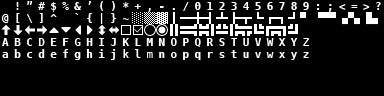

# Part 0: Introduction and Setup

## What You Will Build

By the end of this part, you will have a Python project configured with `uv`, `tcod`, and `numpy`, and a game window that opens on your screen. It will not do much yet, but every chapter from here builds directly on this foundation.

## Learning goals

- Understand what makes a roguelike a roguelike
- Set up a modern Python project with uv
- Confirm that tcod is installed and working

---

## What is a roguelike?

The genre is named after *Rogue* (1980), a dungeon-crawling game that introduced several ideas that were radical at the time:

- **Procedural generation**: the dungeon is different every run
- **Permadeath**: when you die, the game starts over
- **Turn-based**: time only passes when you act
- **Tile-based**: the world is a grid
- **Resource management**: health, items, and position all matter

Games like *NetHack*, *DCSS*, *Brogue*, and *Caves of Qud* all descend from this lineage. The genre has fractured over the decades. *Spelunky* and *The Binding of Isaac* call themselves roguelikes, but most traditionalists call them *roguelites*. For this tutorial we are building a traditional roguelike: grid-based, turn-based, with permadeath and procedural dungeons.

!!! info "The Berlin Interpretation"
    In 2008, a group of roguelike developers formalized what they considered the core traits of a "true" roguelike. The most important ones are: procedural environments, permadeath, turn-based gameplay, grid-based movement, and resource management. We will implement all of these.

!!! info "Roguelike vs. roguelite"
    A **roguelite** keeps some roguelike DNA (procedural levels, permadeath, run-based structure) but typically swaps the core for **real-time action** instead of turn-based tactics, and adds **meta-progression**: currency, unlocks, or permanent upgrades that persist across deaths, so the player gets stronger over many runs. *Hades*, *Dead Cells*, and *The Binding of Isaac* are popular examples. They are great games, but they sit on a different design axis than what we are building here. If at any point you find yourself wanting "permanent upgrades between runs", you are designing a roguelite, not a roguelike. Both are valid; just know which you are aiming at.


---

## Why Python and tcod?

**Python** is readable and expressive, which makes it a good language for learning game architecture without fighting syntax.

**tcod** (also called *python-tcod*) is a library built specifically for roguelikes. It provides:

- A console renderer (draws characters and colors to the screen)
- A tileset system (maps font images to Unicode characters)
- FOV (field of view) computation
- Pathfinding
- Input handling

It is the direct descendant of libtcod, the library used in the classic RogueBasin tutorials that inspired this one.

---

## Prerequisites

This tutorial assumes you know:

- Python basics: variables, functions, `if`/`for`, classes with `__init__`
- How to run a Python script from the terminal

You do **not** need to know anything about game development, graphics, or numpy. Everything is explained as it appears.

---

## Setting up the project

We use [uv](https://docs.astral.sh/uv/), a fast Python package manager. It handles virtual environments automatically.

### Install uv

Follow the [uv installation instructions](https://docs.astral.sh/uv/getting-started/installation/) for your operating system. On most systems:

```bash
# macOS and Linux
curl -LsSf https://astral.sh/uv/install.sh | sh

# Windows (PowerShell)
powershell -ExecutionPolicy ByPass -c "irm https://astral.sh/uv/install.ps1 | iex"
```

### Create the project

```bash
mkdir roguelike-tutorial
cd roguelike-tutorial
uv init --no-readme .
```

This creates:

```text
roguelike-tutorial/
  .python-version     ← pins the Python version
  pyproject.toml      ← project metadata and dependencies
  main.py             ← placeholder that uv created
  .venv/              ← virtual environment (created automatically)
```

### Add the libraries

```bash
uv add "tcod>=21.2,<22" "numpy>=2.4,<3"
```

Your `pyproject.toml` will now look something like this:

```toml
[project]
name = "roguelike-tutorial"
version = "0.1.0"
requires-python = ">=3.12"
dependencies = [
    "numpy>=2.4,<3",
    "tcod>=21.2,<22",
]
```

!!! tip "Why pin version ranges?"
    We write `>=21.2,<22` instead of just `tcod` because the tcod API changes between major versions. Pinning prevents a future major release from silently breaking your code.

!!! info "Prefer the classic pip + requirements.txt flow?"
    Both flows produce the same environment. If you'd rather use pip, create a `requirements.txt` with:

    ```text
    tcod>=21.2,<22
    numpy>=2.4,<3
    ```

    Then create a venv and install:

    ```bash
    python -m venv .venv
    source .venv/bin/activate     # Linux / macOS
    .venv\Scripts\activate        # Windows PowerShell
    python -m pip install -r requirements.txt
    ```

    The rest of the tutorial uses `uv` for setup commands, but the Python code you will write is identical.

### Running your program

You can run the game in two ways:

```bash
# Option A: let uv manage the environment
uv run python main.py

# Option B: activate the environment yourself, then use python directly
source .venv/bin/activate   # Linux / macOS
.venv\Scripts\activate      # Windows PowerShell

python main.py
```

For the rest of this tutorial, code examples assume you have the environment activated (Option B), so you can just type `python main.py`.

---

## Verifying the installation

Replace the contents of `main.py` with:

```python
from __future__ import annotations

import tcod


def main() -> None:
    print("Hello World!")


if __name__ == "__main__":
    main()
```

Run it:

```bash
python main.py
```

You should see `Hello World!` printed to the terminal. If you get an `ImportError` or `ModuleNotFoundError`, the tcod installation did not work. Check the [tcod installation guide](https://python-tcod.readthedocs.io/en/latest/installation.html).

!!! question "What is `from __future__ import annotations`?"
    This line makes Python treat all type annotations as strings (lazy evaluation). It lets us write type hints that refer to classes that are defined later in the file or in another module. In Python 3.12+ many cases work without it, but we include it in every file as a uniform convention, so the codebase stays consistent as it grows and you never get bitten by a forward-reference error.

!!! question "What is `if __name__ == '__main__'`?"
    This guard means: only run `main()` when this file is executed directly, not when it is imported by another file. As our project grows into multiple modules, this prevents code from running accidentally on import.

---

## The font file

tcod needs a font file to draw characters. We use **dejavu12x12_gs_tc.png**, a 32×8 grid of 256 tiles, laid out according to the TCOD character map:



[Download dejavu12x12_gs_tc.png](images/dejavu12x12_gs_tc.png){ download }

Create a `res/` folder next to `main.py`, and save the file there as `dejavu12x12_gs_tc.png`. We will load it from that path in Part 1.

---

## Project structure going forward

As the tutorial progresses, we will add files one at a time. Here is what the final project will look like, so you have a map:

```text
roguelike-tutorial/
  main.py                ← entry point: creates the window and starts the game
  res/
    dejavu12x12_gs_tc.png
  game/
    __init__.py          ← marks `game/` as a Python package
    engine.py            ← the central game object (handles events, render loop)
    entity.py            ← generic game object (player, enemies, items)
    input_handlers.py    ← translates key presses into actions
    actions.py           ← things the player (or AI) can do
    map/                 ← map storage, tile definitions, and generation
      __init__.py
      game_map.py        ← the tile grid
      tile_types.py      ← tile definitions (floor, wall, ...)
      map_generator.py   ← dungeon generator
    constants/           ← visual constants
      __init__.py
      sprites.py         ← single-character glyphs (PLAYER, ORC, TROLL, ...)
      colors.py           ← RGB tuples (PLAYER, HP_BAR_FILLED, MENU_TITLE, ...)
    components/          ← reusable pieces of behavior (Fighter, AI, Inventory, ...)
  pyproject.toml
```

The structure is deliberate: `main.py` at the root is a thin entry point, `game/` is a Python package that holds all the game modules, `res/` keeps static assets (fonts, images) out of the code folders, `game/map/` groups map-related code, and `game/constants/` centralizes visual values so retheming or recoloring is a one-line edit. We will build all of this gradually; each part adds one or two files.

---

## Where to ask for help

Even with the clearest tutorial, you will get stuck. The most welcoming places to ask are:

- **r/roguelikedev**: the subreddit hosts the annual *RoguelikeDev Does The Complete Roguelike Tutorial* event each summer, where dozens of people work through this kind of tutorial together.
- **The Roguelikes Discord**: most roguelike-developer communities run a server with a dedicated channel for tcod / Python questions. Search "roguelikes discord" for the current invite.
- **python-tcod on GitHub**: <https://github.com/libtcod/python-tcod> for library-specific bugs and questions.

When you ask for help, paste the exact error message and the smallest piece of code that reproduces the problem. People are far more likely to engage with a focused question than with "it doesn't work".

---

## Summary

- A roguelike is characterized by procedural generation, permadeath, turn-based gameplay, and a grid-based world.
- We use Python 3.12+ with tcod 21.2+ and numpy 2.x, managed by uv.
- The project lives in a single folder; we will add files progressively.
