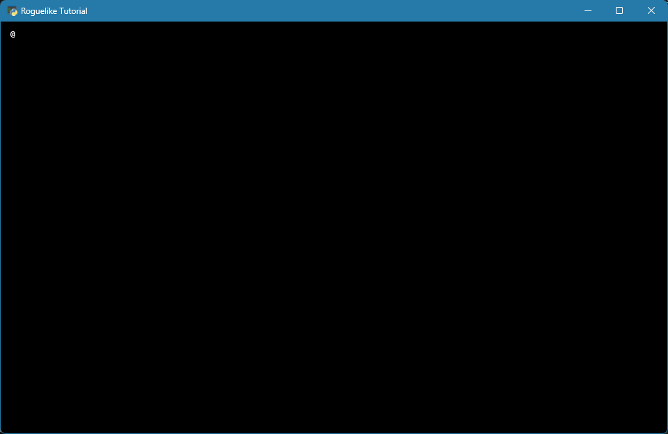
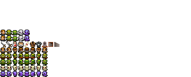
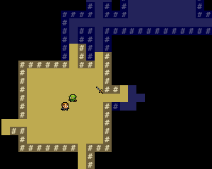
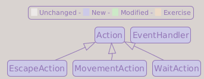
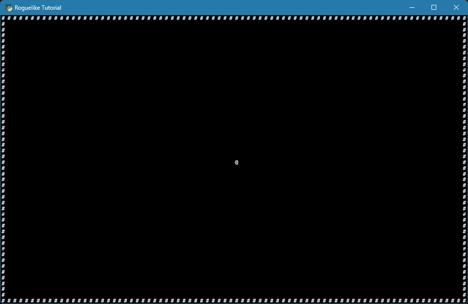

# Part 1: Drawing the @ and Moving It Around

## What You Will Build

By the end of this part, you will have the first playable version of your roguelike: a player character, `@`, moving with the arrow keys inside a small room bounded by walls, `#`.

One thing before we start: this tutorial counts on you doing the exercises at the end of each part. They are not optional extras; the following parts assume you completed them before moving on. Part 1 is the first example: the walls promised above are yours to build, in exercise 2.

## Learning goals

- Understand the game loop and why roguelikes structure it the way they do
- Open a tcod window using three key objects: tileset, console, and context
- Draw a character on screen
- Read keyboard input and move the character

---

## The game loop

Every game, from Pong to Elden Ring, runs a loop. The loop repeats until the player quits, doing the same three things each iteration:

```text
┌──────────┐     ┌──────────┐     ┌──────────┐
│  INPUT   │────▶│  UPDATE  │────▶│  RENDER  │
└──────────┘     └──────────┘     └──────────┘
     ▲                                 │
     └─────────────────────────────────┘
```

- **Input**: read what the player did (key pressed, mouse moved)
- **Update**: apply the consequences (move the player, resolve combat)
- **Render**: draw the current state to the screen

In a real-time game, this loop runs 30 or 60 times per second regardless of whether the player does anything. In a **turn-based roguelike**, the loop is different: we *wait* for input before updating. Nothing happens until the player presses a key. This is what makes the "time only passes when you act" feeling.

Our loop will look like this:

```text
Render ──▶ Wait for input ──▶ Process action ──▶ (back to Render)
```

We render first so the player sees the current state, then block until they act.

---

## Three tcod objects

Before writing code, understand what tcod gives us:

**Tileset**: the font sheet. A grid image where each cell is one character tile. tcod uses it to draw characters on screen. We load it once at startup.

**Console**: an in-memory buffer of cells. Each cell holds a character, a foreground color, and a background color. Drawing to the console does not show anything on screen yet; it is just updating memory.

**Context**: the actual window. When we call `context.present(console)`, it takes the console buffer and displays it. The context also gives us events (key presses, quit signal).

The workflow every frame:

```text
console.clear() ──▶ draw to console ──▶ context.present(console) ──▶ wait for events
```

---

## Opening a window

Replace `main.py` with:

```python
from __future__ import annotations

from pathlib import Path

import tcod


def main() -> None:
    screen_width  = 80
    screen_height = 50

    tileset = tcod.tileset.load_tilesheet(
        Path(__file__).parent / "res" / "dejavu12x12_gs_tc.png",
        32,
        8,
        tcod.tileset.CHARMAP_TCOD,
    )

    title   = "Roguelike Tutorial"
    version = "0.1.0"
    app_id  = "com.tutorial.roguelike"

    tcod.lib.SDL_SetAppMetadata(
        title.encode("utf-8"),
        version.encode("utf-8"),
        app_id.encode("utf-8"),
    )
    tcod.lib.SDL_SetHint(
        b"SDL_RENDER_SCALE_QUALITY",
        b"0",   # Nearest pixel sampling
    )

    with tcod.context.new(
        columns          = screen_width,
        rows             = screen_height,
        tileset          = tileset,
        title            = title,
        vsync            = True,
        sdl_window_flags = tcod.context.SDL_WINDOW_ALLOW_HIGHDPI | tcod.context.SDL_WINDOW_RESIZABLE,
    ) as context:
        console = tcod.console.Console(screen_width, screen_height, order="F")

        while True:
            console.print(x=1, y=1, text="@")
            context.present(console)

            for event in tcod.event.wait():
                match event:
                    case tcod.event.Quit():
                        raise SystemExit()


if __name__ == "__main__":
    main()
```

!!! tip "Run it now"
    Run it with `python main.py`. You should see a window with an `@` in the top-left corner. Close it by clicking the X.


!!! info "Why 80 × 50?"
    The 80-column width is the classic terminal convention: the [VT100](https://en.wikipedia.org/wiki/VT100) (1978) displayed 80 columns because it inherited the width of IBM punched cards, which held 80 characters each. The 50 rows leave comfortable space for the map plus a UI strip we will add in Part 7.

Let's go through each part.

### The tileset

```python
tileset = tcod.tileset.load_tilesheet(
    Path(__file__).parent / "res" / "dejavu12x12_gs_tc.png",
    32, # columns in the sheet
    8,  # rows in the sheet
    tcod.tileset.CHARMAP_TCOD,
)
```

`Path(__file__).parent` is the folder where `main.py` lives, so `Path(__file__).parent / "res" / "dejavu12x12_gs_tc.png"` resolves the image path relative to `main.py` itself, not the terminal's current directory. For example, if `main.py` lives in `/home/user/my-game/`, the path evaluates to `/home/user/my-game/res/dejavu12x12_gs_tc.png`, regardless of which folder you launched Python from. This means `python main.py` works the same way from anywhere.

The sheet has 32 columns and 8 rows = 256 tiles. The TCOD character map only claims the first 160 of them (five rows); the last three rows sit empty, something the end of this part takes advantage of.

!!! info "`CHARMAP_TCOD` vs `CHARMAP_CP437`"
    The charmap is the list that tells `load_tilesheet` which character each tile stands for, in reading order: first tile, first codepoint of the list, and so on. It must describe the layout the image was *drawn* in, so it is a property of the font file, not a preference.

    `CHARMAP_TCOD` (160 entries) is the layout of the classic libtcod fonts, our DejaVu sheet among them. tcod's documentation treats it as legacy: non-standard, kept so that fonts already drawn in it still load, not recommended for new art.

    The standard today is `CHARMAP_CP437` (256 entries): the layout of IBM's original PC character set, Code Page 437. It is what Dwarf Fortress tilesets use, and any sheet from the [Dwarf Fortress tileset repository](https://dwarffortresswiki.org/index.php/DF2014:Tileset_repository) loads with it directly.

    This tutorial stays on `CHARMAP_TCOD` because our font is drawn in that layout; swap in a CP437 sheet and the only changes are the charmap argument and the sheet's own column and row counts.

    Grids of tiles in a PNG are not the only option, either. libtcod's [font folder](https://github.com/libtcod/libtcod/tree/main/data/fonts), where our sheet comes from, points at the alternatives: Dwarf Fortress tilesets, BDF bitmap fonts (`tcod.tileset.load_bdf`), and TrueType fonts (`tcod.tileset.load_truetype_font`).

### SDL metadata and scaling hints

```python
title   = "Roguelike Tutorial"
version = "0.1.0"
app_id  = "com.tutorial.roguelike"

tcod.lib.SDL_SetAppMetadata(
    title.encode("utf-8"),
    version.encode("utf-8"),
    app_id.encode("utf-8"),
)
tcod.lib.SDL_SetHint(
    b"SDL_RENDER_SCALE_QUALITY",
    b"0",   # Nearest pixel sampling
)
```

`tcod.lib` exposes low-level SDL functions. `SDL_SetAppMetadata` gives SDL the application name, version, and identifier as UTF-8 bytes. This lets the operating system and window manager identify the application more consistently.

`SDL_SetHint` with `SDL_RENDER_SCALE_QUALITY` set to `0` requests nearest-neighbor scaling. That keeps the bitmap font sharp when the window is resized, instead of smoothing the tiles.

!!! note "A legacy hint that still works"
    This hint belongs to SDL2. SDL3 removed it, replacing it with a scale mode set directly on each texture. libtcod still reads this older hint internally and applies the same nearest-pixel behavior, so the call above keeps working unchanged and needs no lower-level SDL code on our side.

### The context (window)

```python
with tcod.context.new(
    columns          = screen_width,
    rows             = screen_height,
    tileset          = tileset,
    title            = title,
    vsync            = True,
    sdl_window_flags = tcod.context.SDL_WINDOW_ALLOW_HIGHDPI | tcod.context.SDL_WINDOW_RESIZABLE,
) as context:
```

`tcod.context.new` returns a context manager. The window lives only inside the `with` block; when the block exits, the window closes. `title` uses the variable we defined earlier, so the SDL metadata and the window title stay in sync. `vsync=True` synchronizes rendering to the monitor's refresh rate to avoid screen tearing.

`sdl_window_flags` lets us pass SDL window options through tcod. `SDL_WINDOW_ALLOW_HIGHDPI` makes the window behave better on high-DPI displays, and `SDL_WINDOW_RESIZABLE` lets the player resize the window. The `|` operator combines both flags into one value.

### The console

```python
console = tcod.console.Console(screen_width, screen_height, order="F")
```

`order="F"` changes the array layout so we can index the console as `console[x, y]` instead of the row-first order many grid libraries use. This is more natural for a 2D game.

### The event loop

```python
for event in tcod.event.wait():
    match event:
        case tcod.event.Quit():
            raise SystemExit()
```

`tcod.event.wait()` blocks until at least one event arrives, then returns all pending events. The `match` statement (Python 3.10+) is the cleanest way to handle tcod's typed events.

!!! question "About `match` / `case`"
    `match` is Python's pattern matching, introduced in 3.10. Each `case` matches against the *type* (and optionally the contents) of the value. Here it lets us branch on event types like `tcod.event.Quit` and `tcod.event.KeyDown` without writing a chain of `isinstance` calls. If you have not used `match` before, treat it for now as a more readable `if/elif` over types.

---

## Moving the @

A static `@` is not very interesting. Let's track the player's position and handle movement.

### Player position

```diff
 def main() -> None:
     screen_width  = 80
     screen_height = 50
+
+    player_x = screen_width  // 2
+    player_y = screen_height // 2
+
     tileset = tcod.tileset.load_tilesheet(
```

`//` is integer division: it gives a whole number result, so the player starts exactly in the center.

Update the drawing call to use the new variables:

```diff
-        console.print(x=1, y=1, text="@")
+        console.print(x=player_x, y=player_y, text="@")
```



### Setting up the `game/` package

We are about to add our first module beyond `main.py`. The convention in this tutorial is that **everything except the entry point lives inside a `game/` folder**, which Python will see as a *package*. Create the folder with an empty `__init__.py` inside:

```text
roguelike-tutorial/
  main.py
  res/
    dejavu12x12_gs_tc.png
  game/
    __init__.py     ← empty file, marks `game/` as a Python package
```

!!! question "What is `__init__.py`?"
    The presence of an `__init__.py` file tells Python that the folder it lives in is a *package*: a collection of modules that can be imported with dotted notation, like `from game.actions import MovementAction`. The file itself can be empty; its existence is what matters. (Python 3.3+ technically allows packages without it, but we keep it explicit so the structure is obvious at a glance.)

### Actions and input handlers

We could handle key presses directly in `main.py`, but as the game grows we will have dozens of possible commands. It is cleaner to separate the *intent* (move left) from the *trigger* (left arrow key).

Create `game/actions.py`:

```python
from __future__ import annotations


class Action:
    pass


class EscapeAction(Action):
    pass


class MovementAction(Action):

    def __init__(self, dx: int, dy: int) -> None:
        self.dx = dx
        self.dy = dy
```

`Action` is a base class. It is empty for now, but it gives these commands a shared type that later chapters can build on. `EscapeAction` means "the player wants to quit". `MovementAction` carries a direction as `dx` (delta-x) and `dy` (delta-y).

!!! question "Why separate actions from key presses?"
    Later, enemies will also perform actions. An `Orc` moving toward the player will use the same `MovementAction` as the player pressing the arrow key. By decoupling action *type* from action *trigger*, the same logic handles both.

Create `game/input_handlers.py`:

```python
from __future__ import annotations

import tcod.event

from game.actions import Action, EscapeAction, MovementAction


class EventHandler:

    def dispatch(self, event: tcod.event.Event) -> Action | None:
        match event:
            case tcod.event.Quit():
                return self.event_quit(event)

            case tcod.event.KeyDown():
                return self.event_keydown(event)

            case _:
                return None

    def event_quit(self, _event: tcod.event.Quit) -> Action | None:
        return EscapeAction()

    def event_keydown(self, event: tcod.event.KeyDown) -> Action | None:
        key = event.sym

        match key:
            case tcod.event.KeySym.UP:
                return MovementAction(dx=0, dy=-1)

            case tcod.event.KeySym.DOWN:
                return MovementAction(dx=0, dy=1)

            case tcod.event.KeySym.LEFT:
                return MovementAction(dx=-1, dy=0)

            case tcod.event.KeySym.RIGHT:
                return MovementAction(dx=1, dy=0)

            case tcod.event.KeySym.ESCAPE:
                return EscapeAction()

            case _:
                return None
```

`EventHandler.dispatch` receives a raw tcod event and routes it to the right method. `event_keydown` translates key symbols into `Action` objects, and `event_quit` (the OS-level "close window" signal) returns an `EscapeAction`, the same one as pressing the Escape key. The dispatcher itself never decides what to do; it just translates events into intent. Any unrecognized key returns `None`.

!!! tip "Why `_event`?"
    `_event` is still a normal Python parameter. The leading underscore is a convention that tells readers and linters "this value is required by the function signature, but this function does not use it." If you later need the event data, you can rename it back to `event` and use it normally.

!!! question "Why not `tcod.event.EventDispatch`?"
    In older tcod code you will see `class EventHandler(tcod.event.EventDispatch[Action])`. That base class still exists but is marked as deprecated in recent versions of tcod. Writing the dispatch by hand keeps us in control of the routing and makes it straightforward to add subclasses of `EventHandler` later (one per game state: main menu, inventory, targeting, etc.).

### Vi keys and the numpad

Arrow keys are not the only tradition. *Rogue* was written before arrow keys were something you could count on, so it used the letters `h`, `j`, `k`, `l` to move, a convention borrowed from the vi text editor. Other classics leaned on the numpad instead. Longtime roguelike players expect all three schemes, and supporting them costs us almost nothing, because a single `case` can match several keys at once.

Update the four movement cases in `event_keydown`:

```diff
         match key:
-            case tcod.event.KeySym.UP:
+            case tcod.event.KeySym.UP | tcod.event.KeySym.KP_8 | tcod.event.KeySym.K:
                 return MovementAction(dx=0, dy=-1)

-            case tcod.event.KeySym.DOWN:
+            case tcod.event.KeySym.DOWN | tcod.event.KeySym.KP_2 | tcod.event.KeySym.J:
                 return MovementAction(dx=0, dy=1)

-            case tcod.event.KeySym.LEFT:
+            case tcod.event.KeySym.LEFT | tcod.event.KeySym.KP_4 | tcod.event.KeySym.H:
                 return MovementAction(dx=-1, dy=0)

-            case tcod.event.KeySym.RIGHT:
+            case tcod.event.KeySym.RIGHT | tcod.event.KeySym.KP_6 | tcod.event.KeySym.L:
                 return MovementAction(dx=1, dy=0)
```

Notice the `|` between patterns. Inside a `case` it means "match any of these". It looks like the `|` we used to combine the SDL window flags, but this one is pattern syntax, not a bitwise operation. `KP_8` is the numpad 8, and tcod names letter keys with capitals: `KeySym.K` is the `k` key.

!!! info "Why `hjkl`, of all keys?"
    Because of one keyboard. vi was written on an [ADM-3A](https://en.wikipedia.org/wiki/ADM-3A) (1976) terminal, which had no dedicated arrow keys: the arrows were printed directly on the `h`, `j`, `k`, `l` keycaps, so those keys became the cursor keys. *Rogue* was developed on the same terminals and kept the convention.

    The ADM-3A also printed "Home" on the `~` key. That is why `~` still means the home directory on Unix systems today.

### Wiring it together

Update `main.py` to use the new modules. We also extract the `while True` block into its own function, `game_loop`, so `main` is left as a focused setup orchestrator. Most of the listing below is code you already have, just rearranged; the new parts are the two imports, the `game_loop` function itself, and the `match action` block that replaces the old inline movement:

```python
from __future__ import annotations

from pathlib import Path

import tcod

from game.actions import EscapeAction, MovementAction
from game.input_handlers import EventHandler


def game_loop(
    context: tcod.context.Context,
    console: tcod.console.Console,
    event_handler: EventHandler,
    player_x: int,
    player_y: int,
) -> None:
    while True:
        console.print(x=player_x, y=player_y, text="@")
        context.present(console)

        for event in tcod.event.wait():
            action = event_handler.dispatch(event)

            if action is None:
                continue

            match action:
                case MovementAction(dx=dx, dy=dy):
                    player_x += dx
                    player_y += dy

                case EscapeAction():
                    raise SystemExit()


def main() -> None:
    screen_width  = 80
    screen_height = 50

    player_x = screen_width  // 2
    player_y = screen_height // 2

    tileset = tcod.tileset.load_tilesheet(
        Path(__file__).parent / "res" / "dejavu12x12_gs_tc.png",
        32,
        8,
        tcod.tileset.CHARMAP_TCOD,
    )

    event_handler = EventHandler()

    title   = "Roguelike Tutorial"
    version = "0.1.0"
    app_id  = "com.tutorial.roguelike"

    tcod.lib.SDL_SetAppMetadata(
        title.encode("utf-8"),
        version.encode("utf-8"),
        app_id.encode("utf-8"),
    )
    tcod.lib.SDL_SetHint(
        b"SDL_RENDER_SCALE_QUALITY",
        b"0",   # Nearest pixel sampling
    )

    with tcod.context.new(
        columns          = screen_width,
        rows             = screen_height,
        tileset          = tileset,
        title            = title,
        vsync            = True,
        sdl_window_flags = tcod.context.SDL_WINDOW_ALLOW_HIGHDPI | tcod.context.SDL_WINDOW_RESIZABLE,
    ) as context:
        console = tcod.console.Console(screen_width, screen_height, order="F")
        game_loop(context, console, event_handler, player_x, player_y)


if __name__ == "__main__":
    main()
```

Splitting `main` and `game_loop` is the standard pattern: setup goes in one place, the per-frame work goes in another. You will see this everywhere in game code.

!!! abstract "A quick preview of Part 2"
    For now, the player's position lives in local variables inside the loop, which keeps Part 1 small and easy to follow. In Part 2, we will group this kind of game state into an `Engine` object so the loop can manage it more cleanly.

!!! tip "Run it now"
    Run the game and press each arrow key a few times, in any order. The `@` should follow every direction you press. Try holding one down, too. You will notice it leaves a trail behind it: that is expected, and the next section fixes it.

### Clearing the console

The trail appears because we never erase the old position. Add `console.clear()` at the start of each frame in `game_loop`, before drawing:

```diff
     while True:
+        console.clear()
         console.print(x=player_x, y=player_y, text="@")
         context.present(console)

         for event in tcod.event.wait():
```

The order is now `clear → draw → present → wait`, the standard game-loop pattern: every iteration starts with a blank buffer, draws the current state from scratch, displays it, and then blocks until the next event.

---

## Bonus: "but I don't want to play with letters"

!!! abstract "Optional detour"
    This section is a side trip, not a requirement. The rest of the tutorial stays with characters, and nothing later depends on what you do here. Read it for the idea, try it if you like, and switch back whenever you want.

The player is an `@`. Before moving on, a confession from one kind of reader:

> Yeah, but I don't like these graphics for a game. What do you mean it is a *terminal*?

Fair enough. The good news: **tcod does not know anything about characters.** A tileset is just an image cut into a grid, and each cell is one tile. tcod draws tiles, not letters. The `@` is simply the tile that sits where the codepoint for `@` points, and nothing stops you from pointing a codepoint at a tile that looks like a tiny hero instead.

The only rule is that everything stays on the grid: one tile per cell, all the same size.



That is the same DejaVu sheet with a few sprites painted into the lower rows (hero, orc, dagger, and so on), plus five rows of directional art added below the original eight. This part only uses the hero tile; the rest waits for the [graphics appendix](append-7.md).

??? note "Where to find graphics"
    You can find tile and sprite sets in many styles, free or paid, on sites like [itch.io](https://itch.io), [OpenGameArt](https://opengameart.org), or [Kenney](https://kenney.nl) (there are tens of dedicated webs).

    The sprites used here are adapted from two CC0 sets by Merchant Shade:

    - [16x16 Puny Characters Plus Sprites](https://merchant-shade.itch.io/16x16-puny-characters-plus-sprites) (paid)
    - [16x16 Mixed RPG Icons](https://merchant-shade.itch.io/16x16-mixed-rpg-icons) (free)

    One free, one paid, both released under CC0. I had to adapt them, because our font is `12 × 12` and few sprites come in that size: `16 × 16` is far more common. There is nothing special about `12 × 12`, though. Pick whatever tile size suits your art, as long as the whole sheet uses one consistent size.

With just those few tiles, the same game looks like this:



!!! tip "Mixing characters and sprites"
    It is not all or nothing. The floor, the walls, and the HUD can stay as plain characters while only the entities use sprites. Drawing one *sprite on top of another* (a floor tile under a creature, for example) is the part that gets tricky in tcod, and it has its own appendix.

### Swapping the @ for a sprite

Two small changes to `main.py`. First, load the extended sheet and point a free codepoint at the hero tile:

```diff
     tileset = tcod.tileset.load_tilesheet(
-        Path(__file__).parent / "res" / "dejavu12x12_gs_tc.png",
+        Path(__file__).parent / "res" / "dejavu12x12_gs_tc_ex.png",
         32,
-        8,
+        13,  # the extended sheet adds 5 rows below the original 8
         tcod.tileset.CHARMAP_TCOD,
     )
+
+    # 0xE000 starts the Unicode Private Use Area: a range of codepoints that
+    # never map to a real character, so a sprite there can never clash.
+    # Point its first slot at the hero tile (column 0, row 5 of the sheet).
+    PUA = 0xE000
+
+    tileset.remap(PUA, 0, 5)
```

Then draw that codepoint instead of `"@"`:

```diff
         console.clear()
-        console.print(x=player_x, y=player_y, text="@")
+        console.print(x=player_x, y=player_y, text=chr(PUA))
```

`tileset.remap(codepoint, column, row)` makes a codepoint draw the tile at that cell of the sheet. Columns and rows are zero-based and counted from the top-left, so `(0, 5)` is the first tile of the sixth row. We use `PUA` (`0xE000`) for the codepoint because it sits in the Unicode **Private Use Area** (`U+E000..U+F8FF`), a block Unicode never assigns to real characters. Since tcod only ever sees our own tileset here, nothing else competes for the slot either. `chr(PUA)` turns that codepoint into the one-character string `console.print` expects.

!!! tip "Run it now"
    Run the game and move around. The hero walks as a sprite instead of an `@`, in every direction, same as before. That is the whole trick.

!!! note "Why exactly `0xE000`?"
    `0xE000` is simply the first slot of the Private Use Area: easy to remember, easy to type. That is enough for one sprite. Once a sheet grows to dozens of tiles, picking a codepoint by hand for each one gets tedious and easy to get wrong. A neater trick is to encode a tile's row and column *into* the codepoint itself, so it can be computed instead of memorized. This chapter only needs one sprite, so we are not there yet, but keep the idea in the back of your mind: the [graphics appendix](append-7.md) picks it back up once the sheet is big enough to actually need it.

!!! note "About the sheet layout"
    The lower rows of the original DejaVu sheet were empty, so the first sprites fill unused cells, not overwrite any glyph. The `32` and `13` we pass to `load_tilesheet` are exactly that: how many tiles the image holds across and down, and they must match the image or tcod cannot cut it into tiles. The original sheet is `32 × 8 = 256` cells; the extended one adds five rows of art below, for `32 × 13`.

    Growing *downward* is the safe direction. Tiles are numbered left to right, top to bottom, and `CHARMAP_TCOD` hands out its codepoints in that same order: it has 160 entries, enough for the first five rows, which is exactly why the rows below them are free. Tiles numbered past the end of the list get no character, so new rows at the bottom leave the whole font intact, and the new tiles just wait for `remap`. Widening the sheet instead would shift the numbering, and every character past the first row would land on the wrong cell.

    This part only uses the hero tile from the extra art; the [graphics appendix](append-7.md) shows the tidy setup that wires up the rest.

### Doing it properly, later

This recipe is enough to *see* a sprite. Once the game grows, two more tiny changes make sprites behave well, and you will be able to see it later:

- **Do not tint sprites.** `console.print(..., fg=color)` multiplies the tile by `fg`. That is what paints a green `o` for an orc, but it also stains a full-color sprite. When you add the `Entity` class (Part 2), force `fg` to white for sprite entities so the art keeps its own colors.
- **Tell a codepoint from a character.** Once entities render through the map (Part 3), an entity's glyph may be a real character like `"#"` or a sprite codepoint like `0xE000`. Convert the integer with `chr()` before printing it.

The full, switchable setup (a `USE_SPRITES` flag, a small `sprites` module with named tiles, and separate left/right tiles for facing) lives in the [graphics appendix](append-7.md).

!!! info "Why you cannot just flip a sprite"
    tcod copies each tile to the screen exactly as it sits in the sheet; it never rotates or mirrors them. So a hero facing left and the same hero facing right are *two different tiles*: you draw whichever one matches the current facing. In ASCII this never came up, because a letter does not face anywhere. Honestly, most 2D games do the same even when they *can* mirror, because light hits a character from one side and the highlights should not jump across just because it turned around.

---

## Testing your work

Run `python main.py`:

- [ ] A window opens with a white `@` in the center
- [ ] Arrow keys, the numpad, and the `h`, `j`, `k`, `l` keys move the `@` in all four directions
- [ ] The `@` does not leave a trail
- [ ] Pressing `Escape` or clicking the X closes the game
- [ ] The `@` can still move off-screen (exercise 2 below builds the walls that stop it)

---

## Summary

We built a game loop that renders, then waits for input. tcod's three key objects (**tileset**, **console**, and **context**) work together: the tileset defines how characters look, the console is the drawing buffer, and the context is the window that displays it.

We separated **actions** (what to do) from **input handlers** (what key triggers it). This separation will pay off as soon as enemies need to take turns.

We also adopted the project layout we will use for the rest of the tutorial: `main.py` at the root as the entry point, the `game/` package for our modules, and `res/` for static assets like the font sheet. The per-frame work lives in `game_loop`, separate from the setup in `main`.

**Current architecture**:

- `main.py`: creates the window, loads the tileset, and starts the loop
- `game_loop`: clears, draws, presents, waits for input, and updates player coordinates
- `game/actions.py`: defines action objects such as movement and escape
- `game/input_handlers.py`: translates tcod events into actions

**Class Diagram**:



**File structure**:

```text
main.py                 ← modified
game/
├── __init__.py         ← new
├── actions.py          ← new
└── input_handlers.py   ← new
```

---

## Exercises

1. **Add diagonal movement**:

    The main text already handles the four cardinal directions for arrows, numpad, and vi keys. The diagonals are still missing, and both alternative schemes have them:

    ```text
     vi keys    numpad

      y k u      7 8 9
       \|/        \|/
     h--+--l    4--5--6
       /|\        /|\
      b j n      1 2 3
    ```

    Add the four diagonal cases to `event_keydown`. A diagonal move has both `dx` and `dy` set to non-zero (e.g. `MovementAction(dx=1, dy=-1)` for up-right).

2. **Build the walls**:

    Right now the player can walk straight out of the window. Give the room its walls: after `console.clear()`, draw a border of `#` around the screen, but leave the top row out of the room: start the border at `y = 1` (exercise 3 will put that free row to use). There are several ways to do it; try one before peeking.

    ??? note "Three ways to draw the border"
        Whole rows at a time, plus a loop for the side columns:

        ```python
        console.print(x=0, y=1, text="#" * screen_width)
        console.print(x=0, y=screen_height - 1, text="#" * screen_width)

        for y in range(2, screen_height - 1):
            console.print(x=0, y=y, text="#")
            console.print(x=screen_width - 1, y=y, text="#")
        ```

        One `#` at a time, with two loops:

        ```python
        for x in range(screen_width):
            console.print(x=x, y=1, text="#")
            console.print(x=x, y=screen_height - 1, text="#")

        for y in range(2, screen_height - 1):
            console.print(x=0, y=y, text="#")
            console.print(x=screen_width - 1, y=y, text="#")
        ```

        Or a single call to a tcod method we have not met yet:

        ```python
        console.draw_frame(
            x          = 0,
            y          = 1,
            width      = screen_width,
            height     = screen_height - 1,
            decoration = "#########",  # nine tiles: corners, edges, center
            clear      = False,
        )
        ```

        All three produce the same walls.

    

    Then stop the player before the wall, by hand: before applying a `MovementAction`, compute the destination position and only update `player_x` and `player_y` if it stays inside `0 < x < screen_width - 1` and `1 < y < screen_height - 1` (the `y` range starts one row lower because the top wall sits at `y = 1`). You will need `screen_width` and `screen_height` inside `game_loop`, so pass them in from `main` along with the starting coordinates. Try holding a movement key at each edge: the `@` should stop right next to the wall.

    !!! note "Why this trick will not survive"
        This check works only because our room is a single rectangle: two comparisons describe every wall in it. A real dungeon has dozens of rooms and corridors, and no `if` condition can describe all of their walls. The right question is not "is the destination inside the rectangle?" but "what is at the destination?", and answering it requires storing the map itself as data. That is exactly what we start building in Part 2.

3. **Add a wait action**:

    In many roguelikes, pressing `.` or `5` (numpad) passes a turn without moving. Create a `WaitAction(Action)` class and handle it in both `game/input_handlers.py` and `main.py`.

    Done? Then you will notice that... nothing happens. The `@` stays put, and there is no way to tell whether the game even heard you. Make the turn visible: keep a `turn_count` counter in `game_loop`, add 1 every time `dispatch` returns an action that is not `None`, and draw it each frame with `console.print(x=1, y=0, text=f"Turn: {turn_count}")`, in the top row that exercise 2 left outside the walls. Now hold `.` down: the `@` stands still while time passes. That is the soul of a roguelike, in one corner of the screen: time only passes when you act.
