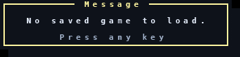
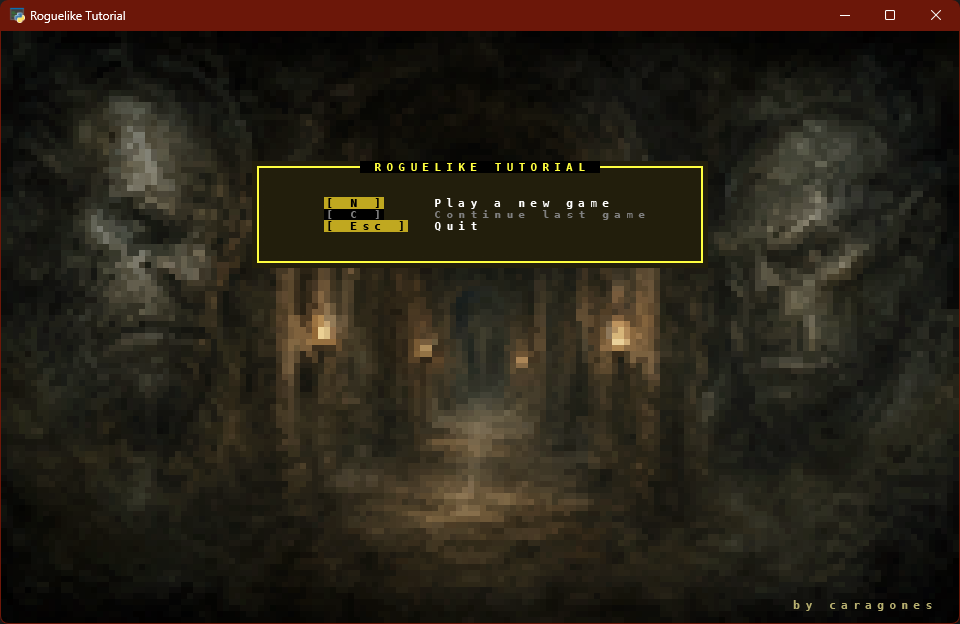
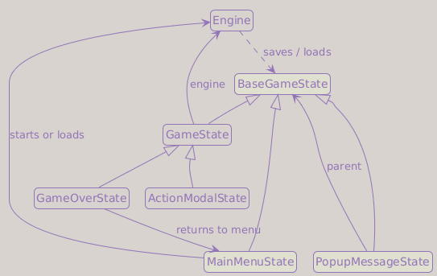
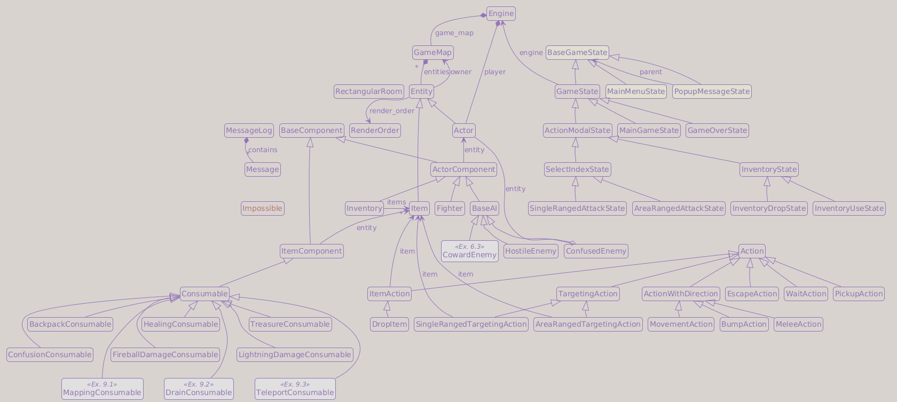
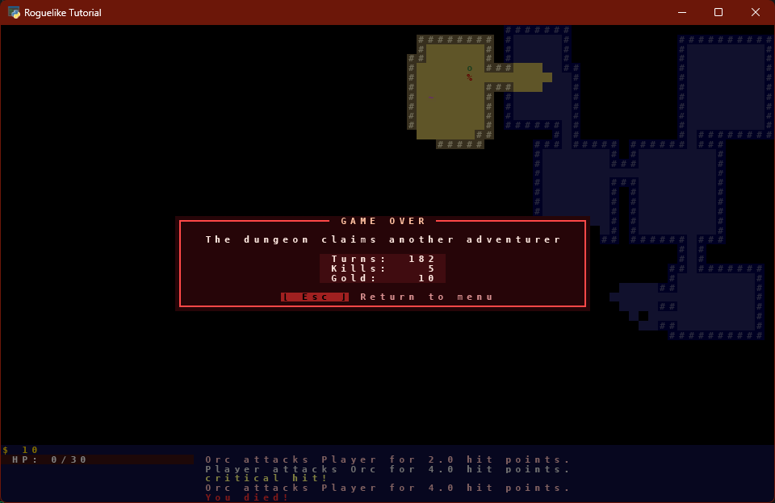

# Part 10: Save and Load

## What You Will Build

By the end of this part, your roguelike will have a main menu and a save system, allowing the player to quit the game and continue later from the saved state.

## Learning goals

- Serialize the entire game state to disk with `pickle` + `lzma`
- Add a main menu with New Game / Continue options
- Refactor game states to return states (not just actions)
- Delete the save file on player death
- Verify: save, quit, reload; map, entities, inventory, and message history are restored

---

## The serialization problem

Saving a game means converting the entire live object graph (engine, game map, entities, components, AI instances) into bytes that can be written to disk and reconstructed later.

```text
Engine
  ├── player (Actor)
  │     ├── fighter (Fighter)   ← component back-reference to player
  │     └── inventory (Inventory)
  ├── game_map (GameMap)
  │     └── entities: set[Entity]
  │           └── orc (Actor)
  │                 └── ai (HostileEnemy)  ← back-reference to the orc
Static state
  └── MessageLog.messages
```

The challenge: `Fighter.entity` points back to the `Actor` that owns it, `HostileEnemy.entity` points to the orc, and in Part 9 `ConfusedEnemy.previous_ai` holds another AI. This is a circular reference graph. The message log is a separate static list, so we save it next to the engine.

**JSON** cannot handle circular references without custom encoding, every class needs a `to_dict()` / `from_dict()` pair. That is a lot of boilerplate.

**`pickle`** handles circular references natively. Python's pickle module serializes the entire object graph, following references and deduplicating them automatically. It is the right tool for internal game state that you fully control.

!!! danger "pickle is not safe with untrusted data"
    Never load a pickle file from an unknown source, pickle can execute arbitrary code during deserialization. For a single-player game saving its own state, this is fine.

!!! warning "Save files are not stable between code changes"
    Understanding what pickle does and does not serialize prevents hours of debugging.

    **What gets serialized:** every object reachable from the saved state, recursively. That means `Engine`, `GameMap`, every `Entity`, every `Fighter`, every `AI` instance, and anything those objects reference. For the plain Python classes in this project, pickle stores each object's `__dict__` (its instance attributes) together with the fully qualified class name (`module.ClassName`) needed to reconstruct it.

    **What does NOT get serialized:** method bodies, property functions, class-level constants (`UPPERCASE` values), and anything not stored as instance data.

    **Changes that break existing saves:**

    - Renaming an instance attribute (`self._hp` to `self._health`): an old save still contains `_hp`, but the new code reads `_health`, so it raises `AttributeError`.
    - Renaming or moving a class (`game.fighter.Fighter` to `game.components.Fighter`): pickle cannot find the class and raises `ModuleNotFoundError` or `AttributeError`.
    - Adding a new instance attribute that old saves do not have, unless you provide a migration or fallback.

    **Changes that do not usually break saves by themselves:**

    - Adding or renaming methods, as long as they can still work with old instance data.
    - Adding properties or class constants, as long as they do not read missing instance attributes.
    - Changing default parameter values in `__init__` (only affects newly created instances; loading with pickle does not call `__init__`).

    **The fix without deleting the save:** two tools, two use cases.

    - `__getattr__(self, name)`: Python calls this when normal attribute lookup fails. Use it when you *added* a new attribute that old saves simply don't have. It is useful for providing a simple default or lazily creating the missing field.

    - `__setstate__(self, state)`: pickle calls this once when loading, passing the saved `__dict__`. Use it when you *renamed* an attribute: rewrite the old key to the new name before updating `__dict__`, and subsequent accesses are normal.

    Exercise 3 below demonstrates both in sequence.

We add `lzma` compression on top to shrink the file. A typical save is a few kilobytes compressed, negligible, but it is good practice.

---

## Engine.save_as()

Add to `game/engine.py`:

```python
import lzma
import pickle
from pathlib import Path

from game.message_log import MessageLog


class Engine:
    ...

    def save_as(self, filename: str | Path, active_state: object = None) -> None:
        save_data = lzma.compress(
            pickle.dumps(
                {
                    "state": active_state,
                    "message_log": MessageLog.messages,
                }
            )
        )

        path = Path(filename)
        path.parent.mkdir(parents=True, exist_ok=True)
        tmp_path = path.with_suffix(".tmp")
        tmp_path.write_bytes(save_data)
        tmp_path.replace(path)
```

`pickle.dumps(...)` serializes `active_state` (which transitively includes the engine and everything it references) plus the static message log. `lzma.compress` shrinks it. `path.parent.mkdir(parents=True, exist_ok=True)` creates the `savegames/` directory if it does not exist yet.

The write uses a temporary file first: `savegame.tmp` is written completely, then `tmp_path.replace(path)` replaces `savegame.sav`. This is much safer than writing directly to the final file. If the process dies halfway through `write_bytes`, the old save is still intact. The replacement step is atomic on most filesystems when both files are in the same directory.

!!! tip "`Path.with_suffix()` and `Path.replace()`"
    `path.with_suffix(".tmp")` returns a new `Path` with the extension swapped: `savegames/savegame.sav` becomes `savegames/savegame.tmp`. The original path is unchanged.

    `tmp_path.replace(path)` renames `tmp_path` to `path`, overwriting the destination if it already exists. On most operating systems this rename is atomic at the filesystem level: any reader of `path` sees either the old file or the new one, never a half-written mix. Both methods are part of the standard library `pathlib.Path` and work identically on Windows and POSIX.

Loading is the inverse:

```python
    @staticmethod
    def load(filename: str | Path):
        save_data = Path(filename).read_bytes()
        data = pickle.loads(lzma.decompress(save_data))
        MessageLog.messages = data["message_log"]

        return data["state"]
```

`MessageLog.messages` is stored explicitly because it is class-level state, not an instance attribute of `Engine`. Without this extra field, loading would restore the map and entities but lose the visible message history.

The active state is now the root of the saved object graph. Any state that inherits from `GameState` stores the engine on `self.engine`, so code that needs the engine can access it through the current state after checking that the state is engine-backed.

`load()` returns the saved state without a type annotation, and `save_as` (above) types its `active_state` as the loose `object`, on purpose: `engine.py` must not import the `GameState` classes, since that would recreate the very `engine → game_states` circular import this part is dismantling. The state stays deliberately untyped at this boundary.

---

## game/constants/config.py

The `game/constants/` package already holds `colors.py`, `sprites.py`, and `keys.py`. This is a good moment to add a fourth member: a home for numeric and text constants that are currently scattered across `main.py` and component defaults (plus a couple staged here for later chapters).

Create `game/constants/config.py`:

```python
from __future__ import annotations

from pathlib import Path

# Paths
_ROOT     = Path(__file__).parent.parent.parent
RES_DIR   = _ROOT / "res"
SAVE_DIR  = _ROOT / "savegames"
SAVE_PATH = SAVE_DIR / "savegame.sav"

# Screen / window
SCREEN_WIDTH  = 80
SCREEN_HEIGHT = 50
TITLE         = "Roguelike Tutorial"
VERSION       = "0.1.0"
APP_ID        = "com.tutorial.roguelike"

# HUD layout
BAR_WIDTH      = 24
XP_LEVEL_WIDTH = 4

# Map generation
MAP_WIDTH             = 80
MAP_HEIGHT            = 44
MAX_ROOMS             = 30
ROOM_MIN_SIZE         = 6
ROOM_MAX_SIZE         = 10
MIN_MONSTERS_PER_ROOM = 0
MAX_MONSTERS_PER_ROOM = 2
MIN_ITEMS_PER_ROOM    = 0
MAX_ITEMS_PER_ROOM    = 2

# Field of view
FOV_RADIUS = 8

# Combat
DEFAULT_CRITICAL_CHANCE     = 0.1
DEFAULT_CRITICAL_MULTIPLIER = 2.0
```

`_ROOT` is a private helper: the underscore signals it is not meant to be imported. It walks three `parent` steps from `game/constants/config.py` to reach the project root, where `res/` and `savegames/` live.

`RES_DIR` lives here rather than in `setup_game.py` because two unrelated modules need it: `main.py` for the tileset and `MainMenuState` for the background image. A single definition prevents drift.

`FOV_RADIUS` replaces the hardcoded `8` in `Engine.__init__`. `BAR_WIDTH` (widened from the old `20` to `24`) and `XP_LEVEL_WIDTH` are staged here for the Part 11 HUD rework; nothing in Part 10 reads them yet. `DEFAULT_CRITICAL_CHANCE` and `DEFAULT_CRITICAL_MULTIPLIER` name the `0.1` and `2.0` values that the Part 6 critical-hit exercise added to `Fighter.__init__`.

!!! note "Exercise-derived constants in `config.py`"
    Two of these only matter if you did the matching exercise. `DEFAULT_CRITICAL_CHANCE` / `DEFAULT_CRITICAL_MULTIPLIER` belong to the Part 6 critical-hit exercise; if you skipped it your `Fighter` has no `critical_chance` / `critical_multiplier`, so leave these defined (they are harmless) and ignore the `fighter.py` change below. `MIN_MONSTERS_PER_ROOM` reflects the Part 5 Exercise 1 minimum; at `0` it is harmless either way.

!!! note "The name `config.py` inside `game/constants/`"
    `game.constants.config` is slightly redundant: the package name already says "constants". A cleaner package name (`game.data`) would remove the redundancy, but that rename is a separate step. The name `config.py` at least avoids the worse `game.constants.constants`.

Every caller imports the module under the alias `constants`:

```python
from game.constants import config as constants
```

Then uses qualified names at every site: `constants.MAP_WIDTH`, `constants.FOV_RADIUS`, `constants.SAVE_PATH`. The qualifier makes the origin explicit without a long destructured import list.

The files that gain an import and lose or avoid local definitions:

- `game/hud.py`: later HUD changes will read `constants.BAR_WIDTH` and `constants.XP_LEVEL_WIDTH` instead of defining local layout constants.
- `game/engine.py`: `fov_radius: int = 8` becomes `fov_radius: int = constants.FOV_RADIUS`.
- `game/entities/components/fighter.py` (Part 6 critical-hit exercise only): if your `Fighter` has them, `critical_chance: float = 0.1` becomes `critical_chance: float = constants.DEFAULT_CRITICAL_CHANCE`, and similarly for `critical_multiplier`. Skip this line if you did not do that exercise.

---

## setup_game.py

We need a function that creates a fresh game (used by "New Game") and one that loads an existing save (used by "Continue"). Extract them into a dedicated module so `main.py` and the main menu state stay clean.

Create `game/setup_game.py`:

```python
from __future__ import annotations

import copy
import os
import secrets
from pathlib import Path

from game.constants import colors
from game.constants import config as constants
from game.engine import Engine
from game.entities import factories
from game.map.map_generator import generate_dungeon
from game.message_log import MessageLog


def new_game() -> Engine:
    """Return a fresh engine for a brand-new game."""
    MessageLog.clear()

    # Part-3. Exercise 1: Reproducible dungeons
    seed = int(os.environ.get("GAME_SEED", secrets.randbits(64)))
    print(f"Game seed: {seed}")

    player = copy.deepcopy(factories.player)

    game_map = generate_dungeon(
        max_rooms             = constants.MAX_ROOMS,
        room_min_size         = constants.ROOM_MIN_SIZE,
        room_max_size         = constants.ROOM_MAX_SIZE,
        map_width             = constants.MAP_WIDTH,
        map_height            = constants.MAP_HEIGHT,
        min_monsters_per_room = constants.MIN_MONSTERS_PER_ROOM,
        max_monsters_per_room = constants.MAX_MONSTERS_PER_ROOM,
        min_items_per_room    = constants.MIN_ITEMS_PER_ROOM,
        max_items_per_room    = constants.MAX_ITEMS_PER_ROOM,
        player                = player,
        seed                  = seed,
    )

    engine = Engine(game_map=game_map, player=player)

    MessageLog.add_message(
        "Hello and welcome, adventurer, to yet another dungeon!",
        colors.WELCOME_TEXT,
    )

    return engine


def load_game(filename: str | Path):
    """Load a save file and return the saved game state."""
    path = Path(filename)
    if not path.exists():
        raise FileNotFoundError(f"No save file found at {filename!r}")

    try:
        return Engine.load(path)

    except Exception as ex:  # pylint: disable=broad-exception-caught
        backup_path = path.with_suffix(path.suffix + ".bak")
        path.replace(backup_path)
        raise RuntimeError(f"Save file could not be loaded and was moved to {backup_path}.") from ex
```

The map dimensions and spawn counts are now read from `constants` rather than defined here. The seed line (`# Part-3. Exercise 1: Reproducible dungeons`) and the `seed = seed` argument are the Part 3 Exercise 1 carry-over: if you skipped that exercise your `generate_dungeon` has no `seed` parameter, so drop the seed computation and the `seed = seed` line. `Path` is still imported because `load_game` uses it in its type annotation and for the backup path.

`load_game()` handles one practical edge case: the save file might exist but fail to load because it is corrupt or incompatible with the current code. Instead of leaving the player stuck with a broken Continue option, the failed save is moved aside to `savegame.sav.bak` and the menu can show a clear message.

---

## BaseGameState and PopupMessageState

Before adding the main menu, we need one more abstraction: a state that does *not* delegate to `Engine`. The main menu runs before any engine exists, so it cannot inherit from the current `GameState`.

We split the hierarchy:

```text
BaseGameState
  ├── GameState (has engine, handles actions)
  │     ├── MainGameState
  │     ├── GameOverState
  │     └── InventoryState (and subclasses)
  │           ├── InventoryUseState
  │           └── InventoryDropState
  ├── MainMenuState  (no engine yet)
  └── PopupMessageState (renders a message overlay over the parent state)
```

`PopupMessageState` wraps long lines with `textwrap`, so add the import at the top of `game/game_states.py`:

```diff
+import textwrap

 import tcod
```

It also needs its own small palette. Add to `game/constants/colors.py`:

```python
# Popup colors
POPUP_FRAME = Color(255, 245, 160)
POPUP_BG    = Color( 14,  18,  26)
POPUP_TITLE = Color(255, 245, 160)
POPUP_TEXT  = Color(232, 240, 255)
POPUP_DIM   = Color(160, 176, 200)
```

`POPUP_FRAME` and `POPUP_TITLE` hold the same value on purpose: the frame and the title share a color for now, but stay separate constants so they can diverge later.

Add to `game/game_states.py`, immediately before `GameState`:

```python
class BaseGameState:

    def handle_events(self, event: tcod.event.Event) -> BaseGameState:
        state = self.dispatch(event)
        if isinstance(state, BaseGameState):
            return state

        return self

    def dispatch(self, event: tcod.event.Event) -> Action | BaseGameState | None:
        match event:
            case tcod.event.Quit():
                raise SystemExit()

            case tcod.event.KeyDown():
                return self.event_keydown(event)

            case tcod.event.MouseButtonDown():
                return self.event_mousebuttondown(event)

        return None

    def event_keydown(self, _event: tcod.event.KeyDown) -> Action | BaseGameState | None:
        return None

    def event_mousebuttondown(self, _event: tcod.event.MouseButtonDown) -> Action | None:
        return None

    def on_render(self, console: tcod.console.Console) -> None:
        raise NotImplementedError()


class PopupMessageState(BaseGameState):
    """Display a message rendered over the parent state with a darkened overlay."""

    def __init__(self, parent_state: BaseGameState, text: str) -> None:
        self.parent = parent_state
        self.text   = text

    def on_render(self, console: tcod.console.Console) -> None:
        self.parent.on_render(console)

        # Dim the screen behind the popup
        console.fg[:] = console.fg // 2
        console.bg[:] = console.bg // 2

        title = " Message "
        hint = "Press any key"
        max_lines = max(1, console.height - 8)
        max_width = console.width - 10
        lines: list[str] = []
        for raw_line in self.text.split("\n"):
            # Wrap long lines instead of cutting them, like the message log
            lines.extend(textwrap.wrap(raw_line, max_width) or [""])
        lines = lines[:max_lines]
        width = min(
            console.width - 4,
            max(len(title), len(hint), *(len(line) for line in lines)) + 6,
        )
        height = len(lines) + 5
        x      = (console.width  - width)  // 2
        y      = (console.height - height) // 2

        # Draw the popup box
        _draw_panel(console, x, y, width, height, colors.POPUP_FRAME, colors.POPUP_BG)

        # Draw the popup title over the frame
        console.print(
            x    = x + (width - len(title)) // 2,
            y    = y,
            text = title,
            fg   = colors.POPUP_TITLE,
            bg   = colors.POPUP_BG,
        )

        for i, line in enumerate(lines):
            # Draw each message line centered inside the popup
            console.print(
                console.width // 2,
                y + 2 + i,
                line,
                fg        = colors.POPUP_TEXT,
                bg        = colors.POPUP_BG,
                alignment = tcod.constants.CENTER,
            )

        # Draw the close hint at the bottom of the popup
        console.print(
            x         = console.width // 2,
            y         = y + height - 2,
            text      = hint,
            fg        = colors.POPUP_DIM,
            bg        = colors.POPUP_BG,
            alignment = tcod.constants.CENTER,
        )

    def event_keydown(self, _event: tcod.event.KeyDown) -> Action | BaseGameState | None:
        return self.parent
```

`PopupMessageState` renders its parent state first, then dims the whole console by halving every color channel (the `// 2` trick from Part 7) and draws the box with `_draw_panel()`. The body is defensive about size: long lines are wrapped with `textwrap.wrap` (the same module the message log uses), `max_lines` caps how many wrapped lines fit on screen, and `width` is clamped to `console.width - 4`. The `or [""]` keeps intentional blank lines: `textwrap.wrap("")` returns an empty list, which would otherwise swallow them. The box carries a `" Message "` title on the top frame row and a dim "Press any key" hint above the bottom border. Any keypress dismisses it and returns to the parent state.



---

## MainMenuState

Save this image as `res/menu_background.png`. It is shown here so the asset used by the menu is visible in the tutorial:


[Download menu_background.png](images/menu_background.png){ download }

The main menu needs two new key constants. Add them to `game/constants/keys.py`:

```python
KEY_NEW_GAME     = tcod.event.KeySym.N
KEY_CONTINUE     = tcod.event.KeySym.C
```

`KEY_QUIT_GAME` (already defined as `ESCAPE`) covers the quit option. With these three constants in place, the menu handler is fully decoupled from raw `KeySym` values.

The menu also needs the image loader and access to the config constants. Add these near the top of `game/game_states.py`:

```diff
 import tcod
+from tcod.image import Image

 from game.constants import colors, keys
+from game.constants import config as constants
 from game.constants.colors import Color
+from game.constants.keys import key_label
 from game.exceptions import Impossible
 from game.message_log import MessageLog
```

The menu renders each option's key as a badge with `key_label`, the helper you added to `game/constants/keys.py` back in Part 8, Exercise 4. It turns a `KeySym` into a label such as `[ N ]` or `[ Esc ]`, so the menu and the in-game hints style keys the same way.

`MainMenuState` is the first state the game enters. Unlike every other state, it holds no engine reference: the engine does not exist until the player makes a choice.

`on_render` draws the background image with `draw_semigraphics`, then overlays a framed menu panel (via `_draw_panel`, without shadow so it blends with the artwork) in the upper third of the screen. Each option shows its key as a badge over `MENU_ACCENT`, the same style the inventory rows use. It also prints `self.author` in a dim olive tone in the lower-right corner, with one row and one column of margin; the default text is `"by caragones"` (me). Change it by your own name. The Continue option is dimmed when no save file exists, but pressing `C` still shows a popup. Ignoring the key would feel like the game had stopped responding.

!!! info "`draw_semigraphics` and half-block rendering"
    A tcod console is a grid of character cells. `draw_semigraphics` maps each 2×1 block of pixels in the source image onto one console cell using the Unicode half-block characters `▀` (upper half filled) and `▄` (lower half filled), setting foreground and background colors independently. The result is an image at twice the vertical resolution of a normal text rendering, at the cost of palette accuracy. The image is loaded once in `__init__` so the file is not re-read on every frame.

`event_keydown` handles three transitions:

- `keys.KEY_NEW_GAME` (`N`): calls `new_game()`, wraps the fresh engine in a `MainGameState`, and returns it.
- `keys.KEY_CONTINUE` (`C`): calls `load_game()` when a save exists. If no save file exists it falls back to a `PopupMessageState`; if the file is corrupt or incompatible, `load_game()` moves it to `.bak` and the menu shows the exception message.
- `keys.KEY_QUIT_GAME` (`Esc`): raises `SystemExit`.

The menu needs its own palette. Add to `game/constants/colors.py`:

```python
MENU_TITLE             = Color(255, 255, 63)
MENU_TEXT              = WHITE
MENU_TEXT_DISABLED     = Color(128, 128, 128)
MENU_BG                = Color(  0,   0,   0)
MENU_ACCENT            = Color(192, 168,  32)
MENU_ROW_BG            = Color( 34,  30,  12)
MENU_DIM               = Color(184, 176, 112)
```

Add to `game/game_states.py` after `PopupMessageState`:

```python
class MainMenuState(BaseGameState):
    """Renders the main menu and handles New / Continue / Quit."""

    def __init__(self, author: str = "by caragones") -> None:
        self.author = author
        self._bg = Image.from_file(constants.RES_DIR / "menu_background.png")

    def on_render(self, console: tcod.console.Console) -> None:
        # Draw the main menu background image
        console.draw_semigraphics(self._bg, 0, 0)

        title_text = "ROGUELIKE TUTORIAL"
        width      = max(len(title_text) + 4, console.width // 2 - 2)
        height     = 9
        x          = (console.width  - width)  // 2
        y          = console.height // 3 - 5

        # Draw the main box containing the title and options
        _draw_panel(
            console,
            x,
            y,
            width,
            height,
            colors.MENU_TITLE,
            colors.MENU_ROW_BG,
            shadow = False,
        )

        title = f" {title_text} "
        # Draw the centered title over the top frame
        console.print(
            x    = x + (width - len(title)) // 2,
            y    = y,
            text = title,
            fg   = colors.MENU_TITLE,
            bg   = colors.MENU_BG,
        )

        menu_options = [
            (keys.KEY_NEW_GAME,  "Play a new game",    True),
            (keys.KEY_CONTINUE,  "Continue last game", constants.SAVE_PATH.exists()),
            (keys.KEY_QUIT_GAME, "Quit",               True),
        ]
        key_labels = [key_label(sym) for sym, _, _ in menu_options]
        key_width  = max(len(label) for label in key_labels) + 2
        row_x      = x + 4

        for i, (label, (_, desc, enabled)) in enumerate(zip(key_labels, menu_options)):
            row = y + 3 + i
            fg = colors.MENU_TEXT if enabled else colors.MENU_TEXT_DISABLED
            # Draw the key bound to this option
            console.print(
                row_x + 2,
                row,
                label,
                fg = colors.BLACK if enabled else colors.MENU_TEXT_DISABLED,
                bg = colors.MENU_ACCENT if enabled else colors.MENU_BG,
            )

            # Draw the option description
            console.print(
                row_x + key_width + 2,
                row,
                desc,
                fg = fg,
            )

        # Draw the author credit in the bottom-right corner
        console.print(
            console.width - 2,
            console.height - 2,
            self.author,
            fg        = colors.MENU_DIM,
            alignment = tcod.constants.RIGHT,
        )

    def event_keydown(self, event: tcod.event.KeyDown) -> Action | BaseGameState | None:
        from game.setup_game import load_game, new_game

        match event.sym:
            case keys.KEY_NEW_GAME:
                engine = new_game()
                return MainGameState(engine)

            case keys.KEY_QUIT_GAME:
                raise SystemExit()

            case keys.KEY_CONTINUE:
                if not constants.SAVE_PATH.exists():
                    return PopupMessageState(self, "No saved game to load.")

                try:
                    return load_game(constants.SAVE_PATH)

                except FileNotFoundError:
                    return PopupMessageState(self, "No saved game to load.")

                except Exception as ex:  # pylint: disable=broad-exception-caught
                    return PopupMessageState(self, f"Failed to load save:\n{ex}")

        return None
```

*The finished main menu screen*:



!!! tip "Nested tuple unpacking with `zip`"
    ```python
    for i, (label, (_, desc, enabled)) in enumerate(zip(key_labels, menu_options)):
    ```

    - `i` comes from `enumerate`.
    - `label` comes from `key_labels`.
    - `(_, desc, enabled)` comes from `menu_options`, where each element is `(sym, desc, enabled)`.
    - `zip` pairs them: `(label, (sym, desc, enabled))`, and Python unpacks both levels in one step.

    `sym` is discarded with `_` because it was already used to build `key_labels`. `_` is a valid variable name; by convention it signals "intentionally unused".

`new_game` and `load_game` are imported locally inside `event_keydown` because they are only needed when the player presses a menu key. `constants` is imported at the top because rendering the menu reads `constants.RES_DIR` on every frame. This import is safe once the refactor below removes the old `engine.py -> game_states.py` dependency.

The first `except FileNotFoundError` is a TOCTOU guard (Time-Of-Check/Time-Of-Use): the file could be deleted between the `constants.SAVE_PATH.exists()` check above and the actual `load_game()` call, so we handle that race rather than letting it crash.

The `except Exception` that catches load failures is intentionally broad at the menu boundary: a corrupt or incompatible save file should show a user-facing popup, not crash the program.

---

## Refactor: states return states

Until now, `GameState.handle_events()` communicated state transitions by writing directly to `engine.game_state`. The engine was both the game model and a shared mutable pointer to the current state. Now that the main menu and popups need to run without an engine, that coupling must go.

!!! warning "Complete all steps and 'Delete save on death' before running type checks"
    After adding `BaseGameState`, mypy will report that `GameState` subclasses are not assignable to `BaseGameState` until Step 2 is done. Step 2 also introduces a call to `GameOverState.on_enter()`, which is not defined until the "Delete save on death" section below. Complete Steps 1, 2, 3 **and** "Delete save on death" before checking types.

The current `GameState.handle_events()` returns `Action | None` and mutates `engine.game_state` as a side effect. The new design returns the next state directly. The caller (`run()` in `main.py`) replaces its local `state` variable with the return value; no shared mutable attribute needed.

### Step 1: remove `game_state` from `Engine`

`engine.game_state` was only needed so states could mutate the active state from inside the engine. With state transitions now expressed as return values, that attribute is no longer needed.

In `game/engine.py`, remove the event-loop and game-state imports (now unused), drop `self.game_state` from `__init__`, and delete `handle_events` and `run` entirely (the main loop moves to `main.py`). The `lzma`, `pickle`, `Path`, and `MessageLog` imports were already added in the `Engine.save_as()` section above.

```diff
-from collections.abc import Iterable
 import tcod.constants
-import tcod.event
 import tcod.map
 from tcod.console import Console
-from tcod.context import Context

 from game import hud
+from game.constants import config as constants
 from game.entities.entity import Actor
-from game.game_states import GameState, MainGameState
 from game.map.game_map import GameMap
 from game.message_log import MessageLog

 class Engine:

     def __init__(
         self,
         game_map: GameMap,
         player: Actor,
         # Part-4. Exercise 1: Variable torch radius
         fov_radius: int     = constants.FOV_RADIUS,
         # Part-4. Exercise 4: Fading memory
         fading_memory: bool = False,
         memory_duration: int = 10,
     ) -> None:
         ...
-        self.game_state: GameState = MainGameState(self)
         self.update_fov()

-    def handle_events(self, events: Iterable[tcod.event.Event]) -> None:
-        for event in events:
-            self.game_state.handle_events(event)
-
-    def run(self, context: Context, console: Console) -> None:
-        while True:
-            console.clear()
-            self.game_state.on_render(console=console)
-            context.present(console)
-            for event in tcod.event.wait():
-                event = context.convert_event(event)
-                self.handle_events([event])
```

Removing `from game.game_states import GameState, MainGameState` breaks the direct circular import `engine → game_states → engine`. It also prevents a larger cycle that would form later, once `game_states.py` imports from `setup_game.py`: without this removal, the chain `game_states → setup_game → engine → game_states` would be circular.

!!! note "Constructor parameters shown as context"
    `fov_radius`, `fading_memory`, and `memory_duration` are Part 4 exercise carry-overs (Variable torch radius and Fading memory), shown here as unchanged context. The one edit inside the signature is the `fov_radius` default: the literal `8` becomes `constants.FOV_RADIUS`. If you skipped those exercises and your `Engine` has no `fov_radius` parameter, swap the hardcoded `8` for `constants.FOV_RADIUS` wherever your FOV radius lives instead.

### Step 2: replace `GameState` with the new version

**Delete the entire existing `GameState` class** and replace it with:

```python
class GameState(BaseGameState):

    def __init__(self, engine: Engine) -> None:
        self.engine = engine

    def handle_events(self, event: tcod.event.Event) -> BaseGameState:
        action: Action | BaseGameState | None = None
        match event:
            case tcod.event.Quit():
                action = EscapeAction()

            case tcod.event.MouseMotion():
                self.engine.mouse_location = event.integer_position
                return self

            case tcod.event.MouseButtonDown():
                action = self.event_mousebuttondown(event)  # pylint: disable=assignment-from-none

            case tcod.event.KeyDown():
                action = self.event_keydown(event)  # pylint: disable=assignment-from-none

        if isinstance(action, BaseGameState):
            return action

        if action is not None:
            try:
                action.perform(self.engine, self.engine.player)

            except Impossible as ex:
                MessageLog.add_message(str(ex), colors.INVALID)
                return self

            if isinstance(action, TargetingAction):
                MessageLog.add_message(action.prompt, colors.NEEDS_TARGET)
                if isinstance(action, SingleRangedTargetingAction):
                    return SingleRangedAttackState(self.engine, callback=action.callback)

                if isinstance(action, AreaRangedTargetingAction):
                    return AreaRangedAttackState(
                        self.engine,
                        radius   = action.radius,
                        color    = action.color,
                        callback = action.callback,
                    )

            if self.engine.player.is_alive:
                self.engine.handle_enemy_turns()

            if not self.engine.player.is_alive:
                new_state = GameOverState(self.engine)
                new_state.on_enter()
                return new_state

            self.engine.update_fov()

            if isinstance(self, ActionModalState):
                return MainGameState(self.engine)

        return self

    def event_keydown(self, _event: tcod.event.KeyDown) -> Action | BaseGameState | None:
        return None

    def event_mousebuttondown(self, _event: tcod.event.MouseButtonDown) -> Action | None:
        return None

    def on_render(self, console: tcod.console.Console) -> None:
        self.engine.render(console)
```

`handle_events` calls `new_state.on_enter()` when the player dies. That method will be filled in the "Delete save on death" section; for now, add a stub to `GameOverState` so the code compiles:

```diff
 class GameOverState(GameState):
+    def on_enter(self) -> None:
+        pass
```

`handle_events` now checks `isinstance(action, BaseGameState)` before treating it as an `Action`. If a subclass's `event_keydown` returns a state (e.g. `InventoryUseState`), the method returns it immediately without executing any game logic. The base `event_keydown` declaration uses `Action | BaseGameState | None` so subclasses can return either without a type mismatch.

### Step 3: replace `engine.game_state` mutations with return values

There are three places in `game_states.py` that assign to `self.engine.game_state`. Replace each one with a return value.

**`SelectIndexState.event_keydown`**:

```diff
-    def event_keydown(self, event: tcod.event.KeyDown) -> Action | None:
+    def event_keydown(self, event: tcod.event.KeyDown) -> Action | BaseGameState | None:
         key = event.sym
@@
         if key == keys.KEY_EXIT:
-            self.engine.game_state = MainGameState(self.engine)
-            return None
+            return MainGameState(self.engine)
```

**`MainGameState.event_keydown`**:

```diff
-    def event_keydown(self, event: tcod.event.KeyDown) -> Action | None:
+    def event_keydown(self, event: tcod.event.KeyDown) -> Action | BaseGameState | None:
         key = event.sym
@@
         if key == keys.KEY_QUIT_GAME:
-            return EscapeAction()
+            try:
+                self.engine.save_as(constants.SAVE_PATH, self)
+                print(f"Game saved at {constants.SAVE_PATH}.")
+
+            except Exception as ex:  # pylint: disable=broad-exception-caught
+                print(f"Warning: could not save ({ex}).")
+
+            return MainMenuState()
@@
         if key == keys.KEY_INVENTORY:
-            self.engine.game_state = InventoryUseState(self.engine)
+            return InventoryUseState(self.engine)

         if key == keys.KEY_DROP:
-            self.engine.game_state = InventoryDropState(self.engine)
+            return InventoryDropState(self.engine)
```

Pressing `KEY_QUIT_GAME` (Escape) during gameplay now saves the current state and returns to the main menu. From the menu the player can press `N` for a new game or `C` to resume. The `EscapeAction` path (which would have raised `SystemExit`) is gone from `MainGameState`; that shortcut now lives only in `GameOverState` and the menu.

**`InventoryState.event_keydown`**:

```diff
-    def event_keydown(self, event: tcod.event.KeyDown) -> Action | None:
+    def event_keydown(self, event: tcod.event.KeyDown) -> Action | BaseGameState | None:
         key = event.sym
@@
         if key == keys.KEY_EXIT:
-            self.engine.game_state = MainGameState(self.engine)
-            return None
+            return MainGameState(self.engine)
```

After these three changes, `self.engine.game_state` no longer appears anywhere in `game_states.py`.

Part 9 already wired this correctly: `ConfusionConsumable` and `FireballDamageConsumable` return `TargetingAction` data classes from `get_action()`, and `handle_events()` dispatches on them. The only migration here is changing the mutation (`engine.game_state = ...`) to a return value, which the updated `handle_events()` above already reflects. No changes to `consumable.py` are needed.

---

## main.py: save on quit, main menu start

```python
from __future__ import annotations

from collections.abc import Callable

import tcod

from game.constants import config as constants
from game.game_states import BaseGameState, MainMenuState


def run(
    state: BaseGameState,
    context: tcod.context.Context,
    console: tcod.console.Console,
    on_exit: Callable[[BaseGameState], None] | None = None,
) -> None:
    """Drive the game state machine until SystemExit. Calls on_exit(state) before re-raising."""
    try:
        while True:
            console.clear()
            state.on_render(console = console)
            context.present(console)

            for event in tcod.event.wait():
                event = context.convert_event(event)
                state = state.handle_events(event)

    except SystemExit:
        if on_exit is not None:
            on_exit(state)
        raise


def save_game(state: BaseGameState) -> None:
    from game.game_states import GameOverState, GameState

    if isinstance(state, GameState) and not isinstance(state, GameOverState):
        try:
            state.engine.save_as(constants.SAVE_PATH, state)
            print(f"Game saved at {constants.SAVE_PATH}.")

        except Exception as ex:  # pylint: disable=broad-exception-caught
            print(f"Warning: game state could not be saved ({ex}).")


def main() -> None:
    state: BaseGameState = MainMenuState()

    tileset = tcod.tileset.load_tilesheet(
        constants.RES_DIR / "dejavu12x12_gs_tc.png",
        32,
        8,
        tcod.tileset.CHARMAP_TCOD,
    )

    tcod.lib.SDL_SetAppMetadata(
        constants.TITLE.encode("utf-8"),
        constants.VERSION.encode("utf-8"),
        constants.APP_ID.encode("utf-8")
    )
    tcod.lib.SDL_SetHint(
        b"SDL_RENDER_SCALE_QUALITY",
        b"0" # Nearest pixel sampling
    )

    with tcod.context.new(
        columns          = constants.SCREEN_WIDTH,
        rows             = constants.SCREEN_HEIGHT,
        tileset          = tileset,
        title            = constants.TITLE,
        vsync            = True,
        sdl_window_flags = tcod.context.SDL_WINDOW_ALLOW_HIGHDPI | tcod.context.SDL_WINDOW_RESIZABLE,
    ) as context:
        root_console = tcod.console.Console(constants.SCREEN_WIDTH, constants.SCREEN_HEIGHT, order="F")
        run(state, context, root_console, on_exit=save_game)


if __name__ == "__main__":
    main()
```

`Engine.run()` from earlier chapters no longer fits: the main menu runs *before* any engine exists, so the loop has to belong somewhere outside `Engine`. We move it back to a free `run()` function in `main.py`, similar in shape to the `game_loop()` from Part 1 but driving a game state machine instead of a single update.

`main.py` no longer generates a seed or adds the welcome message. Both belong in `new_game()`: the seed decides the map layout, and the welcome message is part of the initial game state, not app setup.

The local variables `screen_width`, `screen_height`, `title`, `version`, and `app_id` that were defined inline inside `main()` are gone. They now live in `config.py` as `SCREEN_WIDTH`, `SCREEN_HEIGHT`, `TITLE`, `VERSION`, and `APP_ID`, and `main.py` reads them through `constants`.

`RES_DIR`, `SAVE_DIR`, and `SAVE_PATH` are built once in `config.py` from `Path(__file__).parent.parent.parent`. Because they are absolute `Path` values, every module that imports `constants` uses the same files regardless of the working directory: `main.py` and `MainMenuState` agree on resource locations, while `save_game`, `on_enter`, and `load_game` agree on the save file without any path-joining at call sites.

`save_game()` is the fallback for unexpected exits (closing the window with the X button or a crash). The normal in-game quit path (Escape) already saves explicitly before transitioning to `MainMenuState`, so `save_game` mainly catches the case where the player is mid-game and closes the window without pressing Escape. If they are at the main menu or game-over screen there is nothing to save.

The `try/except` guards against one edge case: if the player closes the window while a targeting cursor is active (`SingleRangedAttackState`, `AreaRangedAttackState`), the state holds a `callback` lambda. `pickle` cannot serialize lambdas or closures, only named top-level functions and ordinary data. The save is skipped with a warning rather than crashing. This is a general rule worth remembering: `pickle` works well with plain classes and top-level functions; lambdas, open file handles, and GUI contexts will fail.

The `on_exit` callback receives the *current* state (after any state-machine transitions during `handle_events`), not the initial one.

The `try/except SystemExit` inside `run()` catches the quit signal raised by any state, runs `save_game`, then re-raises so Python exits normally.

---

## Delete save on death

If the player dies, the save file is stale (it would reload a dead character). Delete it in `GameOverState`.

`constants.SAVE_PATH` is available at the top of `game_states.py` via the `config` import added earlier. Replace the stub `on_enter()` added in Step 2 with the real implementation:

```diff
 class GameOverState(GameState):

-    def on_enter(self) -> None:
-        pass
+    def on_enter(self) -> None:
+        if constants.SAVE_PATH.exists():
+            constants.SAVE_PATH.unlink()
```

`GameOverState` keeps its own `event_keydown` so Escape still quits from the game-over screen. The save file is deleted when the state is entered, before the player has a chance to quit.

`new_state.on_enter()` is already called from `GameState.handle_events()` (added in Step 2):

```python
            if not self.engine.player.is_alive:
                new_state = GameOverState(self.engine)
                new_state.on_enter()
                return new_state
```

---

## Complete file listing for Part 10

After this part, the major files look like this:

**`game/engine.py`**: additions (`save_as`, `load`) and one removal:

```python
import lzma
import pickle
from pathlib import Path

from game.message_log import MessageLog


class Engine:

    def save_as(self, filename: str | Path, active_state: object = None) -> None:
        save_data = lzma.compress(
            pickle.dumps(
                {
                    "state": active_state,
                    "message_log": MessageLog.messages,
                }
            )
        )

        path = Path(filename)
        path.parent.mkdir(parents=True, exist_ok=True)
        tmp_path = path.with_suffix(".tmp")
        tmp_path.write_bytes(save_data)
        tmp_path.replace(path)

    @staticmethod
    def load(filename: str | Path):
        save_data = Path(filename).read_bytes()
        data = pickle.loads(lzma.decompress(save_data))
        MessageLog.messages = data["message_log"]

        return data["state"]
```

The removals (`self.game_state`, `handle_events`, `run`) are covered in the Refactor section above.

`handle_events` and `run` both referenced `self.game_state`; without it they would crash if called. The free `run()` in `main.py` replaces them entirely.

This also breaks the potential circular import introduced when `game_states.py` imports from `setup_game.py`: once `engine.py` no longer imports from `game_states.py`, the chain `game_states → setup_game → engine` is not circular.

**`game/constants/config.py`**: new file, defines paths, screen dimensions, HUD layout, map parameters, FOV radius, and combat defaults

**`game/setup_game.py`**: new file (full content above), imports from `config` and provides `new_game()` / `load_game()`

**`game/game_states.py`**: additions: `BaseGameState`, `PopupMessageState`, `MainMenuState`, updated `GameState`

**`main.py`**: starts with `MainMenuState`, saves on `SystemExit`

---

## Testing your work

Run `python main.py`:

- [ ] The main menu appears with the background image, three framed options, and the author text in the lower-right corner
- [ ] `Continue last game` is dimmed when no save file exists
- [ ] Pressing `C` with no save shows `"No saved game to load."`
- [ ] `N` starts a new game
- [ ] Play for a few turns (pick up items, fight enemies)
- [ ] Press `Esc` or close the window, the terminal prints where the game was saved
- [ ] Run `python main.py` again, `C` loads the game with the same map, entities, and message log
- [ ] Die in combat, the game-over screen appears
- [ ] Press `Esc` to quit, no new save is written
- [ ] Run `python main.py` again, `C` shows `"No saved game to load."` because death deleted it

---

## Summary

Save and load is complete. The verification milestone is met:

> **save, quit, reload → map, entities, inventory, and message history restored**

Key additions:

- **`pickle` + `lzma`**: serialize/deserialize the active state plus static message log state
- **Atomic save writes**: write to a temporary file before replacing the final save
- **Corrupt save recovery**: move broken saves to `.bak` instead of trapping the player on a bad Continue option
- **`game/constants/config.py`**: single source of truth for paths, screen size, map parameters, and tuning defaults
- **`game/setup_game.py`**: `new_game()` and `load_game()` functions; reads all dimensions from `config`
- **`BaseGameState`**: state base that works without an engine (main menu, popups)
- **`PopupMessageState`**: dismissable framed overlay with darkened background
- **`MainMenuState`**: background image plus framed New / Continue / Quit menu at startup
- **States return states**: clean state machine transitions
- **Save on quit, delete on death**: the normal quit and death paths keep the save file consistent; dead runs are never preserved

**Current architecture**:

- `main.py`: owns the outer app loop and active `BaseGameState`
- `setup_game.py`: creates new games and loads saved ones
- `BaseGameState`: common interface for menu, popup, and engine-backed states
- `MainMenuState`: starts before an `Engine` exists
- `Engine.save_as(filename, state)` / `Engine.load()`: serialize and restore the active state (engine included transitively) plus `MessageLog.messages`

**Local Class Diagram**:



**Full Class Diagram**:



**File structure**:

```text
main.py                         ← modified
res/
├── dejavu12x12_gs_tc.png
└── menu_background.png          ← new
game/
├── __init__.py
├── actions.py
├── engine.py                   ← modified
├── exceptions.py
├── hud.py
├── game_states.py              ← modified
├── message_log.py
├── setup_game.py               ← new
├── constants/
│   ├── __init__.py
│   ├── colors.py               ← modified
│   ├── config.py               ← new
│   ├── keys.py                 ← modified
│   └── sprites.py
├── entities/
│   ├── __init__.py
│   ├── entity.py
│   ├── factories.py
│   ├── render_order.py
│   └── components/
│       ├── __init__.py
│       ├── ai.py
│       ├── base_component.py
│       ├── consumable.py
│       ├── fighter.py
│       └── inventory.py
└── map/
    ├── __init__.py
    ├── game_map.py
    ├── tile_types.py
    └── map_generator.py
```

---

## Exercises

1. **Return to main menu on death**:

    On death the game currently quits on `Escape`. Make it return to the main menu instead, so the player can start a fresh run without relaunching the program, and update the on-screen hint so it tells the truth about what `Escape` now does. Draw the hint as a key **badge** (dark text on an accent background, the same style as the Part 8 inventory rows) followed by its description, which means building it from two pieces so the badge and the text can be styled and positioned independently.

    ??? note "Reference implementation"
        The handler change is in `GameOverState.event_keydown` (`game/game_states.py`): return `MainMenuState()` where it used to quit.

        Add the accent color in `game/constants/colors.py`:

        ```python
        GAME_OVER_ACCENT = Color(160,  32,  32)
        ```

        Build the hint from two pieces in `GameOverState.on_render` (`game/game_states.py`); the combined string is still handy for the width calculation:

        ```python
        hint_key  = key_label(keys.KEY_QUIT_GAME)
        hint_text = "Return to menu"
        hint      = f"{hint_key} {hint_text}"
        ```

        ...then draw the badge and its description separately:

        ```python
        # Draw the hint for returning to the main menu
        hint_x = (console.width - len(hint)) // 2
        hint_y = y + height - 2
        # Draw the key that returns to the main menu
        console.print(
            x    = hint_x,
            y    = hint_y,
            text = hint_key,
            fg   = colors.BLACK,
            bg   = colors.GAME_OVER_ACCENT,
        )

        # Draw the description for the return-to-menu action
        console.print(
            x    = hint_x + len(hint_key) + 1,
            y    = hint_y,
            text = hint_text,
            fg   = colors.GAME_OVER_DIM,
        )
        ```

2. **Record a graveyard file**:

    Add a small run history, written when the player dies. Two counters feed it: `turn_count` on `Engine` and `kill_count` on `Fighter`. The thinking is in *when* each one increments:

    - `turn_count` only after an action that actually consumes a turn. Opening the inventory, cancelling targeting, scrolling the message log, or an impossible action should not count.
    - `kill_count` on the actor that *caused* a death, threaded through the damage code so melee attacks and damaging scrolls both attribute correctly. Self-inflicted deaths (caught in your own fireball) must not count.

    Show the tally on the game-over screen, then on death append one record to a `graveyard.json`. Use JSON, not pickle: it is a small, stable record that should stay readable even if the game's classes change later.

    ??? note "Reference implementation"
        Add both counters as `int = 0`: `turn_count` in `Engine.__init__` (`game/engine.py`) and `kill_count` in `Fighter.__init__` (`game/entities/components/fighter.py`).

        Increment `turn_count` only on the successful-action path, right before enemy turns (`game/game_states.py`):

        ```diff
        +# Part-10. Exercise 2: Record a graveyard file
        +self.engine.turn_count += 1
        +
        if self.engine.player.is_alive:
            self.engine.handle_enemy_turns()
        ```

        Attribute the kill in `Fighter.take_damage` (`game/entities/components/fighter.py`); the `attacker` is threaded in from `melee_attack` and the damaging consumables:

        ```diff
        def take_damage(self, amount: float, attacker: Actor) -> None:
            self.hp -= amount
        +    if self.hp <= 0 and attacker is not self.entity:
        +        # Part-10. Exercise 2: Record a graveyard file
        +        # Self-inflicted deaths do not count as kills
        +        attacker.fighter.kill_count += 1
        ```

        This changes `take_damage`'s signature, so every call site must pass `attacker`: `melee_attack` in `fighter.py`, plus the lightning, fireball, and drain consumables in `consumable.py`. That threading is exactly the change Part 11 makes in its "Award XP on kill" section, which then notes it is already in place if you did this exercise.

        Show the tally. Add the row color in `game/constants/colors.py`:

        ```python
        GAME_OVER_ROW_BG = Color( 64,  12,  16)
        ```

        Then in `GameOverState.on_render` (`game/game_states.py`), grow the panel (`height = 10`) and build a centered stats box between the message and the hint, one row per stat over its own `GAME_OVER_ROW_BG` background (the same row pattern as the inventory overlay), including the stat lines in the panel `width` so values never overflow:

        ```python
        stats = [
            ("Turns:", str(self.engine.turn_count)),
            ("Kills:", str(self.engine.player.fighter.kill_count)),
            ("Gold:",  str(self.engine.player.inventory.gold)),
        ]
        stat_label_width = max(len(label) for label, _ in stats)
        stat_value_width = max(len(value) for _, value in stats) + 2
        stat_lines = [
            f"{label:<{stat_label_width}}{value:>{stat_value_width}}"
            for label, value in stats
        ]
        ```

        

        Write the record on death in `GameOverState.on_enter` (`game/game_states.py`); this needs `import json` and `from datetime import datetime`:

        ```python
        # Part-10. Exercise 2: Record a graveyard file
        graveyard_path = constants.SAVE_DIR / "graveyard.json"
        if graveyard_path.exists():
            graveyard = json.loads(graveyard_path.read_text(encoding="utf-8"))
        else:
            graveyard = []

        graveyard.append(
            {
                "date": datetime.now().isoformat(timespec="seconds"),
                "turns": self.engine.turn_count,
                "kills": self.engine.player.fighter.kill_count,
                "gold": self.engine.player.inventory.gold,
            }
        )
        graveyard = graveyard[-10:]   # keep only the latest 10 runs

        constants.SAVE_DIR.mkdir(parents=True, exist_ok=True)
        graveyard_path.write_text(json.dumps(graveyard, indent=2), encoding="utf-8")
        ```

        JSON, not pickle: a graveyard entry is a small, stable record that should stay readable even if the game's classes change.

3. **Break and fix an old save file**:

    Saves are pickled, so they break when `Fighter`'s shape changes underneath them. This exercise reproduces that on purpose and shows the two tools that fix it: `__getattr__` for a **new** field, `__setstate__` for a **renamed** one. Each part starts from the normal Part 10 code, and the order matters: first create the save, then change the code, so you reproduce the real problem of a player carrying a save across versions.

    **Part A: a new field (`__getattr__`)**

    Run the game, play a turn or two, and press `Escape` to save. That save's `Fighter` objects have no `_armor`. Now pretend the next version adds armor. Add an `_armor` attribute to `Fighter.__init__`:

    ```python
    self._armor: int = 0
    ```

    Add a property that reads it:

    ```python
    @property
    def armor(self) -> int:
        return self._armor
    ```

    Then make damage use it (the important part is that combat reads `target.fighter.armor`):

    ```diff
    -base_damage = self.attack - target.fighter.defense
    +base_damage = self.attack - (target.fighter.defense + target.fighter.armor)
    ```

    Load the old save (`C`): the load succeeds, but the first time damage reads armor the game crashes with `AttributeError: 'Fighter' object has no attribute '_armor'`, because the pickled object predates the field. Try to make old saves repair themselves before you peek.

    ??? note "The fix: `__getattr__`"
        `__getattr__` runs only when normal attribute lookup fails, so fresh objects (which already have `_armor`) never reach it; old ones get the field created on first access, and the next save stores it normally. Add `from typing import Any` near the imports, then add this to `Fighter`:

        ```python
        def __getattr__(self, name: str) -> Any:
            if name == "_armor":
                self._armor = 0
                return self._armor

            raise AttributeError(name)
        ```

    Revert the exercise changes when done if you want to continue from the exact reference code.

    ---

    **Part B: a renamed field (`__setstate__`)**

    Return to the normal Part 10 code, delete the Part A save, and save again. This save contains `Fighter._hp`. Now pretend the next version renames the stored field: rename `_hp` to `_health` throughout `game/entities/components/fighter.py` (the `__init__` assignment, the `hp` getter and setter, and `die()`). The public `hp` property keeps its name; only the stored attribute changes.

    Load the old save: the same kind of crash, `AttributeError: 'Fighter' object has no attribute '_health'`. `__getattr__` could paper over it, but a rename is better fixed once, at load time. Try it before you peek.

    ??? note "The fix: `__setstate__`"
        Pickle calls `__setstate__` once on load with the saved `__dict__`; rewrite the old key to the new one before updating the object, so afterwards `_health` is present as normal and later saves store it correctly:

        ```python
        def __setstate__(self, state: dict) -> None:
            if "_hp" in state and "_health" not in state:
                state["_health"] = state.pop("_hp")

            self.__dict__.update(state)
        ```

    Revert the exercise changes when done if you want to continue from the exact reference code.

    ---

    !!! warning "Delete your save before starting Part 11"
        These exercises intentionally create incompatible save files. Delete `savegames/savegame.sav` before continuing. Part 11 adds new classes that the current save does not know about, and any leftover test save will fail on load.
