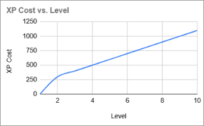
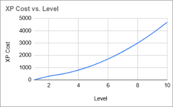
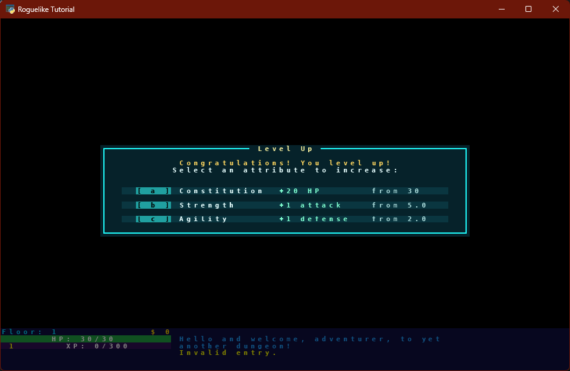
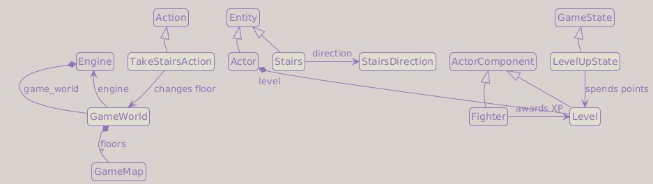
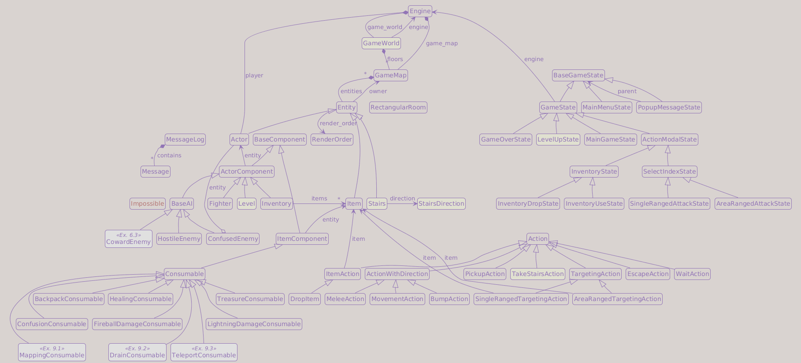

# Part 11: Dungeon Levels and Experience

## What You Will Build

By the end of this part, the player will gain experience from defeating enemies, level up with stat choices, and descend stairs to deeper dungeon floors.

## Learning goals

- Track experience points and character level on a `Level` component
- Show a level-up modal when the player gains enough XP
- Add descending stairs that generate a new dungeon floor
- Introduce `GameWorld` to separate "how to generate maps" from the current map
- Award XP to the killer when an enemy dies

---

## Experience and character progression

Classic roguelikes use an XP curve where each level requires more XP than the last.
The two most common designs are a flat cost per level and an accelerating one.



A **flat (linear) cost** means the player always knows how many fights to expect before
leveling up. Progress feels steady and predictable, but leveling stops feeling like an
event; it becomes background noise.



An **accelerating cost** makes early levels fast and generous, hooking the player
quickly. Later levels require real investment, which makes reaching them feel earned.
The risk is a curve so steep that high levels become practically unreachable.

We use a quadratic formula: each threshold grows by `level * factor`, so early levels
are fast and later ones demand progressively more effort.

| Level | XP cost | Increase |
| ---   | ---     | ---      |
| 2     | 300     | -        |
| 3     | 500     | +200     |
| 4     | 800     | +300     |
| 5     | 1200    | +400     |
| ...   | ...     | +100 * previous level |

The first level-up costs `level_up_base + current_level * level_up_factor` XP (300 at level 1). Each time you level up, the next cost increases by `new_level * level_up_factor`. This matches the growth rate used by games like Diablo from level 8 onwards.

---

## config.py additions

Part 11 introduces the Level/XP system. Append these groups to `game/constants/config.py`:

```python
# Level / XP
DEFAULT_LEVEL_UP_BASE   = 200
DEFAULT_LEVEL_UP_FACTOR = 100

# Stat bonuses on level-up
LEVEL_STAT_HP      = 20
LEVEL_STAT_ATTACK  = 1
LEVEL_STAT_DEFENSE = 1
```

`DEFAULT_LEVEL_UP_BASE` and `DEFAULT_LEVEL_UP_FACTOR` name the numbers that drive the XP curve explained above. `LEVEL_STAT_*` name the per-choice bonuses awarded in the level-up modal; adjusting them in one place changes the feel of every stat option at once.

The exploration-reward constants (`EXPLORATION_MILESTONES`, `EXPLORATION_XP_BASE`, etc.) belong to Exercise 2 and are listed there.

---

## The Level component

Create `game/entities/components/level.py`:

```python
from __future__ import annotations

from game.constants import config as constants
from game.entities.components.base_component import ActorComponent


class Level(ActorComponent):

    def __init__(
        self,
        current_level: int   = 1,
        current_xp: int      = 0,
        level_up_base: int   = constants.DEFAULT_LEVEL_UP_BASE,
        level_up_factor: int = constants.DEFAULT_LEVEL_UP_FACTOR,
        xp_given: int        = 0,
    ) -> None:
        self.current_level    = current_level
        self.current_xp       = current_xp
        self.level_up_base    = level_up_base
        self.level_up_factor  = level_up_factor
        self.xp_given         = xp_given
        self.xp_to_next_level = level_up_base + current_level * level_up_factor

    @property
    def requires_level_up(self) -> bool:
        return self.current_xp >= self.xp_to_next_level

    def add_xp(self, xp: int) -> bool:
        if xp == 0 or self.level_up_base == 0:
            return False

        was_ready = self.requires_level_up
        self.current_xp += xp
        return self.requires_level_up and not was_ready

    def increase_level(self) -> None:
        self.current_level    += 1
        self.current_xp       -= self.xp_to_next_level
        self.xp_to_next_level += self.current_level * self.level_up_factor

        # On level up recover all hp points
        self.entity.fighter.heal(self.entity.fighter.max_hp)

    def increase_max_hp(self, amount: int = constants.LEVEL_STAT_HP) -> None:
        self.entity.fighter.max_hp += amount
        self.increase_level()

    def increase_attack(self, amount: int = constants.LEVEL_STAT_ATTACK) -> None:
        self.entity.fighter.base_attack += amount
        self.increase_level()

    def increase_defense(self, amount: int = constants.LEVEL_STAT_DEFENSE) -> None:
        self.entity.fighter.base_defense += amount
        self.increase_level()
```

`xp_given` is how much XP an enemy awards on death. Enemies set this; the player leaves it at 0 (the player does not give XP to anything).

`add_xp` returns `True` only when this specific gain crosses the level-up threshold: `was_ready` captures the state before the increment, and the method returns `True` only if the threshold is now met and was not met before. Without this check, a fireball that kills two enemies in one action could trigger the message twice if the first kill already pushed XP past the threshold.

The two early-return guards cover two distinct cases. `if xp == 0` handles enemies (or any entity) with `xp_given=0`: they give no XP when killed and the call returns immediately. `if self.level_up_base == 0` is a defensive opt-out for any entity explicitly constructed with `level_up_base=0`; nothing in the current code triggers it, but it makes it easy to add a deliberately non-leveling entity in the future without modifying `add_xp`.

`increase_level` heals the player to full HP on every level-up. In a difficult roguelike, this makes level-up a meaningful survival tool: a player on low health has a reason to push through one more fight rather than retreat. `increase_max_hp` no longer needs to heal separately because `increase_level` already does it.

!!! info "base_attack and base_defense"
    We renamed the stored values to `base_attack` and `base_defense` to make room for equipment bonuses in Part 13. Both are stored as `float` so that equipment can apply multipliers (e.g. `base_defense *= 1.1`) without losing precision. Keep `attack` and `defense` as properties for now, so existing combat code can keep using `fighter.attack` and `fighter.defense`.

Update `Fighter.__init__` and add the two properties:

```python
self.base_defense = float(defense)
self.base_attack  = float(attack)

@property
def defense(self) -> float:
    return self.base_defense

@property
def attack(self) -> float:
    return self.base_attack
```

---

## Award XP on kill

Rather than passing `engine` into `die()`, we add an `attacker` parameter to `take_damage()` and route XP through that actor. This keeps `Fighter` decoupled from `Engine` and makes XP work for any Actor that deals damage: melee attacks, spells, or summoned allies added later.

We also take this opportunity to clean up how `_hp` is accessed. The `hp` setter existed only to clamp the value and call `die()`. Since `die()` is now triggered from `take_damage`, the setter has no remaining purpose. Removing it means `_hp` is only ever written in two places: `heal` and `take_damage`. A comment on each marks them as the sole mutators, so future readers know exactly where to look.

All other reads, including inside `heal` and `take_damage` themselves, go through the `self.hp` property. This makes `_hp =` a reliable grep target for writes.

Update `game/entities/components/fighter.py`. Remove the `hp` setter entirely, then update `heal` and `take_damage`:

```python
    # only heal and take_damage can write to self._hp
    def heal(self, amount: float) -> float:
        if self.hp == self.max_hp:
            return 0

        new_hp_value = self.hp + amount
        new_hp_value = min(new_hp_value, float(self.max_hp))

        recovered    = new_hp_value - self.hp
        self._hp     = new_hp_value

        return recovered

    # only heal and take_damage can write to self._hp
    def take_damage(self, amount: float, attacker: Actor) -> None:
        self._hp = max(0.0, min(self.hp - amount, float(self.max_hp)))

        if self.hp == 0:
            # Part-10. Exercise 2: Record a graveyard file
            # Self-inflicted deaths do not count as kills
            if attacker is not self.entity:
                attacker.fighter.kill_count += 1
            self.die(attacker)
```

Because `take_damage()` now requires an attacker, update every damage call site that can kill an enemy.

!!! note "Part 10 Exercise 2: graveyard file"
    If you completed that exercise, `take_damage` already has the `attacker` parameter and the call-site updates below are already in place. The only new changes for you are the body of `take_damage` shown above: the `_hp` cleanup and the `self.die(attacker)` call.

    **If you skipped that exercise**, your `Fighter` has no `kill_count` attribute, so omit the two `# Part-10. Exercise 2` lines above (`if attacker is not self.entity:` and `attacker.fighter.kill_count += 1`). The body then reads simply `if self.hp == 0: self.die(attacker)`. The `attacker` parameter and the call-site updates below are still required either way.

In `Fighter.melee_attack()`, pass the actor that is making the attack:

```diff
-            target.fighter.take_damage(damage)
+            target.fighter.take_damage(damage, attacker=self.entity)
```

Update the spell damage in `game/entities/components/consumable.py` too. The player is the `consumer`, so they are the attacker for lightning, fireball, and drain:

```diff
 class LightningDamageConsumable(Consumable):
     ...
-            target.fighter.take_damage(self.damage)
+            target.fighter.take_damage(self.damage, attacker=consumer)

 class FireballDamageConsumable(Consumable):
     ...
-                actor.fighter.take_damage(damage)
+                actor.fighter.take_damage(damage, attacker=consumer)

 class DrainConsumable(Consumable):
     ...
-        target.fighter.take_damage(amount_drained)
+        target.fighter.take_damage(amount_drained, attacker=consumer)
```

Replace the existing `die()` method:

```python
    def die(self, attacker: Actor | None) -> None:
        if self.entity.ai is None:
            death_message = "You died!"
            death_message_color = colors.PLAYER_DEATH
        else:
            death_message = f"The {self.entity.name} is dead!"
            death_message_color = colors.ENEMY_DEATH
            if attacker is not None and hasattr(attacker, "level"):
                if attacker.level.add_xp(self.entity.level.xp_given):
                    MessageLog.add_message("You feel your experience grow!", colors.LEVEL_UP)

        MessageLog.add_message(death_message, death_message_color)

        self.entity.char  = sprites.CORPSE
        self.entity.color = colors.CORPSE
        self.entity.ai    = None
        self.entity.name  = f"remains of {self.entity.name}"
        self.entity.blocks_movement = False
        self.entity.render_order    = RenderOrder.CORPSE
```

!!! tip "Duck typing with `hasattr`"
    `hasattr(attacker, "level")` checks for the presence of one specific attribute at runtime. `isinstance(attacker, Actor)` would also work here since all current attackers are `Actor` instances, but `hasattr` is more targeted: it handles future `Actor` subclasses or variants that may not carry a `Level` component, without requiring changes to `die()`. Note that the check is narrow on purpose: `take_damage` is already typed as `attacker: Actor` and accesses `attacker.fighter` earlier, so the attacker must still be a full Actor; `hasattr` does not make this work for arbitrary objects.

The level-up check (`requires_level_up`) runs in `GameState.handle_events()` after `handle_enemy_turns()` completes. This means if the killing blow crosses the XP threshold, the player still has to survive enemy turns before the level-up screen appears. It is intentional roguelike design: level-up healing is a strategic reward for timing fights well, not a last-second escape from death.

Add to `game/constants/colors.py`:

```python
LEVEL_UP = Color(0xFF, 0xFF, 0x00)
```

---

## Wire up the Level component

Update `game/entities/factories.py` imports, then attach `Level` to every actor:

```diff
+from game.constants import config as constants
+from game.entities.components.level import Level
-from game.entities.entity import Actor, Item
+from game.entities.entity import Actor, Entity, Item
+from game.entities.render_order import RenderOrder

 player = Actor(
     ...
     inventory = Inventory(capacity=10, max_capacity=26),
+    level     = Level(level_up_base=constants.DEFAULT_LEVEL_UP_BASE),
 )

 orc = Actor(
     ...
     inventory = Inventory(capacity=0, max_capacity=0),
+    level     = Level(xp_given=54),
 )

 troll = Actor(
     ...
     inventory = Inventory(capacity=0, max_capacity=0),
+    level     = Level(xp_given=36),
 )
```

The player passes `level_up_base=constants.DEFAULT_LEVEL_UP_BASE` and leaves `xp_given` at 0 (the player does not award XP to anything). Enemies pass only `xp_given` and use the default thresholds (which are never triggered because nothing calls `add_xp` on them). Because `Level.__init__` now defaults to `constants.DEFAULT_LEVEL_UP_BASE`, passing it explicitly here is redundant, but leaving it makes the per-entity configuration explicit and searchable.

Update `Actor.__init__` in `game/entities/entity.py` to accept and wire up the `level` component:

```diff
 class Actor(Entity):

     def __init__(
         self,
         *,
         ...
+        level: Level,
     ) -> None:
         ...
+        self.level = level
+        self.level.entity = self
```

!!! warning "Save file compatibility"
    Adding `level` to `Actor` changes the structure of pickled objects. Any save file from Part 10 will fail to load correctly. Delete `savegames/savegame.sav` before testing this part.

---

## GameWorld: separating map params from the live map

`Engine` currently holds `game_map` directly. When the player descends stairs, we need to generate a new map with the same parameters but a higher floor number. We extract those parameters into a `GameWorld` class.

Create `game/game_world.py`:

```python
from __future__ import annotations

from typing import TYPE_CHECKING

if TYPE_CHECKING:
    from game.engine import Engine
    from game.map.game_map import GameMap


class GameWorld:
    """Holds the settings for map generation and tracks the current floor."""

    def __init__(
        self,
        *,
        engine: Engine,
        map_width: int,
        map_height: int,
        max_rooms: int,
        room_min_size: int,
        room_max_size: int,
        min_monsters_per_room: int,
        max_monsters_per_room: int,
        min_items_per_room: int,
        max_items_per_room: int,
        seed: int,
        current_floor: int = 0,
    ) -> None:
        self.engine                = engine
        self.map_width             = map_width
        self.map_height            = map_height
        self.max_rooms             = max_rooms
        self.room_min_size         = room_min_size
        self.room_max_size         = room_max_size
        self.min_monsters_per_room = min_monsters_per_room
        self.max_monsters_per_room = max_monsters_per_room
        self.min_items_per_room    = min_items_per_room
        self.max_items_per_room    = max_items_per_room
        self.seed                  = seed
        self.current_floor         = current_floor
        self.floors: list[GameMap] = []

    def generate_floor(self) -> None:
        from game.map.map_generator import generate_dungeon

        self.current_floor += 1
        self.engine.game_map = generate_dungeon(
            max_rooms             = self.max_rooms,
            room_min_size         = self.room_min_size,
            room_max_size         = self.room_max_size,
            map_width             = self.map_width,
            map_height            = self.map_height,
            min_monsters_per_room = self.min_monsters_per_room,
            max_monsters_per_room = self.max_monsters_per_room,
            min_items_per_room    = self.min_items_per_room,
            max_items_per_room    = self.max_items_per_room,
            player                = self.engine.player,
            seed                  = self.seed + self.current_floor,
        )
```

`seed + self.current_floor` keeps the run reproducible while still giving each dungeon floor a different layout. Using the exact same seed for every floor would generate the same dungeon again.

!!! info "Keyword-only arguments"
    `def __init__(self, *, engine, ...)`: the bare `*` forces every argument after it to be passed by name: `GameWorld(engine=engine, map_width=80, ...)`. Positional calls like `GameWorld(engine, 80, 48, ...)` raise a `TypeError` immediately. This is a useful safeguard for constructors with many parameters of the same type: swapping two `int` arguments positionally is a silent bug, but swapping keyword arguments is obvious from the call site.

Update `Engine` in `game/engine.py`. The engine will no longer receive `game_map` through its constructor: the map is created later by `GameWorld.generate_floor()`, which assigns it directly to `engine.game_map`. Add class-level annotations so the type checker knows both attributes will exist even though neither is set in `__init__`, and remove `self.update_fov()` from the constructor (it will be called from `new_game()` after the first floor is generated):

```diff
+from game.game_world import GameWorld

 class Engine:
+    game_map: GameMap
+    game_world: GameWorld

-    def __init__(self, game_map: GameMap, player: Actor, ...) -> None:
-        self.game_map = game_map
+    def __init__(self, player: Actor, ...) -> None:
         self.mouse_location: tuple[int, int] = (0, 0)
         self.player = player
         ...
-        self.update_fov()
```

If you completed exercises from previous parts, keep `fov_radius`, `fading_memory`, `memory_duration`, and `turn_count` as optional parameters in `__init__`. They stay on the engine and are not affected by this change.

Update `game/setup_game.py`, replace the direct `generate_dungeon` call with `GameWorld`:

```diff
-from game.map.map_generator import generate_dungeon
+from game.game_world import GameWorld

 def new_game() -> Engine:
     ...
-    game_map = generate_dungeon(
-        max_rooms             = constants.MAX_ROOMS,
-        room_min_size         = constants.ROOM_MIN_SIZE,
-        room_max_size         = constants.ROOM_MAX_SIZE,
-        map_width             = constants.MAP_WIDTH,
-        map_height            = constants.MAP_HEIGHT,
-        min_monsters_per_room = constants.MIN_MONSTERS_PER_ROOM,
-        max_monsters_per_room = constants.MAX_MONSTERS_PER_ROOM,
-        min_items_per_room    = constants.MIN_ITEMS_PER_ROOM,
-        max_items_per_room    = constants.MAX_ITEMS_PER_ROOM,
-        player                = player,
-        seed                  = seed,
-    )
-
-    engine = Engine(game_map=game_map, player=player)
+    engine = Engine(player=player)
+    engine.game_world = GameWorld(
+        engine                = engine,
+        max_rooms             = constants.MAX_ROOMS,
+        room_min_size         = constants.ROOM_MIN_SIZE,
+        room_max_size         = constants.ROOM_MAX_SIZE,
+        map_width             = constants.MAP_WIDTH,
+        map_height            = constants.MAP_HEIGHT,
+        min_monsters_per_room = constants.MIN_MONSTERS_PER_ROOM,
+        max_monsters_per_room = constants.MAX_MONSTERS_PER_ROOM,
+        min_items_per_room    = constants.MIN_ITEMS_PER_ROOM,
+        max_items_per_room    = constants.MAX_ITEMS_PER_ROOM,
+        seed                  = seed,
+    )
+    engine.game_world.generate_floor()
+    engine.update_fov()
```

---

## Stairs in the map generator

### The Stairs entity

Using a plain `Entity` for stairs works on a single-staircase map, but as soon as there are two sets of stairs (up and down) the code must compare tile positions to decide which type was triggered. A dedicated class carries that information directly.

Add to `game/entities/entity.py`:

```python
from enum import Enum, auto

class StairsDirection(Enum):
    UP   = auto()
    DOWN = auto()


class Stairs(Entity):
    def __init__(
        self,
        *,
        direction: StairsDirection,
        x: int       = 0,
        y: int       = 0,
        char: str    = sprites.UNKNOWN,
        color: Color = colors.DEFAULT_FG,
        name: str    = "Stairs",
    ) -> None:
        super().__init__(
            x               = x,
            y               = y,
            char            = char,
            color           = color,
            name            = name,
            blocks_movement = False,
            render_order    = RenderOrder.ITEM,
        )
        self.direction = direction
```

!!! tip "Keep the stairs on the map (optional)"
    If you completed Part 4's Exercise 3, stairs are an ideal use of `stays_visible`: pass `stays_visible=True` to the `super().__init__()` call in `Stairs` and they will remain drawn once discovered, even outside your FOV, a small but real quality-of-life improvement. If you skipped that exercise, this is a good reason to go back and add the flag.

Add to `game/constants/sprites.py`:

```python
DOWN_STAIRS = ">"
UP_STAIRS   = "<"
```

Add to `game/constants/colors.py`:

```python
DOWN_STAIRS = Color(255, 255, 100)
UP_STAIRS   = Color(200, 200, 255)
```

Update `game/entities/factories.py` to use `Stairs` instead of bare `Entity`, and add the up-stairs factory:

```python
from game.entities.entity import Actor, Item, Stairs, StairsDirection

down_stairs = Stairs(
    char      = sprites.DOWN_STAIRS,
    color     = colors.DOWN_STAIRS,
    direction = StairsDirection.DOWN,
)

up_stairs = Stairs(
    char      = sprites.UP_STAIRS,
    color     = colors.UP_STAIRS,
    direction = StairsDirection.UP,
)
```

### Updating GameMap

Add both stair locations as class-level attributes and a helper that finds a `Stairs` entity at a given position:

```python
from game.entities.entity import Actor, Entity, Item, Stairs

class GameMap:
    downstairs_location: tuple[int, int] = (0, 0)
    upstairs_location:   tuple[int, int] = (0, 0)

    ...

    def get_stairs_at_location(self, x: int, y: int) -> Stairs | None:
        from game.entities.entity import Stairs
        for entity in self.entities:
            if isinstance(entity, Stairs) and entity.x == x and entity.y == y:
                return entity
        return None
```

### Placing stairs in map_generator.py

`generate_dungeon` now receives the current floor number so it can decide whether to place up-stairs:

```diff
 def generate_dungeon(
     ...,
     player: Entity,
     seed: int,
+    current_floor: int,
 ) -> GameMap:
```

In the first-room block, place up-stairs on floors 2 and deeper (floor 1 has no previous floor to return to):

```diff
     if not rooms:
         player.place(*new_room.center, dungeon)
+        if current_floor > 1:
+            dungeon.upstairs_location = new_room.center
+            factories.up_stairs.spawn(dungeon, *new_room.center)
```

After all rooms are generated, place down-stairs in the last room. Pick a free cell so the stairs do not overwrite an item or monster:

```diff
+    last_room = rooms[-1]
+    free = [
+        (x, y)
+        for x in range(last_room.x1 + 1, last_room.x2)
+        for y in range(last_room.y1 + 1, last_room.y2)
+        if not any(e.x == x and e.y == y for e in dungeon.entities)
+    ]
+
+    stair_pos = random.choice(free) if free else last_room.center
+    dungeon.downstairs_location = stair_pos
+    factories.down_stairs.spawn(dungeon, *stair_pos)
+
     return dungeon
```

`free` is a list comprehension with an `if` clause: it keeps only the room cells where no entity already exists. `random.choice(free) if free else last_room.center` chooses a random free cell when possible, and falls back to the room center if the room somehow has no free cells. Because the list is built by walking the room in a fixed order, the same seed can reproduce the same stair placement.

### Passing current_floor from GameWorld

Update `GameWorld.generate_floor` to pass the new parameter:

```diff
 def generate_floor(self) -> None:
     from game.map.map_generator import generate_dungeon
     self.current_floor += 1
     self.engine.game_map = generate_dungeon(
         ...,
         seed          = self.seed + self.current_floor,
+        current_floor = self.current_floor,
     )
+    self.floors.append(self.engine.game_map)
```

`generate_floor` appends each new map to `self.floors` so it can be retrieved when the player ascends.

---

## TakeStairsAction

Add two colors to `game/constants/colors.py`:

```python
DESCEND = Color(0x9F, 0x3F, 0xFF)
ASCEND  = Color(0x9F, 0x9F, 0xFF)
```

`TakeStairsAction` now queries the map for a `Stairs` entity at the player's position rather than comparing coordinates. This lets a single action handle both directions:

```python
from game.entities.entity import Actor, Item, StairsDirection

class TakeStairsAction(Action):

    def perform(self, engine: Engine, entity: Entity) -> None:
        assert isinstance(entity, Actor)
        stairs = engine.game_map.get_stairs_at_location(entity.x, entity.y)
        if stairs is None:
            raise Impossible("There are no stairs here.")

        if stairs.direction == StairsDirection.DOWN:
            engine.game_world.descend_floor()
            MessageLog.add_message("You descend the staircase.", colors.DESCEND)
            return

        if stairs.direction == StairsDirection.UP and engine.game_world.current_floor > 1:
            engine.game_world.ascend_floor()
            MessageLog.add_message("You ascend the staircase.", colors.ASCEND)
            return

        raise Impossible("There are no stairs here.")
```

### descend_floor and ascend_floor in GameWorld

The `self.floors: list[GameMap] = []` line in `GameWorld.__init__` now has a purpose. Add two navigation methods:

```python
def descend_floor(self) -> None:
    next_floor_index = self.current_floor
    if next_floor_index < len(self.floors):
        self.current_floor += 1
        next_floor = self.floors[next_floor_index]
        self.engine.player.place(*next_floor.upstairs_location, next_floor)
        self.engine.game_map = next_floor
        return
    self.generate_floor()

def ascend_floor(self) -> None:
    previous_floor_index = self.current_floor - 2
    self.current_floor -= 1
    previous_floor = self.floors[previous_floor_index]
    self.engine.player.place(*previous_floor.downstairs_location, previous_floor)
    self.engine.game_map = previous_floor
```

`descend_floor` checks whether the next floor already exists in `self.floors`. If it does (the player has been there before), it restores that map. Otherwise it generates a new one. `ascend_floor` always restores an existing map. You cannot ascend above floor 1, and the check `current_floor > 1` in `TakeStairsAction` enforces that.

Add `KEY_DESCEND` to `game/constants/keys.py` (Enter or numpad Enter triggers both up and down stairs, since the action decides based on which stairs entity is underfoot):

```python
KEY_DESCEND = {tcod.event.KeySym.RETURN, tcod.event.KeySym.KP_ENTER}
```

Add `TakeStairsAction` to the imports in `game/game_states.py` and wire it up in `MainGameState`:

```python
        if key in keys.KEY_DESCEND:
            return TakeStairsAction()
```

---

## LevelUpState

### Colors

Add to `game/constants/colors.py`:

```python
LEVEL_UP_MENU_FRAME    = Color( 32, 255, 255)
LEVEL_UP_MENU_BG       = Color(  6,  34,  42)
LEVEL_UP_MENU_ACCENT   = Color( 32, 160, 160)
LEVEL_UP_MENU_ROW_BG   = Color( 10,  54,  64)
LEVEL_UP_MENU_TITLE    = Color(255, 245, 160)
LEVEL_UP_MENU_CONGRATS = Color(255, 215,  96)
LEVEL_UP_MENU_TEXT     = Color(232, 255, 255)
LEVEL_UP_MENU_DIM      = Color(168, 216, 216)
LEVEL_UP_MENU_BONUS    = Color(128, 255, 208)
LEVEL_UP_MENU_KEY      = BLACK
```

### on_render

The modal dims the scene behind it, draws a drop shadow, and centers itself, all with the tools built in earlier parts (`// 2` dimming and `_draw_panel` from Part 7). Each stat option gets its own colored row with the key badge, stat name, bonus, and current value separated into columns:

```python
class LevelUpState(GameState):
    TITLE = "Level Up"

    def on_render(self, console: tcod.console.Console) -> None:
        super().on_render(console)

        # Dim the map background to highlight the level-up menu
        console.fg[:] = console.fg // 2
        console.bg[:] = console.bg // 2

        fighter = self.engine.player.fighter
        options = [
            ("a", "Constitution", "+20 HP",     f"from {fighter.max_hp}"),
            ("b", "Strength",     "+1 attack",  f"from {fighter.base_attack}"),
            ("c", "Agility",      "+1 defense", f"from {fighter.base_defense}"),
        ]

        width  = 52
        height = 13
        x = (console.width  - width)  // 2
        y = (console.height - height) // 2

        # Draw the level-up menu box
        _draw_panel(
            console,
            x,
            y,
            width,
            height,
            colors.LEVEL_UP_MENU_FRAME,
            colors.LEVEL_UP_MENU_BG,
        )

        title = f" {self.TITLE} "
        # Draw the title over the top frame
        console.print(
            x    = x + (width - len(title)) // 2,
            y    = y,
            text = title,
            fg   = colors.LEVEL_UP_MENU_TITLE,
            bg   = colors.LEVEL_UP_MENU_BG,
        )

        # Draw the congratulations message
        console.print(
            x         = console.width // 2,
            y         = y + 2,
            text      = "Congratulations! You level up!",
            fg        = colors.LEVEL_UP_MENU_CONGRATS,
            alignment = tcod.constants.CENTER,
        )

        # Draw the instruction for choosing an attribute
        console.print(
            x         = console.width // 2,
            y         = y + 3,
            text      = "Select an attribute to increase:",
            fg        = colors.LEVEL_UP_MENU_TEXT,
            alignment = tcod.constants.CENTER,
        )

        row_x = x + 3
        row_width = width - 6
        for index, (key, name, bonus, current) in enumerate(options):
            row_y = y + 6 + index * 2

            # Draw the background for one attribute option
            console.draw_rect(
                x      = row_x,
                y      = row_y,
                width  = row_width,
                height = 1,
                ch     = ord(" "),
                bg     = colors.LEVEL_UP_MENU_ROW_BG,
            )

            # Draw the key that selects this option
            console.print(
                row_x + 2,
                row_y,
                f"[ {key} ]",
                fg = colors.LEVEL_UP_MENU_KEY,
                bg = colors.LEVEL_UP_MENU_ACCENT,
            )

            # Draw the attribute name
            console.print(
                row_x + 8,
                row_y,
                f"{name:<12}",
                fg = colors.LEVEL_UP_MENU_TEXT,
                bg = colors.LEVEL_UP_MENU_ROW_BG,
            )

            # Draw the bonus that will be applied
            console.print(
                row_x + 22,
                row_y,
                f"{bonus:<11}",
                fg = colors.LEVEL_UP_MENU_BONUS,
                bg = colors.LEVEL_UP_MENU_ROW_BG,
            )

            # Draw the current attribute value
            console.print(
                row_x + 35,
                row_y,
                current,
                fg = colors.LEVEL_UP_MENU_DIM,
                bg = colors.LEVEL_UP_MENU_ROW_BG,
            )
```

*The finished Level Up stats overlay looks like this*:



The dimming and the drop shadow come straight from Part 7: `// 2` halves every color channel of the frame already rendered, and `_draw_panel` draws the shadow, fill, and frame in one call. The key badges (`[ a ]`, dark text over the accent color) match the style of the inventory rows from Part 8, so every selectable option in the game now looks the same.

### event_keydown

```python
    def event_keydown(self, event: tcod.event.KeyDown) -> BaseGameState | None:
        player = self.engine.player
        index  = event.sym - tcod.event.KeySym.A

        if index == 0:
            player.level.increase_max_hp()

        elif index == 1:
            player.level.increase_attack()

        elif index == 2:
            player.level.increase_defense()

        else:
            MessageLog.add_message("Invalid entry.", colors.INVALID)
            return None

        return MainGameState(self.engine)
```

### Triggering the modal

Trigger the modal from `GameState.handle_events()` after `update_fov()`:

```diff
             self.engine.update_fov()

+            if self.engine.player.level.requires_level_up:
+                return LevelUpState(self.engine)
+
             if isinstance(self, ActionModalState):
```

---

## Show floor and gold in the UI

Redesign the top two rows of the HUD panel:

```text
Floor: 1         $ 0
[   HP: 30/30      ]
```

**Step 1.** Add the config import and a contrast-aware text helper to `game/hud.py`.

`constants.BAR_WIDTH` is set to 24 (wider than the previous 20) so the HUD has room for the XP bar and the exercise version can embed the level number. `BAR_TEXT_DARK` is used when the bar's fill color is light enough that white text would be hard to read.

`_print_bar_text` renders a string character by character. For each character it checks whether that column falls inside the filled portion of the bar, picks the matching fill or empty color, then chooses the fg color (light or dark) by luminance contrast. This keeps text legible regardless of where the bar boundary sits:

```python
from game.constants import config as constants
from game.constants.colors import Color

def _contrast_text_color(background: Color, light: Color, dark: Color) -> Color:
    return dark if background.grey.r > 128 else light

def _bar_background_at(
    x: int, bar_x: int, bar_width: int,
    filled_color: Color, empty_color: Color,
) -> Color:
    return filled_color if x < bar_x + bar_width else empty_color

def _print_bar_text(
    console: Console,
    text: str, x: int, y: int,
    bar_width: int,
    filled_color: Color, empty_color: Color,
    light_text_color: Color, dark_text_color: Color,
    bar_x: int = 0,
) -> None:
    for offset, character in enumerate(text):
        text_x = x + offset
        bg = _bar_background_at(
            x            = text_x,
            bar_x        = bar_x,
            bar_width    = bar_width,
            filled_color = filled_color,
            empty_color  = empty_color,
        )
        console.print(
            x    = text_x,
            y    = y,
            text = character,
            fg   = _contrast_text_color(bg, light_text_color, dark_text_color),
            bg   = bg,
        )
```

Also give `render_bar` a default width:

```diff
 def render_bar(
     console: Console,
     current_value: float,
     maximum_value: int,
-    total_width: int,
+    total_width: int     = constants.BAR_WIDTH,
     y: int               = 45,
 ) -> None:
```

**Step 2.** Update `render_bar` to use `_print_bar_text`. Also add `BAR_TEXT_DARK` to `colors.py`:

```python
BAR_TEXT_DARK = BLACK
```

Replace the final `console.print` in `render_bar`:

```diff
-    hp_text = f"HP: {int(current_value)}/{maximum_value}"
-    console.print(
-        x    = (total_width - len(hp_text)) // 2,
-        y    = y,
-        text = hp_text,
-        fg   = colors.BAR_TEXT,
-    )
+    hp_text = f"HP: {int(current_value)}/{maximum_value}"
+    _print_bar_text(
+        console          = console,
+        text             = hp_text,
+        x                = (total_width - len(hp_text)) // 2,
+        y                = y,
+        bar_width        = bar_width,
+        filled_color     = bar_color_fg,
+        empty_color      = bar_color_bg,
+        light_text_color = colors.BAR_TEXT,
+        dark_text_color  = colors.BAR_TEXT_DARK,
+    )
```

**Step 3.** Add `FLOOR` to `game/constants/colors.py`:

```python
FLOOR = Color(0x00, 0xD7, 0xFF)
```

**Step 4.** Update `render_gold` to right-align gold within the bar width, and add `render_dungeon_level` to show the current floor on the left of the same row:

```python
def render_gold(
    console: Console,
    gold: int,
    total_width: int = constants.BAR_WIDTH,
    y: int           = 44,
) -> None:
    text = f"$ {gold}"
    console.print(
        x    = total_width - len(text),
        y    = y,
        text = text,
        fg   = colors.GOLD,
    )


def render_dungeon_level(
    console: Console,
    dungeon_floor: int,
    y: int = 44,
) -> None:
    console.print(
        x    = 0,
        y    = y,
        text = f"Floor: {dungeon_floor}",
        fg   = colors.FLOOR,
    )
```

**Step 5.** Add `render_xp_bar` to `game/hud.py`. This basic version draws the bar background, fills it proportionally, and centers the XP text. Exercise 1 later replaces it with the full color gradient and the embedded level number:

```python
def render_xp_bar(
    console: Console,
    current_xp: int,
    xp_to_next_level: int,
    total_width: int      = constants.BAR_WIDTH,
    y: int                = 46,
) -> None:
    xp_ratio  = min(1.0, float(current_xp) / xp_to_next_level)
    bar_width = int(xp_ratio * total_width)

    console.draw_rect(
        x      = 0,
        y      = y,
        width  = total_width,
        height = 1,
        ch     = ord(" "),
        bg     = colors.HP_BAR_EMPTY,
    )

    if bar_width > 0:
        console.draw_rect(
            x      = 0,
            y      = y,
            width  = bar_width,
            height = 1,
            ch     = ord(" "),
            bg     = colors.HP_BAR_FILLED,
        )

    xp_text = f"XP: {current_xp}/{xp_to_next_level}"
    console.print(
        x    = (total_width - len(xp_text)) // 2,
        y    = y,
        text = xp_text,
        fg   = colors.BAR_TEXT,
    )
```

**Step 6.** Update `Engine.render()`: drop the now-redundant `total_width` from the bar call, add the floor and XP displays, and move the message log and mouse-hover x-position to `constants.BAR_WIDTH + 1`:

```diff
         hud.render_bar(
             console       = console,
             current_value = self.player.fighter.hp,
             maximum_value = self.player.fighter.max_hp,
-            total_width   = 20,
         )

+        hud.render_xp_bar(
+            console          = console,
+            current_xp       = self.player.level.current_xp,
+            xp_to_next_level = self.player.level.xp_to_next_level,
+        )
+
         hud.render_gold(
             console = console,
             gold    = self.player.inventory.gold,
         )

         hud.render_dungeon_level(
             console       = console,
             dungeon_floor = self.game_world.current_floor,
         )

         MessageLog.render(
             console = console,
-            x       = 21,
+            x       = constants.BAR_WIDTH + 1,
             ...
         )

         hud.render_names_at_mouse_location(
             console        = console,
-            x              = 21,
+            x              = constants.BAR_WIDTH + 1,
             ...
         )
```

The HUD now shows:

```text
Floor: 1             $ 0
[       HP: 30/30      ]
[       XP: 0/300      ]
```

---

## Testing your work

Run `python main.py`:

- [ ] Killing enemies with melee, lightning, fireball, or drain counts toward level-up XP
- [ ] After enough XP, a level-up screen appears with three stat choices
- [ ] Selecting an option increases the stat and closes the modal
- [ ] Finding `>` stairs and pressing Enter generates a new floor
- [ ] Finding `<` stairs and pressing Enter returns to the previous floor with its original layout
- [ ] The player's HP, inventory, and level persist across floor transitions
- [ ] Enemies and items are freshly generated on each new floor; revisited floors keep their state
- [ ] The floor counter in the UI increments and decrements correctly
- [ ] The XP bar appears below the HP bar with the current XP and next threshold

---

## Summary

Character progression and dungeon depth are now linked. Key additions:

- **`Level` component**: XP tracking, level-up threshold, stat-increase methods
- **`Stairs` entity**: typed stairs with `StairsDirection`; replaces bare `Entity`
- **`GameWorld`**: owns generation parameters, floor list, and navigation methods
- **`TakeStairsAction`**: queries map for stairs entity and delegates to `descend_floor` / `ascend_floor`
- **`LevelUpState`**: centered modal with dimmed background and colored stat rows
- **XP on kill**: `Fighter.die()` awards XP to the player

**Current architecture**:

- `GameWorld`: owns dungeon generation parameters, the ordered `floors` list, and `current_floor`
- `Engine`: owns the current `GameMap` plus a `GameWorld` for navigation
- `Level`: component that owns XP, level thresholds, and stat increases
- `TakeStairsAction`: looks up the `Stairs` entity under the player and calls the appropriate `GameWorld` method
- `LevelUpState`: modal state entered when the player must choose a stat

**Local Class Diagram**:



**Full Class Diagram**:



**File structure**:

```text
main.py
game/
├── __init__.py
├── actions.py                  ← modified
├── engine.py                   ← modified
├── exceptions.py
├── game_world.py               ← new
├── hud.py                      ← modified
├── game_states.py              ← modified
├── message_log.py
├── setup_game.py               ← modified
├── constants/
│   ├── __init__.py
│   ├── colors.py               ← modified
│   ├── config.py               ← modified
│   └── sprites.py              ← modified
├── entities/
│   ├── __init__.py
│   ├── entity.py               ← modified
│   ├── factories.py            ← modified
│   ├── render_order.py
│   └── components/
│       ├── __init__.py
│       ├── ai.py
│       ├── base_component.py
│       ├── consumable.py       ← modified
│       ├── fighter.py          ← modified
│       ├── inventory.py
│       └── level.py            ← new
└── map/
    ├── __init__.py
    ├── game_map.py
    ├── tile_types.py
    └── map_generator.py        ← modified
```

---

## Exercises

1. **XP display**:

    The HUD already renders an XP bar via `render_xp_bar` (added in the main tutorial). Extend it with the full color gradient and the level number embedded on the left.

    `XP_LEVEL_WIDTH = 4` is already defined in `game/constants/config.py` (added in Part 10). `hud.py` reads it as `constants.XP_LEVEL_WIDTH`.

    Add `current_level` to the `render_xp_bar` parameters and pass `self.player.level.current_level` from `Engine.render()`.

    The bar is already 24 chars wide; both bars share `constants.BAR_WIDTH`. At level 50 the XP text reaches `"XP: 122700/127700"` (17 chars). With 24 chars total and 4 reserved for the level prefix, 20 chars remain, enough for any realistic play-through.

    Print the level number at `x=1` inside the XP bar in `colors.LEVEL_UP` (level-up yellow), then center the XP text in the remaining 20 characters:

    ```text
    [      HP: 30/30       ]   24 chars, HP bar unchanged
    [ 1   XP: 0/300        ]   level on the left, XP centered in the rest
    [10   XP: 4700/5700    ]   level 10
    [50  XP: 122700/127700 ]   level 50
    ```

    For the bar fill color, use a three-tier gradient that conveys *accumulating power* rather than the HP bar's danger ramp:

    | Fill ratio | Bar filled | Bar empty | Feel |
    |---|---|---|---|
    | 0-33% | `(0x70, 0x30, 0xC8)` violet | `(0x30, 0x10, 0x54)` | just started |
    | 33-66% | `(0x20, 0x60, 0xC0)` bright blue | `(0x0C, 0x28, 0x60)` | building up |
    | 66-100% | `colors.LEVEL_UP` yellow | `(0x58, 0x48, 0x08)` | almost there |

    The final tier reuses `LEVEL_UP`: the bar turns yellow before a level-up, making the reward feel imminent without any extra text.

2. **XP from exploration**:

    Reward the player for exploring each floor, scaled by depth so the reward stays relevant at every level. There are two sources, and the design is in how they balance:

    - **Milestones** at 25%, 50%, 75% and 100% of a floor revealed. Make the payoff *escalate* (later milestones worth more) and *scale with the current floor*, so deep, thorough exploration pays best. Track which milestones a floor has already paid, and store that on the **map**, not the engine: floors now persist (Part 11), and a return visit must not re-award them.
    - A **descent** reward when the player takes the down stairs, scaled by the floor being left. Guard it the same way, so walking up and down one staircase cannot farm XP.

    Aim for exploration being clearly worth more than rushing. With the numbers below, exploration alone gives double the descent reward at every depth, and fully exploring a floor before descending gives triple the XP of descending immediately.

    ??? note "Reference implementation"
        Constants in `game/constants/config.py`:

        ```python
        # Exploration rewards
        EXPLORATION_MILESTONES = (0.25, 0.50, 0.75, 1.00)
        EXPLORATION_MESSAGES = (
            "You have explored 25% of this floor. You gain {xp} XP.",
            "You have explored half of this floor. You gain {xp} XP.",
            "You have explored 75% of this floor. You gain {xp} XP.",
            "You have fully explored this floor! You gain {xp} XP.",
        )
        EXPLORATION_XP_BASE  = 26
        EXPLORATION_XP_TIER  = 16
        DESCENT_XP_PER_FLOOR = 100
        ```

        Per-floor state in `GameMap.__init__` (`game/map/game_map.py`); the count is filled in later, once the map is carved:

        ```python
        self.explorable_tiles: int = 0
        self.exploration_milestones = [False, False, False, False]
        self.descent_xp_awarded = False
        ```

        At the end of `generate_dungeon`, after all tiles are placed:

        ```python
        dungeon.explorable_tiles = int(dungeon.tiles["walkable"].sum())
        ```

        Award the milestones in `Engine` (`game/engine.py`), called after each FOV update. The escalating, depth-scaled payoff is `(EXPLORATION_XP_BASE + index * EXPLORATION_XP_TIER) * current_floor`, and the per-floor `exploration_milestones` flags stop a milestone paying twice:

        ```python
        # Part-11. Exercise 2: XP from exploration
        def award_exploration_xp(self) -> None:
            game_map = self.game_map
            if game_map.explorable_tiles == 0:
                return

            revealed = int((game_map.explored & game_map.tiles["walkable"]).sum())
            ratio = revealed / game_map.explorable_tiles

            for index, milestone in enumerate(constants.EXPLORATION_MILESTONES):
                if ratio < milestone or game_map.exploration_milestones[index]:
                    continue

                xp_reward = (
                    constants.EXPLORATION_XP_BASE
                    + index * constants.EXPLORATION_XP_TIER
                ) * self.game_world.current_floor
                self.player.level.add_xp(xp_reward)
                game_map.exploration_milestones[index] = True

                message_color = colors.LEVEL_UP if milestone == 1.0 else colors.WHITE
                MessageLog.add_message(
                    constants.EXPLORATION_MESSAGES[index].format(xp=xp_reward),
                    message_color,
                )
        ```

        `award_exploration_xp` does nothing until it is called. Invoke it at the end of `Engine.update_fov()`, so the milestones are checked every time the player's view refreshes:

        ```python
        # at the end of Engine.update_fov()
        self.award_exploration_xp()
        ```

        The descent reward goes in `TakeStairsAction` (`game/actions.py`), which needs `from game.constants import config as constants`. Add it to the "down" branch, guarded so it pays once per floor:

        ```diff
        if stairs.direction == StairsDirection.DOWN:
        +    # Part-11. Exercise 2: XP from exploration
        +    if not engine.game_map.descent_xp_awarded:
        +        xp_reward = constants.DESCENT_XP_PER_FLOOR * engine.game_world.current_floor
        +        entity.level.add_xp(xp_reward)
        +        engine.game_map.descent_xp_awarded = True
        +        MessageLog.add_message(
        +            f"You descend deeper into the dungeon. You gain {xp_reward} XP.",
        +            colors.DESCEND,
        +        )
        +
            engine.game_world.descend_floor()
        ```

        The reward, in XP, escalating per milestone and scaling with depth:

        | Milestone | Floor 1 | Floor 5 | Floor 10 |
        |---|---|---|---|
        | 25% | 26 | 130 | 260 |
        | 50% | 42 | 210 | 420 |
        | 75% | 58 | 290 | 580 |
        | 100% | 74 | 370 | 740 |
        | **Total** | **200** | **1 000** | **2 000** |
