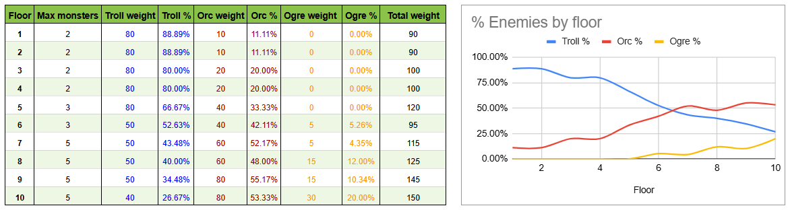
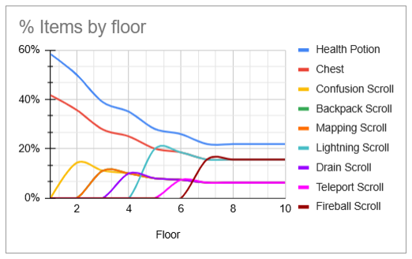
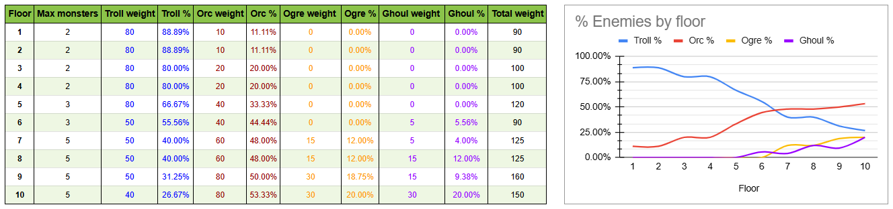

# Part 12: Procedural Difficulty

## What You Will Build

By the end of this part, deeper dungeon floors will feel harder in a way the player can notice: tougher enemies appear more often, and better items become available to compensate. The spawn system driving this is small but reusable for any future content.

## Learning goals

- Replace fixed per-room spawn limits with floor-keyed tables
- Turn the flat weighted spawn table from Part 5 into a depth-aware encounter table
- Make both monster variety and item variety scale with dungeon depth
- Write a reusable generic helper with Python 3.12 type parameter syntax

---

## The problem with flat spawn rates

Right now, every floor draws from the same spawn tables with the same weights. The weighted table from Part 5 Exercise 2 already made some monsters rarer than others, but the weights never change: floor 10 rolls on exactly the same table as floor 1. This makes the game feel flat: depth adds no tension.

!!! info "Where you stand"
    Two Part 5 exercises built the current spawn system: Exercise 1 added minimum and maximum counts per room, and Exercise 2 replaced the hardcoded monster split with a `monster_chances` table and `rng.choices`. This chapter absorbs both: the counts become floor-keyed tables in `config.py`, and the weight tables gain a floor dimension. If you skipped them, don't worry: Part 8 made the weighted tables part of the main path anyway, and Part 11's listings already carried the per-room limit parameters, so the diffs below match your code. Where a deleted line covers something you never added (an exercise item, for example), there is simply nothing to delete.

The fix is an **encounter table**: a mapping from dungeon floor to spawn probabilities. Orcs appear rarely on shallow floors and frequently on deep ones. New items only appear once the player has had time to learn the basics.

!!! info "Out-of-depth monsters"
    Depth-based spawn tables are as old as the genre. Rogue (1980) already picked monsters from bands tied to the dungeon level, so the alphabet got meaner as you went down. Later games like Angband let those bands blur at the edges, so a deeper monster could occasionally surface early. The floor-keyed tables you are about to write are the same core idea: monsters bound to depth, expressed as data.

---

## Weighted selection, floor by floor

You already used weighted random selection in Part 5 Exercise 2: given a list of `(item, weight)` pairs, `rng.choices` picks an item at random, where higher-weight items are more likely. As a refresher, here is how the item weights from this chapter behave on a deep floor, keeping only the four base items to make the example short:

```text
Item              Weight   Cumulative
─────────────────────────────────────
Health Potion       35         35
Confusion Scroll    10         45
Lightning Scroll    25         70
Fireball Scroll     25         95

Random 0-94:   0-34  → Health Potion
              35-44  → Confusion Scroll
              45-69  → Lightning Scroll
              70-94  → Fireball Scroll
```

Note that "spawn nothing" is not an entry in the table. The number of items per room is rolled first (and can be zero); the table only decides *which* items spawn once that count is known.

What is new in this part is the floor dimension: the weight of each entry now depends on how deep the player is.

---

## Floor-keyed weight tables

A **floor-keyed table** is a list of `(floor, value)` pairs meaning "from this floor onward, the value is this". To find the value for floor N, take the last entry whose floor is less than or equal to N. Entries must be sorted by floor.

```python
# Example table: absent on floors 1-2, rare from floor 3, common from floor 7
[(3, 15), (5, 30), (7, 60)]
```

On floor 1: weight 0 (no entry with floor ≤ 1).
On floor 4: weight 15 (entry `(3, 15)` is the last one ≤ 4).
On floor 7: weight 60.

The same format works for things that are not weights at all. A table like `[(1, 2), (4, 3), (6, 5)]` can describe "at most 2 monsters per room on floors 1-3, at most 3 on floors 4-5, at most 5 from floor 6". One format, one helper function, many uses.

---

## config.py: spawn limits become tables

The four per-room constants from Part 5 turn into floor-keyed tables. Update `game/constants/config.py`:

```diff
 # Map generation
 MAP_WIDTH             = 80
 MAP_HEIGHT            = 44
 MAX_ROOMS             = 30
 ROOM_MIN_SIZE         = 6
 ROOM_MAX_SIZE         = 10
-MIN_MONSTERS_PER_ROOM = 0
-MAX_MONSTERS_PER_ROOM = 2
-MIN_ITEMS_PER_ROOM    = 0
-MAX_ITEMS_PER_ROOM    = 2
+
+# Procedural spawn limits: (floor_minimum, value), sorted by floor
+MIN_MONSTERS_BY_FLOOR = [(1, 0)]
+MAX_MONSTERS_BY_FLOOR = [(1, 2), (4, 3), (6, 5)]
+MIN_ITEMS_BY_FLOOR    = [(1, 0)]
+MAX_ITEMS_BY_FLOOR    = [(1, 1), (4, 2)]
```

The minimum tables keep their old behavior (always 0), but now they can scale too: change `MIN_MONSTERS_BY_FLOOR` to `[(1, 0), (6, 1)]` and every room from floor 6 onward is guaranteed at least one monster. Empty rooms stop being a place to catch your breath exactly when the dungeon turns hostile.

---

## A new monster: the ogre

Floor-keyed weights only earn their keep if there is something worth saving for the deep floors. The dungeon has two monsters so far; let's add a third that belongs at the bottom. Meet the **ogre**: a slab of muscle that hits twice as hard as an orc and soaks up far more punishment. It has no special trick, and that is the point. By the depth where ogres appear you should already be carrying Lightning, Fireball, and Confusion scrolls, and the ogre is the monster that makes you reach for them: trading blows toe-to-toe is a losing war of attrition, so the smart play is to open from range or stun it before it closes.

Add its glyph to `game/constants/sprites.py`:

```diff
 PLAYER  = "@"
 ORC     = "o"
 TROLL   = "T"
+OGRE    = "O"
```

And its color to `game/constants/colors.py`:

```diff
 PLAYER             = Color(255, 255, 255)
 ORC                = Color( 63, 127,  63)
 TROLL              = Color(  0, 127,   0)
+OGRE               = Color(130, 110,  70)
```

A warm brown sets it apart from the greens of orcs and trolls at a glance. Now add the factory in `game/entities/factories.py`, below `troll`:

```python
ogre = Actor(
    char      = sprites.OGRE,
    color     = colors.OGRE,
    name      = "Ogre",
    ai        = HostileEnemy(),
    fighter   = Fighter(hp=30, defense=1, attack=6),
    inventory = Inventory(capacity=0, max_capacity=0),
    level     = Level(xp_given=100),
)
```

!!! note "`max_capacity` is from Part 8 Exercise 2"
    `max_capacity` is the parameter the Part 8 backpack-scroll exercise added to `Inventory` (required, no default). If you did that exercise, keep `max_capacity=0`; if you skipped it, drop it and write `inventory = Inventory(capacity=0)`. The same choice applies to every new `Inventory(...)` in this chapter, including the ghoul exercise below.

The ogre is the brave, dim opposite of the troll: no flee, no regeneration, just bulk and a heavy swing. Its defense stays at 1 on purpose, so the threat is hit points and damage, not an armor wall that would punish a low-attack character. Note what adding a whole new monster did *not* require: the generator, `place_entities`, and the helpers are all untouched. A new template plus one line in the weight table is the entire change, which is exactly the payoff this chapter is building toward.

---

## factories.py: weights become floor-keyed

The entity weight tables stay where Part 5 Exercise 2 put them: in `game/entities/factories.py`, right next to the templates they reference. They could not move to `config.py` even if we wanted: the tables need the templates, and `factories.py` already imports `config.py`, so importing back would create a circular import. Only the plain numeric limits belong in `config.py`; the weight tables live with the data they describe. The format changes from a flat list to a dict of floor-keyed weights. Update `monster_chances`:

```diff
-# Part-5. Exercise 2: Weighted monster table
-monster_chances = [
-    (orc,   25),
-    (troll, 75),
-]
+# Spawn weights by floor: (floor_minimum, weight), sorted by floor
+monster_chances = {
+    troll: [(1, 80), (6, 50), (10, 40)],
+    orc:   [(1, 10), (3, 20), (5, 40), (7, 60), (9, 80)],
+    ogre:  [(6,  5), (8, 15), (10, 30)],
+}
```

And `item_chances`:

```diff
-item_chances = [
-    (health_potion,    40),
-    (chest,            60),
-    # Part-8. Exercise 2: Backpack growing scroll
-    (backpack_scroll,  20),
-    (confusion_scroll, 15),
-    (fireball_scroll,  15),
-    (lightning_scroll, 15),
-    (mapping_scroll,   15),
-    (drain_scroll,     15),
-    (teleport_scroll,  15),
-]
+# Spawn weights by floor: (floor_minimum, weight), sorted by floor
+item_chances = {
+    health_potion:    [(1, 35)],
+    chest:            [(1, 25)],   # Part-5. Exercise 3: Chest
+    confusion_scroll: [(2, 10)],
+    mapping_scroll:   [(3, 10)],   # Part-9. Exercise 1: Scroll of mapping
+    backpack_scroll:  [(3, 10)],   # Part-8. Exercise 2: Backpack growing scroll
+    drain_scroll:     [(4, 10)],   # Part-9. Exercise 2: Drain scroll
+    lightning_scroll: [(5, 25)],
+    teleport_scroll:  [(6, 10)],   # Part-9. Exercise 3: Teleport scroll
+    fireball_scroll:  [(7, 25)],
+}
```

Floor 1 now offers only potions and chests. New scrolls then arrive about one floor at a time, weakest and most general first: utility from floor 2, the first attack scroll on floor 4, and the Fireball saved for floor 7. Some weights shift along the way (the chest drops from 60 to 25, the potion from 40 to 35): with scrolls joining the pool floor by floor, the early-game entries no longer need to dominate the table.

!!! info "Items from earlier exercises"
    The chest comes from Part 5 Exercise 3 (via Part 8), the backpack scroll from Part 8 Exercise 2, and the mapping, drain and teleport scrolls from Part 9 Exercises 1-3. If you skipped any of them, omit that line: the table works with any subset of entries.

!!! question "Can entities be dict keys?"
    Yes. A dictionary key only has to be *hashable*: something Python can turn into a fixed number to look it up by. By default an object is hashable by its identity (which object it is, not what it holds), and each template in `factories.py` is a single, unique object, so there is exactly one `orc` to use as a key. Keying the table by the template also keeps it honest: a typo like `trol` is an immediate `NameError`, while a misspelled string key would fail silently by never spawning.

---

## map_generator.py: two helpers

The selection logic lives in `game/map/map_generator.py`, next to its only caller. First add the import for the new config tables:

```diff
+from game.constants import config as constants
 from game.entities import factories
```

Then add the two helpers, above `place_entities`:

```python
def get_value_for_floor(
    values_by_floor: list[tuple[int, int]],
    floor: int,
) -> int:
    """Return the value of the last entry at or below the given floor."""
    current_value = 0
    for floor_minimum, value in values_by_floor:
        if floor_minimum > floor:
            break

        current_value = value

    return current_value


def get_entities_at_random[T](
    rng: random.Random,
    weighted_chances_by_floor: dict[T, list[tuple[int, int]]],
    number_of_entities: int,
    floor: int,
) -> list[T]:
    """Pick random entities using the weights for the given floor."""
    entity_weighted_chances: dict[T, int] = {}
    for entity, values in weighted_chances_by_floor.items():
        weight = get_value_for_floor(values, floor)
        if weight > 0:
            entity_weighted_chances[entity] = weight

    if not entity_weighted_chances:
        return []

    entities = list(entity_weighted_chances.keys())
    weights  = list(entity_weighted_chances.values())

    return rng.choices(entities, weights=weights, k=number_of_entities)
```

`get_value_for_floor` walks the table in order and remembers the last entry that applies. Older tutorials call this function `get_max_value_for_floor`, but ours also reads the *minimum* tables, so that name would lie; the helper returns whichever value is in force on the given floor, whatever it represents.

`get_entities_at_random` builds the weight list for the requested floor and drops every entry whose weight is 0 (not available yet). Then `rng.choices` does the selection, and its `k` argument is the one to watch: `k=number_of_entities` sets how many picks come back, so the count rolled earlier in `place_entities` becomes the length of the returned list. Selection is with replacement, so the same template can be picked more than once: that is what lets one room hold two orcs. Both keys and values come from the same dict, so the two lists stay aligned: dicts preserve insertion order.

!!! tip "Generic functions: `def f[T](...)`"
    The `[T]` after the function name declares a **type parameter** (Python 3.12, PEP 695). It ties the input to the output: pass a `dict[Actor, ...]` and the checker knows you get a `list[Actor]` back; pass a `dict[Item, ...]` and you get `list[Item]`. Without it we would have to type the function with a common base class and lose precision, or repeat ourselves with two nearly identical functions. Before Python 3.12 this required declaring a separate `TypeVar` object from the `typing` module; the new syntax does the same job inline.

---

## A smaller place_entities()

With the tables and helpers in place, `place_entities` shrinks. Replace it entirely:

```python
def place_entities(
    rng: random.Random,
    room: RectangularRoom,
    dungeon: GameMap,
    current_floor: int,
) -> None:
    number_of_monsters = rng.randint(
        get_value_for_floor(constants.MIN_MONSTERS_BY_FLOOR, current_floor),
        get_value_for_floor(constants.MAX_MONSTERS_BY_FLOOR, current_floor),
    )
    number_of_items = rng.randint(
        get_value_for_floor(constants.MIN_ITEMS_BY_FLOOR, current_floor),
        get_value_for_floor(constants.MAX_ITEMS_BY_FLOOR, current_floor),
    )

    monsters = get_entities_at_random(
        rng,
        factories.monster_chances,
        number_of_monsters,
        current_floor,
    )
    items = get_entities_at_random(
        rng,
        factories.item_chances,
        number_of_items,
        current_floor,
    )

    for entity in monsters + items:
        x = rng.randint(room.x1 + 1, room.x2 - 1)
        y = rng.randint(room.y1 + 1, room.y2 - 1)

        if not any(e.x == x and e.y == y for e in dungeon.entities):
            entity.spawn(dungeon, x, y)
```

The min/max parameters are gone: counts now come from the config tables, scaled by floor. The selection produces template objects directly, so spawning is a single method call, and monsters and items share one placement loop. The collision rule is unchanged: if the rolled tile is occupied, that spawn is skipped.

---

## generate_dungeon() loses four parameters

`generate_dungeon` no longer needs to carry the per-room limits around. Note what does *not* change: `current_floor` already arrives here since Part 11 (the up stairs need it), the first room still spawns nothing (your starting room stays safe), and the stairs placement at the end is untouched.

```diff
 def generate_dungeon(
     max_rooms: int,
     room_min_size: int,
     room_max_size: int,
     map_width: int,
     map_height: int,
-    # Part-5. Exercise 1: Minimum monsters per room
-    min_monsters_per_room: int,
-    max_monsters_per_room: int,
-    min_items_per_room: int,
-    max_items_per_room: int,
     player: Entity,
     seed: int,
     current_floor: int,
 ) -> GameMap:
```

And the call inside the room loop:

```diff
-            place_entities(
-                rng,
-                new_room,
-                dungeon,
-                min_monsters_per_room,
-                max_monsters_per_room,
-                min_items_per_room,
-                max_items_per_room,
-            )
+            place_entities(rng, new_room, dungeon, current_floor)
```

This is the architectural payoff of the chapter: adding new floor-scaled content (a new monster, a new item, a different difficulty curve) now means editing a data table. The generator's signature never changes again for spawn reasons.

---

## GameWorld and setup_game slim down

`GameWorld` stored the four limits only to forward them. Remove them from `game/game_world.py`:

```diff
     def __init__(
         self,
         *,
         engine: Engine,
         map_width: int,
         map_height: int,
         max_rooms: int,
         room_min_size: int,
         room_max_size: int,
-        min_monsters_per_room: int,
-        max_monsters_per_room: int,
-        min_items_per_room: int,
-        max_items_per_room: int,
         seed: int,
         current_floor: int = 0,
     ) -> None:
         self.engine                = engine
         self.map_width             = map_width
         self.map_height            = map_height
         self.max_rooms             = max_rooms
         self.room_min_size         = room_min_size
         self.room_max_size         = room_max_size
-        self.min_monsters_per_room = min_monsters_per_room
-        self.max_monsters_per_room = max_monsters_per_room
-        self.min_items_per_room    = min_items_per_room
-        self.max_items_per_room    = max_items_per_room
         self.seed                  = seed
         self.current_floor         = current_floor
         self.floors: list[GameMap] = []
```

```diff
     def generate_floor(self) -> None:
         from game.map.map_generator import generate_dungeon

         self.current_floor += 1
         self.engine.game_map = generate_dungeon(
             max_rooms     = self.max_rooms,
             room_min_size = self.room_min_size,
             room_max_size = self.room_max_size,
             map_width     = self.map_width,
             map_height    = self.map_height,
-            min_monsters_per_room = self.min_monsters_per_room,
-            max_monsters_per_room = self.max_monsters_per_room,
-            min_items_per_room    = self.min_items_per_room,
-            max_items_per_room    = self.max_items_per_room,
             player        = self.engine.player,
             seed          = self.seed + self.current_floor,
             current_floor = self.current_floor,
         )
         self.floors.append(self.engine.game_map)
```

The `self.floors.append(...)` line stays exactly where it is: floor persistence from Part 11 is not affected by any of this.

Finally, remove the four arguments from `new_game()` in `game/setup_game.py`:

```diff
     engine.game_world = GameWorld(
         engine        = engine,
         max_rooms     = constants.MAX_ROOMS,
         room_min_size = constants.ROOM_MIN_SIZE,
         room_max_size = constants.ROOM_MAX_SIZE,
         map_width     = constants.MAP_WIDTH,
         map_height    = constants.MAP_HEIGHT,
-        min_monsters_per_room = constants.MIN_MONSTERS_PER_ROOM,
-        max_monsters_per_room = constants.MAX_MONSTERS_PER_ROOM,
-        min_items_per_room    = constants.MIN_ITEMS_PER_ROOM,
-        max_items_per_room    = constants.MAX_ITEMS_PER_ROOM,
         seed          = seed,
     )
```

!!! info "Old saves keep working this time"
    Part 11 warned that adding the Level component broke old save files. This chapter does the opposite kind of change, and it is harmless: pickle restores whatever attributes the saved object had, so an old `GameWorld` loads with its now-unused `min_monsters_per_room` and friends still attached. The new code simply never reads them. As a general rule: *adding* required state breaks old saves, *removing* reads does not.

---

## Visualizing the difficulty curve

Here is how the monster mix changes across floors with the tables above:



By floor 7, rooms can hold up to 5 monsters, and the early calm is gone: orcs now make up just over half of encounters, trolls have dropped below half, and ogres can appear as rare heavy threats.

Items follow their own schedule. What matters for them is not a per-floor mix but *when* each one unlocks, and *why*. The table carries a reason for every floor:

| Item | Unlocks at floor | Weight | Why |
| --- | --- | --- | --- |
| Health Potion | 1 | 35 | Survival, needed from turn one |
| Chest | 1 | 25 | A plain reward, available from the start |
| Confusion Scroll | 2 | 10 | First crowd-control tool |
| Mapping Scroll | 3 | 10 | Utility, never urgent |
| Backpack Scroll | 3 | 10 | Quality of life, can wait |
| Drain Scroll | 4 | 10 | First offensive scroll, modest damage |
| Lightning Scroll | 5 | 25 | Strong single-target burst |
| Teleport Scroll | 6 | 10 | Escape, as crowds start to form |
| Fireball Scroll | 7 | 25 | Strongest tool, AoE, saved for last |

The maximum items per room also steps up, from 1 to 2 at floor 4. The ordering is the real lesson here: not a theme dumped all at once, but a steady drip of one new tool at a time, the weakest and most general first and the strongest, most situational last. Tools arrive roughly as the fights that need them do.



!!! example "Tuning the tables"
    Adjust the numbers until the game feels balanced. Run the game 10 times at each floor depth. If you consistently clear floor 6 without taking damage, orcs need more weight or higher stats. If you die on floor 2, tone down the monster limits. The table format makes this iteration fast: every knob is one number in one place.

---

## Testing your work

Run `python main.py` multiple times and descend to different floors:

- [ ] Floor 1: mostly trolls with the occasional orc; at most 2 monsters and 1 item per room; only potions and chests on the ground
- [ ] Floor 2: confusion scrolls join the item pool
- [ ] Floor 3: orcs show up more often than on floor 1; backpack and mapping scrolls join the item pool
- [ ] Floor 4: up to 3 monsters and 2 items per room; drain scrolls appear
- [ ] Floor 5: lightning scrolls appear
- [ ] Floor 6: up to 5 monsters per room; ogres begin to appear; teleport scrolls appear
- [ ] Floor 7+: orcs lead the mix; fireball scrolls appear; combat is noticeably harder
- [ ] Revisiting a floor through the stairs still restores it exactly as you left it

---

## Summary

Spawn rates now scale with dungeon depth. Key additions:

- **`get_value_for_floor`**: reads a floor-keyed table and returns the value currently in force
- **`get_entities_at_random`**: weighted random selection using the weights of the current floor
- **Floor-keyed tables**: `MIN/MAX_MONSTERS_BY_FLOOR` and `MIN/MAX_ITEMS_BY_FLOOR` in `config.py`; `monster_chances` and `item_chances` in `factories.py`

**Current architecture**:

- `game/entities/factories.py`: owns the spawn data (templates and their floor-keyed weights)
- `game/map/map_generator.py`: owns the selection algorithm and entity placement
- `GameWorld`: passes `current_floor` into generation (since Part 11); spawn limits no longer travel through it
- Adding new floor-scaled content means editing data tables, not changing signatures

**File structure**:

```text
main.py
game/
├── __init__.py
├── actions.py
├── engine.py
├── exceptions.py
├── game_world.py               ← modified
├── hud.py
├── game_states.py
├── message_log.py
├── setup_game.py               ← modified
├── constants/
│   ├── __init__.py
│   ├── colors.py
│   ├── config.py               ← modified
│   ├── keys.py
│   └── sprites.py
├── entities/
│   ├── __init__.py
│   ├── entity.py
│   ├── factories.py            ← modified
│   ├── render_order.py
│   └── components/
│       ├── __init__.py
│       ├── ai.py
│       ├── base_component.py
│       ├── consumable.py
│       ├── fighter.py
│       ├── inventory.py
│       └── level.py
└── map/
    ├── __init__.py
    ├── game_map.py
    ├── tile_types.py
    └── map_generator.py        ← modified
```

---

## Exercises

!!! tip "Don't skip the ending"
    These exercises are optional and a bit long. Even if you skip them, read the closing section, [A cast, not a difficulty curve](#a-cast-not-a-difficulty-curve), right after: it is the design lesson this whole chapter has been building toward.

1. **Stairs guardian**:

    Every floor, post a guardian: spawn the strongest monster available on this floor right next to the down stairs, regardless of the RNG roll. Because "strongest" is read from the data, the guardian scales on its own: an orc early, an ogre once they appear, whatever you add to the roster later. It stands *next to* the stairs, not on them, so a player who cannot win the fight can still slip past and descend; even a tough guardian stays fair.

    Three things to work out in `generate_dungeon`, after the stairs spawn:

    - **How strong is a monster?** You already ranked them: `xp_given` is the number you assigned to say how dangerous each one is.
    - **Which monsters count on this floor?** Those with a non-zero weight here (`get_value_for_floor`), so the guardian is always something that could legitimately appear on this floor.
    - **Where does it stand?** A free tile next to the stairs. The `free` list from the stairs placement is the starting point, but it was built before the stairs spawned, so remove the stairs tile first; then keep only the tiles within a tile or two of the stairs, with a fallback for when none are free.

    ??? note "Reference implementation"
        Add a helper near the other map-generation helpers (`game/map/map_generator.py`). Keeping this out of `generate_dungeon()` keeps that function small enough for the project linters:

        ```python
        def place_stairs_guardian(
            rng: random.Random,
            dungeon: GameMap,
            current_floor: int,
            free: list[tuple[int, int]],
            stair_pos: tuple[int, int],
            fallback_pos: tuple[int, int],
        ) -> None:
            # Part-12. Exercise 1: Stairs guardian
            if stair_pos in free:
                free.remove(stair_pos)

            monsters_available = [
                monster
                for monster, table in factories.monster_chances.items()
                if get_value_for_floor(table, current_floor) > 0
            ]

            near_stairs = [
                (x, y)
                for x, y in free
                if max(abs(x - stair_pos[0]), abs(y - stair_pos[1])) <= 2
            ]
            guardian_pos = rng.choice(near_stairs) if near_stairs else fallback_pos

            guardian = max(monsters_available, key=lambda monster: monster.level.xp_given)
            guardian.spawn(dungeon, *guardian_pos)
        ```

        Then call it in `generate_dungeon()`, right after the down stairs spawn:

        ```python
        place_stairs_guardian(rng, dungeon, current_floor, free, stair_pos, last_room.center)
        ```

2. **New monster: Ghoul**:

    Add a deep-floor monster that is the **opposite of the ogre**: a frail glass cannon with low HP and low defense, but a hungry **lifesteal** that heals it for most of the damage it lands. A slow trade drags on as it claws back your damage, so the lesson is to burst it down or strike from range before it leeches.

    The design question is *where* the lifesteal belongs. Attacks resolve in `Fighter.melee_attack`, not in the AI, so that is where the attacker should heal, and only when the hit actually deals damage. The heal is capped by the ghoul's own `max_hp` (`heal()` already clamps the result to `max_hp`), so it cannot snowball its own pool; the real threat is the life it drains from *you*. Spawn it around the ogre's depth but a little earlier and rarer, so the player meets the drainer and learns to burst it before the heavier wall arrives.

    ??? note "Reference implementation"
        `Fighter` (`game/entities/components/fighter.py`): add a `lifesteal: float = 0.0` parameter, store it as `self.lifesteal`, and heal the attacker at the end of `melee_attack`:

        ```diff
        if damage > 0:
            MessageLog.add_message(f"{attack_msg} for {damage:.1f} hit points.", attack_color)
            target.fighter.take_damage(damage, attacker=self.entity)
        +
        +    # Part-12. Exercise 2: New monster: Ghoul
        +    if self.lifesteal > 0:
        +        drained_life = damage * self.lifesteal
        +        self.heal(drained_life)
        ```

        Add the ghoul's glyph and color first, mirroring the ogre. In `game/constants/sprites.py`:

        ```python
        GHOUL = "g"
        ```

        In `game/constants/colors.py`:

        ```python
        GHOUL = Color(127, 191, 127)
        ```

        In `game/entities/factories.py`, below `troll`:

        ```python
        # Part-12. Exercise 2: New monster: Ghoul
        ghoul = Actor(
            char      = sprites.GHOUL,
            color     = colors.GHOUL,
            name      = "Ghoul",
            ai        = HostileEnemy(),
            fighter   = Fighter(hp=14, defense=0, attack=5, lifesteal=0.75),
            inventory = Inventory(capacity=0, max_capacity=0),
            level     = Level(xp_given=75),
        )
        ```

        ...and in `monster_chances` (same file), make room for it on the deep floors:

        ```diff
        monster_chances = {
            troll: [(1, 80), (6, 50), (10, 40)],
            orc:   [(1, 10), (3, 20), (5, 40), (7, 60), (9, 80)],
        -    ogre:  [(6,  5), (8, 15), (10, 30)],
        +    ogre:  [(7,  15), (9,  30)],
        +    ghoul: [(6,  5), (8, 15), (10, 30)],  # Part-12. Exercise 2: New monster: Ghoul
        }
        ```

        Here is how the monster mix changes across floors with these tables:

        

        Low HP and zero defense keep it fragile; `attack=5` with `lifesteal=0.75` means each bite heals it for most of the hit, so a slow trade drags on while a quick burst drops it first. The ghoul arrives a floor before the ogre (floor 6 versus floor 7) and rare at first. Its `xp_given` of 75 sits between the orc's and the ogre's, so on floor 6 the ghoul is briefly the floor's strongest, which makes the Exercise 1 guardian a ghoul until the ogre takes over from floor 7.

3. **The regenerating troll**:

    This builds on the flee behavior from Part 6 Exercise 3. If you skipped it, add `CowardEnemy` and `flee_threshold` first, or skip this exercise.

    In folklore the troll's signature power is regeneration, and it pairs beautifully with cowardice: a troll that flees, heals in a corner, and returns at full strength turns "just chase it down" into a real decision. The catch is *when* it heals. It must not regenerate while fighting (it would never die) nor while fleeing (the chase would be pointless): only when it stands still, cornered against a wall or out of your sight in another room. And it must be able to come back, or the regeneration is wasted, a coward that flees forever never threatens you again.

    Three problems to solve:

    - **A regeneration trait.** Give `Fighter` an optional `regeneration` amount (a `float`, not a flag, so a future potion or spell can reuse it) and a small `regenerate()` method, then give the troll `regeneration=1.0`.
    - **Tick it only when idle.** "Standing still" means the troll neither moved nor attacked this turn, and you need no extra state on the entity: compare its position right before and right after the AI acts. Also require it to be non-adjacent to the player, because attacking does not change position, so "did not move" alone would let it heal mid-melee.
    - **Let it come back.** Make `CowardEnemy` reversible, the way `ConfusedEnemy` restores the previous AI: store the prior AI when fear takes over, then revert once it is **fully healed**, or once it is **cornered** (player adjacent) and has clawed back above its flee threshold, so it turns and fights instead of taking free hits.

    ??? note "Reference implementation"
        `Fighter` (`game/entities/components/fighter.py`): add `regeneration: float = 0.0`, store it, and add a method:

        ```python
        # Part-12. Exercise 3: The regenerating troll
        def regenerate(self) -> None:
            self.heal(self.regeneration)
        ```

        Give the troll the trait in `game/entities/factories.py`:

        ```diff
        -    fighter   = Fighter(
        -        hp            = 12,
        -        defense       = 0,
        -        attack        = 3,
        -        flee_threshold = 0.3,
        -    ),
        +    fighter   = Fighter(
        +        hp            = 12,
        +        defense       = 0,
        +        attack        = 3,
        +        flee_threshold = 0.3,
        +        regeneration  = 1.0,
        +    ),
        ```

        Tick it in `handle_enemy_turns()` (`game/engine.py`), around the AI's turn:

        ```diff
        for actor in set(self.game_map.actors) - {self.player}:
            if actor.ai:
        +        last_position = (actor.x, actor.y)  # Part-12. Exercise 3: The regenerating troll
                actor.ai.perform(self, actor)
        +
        +        # Part-12. Exercise 3: The regenerating troll
        +        if actor.fighter.regeneration and actor.is_alive:
        +            moved    = (actor.x, actor.y) != last_position
        +            distance = max(abs(actor.x - self.player.x), abs(actor.y - self.player.y))
        +            if not moved and distance > 1:
        +                actor.fighter.regenerate()
        ```

        Finally, make `CowardEnemy.perform` (`game/entities/components/ai.py`) reversible by checking, before it flees, whether it should turn back:

        ```diff
        def perform(self, engine: Engine, entity: Actor) -> None:
        +    # Part-12. Exercise 3: The regenerating troll
        +    fighter  = entity.fighter
        +    adjacent = max(
        +                abs(entity.x - engine.player.x),
        +                abs(entity.y - engine.player.y)
        +               ) <= 1
        +
        +    if fighter.hp >= fighter.max_hp or (adjacent and not fighter.should_flee()):
        +        entity.ai = self.previous_ai
        +        entity.ai.perform(engine, entity)
        +        return
        +
        +    # Otherwise, keep fleeing
            if not engine.game_map.visible[entity.x, entity.y]:
                return  # Out of player FOV; cannot act

            ...
        ```

        The result is a coward that is also treacherous: you think it is easy prey, you break off the chase, and it heals up and comes back; or you corner it and it bites. Tune `regeneration` and `flee_threshold` until the chase feels tense rather than tedious.

4. **Monsters that remember**:

    Back in Part 6, the first thing `HostileEnemy.perform` does is give up:

    ```python
    if not engine.game_map.visible[entity.x, entity.y]:
        return
    ```

    Step out of a monster's sight and it freezes mid-room, forever, as if it had never seen you. It is the simplest rule that works and the right place to start, but a monster that just watched you round a corner should at least walk to where you were.

    Give `HostileEnemy` a `target_position`: update it every turn the player is in sight, and when sight is lost, head for that tile instead of stopping. Think about when the trail should go cold: the monster is standing on the remembered tile and *still* cannot see the player. Detect that, clear the memory, and let the monster idle.

    **The decision it creates.** "Out of sight" stops being an off switch and becomes a tool: let a monster catch a glimpse of you and you can walk it out of a room you would rather not fight in.

    **Extension: a guardian that holds its post.** Make some monsters the exception. Add a `home: tuple[int, int] | None` to the AI. A monster with a `home` chases to your last known position like any other, but once the trail goes cold it walks *back* to `home` instead of idling in the wrong room, so it cannot be lured away for good. The wiring is the part worth thinking about:

    - If you completed the **Stairs guardian** (Exercise 1), that is exactly the monster that wants this: right after spawning the guardian, set the placed copy's `ai.home` to its tile.

    If you added the flee behavior (Part 6, Exercise 3), keep its `should_flee` check inside the in-sight branch: a monster cannot decide to flee from a player it cannot see.

    ??? note "Reference implementation"
        `HostileEnemy` in `game/entities/components/ai.py`:

        ```python
        # Part-12. Exercise 4: Monsters that remember
        def __init__(self) -> None:
            super().__init__()
            self.target_position: tuple[int, int] | None = None
            self.home: tuple[int, int] | None = None   # set only on monsters that guard a spot

        def perform(self, engine: Engine, entity: Actor) -> None:
            # Part-12. Exercise 4: Monsters that remember
            target = engine.player

            if engine.game_map.visible[entity.x, entity.y]:
                # In sight: remember where the player is, then engage
                self.target_position = (target.x, target.y)

                # Part-6. Exercise 3: Flee behavior
                if entity.fighter.should_flee():
                    entity.ai = CowardEnemy(previous_ai=self)
                    entity.ai.entity = entity
                    MessageLog.add_message(f"The {entity.name} flees!", colors.ENEMY_FLEE)
                    entity.ai.perform(engine, entity)
                    return

                dx = target.x - entity.x
                dy = target.y - entity.y
                distance = max(abs(dx), abs(dy))
                if distance <= 1:
                    BumpAction(dx, dy).perform(engine, entity)
                    return

                destination = self.target_position

            else:
                # Reached the last seen tile without finding the player: the trail goes cold
                if (entity.x, entity.y) == self.target_position:
                    self.target_position = None

                if self.target_position is not None:
                    destination = self.target_position

                elif self.home is not None:
                    destination = self.home

                else:
                    return

            path = self.get_path_to(engine, entity, *destination)
            if path:
                dest_x, dest_y = path[0]
                BumpAction(
                    dx = dest_x - entity.x,
                    dy = dest_y - entity.y,
                ).perform(engine, entity)
        ```

        The `# Part-6. Exercise 3: Flee behavior` block above belongs here only if you completed that exercise; omit it otherwise.

        Then in `generate_dungeon()` (`game/map/map_generator.py`), give the guardian from Exercise 1 a `home`. This only applies if you did Exercise 1: the `guardian` and `guardian_pos` variables come from its code, and the diff below replaces its `guardian.spawn(...)` line. It also needs `Actor` and `HostileEnemy` imported in `map_generator.py` (`from game.entities.entity import Actor`, `from game.entities.components.ai import HostileEnemy`):

        ```diff
        guardian = max(monsters_available, key=lambda monster: monster.level.xp_given)
        -guardian.spawn(dungeon, *guardian_pos)
        +
        +# Part-12. Exercise 4: Monsters that remember
        +# guardian is a shared template from factories.py: changing it would affect
        +# every monster of this type spawned later, so set home on the clone instead
        +guardian_clone = guardian.spawn(dungeon, *guardian_pos)
        +# confirm spawn() gave us an Actor, so the type checker accepts .ai below
        +assert isinstance(guardian_clone, Actor)
        +if isinstance(guardian_clone.ai, HostileEnemy):
        +    guardian_clone.ai.home = guardian_pos
        ```

---

## A cast, not a difficulty curve

There is an easy way to make a dungeon harder as it descends, and this chapter quietly avoided it. The lazy lever is **numbers**: take the same monsters down to the deep floors with more hit points, more damage, and a little more defense, and call it difficulty. It works, in the narrow sense that the player dies more often. But it is shallow. A floor-10 orc with triple the hit points is still an orc: you fight it exactly the way you fought the first one, only for longer. Bigger numbers stretch a fight; they do not change it. Stack enough of them and every encounter becomes the same encounter with a longer health bar, and the player stops paying attention, because there is nothing new to read.

The alternative costs almost nothing and is where the game finds its depth: give each monster a **personality**, a different question it forces the player to answer.

- The **orc** is the question with no twist: plain attack-minus-defense combat, the honest fight everything else is measured against.
- The **troll** asks *chase or let go?* It is weak, but it flees and heals, so finishing it means committing, and committing drags you into the next room.
- The **ogre** asks *can you avoid trading blows?* Toe-to-toe it grinds you down, so it pushes you toward Lightning, Fireball, or Confusion scrolls.
- The **ghoul** asks *can you burst it down?* Frail but draining, it punishes the slow trade and rewards focus and range.

Notice how they pair off. The troll and the ghoul both heal, but one does it by *running and waiting* and the other by *closing and biting*, so they pull the player in opposite directions. The ogre and the ghoul are both deep-floor threats, yet one is a wall you cannot out-damage and the other a fight you must end fast. None of this is a higher number; each is a different *shape*. And because the personality lives in behavior rather than stats, a room with two trolls and an ogre is a genuinely different problem from a room with two ghouls, even when the raw "difficulty" is the same.

That is what the spawn table is really for. It is not a knob for how *strong* a floor is; it is a knob for *which questions* the player has to answer, and how often. The numbers still matter, of course, but they are the floor of good enemy design, not the ceiling. Depth comes from the variety of decisions a dungeon asks for, not from the size of its health bars.

!!! tip "Design takeaway"
    "Harder" is the boring axis. The one that creates depth is *what decision does this enemy force?* A good bestiary is a set of distinct questions; the spawn table just sets how often each one comes up.

And the cast is not closed: the most interesting monster is the one you have not written yet. What would a thief that snatches an item and bolts force you to do? A creature that is harmless until you turn your back? One that splits in two every time you hit it, or one that does nothing but heal the monsters around it? Each of those is a sentence, not a stat block. So before you reach for *the next enemy needs more hit points*, try finishing the other sentence instead, *this enemy makes the player...*, and follow where it leads.
