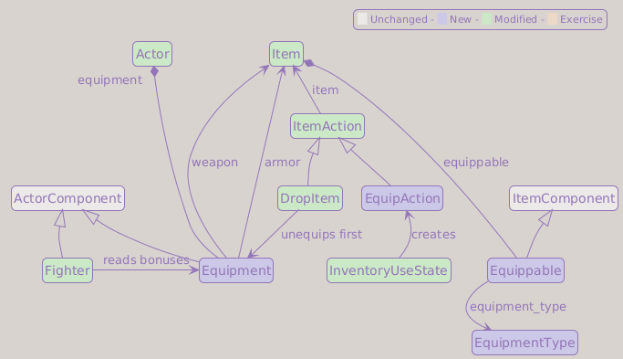
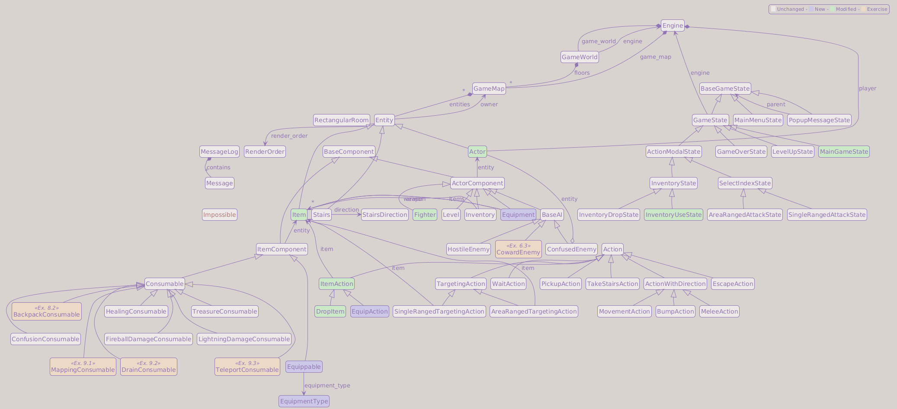

# Part 13: Equipment

## What You Will Build

By the end of this part, the player can find, equip, and swap weapons and armor, and their combat stats will reflect what they are carrying. Equipment does not come from the random loot tables: each piece appears exactly once per run, starting with a dagger waiting in your first room. With this in place, the main tutorial game is complete.

## Learning goals

- Add `Equippable` and `Equipment` components
- Define equipment slots (weapon, armor) as an enum
- Layer equipment bonuses on top of `Fighter` base stats through the existing properties
- Route inventory selection to an `EquipAction`, and group the inventory overlay (numbers for gear, letters for the rest)
- Place guaranteed, once-per-run equipment by floor, in contrast with Part 12's weighted tables

!!! info "Where you stand"
    This chapter touches files that earlier exercises also modified. If you did Part 8 Exercise 3 (persistent item keys), the new equipment templates take fixed number keys instead of letters; the inventory section below shows them. If you did the stacking exercise from Part 8, the inventory grouping classifies each stack by its first item (`stack[0]`). If you did Part 9 Exercise 3 (teleport scroll), one extra guard applies to it; the section that adds it says where. Readers without those exercises can ignore all three notes.

---

## How equipment works

Equipment is a two-sided relationship:

- An **`Equippable`** component sits on an `Item` and says "I give +2 attack when equipped in the weapon slot"
- An **`Equipment`** component sits on an `Actor` and holds references to whatever is currently equipped

When combat damage is calculated, `Fighter.attack` and `Fighter.defense` include the bonuses from the `Equipment` component.

```text
Actor (player)
  ├── Fighter  (base_attack=5, base_defense=2)
  └── Equipment
        ├── weapon  → Item("Sword")
        │               └── Equippable(attack_bonus=4)
        └── armor   → Item("Chain Mail")
                        └── Equippable(defense_bonus=3)

Effective attack  = 5 + 4 = 9
Effective defense = 2 + 3 = 5
```

None of this runs yet: equipment comes alive near the end of the chapter, once `factories.py` builds the pieces and the generator places them. Until then you are wiring up parts you cannot see in action; the dagger waiting in your first room is the payoff.

!!! info "Wield and wear"
    The two slots are as old as the genre. Rogue (1980) had separate commands to wield a weapon and wear armor, and NetHack still binds them to `w` and `W` today. Our version follows the modern convention instead: one inventory screen, one key, and the game works out which slot the item belongs to.

---

## EquipmentType enum

Create `game/entities/equipment_type.py`:

```python
from __future__ import annotations

from enum import Enum, auto


class EquipmentType(Enum):
    WEAPON = auto()
    ARMOR  = auto()
```

A two-member enum may look like overkill when a pair of strings would do, but it buys the same guarantees as `RenderOrder` did in Part 6: a typo becomes an immediate `AttributeError` instead of a silent bug, and your editor can autocomplete the slots.

---

## game/entities/components/equippable.py

Create `game/entities/components/equippable.py`:

```python
from __future__ import annotations

from game.entities.components.base_component import ItemComponent
from game.entities.equipment_type import EquipmentType


class Equippable(ItemComponent):

    def __init__(
        self,
        equipment_type: EquipmentType,
        attack_bonus: float  = 0,
        defense_bonus: float = 0,
    ) -> None:
        self.equipment_type = equipment_type
        self.attack_bonus   = attack_bonus
        self.defense_bonus  = defense_bonus
```

That is the whole file. An `Equippable` is pure data: which slot it occupies and what it adds. The concrete numbers (a dagger gives +2, chain mail gives +3) do not live here; they go in `factories.py` later in this chapter, next to the templates, exactly where `Fighter(hp=30, defense=2, attack=5)` and the Part 12 spawn tables already live. One file tells you everything about an item.

!!! info "Why not a subclass per item?"
    The older tutorials define `class Dagger(Equippable)` and friends, one subclass per item type. It works, but every new weapon then needs edits in two files, and none of those subclasses add behavior; they only store different parameters. We already have a place for parameters: the template in `factories.py`. Subclasses earn their keep when items need different *code*, not different *numbers*.

---

## game/entities/components/equipment.py

Create `game/entities/components/equipment.py`. Start with the imports, the two slots, and the combat bonus they expose:

```python
from __future__ import annotations

from typing import TYPE_CHECKING

from game.entities.components.base_component import ActorComponent
from game.entities.equipment_type import EquipmentType
from game.message_log import MessageLog

if TYPE_CHECKING:
    from game.entities.entity import Item


class Equipment(ActorComponent):

    def __init__(
        self,
        weapon: Item | None = None,
        armor:  Item | None = None,
    ) -> None:
        self.weapon = weapon
        self.armor  = armor

    @property
    def attack_bonus(self) -> float:
        bonus = 0.0

        if self.weapon and self.weapon.equippable:
            bonus += self.weapon.equippable.attack_bonus

        if self.armor and self.armor.equippable:
            bonus += self.armor.equippable.attack_bonus

        return bonus

    @property
    def defense_bonus(self) -> float:
        bonus = 0.0

        if self.weapon and self.weapon.equippable:
            bonus += self.weapon.equippable.defense_bonus

        if self.armor and self.armor.equippable:
            bonus += self.armor.equippable.defense_bonus

        return bonus
```

Both bonus properties check both slots, even though today weapons only carry attack bonuses and armor only defense. The symmetry is on purpose: a *Sword of Deflection* with `defense_bonus=1` would work without touching this class.

Next, a way to ask what is equipped, and the single entry point for putting gear on or taking it off. Add these methods to the class:

```python
    def item_is_equipped(self, item: Item) -> bool:
        return self.weapon is item or self.armor is item

    def toggle_equip(self, equippable_item: Item) -> None:
        assert equippable_item.equippable is not None

        if equippable_item.equippable.equipment_type == EquipmentType.WEAPON:
            slot = "weapon"
        else:
            slot = "armor"

        if getattr(self, slot) is equippable_item:
            self.unequip_from_slot(slot)
        else:
            self.equip_to_slot(slot, equippable_item)
```

`toggle_equip` is the single entry point. Select an equipped item and it comes off; select an unequipped one and it goes on, displacing whatever was in that slot (`equip_to_slot` unequips the previous occupant first, so swapping a dagger for a sword logs both messages). The `assert` at the top narrows `equippable` from `Equippable | None` to `Equippable` for the type checker, the same trick the actions have used with `isinstance` since Part 8.

Finally, the two methods that actually move an item into or out of a slot:

```python
    def equip_to_slot(self, slot: str, item: Item) -> None:
        current_item = getattr(self, slot)
        if current_item is not None:
            self.unequip_from_slot(slot)

        setattr(self, slot, item)
        MessageLog.add_message(f"You equip the {item.name}.")

    def unequip_from_slot(self, slot: str) -> None:
        current_item = getattr(self, slot)
        MessageLog.add_message(f"You remove the {current_item.name}.")
        setattr(self, slot, None)
```

!!! tip "`getattr` and `setattr` with a computed name"
    `getattr(self, "weapon")` is exactly `self.weapon`, except the attribute name is a runtime value. That lets `equip_to_slot` and `unequip_from_slot` serve both slots with one implementation; with direct attribute access we would need a near-identical `if`/`else` branch per slot, and a third copy the day we add jewelry, amulets, etc. This pair is the standard tool when *which attribute to touch* is data rather than something you can hardcode.

!!! note "Expect red squiggles for now"
    Your editor will flag `item.equippable` as unknown here, because `Item` does not have that attribute yet. We add it a couple of sections down, in *entity.py: Item gets equippable, Actor gets equipment*. The references resolve there.

---

## Fighter: bonuses through the existing properties

Part 11 renamed the stored stats to `base_attack` and `base_defense` and kept `attack` and `defense` as properties precisely for this moment. Update the two properties in `game/entities/components/fighter.py`:

```diff
     @property
     def defense(self) -> float:
-        return self.base_defense
+        return self.base_defense + self.entity.equipment.defense_bonus

     @property
     def attack(self) -> float:
-        return self.base_attack
+        return self.base_attack + self.entity.equipment.attack_bonus
```

That is the entire combat integration. Every read of `fighter.attack` and `fighter.defense`, starting with `melee_attack`, now includes equipment bonuses with no changes at the call sites. This is the payoff of going through properties: the representation has changed twice (the rename in Part 11, the bonuses now) and the rest of the game never noticed.

!!! note "Still red, still fine"
    Like `item.equippable` above, `self.entity.equipment` does not exist yet: `Actor` gains it in the next section. Both references go green once *entity.py* wires in the two new components.

---

## entity.py: Item gets equippable, Actor gets equipment

In `game/entities/entity.py`, add the two new components to the `TYPE_CHECKING` block:

```diff
     from game.entities.components.consumable import Consumable
+    from game.entities.components.equipment import Equipment
+    from game.entities.components.equippable import Equippable
     from game.entities.components.fighter import Fighter
```

So far `Item` required a consumable. Now an item can be a potion, a sword, or in principle both at once, so the two components become optional:

```diff
 class Item(Entity):

     def __init__(
         self,
         *,
         ...
         name: str = "<unnamed>",
-        consumable: Consumable,
+        consumable: Consumable | None = None,
+        equippable: Equippable | None = None,
     ) -> None:
         super().__init__(
             ...
         )
-        self.consumable = consumable
-        self.consumable.entity = self
+        self.consumable = consumable
+        if self.consumable:
+            self.consumable.entity = self
+
+        self.equippable = equippable
+        if self.equippable:
+            self.equippable.entity = self
```

`Actor` gains a required `equipment` component, wired up like the other three:

```diff
         ai: BaseAI | None = None,
         fighter: Fighter,
         inventory: Inventory,
         level: Level,
+        equipment: Equipment,
     ) -> None:
```

```diff
         self.level = level
         self.level.entity = self

+        self.equipment = equipment
+        self.equipment.entity = self
```

Making `consumable` optional also changes the base `ItemAction`. Its default implementation is only valid for consumable items, so state that invariant explicitly before calling `activate`:

```diff
 class ItemAction(Action):

     def perform(self, engine: Engine, entity: Entity) -> None:
         assert isinstance(entity, Actor)
+        assert self.item.consumable is not None
         self.item.consumable.activate(self, engine, entity)
```

`DropItem` and the `EquipAction` added below override `perform`, so neither reaches this assertion. Besides preventing an invalid direct `ItemAction` from failing with a less useful `AttributeError`, the assertion narrows `Consumable | None` for the type checker.

!!! warning "Old saves break this time"
    Part 12 ended with good news: removing reads does not hurt old save files. This chapter is the other half of that rule: **adding required state breaks them**. A player loaded from an old save has no `equipment` attribute, and the first code path that touches it (the `Fighter` properties run on every attack) dies with `AttributeError`. Delete your old save files after this change, just as you did when `Level` arrived in Part 11. If you would rather migrate them, the `__getattr__` trick from Part 10 can hand out a default `Equipment()` on first access; deleting the save is simpler.

---

## Walking over items: guard the contact hook

Since Part 8, `MovementAction` lets items react when an actor steps on them; that `on_contact` hook is how chests collect themselves. The loop assumes every item has a consumable, which just stopped being true: walk over a sword lying on the floor and the game would crash. Add a guard in `game/actions.py`:

```diff
         if isinstance(entity, Actor):
             for item in engine.game_map.items_at(entity.x, entity.y):
-                item.consumable.on_contact(engine=engine, consumer=entity)
+                if item.consumable is not None:
+                    item.consumable.on_contact(engine=engine, consumer=entity)
```

This breakage is the standard tax for relaxing an invariant: "every item has a consumable" was load-bearing, and loosening `Consumable` to `Consumable | None` invalidates every unguarded `.consumable.` access. The type checker is the fastest way to find them all; `mypy` flags each one as a possible `None` the moment the annotation changes.

!!! info "Same guard in the teleport scroll"
    If you did Part 9 Exercise 3, `TeleportConsumable` runs the same auto-collect loop after teleporting. Give it the same `if item.consumable is not None:` guard.

---

## EquipAction and a safer DropItem

Equipping is an action like any other: it goes through `GameState.handle_events()` and consumes a turn. Add it to `game/actions.py`, next to its siblings:

```python
class EquipAction(ItemAction):

    def perform(self, engine: Engine, entity: Entity) -> None:
        assert isinstance(entity, Actor)
        entity.equipment.toggle_equip(self.item)
```

`ItemAction` already stores the item, and `DropItem` already subclasses it for exactly that reason, so `EquipAction` only has to override `perform`.

Dropping equipped gear should unequip it first; otherwise you would keep the bonus of a sword lying on the floor. Update `DropItem`:

```diff
 class DropItem(ItemAction):

     def perform(self, engine: Engine, entity: Entity) -> None:
         assert isinstance(entity, Actor)
+        if entity.equipment.item_is_equipped(self.item):
+            entity.equipment.toggle_equip(self.item)
+
         entity.inventory.drop_item(self.item, engine.game_map)
         MessageLog.add_message(f"You dropped the {self.item.name}.")
```

---

## Update InventoryUseState

When the selected item is equippable, return an `EquipAction` instead of asking the consumable. In `game/game_states.py`:

```diff
     def on_item_selected(self, item: Item) -> Action | None:
-        return item.consumable.get_action(self.engine.player, self.engine)
+        if item.equippable:
+            from game.actions import EquipAction
+
+            return EquipAction(item=item)
+
+        if item.consumable:
+            return item.consumable.get_action(self.engine.player, self.engine)
+
+        return None
```

The local import mirrors `InventoryDropState`, which already imports `DropItem` the same way to avoid an import cycle. The final `return None` covers an item with neither component: no such item exists today, but if one ever does, the method degrades to "nothing happens" instead of crashing.

!!! note "If you did the persistent-keys exercise (Part 8 Exercise 3)"
    That exercise also added a direct item-key shortcut to `MainGameState.event_keydown` in `game/game_states.py`. It still calls `item.consumable.get_action()` unconditionally, so update that method with the same component dispatch:

    ```diff
     class MainGameState(GameState):
         ...
         def event_keydown(self, event: tcod.event.KeyDown) -> Action | BaseGameState | None:
             ...
             for item in self.engine.player.inventory.items:
                 if item.key is not None and item.key == key:
-                    return item.consumable.get_action(self.engine.player, self.engine)
+                    if item.equippable:
+                        from game.actions import EquipAction
+
+                        return EquipAction(item=item)
+
+                    if item.consumable:
+                        return item.consumable.get_action(self.engine.player, self.engine)
+
+                    return None
    ```

    This makes a persistent equipment key return `EquipAction`, while consumable keys keep their existing behavior.

---

## Group the inventory: numbers for gear, letters for the rest

Right now the inventory is one flat, alphabetical list: every item, equipped or not, takes the next letter. That was fine when everything was a consumable, but equipment changes what the list is *for*. The player needs to see at a glance what is worn versus what is spare, and gear is selected far more often than a one-shot potion. So we split the overlay into three sections, *Equipped*, *Equippable*, and *Items*, and give equipment its own keys: **numbers** for weapons and armor, **letters** for everything else.

The split is not decoration. Selecting gear by number is the convention players already know from countless games (hotbars, quick-slots), and keeping consumables on letters means a reflex like pressing the health-potion key never collides with equipping a weapon. A dedicated *Equipped* header also makes a per-item marker like `(E)` unnecessary: where a row sits says everything the marker would.

!!! warning "Two paths through this section"
    The code below builds the overlay on the **base** inventory: positional letters, one flat list. If you did the Part 8 inventory exercises (Exercise 1, item stacking, and Exercise 3, persistent keys), your inventory already stacks and selects by a fixed key, so this base code will not line up with yours. Skip to [If you did the Part 8 inventory exercises](#if-you-did-the-part-8-inventory-exercises) at the end of this section, expand the box there, and rejoin at *Sprites and colors*. Everyone else, read on.

First, a helper that sorts the inventory into the three groups, in the order they appear on screen. Add it to `InventoryState` (`game\game_states.py`):

```python
    def _grouped_items(self) -> tuple[list[Item], list[Item], list[Item]]:
        """Equipped gear, carried equippables, and everything else."""
        equipment = self.engine.player.equipment

        equipped:   list[Item] = []
        equippable: list[Item] = []
        other:      list[Item] = []
        for item in self.engine.player.inventory.items:
            if equipment.item_is_equipped(item):
                equipped.append(item)

            elif item.equippable is not None:
                equippable.append(item)

            else:
                other.append(item)

        return equipped, equippable, other
```

A second helper turns those groups into the rows the overlay draws: a section header, a blank line between groups, and one row per item carrying the key that selects it. Equipment is numbered with a single sequence that runs across *both* gear sections, so an equipped dagger and a spare sword read as `1` and `2`, not `1` and `1`. Consumables keep letters.

```python
    def _inventory_rows(self) -> list[tuple[str, str, Item | None]]:
        """Display rows as (kind, label, item); kind is header, blank or item."""
        equipped, equippable, other = self._grouped_items()

        rows: list[tuple[str, str, Item | None]] = []

        number = 1
        for header, gear in (("Equipped", equipped), ("Equippable", equippable)):
            if not gear:
                continue

            if rows:
                rows.append(("blank", "", None))

            rows.append(("header", header, None))
            for item in gear:
                rows.append(("item", str(number), item))
                number += 1

        if other:
            if rows:
                rows.append(("blank", "", None))

            rows.append(("header", "Items", None))
            for offset, item in enumerate(other):
                rows.append(("item", chr(ord("a") + offset), item))

        return rows
```

Now `InventoryState.on_render` draws from that list instead of walking `inventory.items` directly. The height is driven by the number of rows, headers and blanks included, so change the count near the top of the method:

```diff
-        number_of_items_in_inventory = len(inventory.items)
+        rows           = self._inventory_rows()
+        number_of_rows = len(rows)

         slot_count   = f"({len(inventory.items)} / {inventory.capacity} slots)"
         max_height   = console.height - 4
-        height       = min(max(8, number_of_items_in_inventory + 7), max_height)
-        visible_rows = min(number_of_items_in_inventory, max(0, height - 7))
+        height       = min(max(8, number_of_rows + 7), max_height)
+        visible_rows = min(number_of_rows, max(0, height - 7))
```

Then replace the drawing loop itself. Keep the surrounding `if visible_rows > 0:` guard, its `else` branch that prints `EMPTY_TEXT`, and the `name_width` line just above the loop exactly as they are; only the loop body changes. The old loop walked items and built a letter from the index; the new one walks `rows` and branches on the row kind, printing a header, skipping a blank, or drawing an item with its precomputed label:

```python
            for i, (kind, label, item) in enumerate(rows[:visible_rows]):
                row_y = y + 4 + i

                # A blank row is a true gap: draw nothing, not even a background
                if kind == "blank":
                    continue

                # Draw the background for one row
                console.draw_rect(
                    x      = row_x,
                    y      = row_y,
                    width  = row_width,
                    height = 1,
                    ch     = ord(" "),
                    bg     = self.ROW_BG_COLOR,
                )

                if kind == "header":
                    console.print(
                        row_x,
                        row_y,
                        label,
                        fg = colors.INVENTORY_MENU_DIM,
                        bg = self.ROW_BG_COLOR,
                    )
                    continue

                assert item is not None

                # Draw the key that selects this item
                console.print(
                    row_x + 2,
                    row_y,
                    f"[ {label} ]",
                    fg = colors.INVENTORY_MENU_KEY,
                    bg = self.ACCENT_COLOR,
                )

                # Draw the item glyph using its own color
                console.print(
                    row_x + 8,
                    row_y,
                    item.char,
                    fg = item.color,
                    bg = self.ROW_BG_COLOR,
                )

                # Draw the item name, trimmed if it does not fit
                console.print(
                    row_x + 10,
                    row_y,
                    _trim_text(item.name, name_width),
                    fg = colors.INVENTORY_MENU_TEXT,
                    bg = self.ROW_BG_COLOR,
                )
```

Selection now has two namespaces, so `InventoryState.event_keydown` checks numbers and letters separately. Numbers index into the gear (the two equipment sections joined, in display order); letters index into everything else:

```python
    def event_keydown(self, event: tcod.event.KeyDown) -> Action | None:
        key = event.sym
        equipped, equippable, other = self._grouped_items()

        # Numbers select equipment, one sequence across both gear sections
        if tcod.event.KeySym.N1 <= key <= tcod.event.KeySym.N9:
            gear  = equipped + equippable
            index = int(key) - int(tcod.event.KeySym.N1)
            if index < len(gear):
                return self.on_item_selected(gear[index])

            MessageLog.add_message("Invalid entry.", colors.INVALID)
            return None

        # Letters select consumables and anything else
        index = key - tcod.event.KeySym.A
        if 0 <= index <= 25:
            try:
                selected_item = other[index]
            except IndexError:
                MessageLog.add_message("Invalid entry.", colors.INVALID)
                return None

            return self.on_item_selected(selected_item)

        if key == keys.KEY_EXIT:
            self.engine.game_state = MainGameState(self.engine)
            return None

        return super().event_keydown(event)
```

The two key ranges never overlap, so a number always means "equip or unequip" and a letter always means "use". An equipped item still shows its number in the *Equipped* section, and pressing it again toggles the gear back off through the `on_item_selected` routing you just added. The base class powers both the use and drop overlays, so the grouping and the new keys appear in both for free.

### If you did the Part 8 inventory exercises

??? note "Adapted overlay: stacking and persistent keys"
    Your overlay already stacks identical items and selects them by a fixed `key` (Part 8 Exercises 1 and 3). The grouped overlay builds on that, and it ends up *simpler* than the positional code above: equipment carries number keys and consumables carry letter keys, so every label is just `chr(stack[0].key)` and the number/letter split disappears.

    `_grouped_items` classifies stacks instead of loose items:

    ```python
    def _grouped_items(self) -> tuple[list[list[Item]], list[list[Item]], list[list[Item]]]:
        """Equipped, carried equippable, and other, as stacks."""
        equipment = self.engine.player.equipment

        equipped:   list[list[Item]] = []
        equippable: list[list[Item]] = []
        other:      list[list[Item]] = []
        for stack in self.stack_items(self.engine.player.inventory.items):
            item = stack[0]
            if equipment.item_is_equipped(item):
                equipped.append(stack)
            elif item.equippable is not None:
                equippable.append(stack)
            else:
                other.append(stack)

        return equipped, equippable, other
    ```

    `_inventory_rows` carries each stack and labels it with its key, so all three groups share one loop:

    ```python
    def _inventory_rows(self) -> list[tuple[str, str, list[Item] | None]]:
        """Display rows as (kind, label, stack); kind is header, blank or item."""
        equipped, equippable, other = self._grouped_items()

        rows: list[tuple[str, str, list[Item] | None]] = []

        for header, group in (
            ("Equipped",   equipped),
            ("Equippable", equippable),
            ("Items",      other),
        ):
            if not group:
                continue

            if rows:
                rows.append(("blank", "", None))

            rows.append(("header", header, None))
            for stack in group:
                key   = stack[0].key
                label = chr(key) if key is not None else "-"
                rows.append(("item", label, stack))

        return rows
    ```

    In the drawing loop, unpack the row as `(kind, label, stack)`. In the item branch take `item = stack[0]` (after `assert stack is not None`) for the key badge and glyph, and draw the name with `self.stack_name(stack)` instead of `item.name`, so a stacked row still reads `Health Potion (x3)`.

    `event_keydown` keeps your persistent loop (it already matches `stack[0].key`); the only change is widening the invalid-entry guard to reject stray digits too:

    ```diff
             if key == keys.KEY_EXIT:
                 return MainGameState(self.engine)

    -        if ord("a") <= int(key) <= ord("z"):
    +        # Part-13: equipment uses number keys, so reject stray digits too.
    +        if ord("a") <= int(key) <= ord("z") or ord("0") <= int(key) <= ord("9"):
                 MessageLog.add_message("Invalid entry.", colors.INVALID)
                 return None
    ```

    Finally, give the equipment templates fixed number keys in `game/data/keys.py`, reserving **1-5 for weapons and 6-0 for armor** so the two ranges never collide:

    ```python
    # Part-13: equipment keys are numbers; weapons 1-5, armor 6-0.
    DAGGER        = tcod.event.KeySym.N1
    SWORD         = tcod.event.KeySym.N2
    LEATHER_ARMOR = tcod.event.KeySym.N6
    CHAIN_MAIL    = tcod.event.KeySym.N7
    ```

    The factories section below wires `key = keys.DAGGER` (and so on) into each template; mark those lines `# Part-8. Exercise 3: Persistent item keys`. The gap between `2` and `6` leaves room to add more weapons or armor later without renumbering.

---

## Sprites and colors

Each piece of equipment gets its own named sprite and color, even though daggers and swords share `/` and the two armors share `[`. Per the convention from Part 5, `colors.SWORD` reads better at a call site than a reused `colors.DAGGER` or a hardcoded tuple.

Add to `game/data/sprites.py`:

```diff
+# Equipment sprites
+DAGGER        = "/"
+SWORD         = "/"
+LEATHER_ARMOR = "["
+CHAIN_MAIL    = "["
```

Add to `game/data/colors.py`:

```diff
+# Equipment colors
+DAGGER        = Color(  0, 191, 255)
+SWORD         = Color(  0, 191, 255)
+LEATHER_ARMOR = Color(139,  69,  19)
+CHAIN_MAIL    = Color(139,  69,  19)
```

---

## factories.py: weapons and armor

Wire the new components into `game/entities/factories.py`. First the imports:

```diff
 from game.entities.components.ai import HostileEnemy
 from game.entities.components.consumable import (
     ...
 )
+from game.entities.components.equipment import Equipment
+from game.entities.components.equippable import Equippable
 from game.entities.components.fighter import Fighter
 from game.entities.components.inventory import Inventory
 from game.entities.components.level import Level
 from game.entities.entity import Actor, Item, Stairs, StairsDirection
+from game.entities.equipment_type import EquipmentType
```

Every actor now needs an `Equipment` component. Add the empty default to the three templates (shown for the player; do the same for `orc` and `troll`):

```diff
 player = Actor(
     ...
     level     = Level(level_up_base=config.DEFAULT_LEVEL_UP_BASE),
+    equipment = Equipment(),
 )
```

Monsters get one too, even though nothing equips them yet: the `Fighter` properties read `entity.equipment` unconditionally, and an orc with a rusty sword is now one template edit away.

Then the four item templates, at the end of the items section:

```python
# Weapons and armor
dagger = Item(
    char       = sprites.DAGGER,
    color      = colors.DAGGER,
    name       = "Dagger",
    equippable = Equippable(equipment_type=EquipmentType.WEAPON, attack_bonus=2),
)

sword = Item(
    char       = sprites.SWORD,
    color      = colors.SWORD,
    name       = "Sword",
    equippable = Equippable(equipment_type=EquipmentType.WEAPON, attack_bonus=4),
)

leather_armor = Item(
    char       = sprites.LEATHER_ARMOR,
    color      = colors.LEATHER_ARMOR,
    name       = "Leather Armor",
    equippable = Equippable(equipment_type=EquipmentType.ARMOR, defense_bonus=1),
)

chain_mail = Item(
    char       = sprites.CHAIN_MAIL,
    color      = colors.CHAIN_MAIL,
    name       = "Chain Mail",
    equippable = Equippable(equipment_type=EquipmentType.ARMOR, defense_bonus=3),
)
```

!!! note "If you did the persistent-keys exercise (Part 8 Exercise 3)"
    These templates take their keys by position. With persistent keys, remember to give each piece its fixed number, exactly as the consumables already do: `key = keys.DAGGER`, `key = keys.SWORD`, `key = keys.LEATHER_ARMOR`, and `key = keys.CHAIN_MAIL` (defined back in the inventory section).

The whole definition of a dagger fits in one template: sprite, color, name, slot, numbers. Rebalancing the sword is a one-line edit here, with nothing to chase through other files.

---

## Guaranteed equipment spawns

Part 12 made random loot scale with depth. Equipment gets the opposite treatment, and for a reason: with only two slots and items that never break, a second dagger is dead weight. Instead of joining `item_chances`, each piece appears **exactly once per run**, on a floor rolled from a band. Add the table at the end of `factories.py`, next to the other spawn data:

```python
# Guaranteed equipment: each template spawns once per run,
# on a floor rolled from its (first_floor, last_floor) band
equipment_spawns = {
    dagger:        (1, 1),
    leather_armor: (2, 3),
    sword:         (4, 5),
    chain_mail:    (6, 7),
}
```

The bands encode the difficulty curve. The dagger is always on floor 1; the sword arrives somewhere on floors 4 to 5; and because the bands of a piece and its upgrade never overlap, the upgrade cannot appear before the thing it replaces.

!!! info "Guaranteed loot is a classic tool"
    Pure random tables can starve a run of basics, and a roguelike where you melee bare-handed for five floors because the dice said so is not difficult, just unfair. Brogue is famous for hand-placing guarantees inside its randomness (early potions of strength among them), and most modern roguelikes mix the two systems: weighted tables for consumables, guarantees for the items the balance depends on. Now ours does too.

### GameWorld rolls the floors

`GameWorld` owns the run seed, so it decides which floor each piece lands on. Add the imports to `game/game_world.py`:

```diff
 from __future__ import annotations

+import random
 from typing import TYPE_CHECKING

+from game.entities import factories
+
 if TYPE_CHECKING:
     from game.engine import Engine
+    from game.entities.entity import Item
     from game.map.game_map import GameMap
```

Then a helper method, above `generate_floor`:

```python
    def equipment_for_floor(self) -> list[Item]:
        """The guaranteed equipment whose floor roll matches the current floor."""
        rng = random.Random(self.seed)
        return [
            item
            for item, (first_floor, last_floor) in factories.equipment_spawns.items()
            if rng.randint(first_floor, last_floor) == self.current_floor
        ]
```

And pass the result to the generator:

```diff
             player        = self.engine.player,
             seed          = self.seed + self.current_floor,
             current_floor = self.current_floor,
+            equipment     = self.equipment_for_floor(),
         )
```

The method recomputes every roll from scratch on every call, with a fresh `random.Random(self.seed)`. That sounds wasteful, but it is the point: the same seed always produces the same rolls in the same order (dicts iterate in insertion order), so when floor 4 asks "is the sword mine?" it gets the answer the run already decided on floor 1. Uniqueness needs no bookkeeping either: floors are persistent since Part 11, each floor generates exactly once, so each piece spawns exactly once. This `rng` is deliberately separate from `generate_dungeon`'s own `rng` (Part 4): this one decides only *which* floor each piece belongs to, seeded from the run seed (`self.seed`); `generate_dungeon`'s decides *where* things land on a given floor, seeded from the per-floor seed (`self.seed + self.current_floor`, from Part 11). Two local `random.Random` instances, each owning one concern, instead of a single shared or global generator. The same run seed still reproduces the whole dungeon: layout, which equipment, which floor, and which tile.

!!! warning "Why not just store the rolled floors?"
    The tempting alternative is a dict computed once in `__init__`, something like `self.equipment_floors = {factories.dagger: 1, ...}`. But `GameWorld` is pickled inside every save file, and pickle would store *copies* of those template items. After loading, `factories.dagger` and the key in your dict would be two different objects, and every identity-based lookup (the same identity hashing that makes the Part 12 tables work) would quietly fail. Deriving the rolls from the seed keeps `GameWorld` free of template references, and your saves free of surprises.

### map_generator places the items

The stairs placement at the end of `generate_dungeon` already solves "find a free tile in a room". Extract that search into a helper so the new code can reuse it. Add it above `generate_dungeon` in `game/map/map_generator.py`:

```python
def free_positions(room: RectangularRoom, dungeon: GameMap) -> list[tuple[int, int]]:
    """Every tile inside the room not occupied by an entity."""
    return [
        (x, y)
        for x in range(room.x1 + 1, room.x2)
        for y in range(room.y1 + 1, room.y2)
        if not any(entity.x == x and entity.y == y for entity in dungeon.entities)
    ]
```

And replace the inline search in the stairs block:

```diff
     # Place stairs in the last room, avoiding any entity already there
     last_room = rooms[-1]
-    free = [
-        (x, y)
-        for x in range(last_room.x1 + 1, last_room.x2)
-        for y in range(last_room.y1 + 1, last_room.y2)
-        if not any(e.x == x and e.y == y for e in dungeon.entities)
-    ]
+    free = free_positions(room=last_room, dungeon=dungeon)

     stair_pos = rng.choice(free) if free else last_room.center
```

`generate_dungeon` accepts the equipment list. Extend the entity import:

```diff
-from game.entities.entity import Entity
+from game.entities.entity import Entity, Item
```

```diff
     player: Entity,
     seed: int,
     current_floor: int,
+    equipment: list[Item],
 ) -> GameMap:
```

And place each piece after the stairs, just before the return:

```diff
     dungeon.downstairs_location = stair_pos
     factories.down_stairs.spawn(dungeon, *stair_pos)

+    # Guaranteed equipment: the starting room on floor 1, a random room deeper down
+    for item_template in equipment:
+        room = rooms[0] if current_floor == 1 else rng.choice(rooms)
+        free = free_positions(room, dungeon)
+        if free:
+            item_template.spawn(dungeon, *rng.choice(free))
+
     return dungeon
```

The floor 1 special case is deliberate level design. Your starting room spawns no monsters (it never has, since Part 5), so the dagger sits in a safe spot where you can practice the whole loop: walk over it, pick it up with `g`, open the inventory, equip it, with nothing biting your ankles. The game teaches its own mechanic before the first fight. On deeper floors the rule flips: the arrival room holds the up stairs, gear there would be loot without exploration, so the piece lands in a random room instead.

The `if free:` guard mirrors the stairs code above it: a room with no free tile is practically impossible, but the check keeps generation crash-proof instead of crash-prone.

---

## A toolkit, not a power ladder

Part 12 warned against making a dungeon harder with bigger numbers, and gave each monster a personality instead. This chapter, if we are honest, did the opposite with the player's gear. The dagger gives +2, the sword +4; leather armor +1, chain mail +3. That is a **power ladder**: each piece is the one before it with a larger number, and you swing the sword exactly the way you swung the dagger, only it hits harder. It is the orc with triple hit points, turned on your own inventory.

That is fine here, and deliberate. The goal of this chapter was the *architecture*: two components, a pair of slots, bonuses that flow through the `Fighter` properties. A clean stat ladder is the honest baseline for that machinery, the equipment equivalent of the orc, the plain fight everything else is measured against. You need a flat reference before you can build twists on top of it.

But the interesting direction is the one the bestiary already took. A weapon, too, can ask a **different question** instead of offering a bigger number:

- an **axe** that hits every enemy around you asks, *are you in the open, or in a corridor?*
- a **war hammer** that stuns asks, *do you need to buy a turn to escape?*
- a **bow** that strikes at range asks, *can you fight before they reach you?*

None of those is a larger `attack_bonus`; each changes *how* you fight. That is a toolkit, not a ladder.

Armor resists this, and the reason is worth naming, because it is the same thesis as Part 12: *personality lives in behavior, not in stats.* Attacking is an **action**, so you can hang behavior on it (a cleave, a stun, a knockback). Wearing armor is **passive**: it sits there and changes a number, and a number has no behavior to vary. Armor gains a personality only by becoming partly active (spikes that bite back, slow regeneration, resistance to one kind of damage), and at that point it is borrowing the weapon's trick. So let armor be the honest axis, the steady baseline, and let the weapons carry the variety.

!!! tip "Design takeaway"
    For the player's gear as for the bestiary, "stronger" is the boring axis. The one that creates depth is *what new decision does this item create?* Stats are the floor of good item design, not the ceiling.

The behavioral weapons above are not in this chapter, and the reason is the line the `Equippable` design drew at the very start: a subclass earns its keep when an item needs different *code*, not different *numbers*. A cleave needs targeting, a stun needs a status effect, a bow needs a ranged attack path; none of that fits in a template. When you are ready to cross that line, a future appendix, *Weapons with behavior*, builds them out.

---

## Testing your work

Run `python main.py`:

- [ ] A Dagger lies somewhere in your starting room. Pick it up with `g` and equip it from the inventory: `"You equip the Dagger."`
- [ ] The equipped Dagger appears under an *Equipped* header with a number key; pressing that number again unequips it: `"You remove the Dagger."`
- [ ] Walking over equipment on the floor does not crash the game (the contact guard at work)
- [ ] Leather Armor appears once on floor 2 or 3, the Sword once on floor 4 or 5, Chain Mail once on floor 6 or 7; never a duplicate, never an upgrade before the piece it replaces
- [ ] Equipping the Sword while the Dagger is equipped logs `"You remove the Dagger."` and then `"You equip the Sword."`
- [ ] With the Sword equipped, attacks land with effective attack 5 (base) + 4 (sword) = 9
- [ ] Dropping an equipped item unequips it first, and its bonus disappears
- [ ] Two runs with the same `GAME_SEED` (Part 3 Exercise 1) place every piece on the same floors and tiles

---

## Summary

Equipment is complete, and with it the main tutorial game. Key additions:

- **`Equippable` component**: pure data, slot plus stat bonuses, with the numbers defined inline in the templates
- **`Equipment` component**: tracks the weapon and armor slots and exposes the summed bonuses
- **`Fighter.attack`/`.defense`**: the Part 11 properties now add equipment bonuses transparently
- **`EquipAction`**: routes inventory selection into `equipment.toggle_equip()`
- **Inventory UI**: groups items into *Equipped*, *Equippable* and *Items*, with number keys for gear and letters for the rest
- **Guaranteed spawns**: `equipment_spawns` bands in `factories.py`, rolled per run by `GameWorld`, placed by the generator; the dagger waits in the safe starting room of floor 1

**Local Class Diagram**:



**Full Class Diagram**:



**File structure**:

```text
main.py
game/
├── __init__.py
├── actions.py                  ← modified
├── engine.py
├── exceptions.py
├── game_world.py               ← modified
├── hud.py
├── game_states.py              ← modified
├── message_log.py
├── setup_game.py
├── data/
│   ├── __init__.py
│   ├── colors.py               ← modified
│   ├── config.py
│   ├── keys.py
│   └── sprites.py              ← modified
├── entities/
│   ├── __init__.py
│   ├── entity.py               ← modified
│   ├── factories.py            ← modified
│   ├── render_order.py
│   ├── equipment_type.py       ← new
│   └── components/
│       ├── __init__.py
│       ├── ai.py
│       ├── base_component.py
│       ├── consumable.py
│       ├── equipment.py        ← new
│       ├── equippable.py       ← new
│       ├── fighter.py          ← modified
│       ├── inventory.py
│       └── level.py
└── map/
    ├── __init__.py
    ├── game_map.py
    ├── tile_types.py
    └── map_generator.py        ← modified
```

---

## Exercises

1. **Show equipment bonuses in the inventory**:

   The inventory lists `Sword` and `Chain Mail` with no hint of what they do, so the player has no reason to prefer one over another. Make each equippable row show its bonus, for example `Sword (+4 attack)` or `Chain Mail (+3 defense)`.

   The bonus lives on the item: `item.equippable` is `None` for consumables and an `Equippable` for gear, and it carries `attack_bonus`, `defense_bonus`, and `equipment_type` (which tells you whether to label the number "attack" or "defense"). The name is drawn in `InventoryState.on_render`, in the `_trim_text(item.name, name_width)` call. Build the suffix only when `item.equippable is not None`, append it to the name *before* trimming, and remember that the extra characters eat into `name_width`.

2. **Equipment stats in the HUD**:

   The panel shows the HP and XP bars, the floor, and your gold, but never your actual combat numbers. Add one line below the XP bar, for example `Attack: 9  Defense: 5`.

   This is almost free, and that is the lesson: the `Fighter.attack` and `Fighter.defense` properties you edited earlier in this chapter already fold the weapon and armor bonuses on top of the base stats, so you do **not** touch `Equipment` here at all. You only *read* `player.fighter.attack` and `player.fighter.defense` (they return floats, so wrap them in `int(...)`) and print them.

   Follow the pattern of the other panel pieces: add a small `render_combat_stats(console, attack, defense)` to `game/hud.py`, next to `render_dungeon_level`, have it `console.print` the line on a free panel row, and call it from `Engine.render()` right after `hud.render_xp_bar(...)`. The text itself is just `f"Attack: {int(attack)}  Defense: {int(defense)}"`.

3. **Place guaranteed equipment away from the arrival room**:

   On floors after the first, the guaranteed piece can currently land in `rooms[0]`, the room you arrive in, which also holds the up stairs, so the reward appears with no exploration. In the placement loop in `generate_dungeon` (`game/map/map_generator.py`), the deeper-floor branch is `rng.choice(rooms)`; restrict it to `rooms[1:]` so the arrival room is excluded.

   Fall back safely when the dungeon has only one room (so `rooms[1:]` is empty): `rooms[1:] or rooms` gives you the candidate list in a single expression. Leave the floor-1 special case (`rooms[0]`) untouched, since placing the dagger in the safe starting room is deliberate.

4. **Optional challenge: equipment for monsters**:

   Every actor already carries an `Equipment` component, so the machinery for armed monsters is mostly in place. Give one monster template (say the orc) an equipped weapon in `factories.py` (`equipment = Equipment(weapon=...)`); because `Fighter.attack` reads `entity.equipment`, that orc immediately hits harder, with no other change. Each monster is deep-copied from its template on spawn (Part 5), so every orc gets its own weapon instance.

   Then make the kill rewarding: in the death logic in `Fighter` (the `die` handler that turns an actor into a corpse), check whether the dying actor has anything in a slot and, if so, drop it onto the corpse's tile (set the item's `x`/`y` and add it to the map's entities) so the player can pick it up and equip it. That turns equipment from a player-only system into a general actor feature.

---

## What's next

You have built a complete roguelike. Here are directions to take it further:

**Content**:

- More monster types riding Part 12's weighted tables (troll variants, vampires, dragons)
- More spell scrolls: confusion variants, area heals, walls of fire
- Ranged weapons: a bow as an `Equippable` plus arrows as inventory items

**Depth**:

- A shop between floors: the gold from Part 8's chests wants something to buy
- Named artifacts: unique items with special effects, spawned through their own `equipment_spawns` bands
- Status effects: poison, blindness, haste, each as a component with a countdown

**Polish**:

- Graphical tiles: swap the tileset for a 16×16 pixel art set; tcod supports it with no code changes beyond the tileset loader
- Sound: `pygame.mixer` can play `.wav` files alongside tcod's rendering
- Fullscreen: extend the `sdl_window_flags` value passed to `tcod.context.new`, for example by adding `tcod.context.SDL_WINDOW_FULLSCREEN`

**Sharing it**:

- Push the game to a public repository with a README, a screenshot, and the run command; a project that starts with `uv run python main.py` is easy for anyone to try

The architecture you built (entities and components, actions, game states as a state machine, pickle serialization, data-driven spawn tables) scales to a much larger game. [Yet Another Roguelike Tutorial](https://www.rogueliketutorials.com/), the tutorial this one descends from, makes a good comparison point: same genre, same library, different decisions in the places where this tutorial deliberately diverged (game states instead of event handlers, a static message log, the data and factories packages, guaranteed equipment). Reading code that solves the same problems differently is one of the fastest ways to grow.

Good luck with the dungeon.
