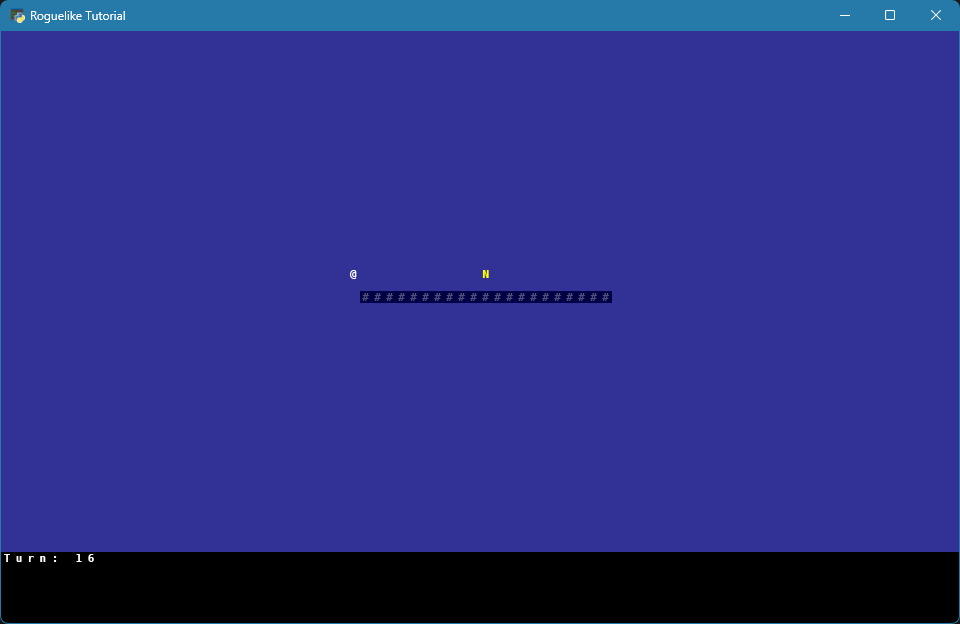
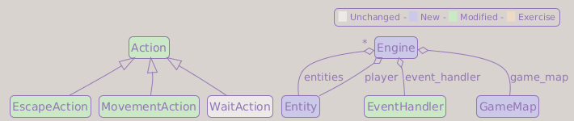
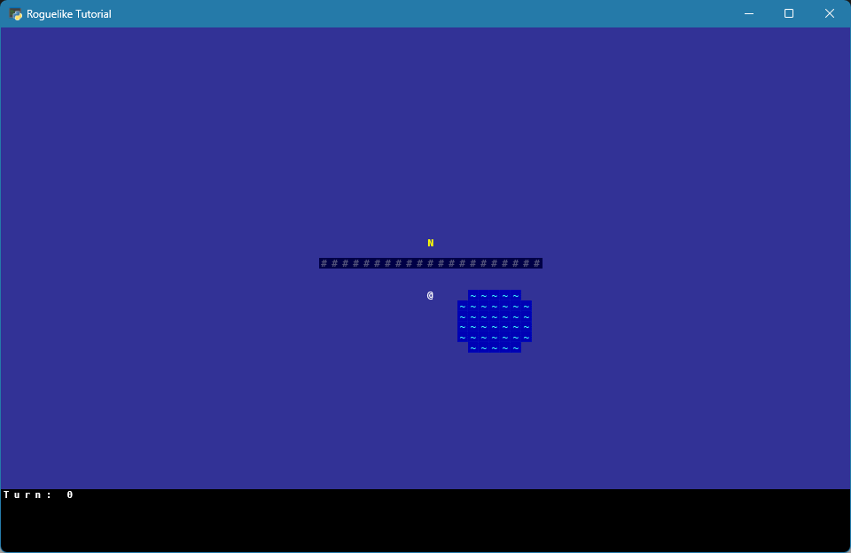

# Part 2: Entities, the Map, and the Engine

## What You Will Build

By the end of this part, the game still looks simple, but the code is reorganized into entities, a map, and an engine, with each action responsible for performing itself. Every feature added from Part 3 onward (dungeons, enemies, items, spells) fits into the structure introduced here.

## Learning goals

- Represent game objects with a generic `Entity` class
- Build a tile-based map using numpy structured arrays
- Understand why the game state and the main loop move into an `Engine` class
- Move each action's logic into its own `perform()` method (the Command pattern)
- Prevent the player from walking through walls

---

## From variables to objects

Right now the player is just `player_x` and `player_y`. This works for one character, but the dungeon will have enemies, items, corpses, and stairs, each needing the same core data: position and appearance, and soon a name.

Instead of managing separate variables for each, we create a single class that any game object can use.

!!! info "Design decision: Generic Entity"
    We could create separate `Player`, `Orc`, `Potion` classes with their own position fields. The problem is that these classes share most of their data and you end up duplicating code. A single `Entity` class holds the common fields; specialized behavior comes later through *components* (covered in Part 5 and beyond).

---

## The Entity class

Create `game/entity.py`:

```python
from __future__ import annotations


class Entity:
    """A generic object: player, enemy, item, etc."""

    def __init__(
        self,
        x: int,
        y: int,
        char: str,
        color: tuple[int, int, int],
    ) -> None:
        self.x = x
        self.y = y
        self.char = char
        self.color = color

    def set_position(self, x: int, y: int) -> None:
        self.x = x
        self.y = y

    def move(self, dx: int, dy: int) -> None:
        self.x += dx
        self.y += dy
```

- `char`: the single character drawn on screen (`"@"`, `"o"`, `"T"`, etc.)
- `color`: an RGB tuple, e.g. `(255, 255, 255)` for white
- `set_position`: jumps to an absolute position; used when the dungeon generator places the player in the first room (Part 3), until Part 8 replaces it with a `place()` method that also registers the entity on the map
- `move`: shifts position by a delta; used by the player and enemies for stepping

---

## The tile system

Maps in roguelikes are grids of tiles. Each tile needs several properties:

- **walkable**: can the player step here?
- **transparent**: does this tile block the field of view?
- **appearance**: what character and colors to draw

`walkable` and `transparent` are separate ideas. Many tiles use the obvious
combinations, but all four combinations can be useful:

| walkable | transparent | Example |
| --- | --- | --- |
| `False` | `False` | A wall, closed stone door, or pillar. You cannot walk through it, and it blocks vision. |
| `False` | `True` | Water, a low fence, a window, or iron bars. You cannot walk through it, but you can see past it. |
| `True` | `False` | Smoke, fog, magical darkness, or tall grass. You can enter the tile, but it blocks or limits vision. |
| `True` | `True` | A floor, open door, or normal corridor. You can walk through it, and it does not block vision. |

This separation pays off later. Movement checks will look at `walkable`, while
field-of-view checks will look at `transparent`. A tile can affect one system
without affecting the other.

We use **numpy structured arrays** to hold all of this efficiently. This might look unusual at first, take it step by step.

Create `game/tile_types.py`:

```python
from __future__ import annotations

import numpy as np

# Describes how to draw one tile: character + foreground + background colors
graphic_dtype = np.dtype(
    [
        ("ch", np.int32),   # Unicode codepoint of the character
        ("fg", "3B"),       # foreground RGB (3 unsigned bytes)
        ("bg", "3B"),       # background RGB
    ]
)

# Describes one tile: its gameplay properties + its appearance
tile_dtype = np.dtype(
    [
        ("walkable",    np.bool_),      # True if entities can walk here
        ("transparent", np.bool_),      # True if this tile doesn't block FOV
        ("out_of_fov",  graphic_dtype), # appearance when outside the player's FOV
    ]
)


def new_tile(
    *,
    walkable: bool,
    transparent: bool,
    out_of_fov: tuple[int, tuple[int, int, int], tuple[int, int, int]],
) -> np.ndarray:
    """Create a single tile definition."""
    return np.array((walkable, transparent, out_of_fov), dtype=tile_dtype)


# Tile definitions
floor = new_tile(
    walkable    = True,
    transparent = True,
    out_of_fov  = (ord(" "), (255, 255, 255), (35, 35, 90)),
)

wall = new_tile(
    walkable    = False,
    transparent = False,
    out_of_fov  = (ord("#"), (80, 80, 120), (0, 0, 70)),
)
```

!!! question "Why `out_of_fov`? What about `in_fov`?"
    Field of View means the area the player can currently see. The field name describes *when* the appearance is used, not what it looks like. We will add an `in_fov` appearance in Part 4 (Field of View): tiles inside the player's vision will look different from tiles outside it. For now, the player can see the entire map, so we only define `out_of_fov`.

    That is also why the palette looks dark: these values are tuned for the "explored, but currently out of sight" role they will keep from Part 4 onward. The dungeon lights up when Field of View arrives.

!!! question "Why numpy dtypes?"
    A numpy structured array stores thousands of tile structs as a single contiguous block of memory. This is faster to access and render than a Python list of objects. We can also write the entire map to the screen in one call (`console.rgb[...] = tiles["out_of_fov"]`), which is much faster than looping over each tile individually.

The `*` in `new_tile(*, ...)` forces callers to use keyword arguments. Without it, you could accidentally write `new_tile(True, False, ...)` and mistake the argument order. With keyword arguments, the intent is always explicit.

---

## The GameMap class

Create `game/game_map.py`:

```python
from __future__ import annotations

import numpy as np
from tcod.console import Console

from game import tile_types


class GameMap:

    def __init__(self, width: int, height: int) -> None:
        self.width  = width
        self.height = height
        # Fill the entire map with floor tiles for now
        # Part 3 will change this to walls, which we dig out
        self.tiles = np.full((width, height), fill_value=tile_types.floor, order="F")

        half_width  = width  // 2
        half_height = height // 2

        # A small wall for testing: we will remove it in Part 3
        self.tiles[half_width-10:half_width+10+1, half_height] = (
            tile_types.wall
        )

    def in_bounds(self, x: int, y: int) -> bool:
        """True if (x, y) is inside the map."""
        return 0 <= x < self.width and 0 <= y < self.height

    def render(self, console: Console) -> None:
        console.rgb[0 : self.width, 0 : self.height] = self.tiles["out_of_fov"]
```

`np.full((width, height), fill_value=..., order="F")` creates a 2D array filled with the same tile. The `(width, height)` shape is what gives us natural `[x, y]` indexing. `order="F"` decides the memory layout: it keeps columns contiguous, matching the `order="F"` we set on the console, so copying tiles into the console never needs to reorder memory.

`render` is one line, but it does a lot. `console.rgb` is the console's cell grid exposed as a numpy array: one element per screen cell, each holding a codepoint (`ch`) and two colors (`fg`, `bg`). That is exactly the layout we gave `graphic_dtype`, and that is not a coincidence: matching layouts is what lets numpy copy tiles straight into the console. `self.tiles["out_of_fov"]` selects the `out_of_fov` field of every tile at once, an 80×44 array of graphics, and the slice assignment copies it into the top-left region of the console in one vectorized operation, no Python loop needed.

---

## The Engine class

`main.py` is already doing too much: it creates entities, handles events, and renders. As we add features, this file will become unmanageable.

We extract the *game loop logic* into an `Engine` class. Think of it as the conductor: it holds the game state and orchestrates everything.

Create `game/engine.py`:

```python
from __future__ import annotations

from collections.abc import Iterable
from typing import Any

import tcod.event
from tcod.console import Console
from tcod.context import Context

from game.actions import EscapeAction, MovementAction
from game.entity import Entity
from game.game_map import GameMap
from game.input_handlers import EventHandler


class Engine:

    def __init__(
        self,
        entities: set[Entity],
        event_handler: EventHandler,
        game_map: GameMap,
        player: Entity,
    ) -> None:
        self.entities      = entities
        self.event_handler = event_handler
        self.game_map      = game_map
        self.player        = player

    def handle_events(self, events: Iterable[Any]) -> None:
        for event in events:
            action = self.event_handler.dispatch(event)

            if action is None:
                continue

            match action:
                case MovementAction(dx=dx, dy=dy):
                    dest_x, dest_y = self.player.x + dx, self.player.y + dy
                    if self.game_map.in_bounds(dest_x, dest_y):
                        if self.game_map.tiles["walkable"][dest_x, dest_y]:
                            self.player.move(dx=dx, dy=dy)

                case EscapeAction():
                    raise SystemExit()

    def render(self, console: Console, context: Context) -> None:
        console.clear()
        self.game_map.render(console)

        for entity in self.entities:
            console.print(entity.x, entity.y, entity.char, fg=entity.color)

        context.present(console)

    def run(self, context: Context, console: Console) -> None:
        while True:
            self.render(console=console, context=context)
            self.handle_events(tcod.event.wait())
```

`run()` is the loop we extracted as `game_loop` in Part 1, now living on `Engine` as a method. This is the idea previewed in Part 1: the player's position is now part of the `Engine` state instead of a pair of local loop variables, so the loop modifies state that the caller already owns.

The collision check in `handle_events` computes the destination, then looks it up in the tile array:

```python
dest_x, dest_y = self.player.x + dx, self.player.y + dy
if self.game_map.tiles["walkable"][dest_x, dest_y]:
```

This reads the `walkable` field at the destination tile. If it is `False` (a wall), the move is rejected.

!!! note "If you completed the turn-counter exercise"
    Part 1, Exercise 3 made waiting visible by adding a `turn_count` counter
    inside `game_loop`. Since `game_loop` now lives in `Engine`, move that state
    into the engine too:

    ```diff
     class Engine:

         def __init__(
             self,
             entities: set[Entity],
             event_handler: EventHandler,
             game_map: GameMap,
             player: Entity,
         ) -> None:
             self.entities      = entities
             self.event_handler = event_handler
             self.game_map      = game_map
             self.player        = player
    +
    +        # Part-1. Exercise 3: Add a wait action
    +        self.turn_count    = 0
    ```

    Then increment it after the engine receives a real action:

    ```diff
                 if action is None:
                     continue
    +
    +            # Part-1. Exercise 3: Add a wait action
    +            self.turn_count += 1
    ```

    Finally, draw it in one of the unused bottom rows:

    ```diff
         def render(self, console: Console, context: Context) -> None:
             console.clear()
             self.game_map.render(console)

             for entity in self.entities:
                 console.print(entity.x, entity.y, entity.char, fg=entity.color)
    +
    +        # Part-1. Exercise 3: Add a wait action
    +        console.print(x=0, y=44, text=f"Turn: {self.turn_count}")

             context.present(console)
    ```

    If you skipped that exercise, ignore this note. If you did it, pressing `.`
    or numpad 5 still leaves the player in place while the turn number advances.

!!! info "Design decision: Engine holds the game state"
    `main.py` will become a thin launcher: create objects, create the window, hand off to `engine.handle_events` and `engine.render`. The real logic lives inside the `game` package, coordinated by `Engine`. This makes it easier to add save/load later (Part 10), because we can serialize and deserialize the `Engine` state.

    Right now `game_map.render` also decides what appears on screen. Part 7 splits that further, separating frame composition (the UI, the message log) from map rendering, once there is enough on screen to make that split worth it.

---

## Updating main.py

Replace `main.py` with this cleaner version, which also adds a second entity (yellow `N`) just to verify that the entity set and renderer work with more than one object; it has no AI and will be removed in Part 3.

```python
from __future__ import annotations

from pathlib import Path

import tcod

from game.engine import Engine
from game.entity import Entity
from game.game_map import GameMap
from game.input_handlers import EventHandler


def main() -> None:
    screen_width  = 80
    screen_height = 50

    map_width  = 80
    map_height = 44

    tileset = tcod.tileset.load_tilesheet(
        Path(__file__).parent / "res" / "dejavu12x12_gs_tc.png",
        32,
        8,
        tcod.tileset.CHARMAP_TCOD,
    )

    event_handler = EventHandler()

    player = Entity(
        x     = screen_width // 2,
        y     = screen_height // 2,
        char  = "@",
        color = (255, 255, 255),
    )
    npc    = Entity(
        x     = screen_width // 2,
        y     = screen_height // 2 - 5,
        char  = "N",
        color = (255, 255, 0),
    )

    entities = {npc, player}

    game_map = GameMap(map_width, map_height)

    engine = Engine(
        entities      = entities,
        event_handler = event_handler,
        game_map      = game_map,
        player        = player,
    )

    title   = "Roguelike Tutorial"
    version = "0.1.0"
    app_id  = "com.tutorial.roguelike"

    tcod.lib.SDL_SetAppMetadata(
        title.encode("utf-8"),
        version.encode("utf-8"),
        app_id.encode("utf-8"),
    )
    tcod.lib.SDL_SetHint(
        b"SDL_RENDER_SCALE_QUALITY",
        b"0",   # Nearest pixel sampling
    )

    with tcod.context.new(
        columns          = screen_width,
        rows             = screen_height,
        tileset          = tileset,
        title            = title,
        vsync            = True,
        sdl_window_flags = tcod.context.SDL_WINDOW_ALLOW_HIGHDPI | tcod.context.SDL_WINDOW_RESIZABLE,
    ) as context:
        console = tcod.console.Console(screen_width, screen_height, order="F")
        engine.run(context, console)


if __name__ == "__main__":
    main()
```

Notice that the map is 44 rows tall while the screen is 50: we reserve the bottom six rows for the UI (health bar, message log) which we will add in Part 7.

!!! tip "Run it now"
    This is a good moment to run the game. You should see a white `@` (the
    player), a yellow `N` (an NPC with no AI), and a short test wall drawn as a
    line of `#`. Walking
    into the wall or off the edge of the map is blocked; the NPC stays put.
    This is a complete, playable milestone. The rest of the chapter is a refactor
    that improves how actions are structured without changing anything you see on
    screen.

    

---

## Giving actions more context

Right now the engine handles movement inside its `match action:` block: it recognizes `MovementAction`, computes the destination, and applies the logic itself. Every new kind of action we add later (attacking an enemy, picking up an item, drinking a potion, descending the stairs) would need another `case` here and more logic inside `handle_events`. The engine would have to know about every action in the game, and this single method would keep growing.

A better pattern moves the responsibility: each `Action` knows how to perform *itself*, given the engine and the acting entity. The engine stops deciding what each action does; it just calls `action.perform(engine, entity)` and moves on.

The gain is concrete. The whole `match` block shrinks to a single call, and `handle_events` never needs to know about individual action types again, no matter how many we add: a new behavior later means writing one new `Action` subclass, not editing the engine. This also separates who *requests* an action (the input handler) from who *carries it out* (the action).

This rewrites every class from Part 1, so replace the whole contents of `game/actions.py`:

```python
from __future__ import annotations

from typing import TYPE_CHECKING

if TYPE_CHECKING:
    from game.engine import Engine
    from game.entity import Entity


class Action:

    def perform(self, engine: Engine, entity: Entity) -> None:
        """Perform this action. Must be overridden by subclasses."""
        raise NotImplementedError()


class EscapeAction(Action):

    def perform(self, engine: Engine, entity: Entity) -> None:
        raise SystemExit()


class MovementAction(Action):

    def __init__(self, dx: int, dy: int) -> None:
        self.dx = dx
        self.dy = dy

    def perform(self, engine: Engine, entity: Entity) -> None:
        dest_x = entity.x + self.dx
        dest_y = entity.y + self.dy

        if not engine.game_map.in_bounds(dest_x, dest_y):
            return  # Destination is outside the map

        if not engine.game_map.tiles["walkable"][dest_x, dest_y]:
            return  # Destination is blocked by a tile

        entity.move(self.dx, self.dy)
```

!!! note "If you completed the wait-action exercise"
    If you completed Part 1, Exercise 3, your input handler already imports and returns `WaitAction`. Add this class below `MovementAction` now so that import still works:

    ```python
    class WaitAction(Action):

        def perform(self, engine: Engine, entity: Entity) -> None:
            pass
    ```

    If you skipped that exercise, you can ignore this for now. Exercise 2 at the end of this chapter adds it.

!!! question "What is `TYPE_CHECKING`?"
    `from game.engine import Engine` inside the file would create a circular import: `game/engine.py` imports from `game/actions.py`, and `game/actions.py` would import from `game/engine.py`. `TYPE_CHECKING` is `False` at runtime, so the import only happens when a type checker (like mypy or Pyright) analyzes the code. This breaks the cycle.

    Two modules that need to import each other is usually a sign that their responsibilities are tangled, and worth noticing as such. We accept this one because `Action` and `Engine` genuinely collaborate: an action cannot perform itself without the engine's state, and the engine cannot act without a concrete action to call.

!!! tip "Action is meant to be subclassed"
    `Action` is never intended to be instantiated directly: it is a contract that subclasses fulfill. Right now that intent lives only in the docstring. In Part 5, we will make it a formal, enforceable contract using Python's `abc` module.

!!! info "Pattern: Command"
    Each `Action` is an encapsulated *command*: it knows how to execute itself (`perform`). This separates who requests an action (the input handler) from who executes it (the action itself), and lets actions be treated as data (returned from methods, passed around, and handled uniformly by the engine).

    → [Game Programming Patterns: Command](https://gameprogrammingpatterns.com/command.html)

    → [Refactoring Guru: Command](https://refactoring.guru/design-patterns/command) ([Python example](https://refactoring.guru/design-patterns/command/python/example))

This means two changes to `game/engine.py`. First, drop the now-unused action import:

```diff
-from game.actions import EscapeAction, MovementAction
 from game.entity import Entity
 from game.game_map import GameMap
 from game.input_handlers import EventHandler
```

Then the action-specific part of `handle_events` shrinks to a single call,
replacing the whole `match` block:

```diff
     def handle_events(self, events: Iterable[Any]) -> None:
         for event in events:
             action = self.event_handler.dispatch(event)

             if action is None:
                 continue

             # Part-1. Exercise 3: Add a wait action
             self.turn_count += 1

-            match action:
-                case MovementAction(dx=dx, dy=dy):
-                    dest_x, dest_y = self.player.x + dx, self.player.y + dy
-                    if self.game_map.in_bounds(dest_x, dest_y):
-                        if self.game_map.tiles["walkable"][dest_x, dest_y]:
-                            self.player.move(dx=dx, dy=dy)
-
-                case EscapeAction():
-                    raise SystemExit()
+            action.perform(self, self.player)
```

If you did not add the Part 1 turn counter, omit the `self.turn_count += 1` line.
The important refactor is that the old `match` block becomes
`action.perform(self, self.player)`.

`Engine` no longer imports `MovementAction` or `EscapeAction`: it does not need to know which action type it is dispatching, only that the action knows how to perform itself. When we add new action types (attack, pick up item, descend stairs), we add a new `Action` subclass and leave the engine alone. The method itself will still change for other reasons (recomputing the field of view in Part 4, running enemy turns in Part 5), but never to teach it about a new action type.

---

## Testing your work

Run `python main.py`:

- [ ] The map fills the top 44 rows
- [ ] A white `@` (player) and a yellow `N` (NPC) appear on the map
- [ ] The small wall blocks movement
- [ ] The player cannot walk off the edge of the map
- [ ] The NPC stays in place (it has no AI yet)
- [ ] If you kept the Part 1 turn counter, pressing `.` or numpad 5 advances the turn number without moving the player

---

## Summary

We introduced three new concepts:

- **Entity**: a generic game object with position and appearance
- **Tile system**: a numpy structured array where each tile stores walkability, transparency, and appearance
- **Engine**: a central class that owns the game state and drives the loop

The `perform()` pattern on `Action` classes means the engine never needs to know about individual action types: a new kind of action is added by creating a new subclass, without editing the engine.

**Current architecture**:

- `main.py`: creates entities, the map, the event handler, and the engine
- `Engine`: owns the game state and drives events, rendering, and the main loop
- `GameMap`: owns the tile grid and renders terrain
- `Entity`: stores position and appearance for game objects
- `Action`: performs game logic with access to the engine and acting entity

**Class Diagram**:



**File structure**:

```text
main.py                 ← modified
game/
├── __init__.py
├── actions.py          ← modified
├── engine.py           ← new
├── entity.py           ← new
├── game_map.py         ← new
├── input_handlers.py
└── tile_types.py       ← new
```

---

## Exercises

1. **Add names to entities**:

    Add a `name: str` parameter to `Entity.__init__` and store it as `self.name`. Update the player and NPC creation in `main.py` to pass names such as `"Player"` and `"NPC"`. This will not change what appears on screen yet, but later systems will use entity names in messages like `"Player attacks Orc!"`.

2. **Promote `WaitAction` to the `perform()` pattern**:

    Add a `WaitAction(Action)` class to `game/actions.py` with a `perform()` that just `pass`es.
    If you already carried this forward from Part 1, you are done. If you skipped Part 1's exercise, also wire `.` (and `KP_5`) to it in `game/input_handlers.py`. Notice that `Engine.handle_events` does not need any changes; that is the point of the polymorphic pattern.

3. **Add a new tile type**:

    In `game/tile_types.py`, define a new `water` tile with a blue background, `walkable=False`, and `transparent=True`. In `GameMap.__init__`, paint a small lake somewhere on the map. Verify that it renders differently and blocks movement just like the wall.

    
