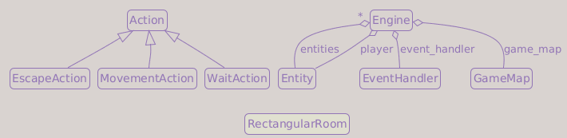

# Part 3: Generating a Dungeon

## What You Will Build

By the end of this part, your roguelike will generate a new dungeon layout made of rooms and tunnels each time it starts, instead of using a single hand-written room.

## Learning goals

- Understand what procedural generation means and why it matters
- Implement the rooms-and-corridors dungeon algorithm
- Place the player in the first room
- Use Bresenham lines to dig L-shaped tunnels

---

## Procedural generation

A hand-crafted dungeon is fixed: every player sees the same thing. A procedurally generated dungeon is created algorithmically at runtime: different every time, potentially infinite in variety.

The classic roguelike dungeon uses the **rooms-and-corridors** approach:

1. Pick a random position and size for a room
2. Check if it overlaps with any existing room
3. If not, place it and dig a tunnel to the previous room
4. Keep trying until we have enough rooms, or until we run out of placement attempts.

This gives dungeons that feel hand-designed (recognizable rooms connected by corridors) but with endless variety.

!!! example "Other algorithms"
    Many alternatives exist:

    | Algorithm | Feel | Complexity |
    | --- | --- | --- |
    | Rooms-and-corridors | Classic dungeon | Low |
    | BSP (Binary Space Partitioning) | Structured, no wasted space | Medium |
    | Cellular automata | Organic caves | Medium |
    | Wave Function Collapse | Highly varied, tile-pattern aware | High |

    We use rooms-and-corridors because it is the most intuitive to understand and produces instantly recognizable roguelike dungeons. The architecture we build here can be swapped for another generator later without changing anything else.

---

## The map package

Part 2 created `game/game_map.py` and `game/tile_types.py` directly inside `game/`. Now that we are adding dungeon generation, it is worth grouping the map-related files before the project grows further:

```text
game/
  map/
    __init__.py
    game_map.py
    tile_types.py
    map_generator.py
```

Create `game/map/__init__.py` as an empty file. Then move:

- `game/game_map.py` to `game/map/game_map.py`
- `game/tile_types.py` to `game/map/tile_types.py`

Update the import in `game/map/game_map.py`:

```diff
-from game import tile_types
+from game.map import tile_types
```

Update the `GameMap` import in `game/engine.py`. It moves below the other `game` imports to keep them alphabetical:

```diff
 from game.entity import Entity
-from game.game_map import GameMap
 from game.input_handlers import EventHandler
+from game.map.game_map import GameMap
```

---

## The dungeon generator module

The original libtcod tutorial put dungeon generation inside the `GameMap` class. That works for simple cases, but it couples the map *data structure* to one specific *algorithm*. If you ever want a second generator (say, a cave level that uses cellular automata), you end up with a cluttered `GameMap`.

The better approach: a separate `game/map/map_generator.py` module that takes configuration parameters and returns a `GameMap`.

!!! info "Design decision: Separate map generator module"
    `GameMap` is responsible for *storing* and *rendering* the tile grid. `game/map/map_generator.py` is responsible for *filling* it. This is the Single Responsibility Principle: each module does one thing. Swapping algorithms later is then a one-line change in `main.py`.

---

## The RectangularRoom class

Create `game/map/map_generator.py` with our first class:

```python
from __future__ import annotations

import random
from collections.abc import Iterator
from typing import TYPE_CHECKING

import tcod

from game.map.game_map import GameMap
from game.map import tile_types

if TYPE_CHECKING:
    from game.entity import Entity


class RectangularRoom:

    def __init__(self, x: int, y: int, width: int, height: int) -> None:
        self.x1 = x
        self.y1 = y
        self.x2 = x + width
        self.y2 = y + height

    @property
    def center(self) -> tuple[int, int]:
        return (self.x1 + self.x2) // 2, (self.y1 + self.y2) // 2

    @property
    def inner(self) -> tuple[slice, slice]:
        """The interior of the room as numpy slices."""
        return slice(self.x1 + 1, self.x2), slice(self.y1 + 1, self.y2)

    def intersects(self, other: RectangularRoom) -> bool:
        """True if this room overlaps with another."""
        return (
            self.x1 <= other.x2
            and self.x2 >= other.x1
            and self.y1 <= other.y2
            and self.y2 >= other.y1
        )
```

!!! question "What does `@property` do?"
    `@property` lets us call a method like an attribute. Instead of writing `room.center()`, we write `room.center`. This is useful for values that are computed from the object's current state but feel like data: a room's center is derived from `x1`, `y1`, `x2`, and `y2`.

Two rectangles overlap if and only if their projections overlap on **both** the X and Y axes. The four conditions check exactly that: each axis must have at least one common point.

### Why `inner` adds 1

Consider a room placed at `(1, 1)` to `(6, 6)`. If we dig out exactly that rectangle, and then place a room at `(6, 1)` to `(11, 6)`, the two rooms share the column at `x=6`; they merge with no wall between them.

By starting the interior at `x1 + 1` and `y1 + 1`, we always leave at least one tile of wall around each room:

```text
Without +1:                  With +1 (what we do):

  0 1 2 3 4 5 6 7            0 1 2 3 4 5 6 7
0 # # # # # # # #          0 # # # # # # # #
1 # . . . . . . #          1 # + + + + + + #
2 # . . . . . . #    ->    2 # + . . . . + #
3 # . . . . . . #          3 # + . . . . + #
4 # . . . . . . #          4 # + . . . . + #
5 # . . . . . . #          5 # + . . . . + #
6 # . . . . . . #          6 # + + + + + + #
7 # # # # # # # #          7 # # # # # # # #
```

!!! info "About `+` and `#`"
    Here `+` is only used to highlight the wall tiles preserved by the `+1` offset. In the actual game, these are still normal wall tiles.

Two rooms next to each other will always have a wall between them.

---

## L-shaped tunnels

Rooms need corridors between them. We connect room centers with an L-shaped tunnel: first move horizontally (or vertically), then turn.

Add this function to `game/map/map_generator.py`:

```python
def tunnel_between(
    start: tuple[int, int],
    end: tuple[int, int],
) -> Iterator[tuple[int, int]]:
    """Yield the (x, y) coordinates of an L-shaped tunnel."""
    x1, y1 = start
    x2, y2 = end

    if random.random() < 0.5:
        corner_x, corner_y = x2, y1  # Horizontal first, then vertical
    else:
        corner_x, corner_y = x1, y2  # Vertical first, then horizontal

    for x, y in tcod.los.bresenham((x1, y1), (corner_x, corner_y)).tolist():
        yield x, y

    for x, y in tcod.los.bresenham((corner_x, corner_y), (x2, y2)).tolist():
        yield x, y
```

The two options look like this:

```text
Option A (right then down):      Option B (down then right):

  ┌──────┐                    ┌──────┐
  │      │                    │      │
  │  ●───────────────┐        │  ●   │
  └──────┘           │        └──│───┘
                     │           │
                     │           │
                  ┌──│───┐       │            ┌──────┐
                  │  ●   │       └───────────────●   │
                  └──────┘                    └──────┘
```

The 50/50 random choice means the dungeon gets a mix of both shapes, which looks more natural than always turning the same way.

`tcod.los.bresenham` returns the coordinates of a straight line between two points using [Bresenham's line algorithm](https://en.wikipedia.org/wiki/Bresenham%27s_line_algorithm). We use it from tcod's line-of-sight module: it happens to be exactly what we need for drawing grid lines.

The `yield` keyword makes `tunnel_between` a *generator*: it produces coordinates one at a time instead of building a full list. The caller (`for x, y in tunnel_between(...)`) receives them as it iterates.

---

## The dungeon generator

Now add the main function:

```python
def generate_dungeon(
    max_rooms: int,
    room_min_size: int,
    room_max_size: int,
    map_width: int,
    map_height: int,
    player: Entity,
) -> GameMap:
    """Generate a new dungeon map and place the player."""
    dungeon = GameMap(map_width, map_height)

    rooms: list[RectangularRoom] = []

    max_room_attempts = max_rooms * 2
    for _ in range(max_room_attempts):
        room_width  = random.randint(room_min_size, room_max_size)
        room_height = random.randint(room_min_size, room_max_size)

        x = random.randint(0, dungeon.width  - room_width  - 1)
        y = random.randint(0, dungeon.height - room_height - 1)

        new_room = RectangularRoom(x, y, room_width, room_height)

        # Skip this room if it overlaps with any existing room
        if any(new_room.intersects(other) for other in rooms):
            continue

        # Dig out the interior
        dungeon.tiles[new_room.inner] = tile_types.floor

        if not rooms:
            # First room: place the player here
            player.set_position(*new_room.center)

        else:
            # All subsequent rooms: dig a tunnel to the previous room
            for x, y in tunnel_between(rooms[-1].center, new_room.center):
                dungeon.tiles[x, y] = tile_types.floor

        rooms.append(new_room)
        if len(rooms) >= max_rooms:
            break

    return dungeon
```

The algorithm in plain language:

1. Attempt to place rooms, giving the generator extra chances when a room overlaps
2. For each attempt, pick a random size and position
3. If it overlaps an existing room, skip it (try again next iteration)
4. Otherwise, dig it out and connect it to the last room with a tunnel
5. Put the player in the first room that was successfully placed

`max_rooms` is the maximum number of rooms we want to keep, not the number of placement attempts. Since many attempts are rejected because they overlap existing rooms, we give the generator extra chances with `max_room_attempts`. The loop stops early once enough rooms have been placed.

!!! tip "Tweaking the dungeon"
    The three parameters `max_rooms`, `room_min_size`, and `room_max_size` control the dungeon character. More rooms = denser dungeon. Smaller rooms = tighter corridors. Experiment after Part 3 is working.

---

## The GameMap needs walls to start

The generator digs floors out of a solid wall map. Update `game/map/game_map.py` to start with walls:

```diff
-        # Fill the entire map with floor tiles for now
-        # Part 3 will change this to walls, which we dig out
-        self.tiles = np.full((width, height), fill_value=tile_types.floor, order="F")
-
-        half_width  = width  // 2
-        half_height = height // 2
-
-        # A small wall for testing: we will remove it in Part 3
-        self.tiles[half_width-10:half_width+10+1, half_height] = tile_types.wall
+        self.tiles = np.full((width, height), fill_value=tile_types.wall, order="F")
```

---

## Wiring it into main.py

Update `main.py` to call `generate_dungeon`:

```python
from __future__ import annotations

from pathlib import Path

import tcod

from game.engine import Engine
from game.entity import Entity
from game.input_handlers import EventHandler
from game.map.map_generator import generate_dungeon


def main() -> None:
    screen_width  = 80
    screen_height = 50

    map_width  = 80
    map_height = 45

    room_max_size = 12
    room_min_size = 7

    max_rooms = 30

    tileset = tcod.tileset.load_tilesheet(
        Path(__file__).parent / "res" / "dejavu12x12_gs_tc.png",
        32,
        8,
        tcod.tileset.CHARMAP_TCOD,
    )

    event_handler = EventHandler()

    player = Entity(x=0, y=0, char="@", color=(255, 255, 255))

    game_map = generate_dungeon(
        max_rooms     = max_rooms,
        room_min_size = room_min_size,
        room_max_size = room_max_size,
        map_width     = map_width,
        map_height    = map_height,
        player        = player,
    )

    engine = Engine(
        entities      = {player},
        event_handler = event_handler,
        game_map      = game_map,
        player        = player,
    )

    title   = "Roguelike Tutorial"
    version = "0.1.0"
    app_id  = "com.tutorial.roguelike"

    tcod.lib.SDL_SetAppMetadata(
        title.encode("utf-8"),
        version.encode("utf-8"),
        app_id.encode("utf-8")
    )
    tcod.lib.SDL_SetHint(
        b"SDL_RENDER_SCALE_QUALITY",
        b"0" # Nearest pixel sampling
    )

    with tcod.context.new(
        columns          = screen_width,
        rows             = screen_height,
        tileset          = tileset,
        title            = title,
        vsync            = True,
        sdl_window_flags = tcod.context.SDL_WINDOW_ALLOW_HIGHDPI | tcod.context.SDL_WINDOW_RESIZABLE,
    ) as context:
        console = tcod.console.Console(screen_width, screen_height, order="F")
        engine.run(context, console)


if __name__ == "__main__":
    main()
```

Notice that the player starts at `(0, 0)`, a wall. `generate_dungeon` will move the player to the center of the first room before the game begins. We also removed the `npc` entity since it was just for demonstration.

---

## Testing your work

Run `python main.py` a few times:

- [ ] A different dungeon layout appears every run
- [ ] The player starts inside a room, not inside a wall
- [ ] All rooms are connected by corridors (you can reach every room)
- [ ] Walls block movement as expected
- [ ] The dungeon fits within the map bounds
- [ ] There is no exit yet; descending stairs come in Part 11

!!! bug "What if some rooms are unreachable?"
    Our algorithm connects each room to the *previous* room in the list. As long as no room overlaps (which we check), every placed room is reachable. If you see a floating room with no connection, it is a bug in the intersection check; verify that `intersects` is comparing `x1/x2/y1/y2` correctly.

---

## Summary

We built a rooms-and-corridors dungeon generator in a dedicated `game/map/map_generator.py` module. Key ideas:

- **Separation of concerns**: `GameMap` stores tiles, `map_generator` fills them
- **Wall-first approach**: start with all walls and dig out rooms
- **Intersection testing**: reject rooms that overlap, guaranteeing clean separation
- **L-shaped tunnels**: connecting room centers with a random horizontal-or-vertical-first choice
- **Player placement**: the first valid room becomes the player's starting position

**Current architecture**:

- `main.py`: chooses generation parameters and starts the engine
- `game/map/`: groups tile definitions, map storage, and map generation
- `game/map/map_generator.py`: builds a dungeon and places the player
- `GameMap`: stores the generated tile grid
- `RectangularRoom`: local helper for the rooms-and-corridors algorithm
- `Engine`: runs the already-generated map

**Class Diagram**:



**File structure**:

```text
main.py                     ← modified
game/
├── __init__.py
├── actions.py
├── engine.py               ← modified
├── entity.py
├── input_handlers.py
└── map/
    ├── __init__.py         ← new
    ├── game_map.py         ← moved (game/game_map.py), modified
    ├── tile_types.py       ← moved (game/tile_types.py)
    └── map_generator.py    ← new
```

---

## Exercises

0. **Remove lake if you implemented it**:

    If you completed Part 2's water-tile exercise, remove the hard-coded lake before testing procedural generation. A fixed obstacle can accidentally cut a corridor or block a room entrance, which makes it harder to tell whether a problem comes from the dungeon generator or from the old test feature. Keep the `water` tile definition if you want, but remove any code that paints water into the generated map for now.

1. **Reproducible dungeons**:

    Add a `seed` parameter to `generate_dungeon` and call `random.seed(seed)` at the top of the function. With a fixed seed, the dungeon is always the same. This is useful for debugging: if you find a problematic layout, record its seed to reproduce it.

2. **Connect to the *nearest* room instead of the *previous* one**:

    Our current algorithm connects each room to the one placed before it. This sometimes creates long diagonal tunnels. Instead, find the already-placed room that is closest to the new room and connect to that. The dungeon will look more compact.

    Add distance helpers to `RectangularRoom`:

    ```python
    def squared_center_distance(self, other_room: RectangularRoom) -> int:
        dx = self.center[0] - other_room.center[0]
        dy = self.center[1] - other_room.center[1]
        return dx * dx + dy * dy

    def squared_distance(self, other_room: RectangularRoom) -> int:
        dx = max(
            other_room.x1 - self.x2,
            self.x1 - other_room.x2,
            0,
        )
        dy = max(
            other_room.y1 - self.y2,
            self.y1 - other_room.y2,
            0,
        )
        return dx * dx + dy * dy
    ```

    `squared_center_distance` compares room centers. `squared_distance` compares the rectangles themselves: if two rooms overlap along one axis, that axis contributes `0`; otherwise it contributes the gap between their edges. Use `squared_distance` for this exercise.

    We compare squared distances instead of real distances because we only need to know which room is closest. Taking a square root would make every distance slower to compute, and it would not change the ordering: if one squared distance is smaller than another, its real distance is smaller too.

    A simple explicit loop is a good fit here: keep track of the closest room found so far and update it when you find a shorter distance. This avoids extra imports and keeps type checkers happy.

3. **Connect rooms using rough centers**:

    Add a `roughly_center` property to `RectangularRoom` that returns a random point inside the room instead of its exact center, keeping a small margin from the walls so the point never lands on one. Use `roughly_center` as the tunnel endpoint instead of `center`, so corridors do not always connect to the exact middle of each room. Keep using `center` to place the player in the first room.
