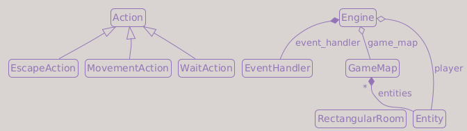

# Part 4: Field of View

## What You Will Build

By the end of this part, the player will only see the parts of the dungeon that are currently visible, while previously explored areas remain remembered on the map.

## Learning goals

- Understand what FOV means in a roguelike and why it matters
- Track three tile visibility states: visible, explored, unseen
- Render tiles differently depending on visibility
- Recompute FOV after every player move

---

## What is FOV and why do roguelikes use it?

In a dungeon you cannot see around corners. FOV (Field of View) simulates this: the player only sees tiles that have an unobstructed line of sight from their position.

```text
Legend:
  @ player
  # wall
  . visible floor
  ? unseen floor

# # # # # # # # # # # # # # # # #
# ? ? . . . . . # ? ? ? ? ? ? ? #
# ? . . . . . . # ? ? ? ? ? ? ? #
# . . . . . . . # ? ? ? ? ? ? ? #
# . . . . @ . . . . ? ? ? ? ? ? #
# . . . . . . . # ? ? ? ? ? ? ? #
# ? . . . . . . # ? ? ? ? ? ? ? #
# ? ? . . . . . # ? ? ? ? ? ? ? #
# # # # # # # # # # # # # # # # #
```

The wall blocks line of sight. The player can see the floor tiles on the left, but the tiles behind the wall are unseen, even if they are physically part of the same map.

This creates tension (you never know what is around the next corner) and makes exploration meaningful.

Roguelikes also show tiles the player has *already seen* even when they are out of current view. These are rendered differently (darker) to indicate they are remembered but not currently visible. Tiles never seen at all are completely black.

This is often called **fog of war**: visible tiles are bright, remembered tiles are dim, and unseen tiles are black. Some roguelike codebases call never-seen tiles the *shroud*, but we use the plainer name `UNSEEN`.

This gives us three states:

| State | Appearance |
| ----- | ---------- |
| Currently visible | Bright (light colors) |
| Explored but out of FOV | Dimmed (dark colors) |
| Never seen | Black (`UNSEEN`) |

---

## Adding light colors to tiles

Until now, tiles only had an `out_of_fov` appearance. We add an `in_fov` appearance for when a tile is inside the player's FOV.

Update `game/map/tile_types.py`:

```python
from __future__ import annotations


import numpy as np

graphic_dtype = np.dtype(
    [
        ("ch", np.int32),
        ("fg", "3B"),
        ("bg", "3B"),
    ]
)

tile_dtype = np.dtype(
    [
        ("walkable",    np.bool_),
        ("transparent", np.bool_),
        ("out_of_fov",  graphic_dtype), # appearance when explored but outside FOV
        ("in_fov",      graphic_dtype), # appearance when inside the player's FOV
    ]
)

# Used for tiles the player has never seen. Pure black
UNSEEN = np.array((ord(" "), (255, 255, 255), (0, 0, 0)), dtype=graphic_dtype)


def new_tile(
    *,
    walkable: bool,
    transparent: bool,
    out_of_fov: tuple[int, tuple[int, int, int], tuple[int, int, int]],
    in_fov: tuple[int, tuple[int, int, int], tuple[int, int, int]],
) -> np.ndarray:
    return np.array((walkable, transparent, out_of_fov, in_fov), dtype=tile_dtype)


# Tile definitions
floor = new_tile(
    walkable    = True,
    transparent = True,
    out_of_fov  = (ord(" "), (255, 255, 255), (35, 35, 90)),
    in_fov      = (ord(" "), (255, 255, 255), (190, 170, 80)),
)

wall = new_tile(
    walkable    = False,
    transparent = False,
    out_of_fov  = (ord("#"), (80, 80, 120), (0, 0, 70)),
    in_fov      = (ord("#"), (220, 210, 170), (110, 95, 60)),
)
```

`UNSEEN` is a single graphic (not a full tile struct) that we use for unseen cells.

---

## Moving entities into GameMap

Right now, entities are stored in `Engine`. But entities live *in* the dungeon; it makes more sense for the map to own them. Moving them to `GameMap` also makes the rendering code simpler: the map knows both the tile grid and what is on it.

!!! info "Design decision: entities belong to the map"
    Storing entities in `Engine` worked while we had one player and no enemies. Once we add dozens of enemies per floor, pathfinding and collision queries become much easier if the map already knows where everything is. We make this move now before enemy placement in Part 5.

Update `game/map/game_map.py`:

```python
from __future__ import annotations

from collections.abc import Iterable
from typing import TYPE_CHECKING

import numpy as np
from tcod.console import Console

from game.map import tile_types

if TYPE_CHECKING:
    from game.entity import Entity


class GameMap:

    def __init__(
        self,
        width: int,
        height: int,
        entities: Iterable[Entity] = (),
    ) -> None:
        self.width = width
        self.height = height
        self.entities: set[Entity] = set(entities)
        self.tiles = np.full((width, height), fill_value=tile_types.wall, order="F")
        self.visible = np.full((width, height), fill_value=False, order="F")
        self.explored = np.full((width, height), fill_value=False, order="F")

    def in_bounds(self, x: int, y: int) -> bool:
        return 0 <= x < self.width and 0 <= y < self.height

    def render(self, console: Console) -> None:
        console.rgb[0 : self.width, 0 : self.height] = np.select(
            condlist   = [self.visible, self.explored],
            choicelist = [self.tiles["in_fov"], self.tiles["out_of_fov"]],
            default    = tile_types.UNSEEN,
        )

        for entity in self.entities:
            if self.visible[entity.x, entity.y]:
                console.print(entity.x, entity.y, entity.char, fg=entity.color)
```

### np.select: choosing between three outcomes

`np.select` evaluates a list of conditions in order and picks the matching array:

```text
If visible[x, y]    → use tiles["in_fov"][x, y]
Elif explored[x, y] → use tiles["out_of_fov"][x, y]
Else                → use UNSEEN
```

This replaces the entire map in one vectorized call: no Python loop needed.

Entity rendering now only shows entities in the player's current FOV (`if self.visible[entity.x, entity.y]`). Enemies that have walked out of sight disappear from view until the player sees them again.

Update `game/map/map_generator.py` to add the player to the map's entity set. In `generate_dungeon`, change:

```diff
-    dungeon = GameMap(map_width, map_height)
+    dungeon = GameMap(map_width, map_height, entities=[player])
```

---

## Computing FOV in the Engine

`tcod.map.compute_fov` takes the map's transparency array and the player's position and returns a boolean array: `True` where the player can see.

Update `game/engine.py`:

```python
from __future__ import annotations

from collections.abc import Iterable
from typing import Any

import tcod.constants
import tcod.event
import tcod.map
from tcod.console import Console
from tcod.context import Context

from game.entity import Entity
from game.input_handlers import EventHandler
from game.map.game_map import GameMap


class Engine:

    def __init__(self, game_map: GameMap, player: Entity) -> None:
        self.game_map = game_map
        self.player = player
        self.event_handler = EventHandler()
        self.update_fov()  # compute FOV for the starting position

    def update_fov(self) -> None:
        self.game_map.visible[:] = tcod.map.compute_fov(
            self.game_map.tiles["transparent"],
            (self.player.x, self.player.y),
            radius    = 8,
            algorithm = tcod.constants.FOV_SHADOW,
        )
        # Any tile now visible is permanently remembered
        self.game_map.explored |= self.game_map.visible

    def handle_events(self, events: Iterable[Any]) -> None:
        for event in events:
            action = self.event_handler.dispatch(event)
            if action is None:
                continue
            action.perform(self, self.player)
            self.update_fov()  # recompute after every action

    def render(self, console: Console, context: Context) -> None:
        console.clear()
        self.game_map.render(console)
        context.present(console)

    def run(self, context: Context, console: Console) -> None:
        while True:
            self.render(console=console, context=context)
            self.handle_events(tcod.event.wait())
```

Key points:

- `update_fov()` is called once in `__init__` so the player's starting room is immediately visible
- It is called after every action in `handle_events` so moving updates the view
- `explored |= visible`: the bitwise OR accumulates explored tiles over time: once seen, always remembered

!!! note "What does `[:]` mean?"
    `visible[:] = ...` updates the contents of the existing array in-place. Without `[:]`, the assignment would replace the array with a new one, and any other code holding a reference to the original would still see the old data.

!!! info "The Engine constructor shrank"
    Compared to Part 2, `Engine.__init__` no longer receives `entities` (they live in `GameMap` now) or `event_handler` (we always create the `EventHandler` inside the engine, since for now there is only one). What stays in the signature is what the caller has to provide from outside: the freshly generated `game_map` and the `player`. Internal collaborators move inside.

!!! question "Why `radius=8`?"
    The radius controls how far the player can see. Eight tiles is a common default: large enough to see across a room, small enough that corridors stay mysterious. Change it to taste, or make it a character stat later.

!!! example "FOV algorithms"
    tcod ships several FOV algorithms: `FOV_BASIC`, `FOV_DIAMOND`, `FOV_SHADOW`, `FOV_PERMISSIVE_*` (eight variants), and `FOV_RESTRICTIVE`. They differ in how they handle corners, walls, and symmetry (whether A seeing B implies B seeing A). We pick `FOV_SHADOW` because it produces clean, symmetric sight lines and matches what most modern roguelikes use. Try the others to see how they change the feel of corridors and walls.

---

## Reproducible dungeons on the main path

The `main.py` we are about to write picks a **seed** for the dungeon and passes it to `generate_dungeon`. With a fixed seed the generator is reproducible: the same seed rebuilds the same dungeon. From here on, `main.py` always passes a seed, so `generate_dungeon` needs a `seed` parameter on the main path.

This was Part 3's first exercise. If you completed it, you already have this code; otherwise, add it now (from this point it is required, not optional):

```diff
 def generate_dungeon(
     max_rooms: int,
     room_min_size: int,
     room_max_size: int,
     map_width: int,
     map_height: int,
     player: Entity,
+    seed: int,
 ) -> GameMap:
     """Generate a new dungeon map and place the player."""
+    # Part-3. Exercise 1: Reproducible dungeons
+    random.seed(seed)
+
     dungeon = GameMap(map_width, map_height)
```

`random.seed(seed)` resets Python's random generator, so every call that follows (room sizes, positions, tunnel bends) replays the same sequence for a given seed.

---

## Simplifying main.py

With entities now living in `GameMap` and `Engine` having a simpler constructor, update `main.py`:

```python
from __future__ import annotations

import os
from pathlib import Path
import secrets

import tcod

from game.engine import Engine
from game.entity import Entity
from game.map.map_generator import generate_dungeon


def main() -> None:
    # Part-3. Exercise 1: Reproducible dungeons
    seed = int(os.environ.get("GAME_SEED", secrets.randbits(64)))
    #seed = 12345 # Write here the game seed to reproduce a map
    print(f"Game seed: {seed}")

    screen_width  = 80
    screen_height = 50

    map_width  = 80
    map_height = 45

    room_max_size = 12
    room_min_size = 7

    max_rooms = 30

    tileset = tcod.tileset.load_tilesheet(
        Path(__file__).parent / "res" / "dejavu12x12_gs_tc.png",
        32,
        8,
        tcod.tileset.CHARMAP_TCOD,
    )

    player = Entity(x=0, y=0, char="@", color=(255, 255, 255))

    game_map = generate_dungeon(
        max_rooms     = max_rooms,
        room_min_size = room_min_size,
        room_max_size = room_max_size,
        map_width     = map_width,
        map_height    = map_height,
        player        = player,
        seed          = seed,
    )

    engine = Engine(game_map=game_map, player=player)

    title   = "Roguelike Tutorial"
    version = "0.1.0"
    app_id  = "com.tutorial.roguelike"

    tcod.lib.SDL_SetAppMetadata(
        title.encode("utf-8"),
        version.encode("utf-8"),
        app_id.encode("utf-8")
    )
    tcod.lib.SDL_SetHint(
        b"SDL_RENDER_SCALE_QUALITY",
        b"0" # Nearest pixel sampling
    )

    with tcod.context.new(
        columns          = screen_width,
        rows             = screen_height,
        tileset          = tileset,
        title            = title,
        vsync            = True,
        sdl_window_flags = tcod.context.SDL_WINDOW_ALLOW_HIGHDPI | tcod.context.SDL_WINDOW_RESIZABLE,
    ) as context:
        console = tcod.console.Console(screen_width, screen_height, order="F")
        engine.run(context, console)


if __name__ == "__main__":
    main()
```

`main.py` decides the seed before anything else:

- `secrets.randbits(64)` produces a fresh 64-bit number, so each run builds a different dungeon.
- `os.environ.get("GAME_SEED", ...)` lets you override that: set the `GAME_SEED` environment variable and the game uses it instead, so `GAME_SEED=12345 python main.py` always builds the same dungeon. The commented `seed = 12345` line is a quick alternative if you prefer editing the source.
- `print(f"Game seed: {seed}")` reports the chosen seed, so when you find an interesting (or broken) layout you can reproduce it later.

---

## Testing your work

Run `python main.py`:

- [ ] The starting room is immediately lit (light yellow/gold colors)
- [ ] Tiles you have already seen become dark blue when they leave your current FOV
- [ ] Areas you have never visited are completely black
- [ ] Moving updates the visible area in real time
- [ ] Walls adjacent to lit rooms appear brighter than distant walls

---

## Summary

FOV adds the core roguelike feeling that exploration matters. We track three states (visible, explored, unseen) using two boolean numpy arrays (`visible` and `explored`). Tile definitions now carry both `in_fov` and `out_of_fov` appearances. `np.select` picks the right appearance for each tile in one vectorized call. `update_fov()` runs after every player action to keep the view current.

We also moved entities from `Engine` into `GameMap`, which is where they logically belong.

**Current architecture**:

- `main.py`: creates the player, generates the dungeon, and starts the engine
- `game/map/map_generator.py`: creates the `GameMap` and adds the player to it
- `GameMap`: owns tiles, entities, visibility, exploration, and map rendering
- `Engine`: owns the player reference, handles turns, and recomputes FOV
- `game/map/tile_types.py`: defines visible, explored, and unseen tile appearances

**Class Diagram**:



**File structure**:

```text
main.py                     ← modified
game/
├── __init__.py
├── actions.py
├── engine.py               ← modified
├── entity.py
├── input_handlers.py
└── map/
    ├── __init__.py
    ├── game_map.py         ← modified
    ├── tile_types.py       ← modified
    └── map_generator.py    ← modified
```

---

## Exercises

1. **Variable torch radius**:

    Add a `fov_radius` parameter to `Engine.__init__()`, defaulting to `8`, and store it in `self.fov_radius`. Use `self.fov_radius` instead of the hardcoded `8` in `update_fov()`. Try passing a different value when creating `Engine` to see how the visible area changes.

2. **Add a debug marker entity**:

    In `generate_dungeon()`, create a marker entity in the center of the first room after the starting room, and add it to `dungeon.entities`. For example, when placing the first non-starting room, add an `Entity` with char `"N"` and a bright color at `new_room.center`.

    Verify that the marker only appears when it is inside the player's FOV. Move away and confirm it disappears instead of being remembered like floor tiles.

3. **Remember a discovered marker**:

    Some roguelikes keep certain entities visible after you have seen them once, even when they leave your current FOV. Add an `stays_visible` flag to `Entity`, defaulting to `False`. Create a marker entity with char="P" and with `stays_visible=True`, add it to `game_map.entities`, and update `GameMap.render()` so this entity is drawn when either:

    - its tile is currently visible, or
    - `stays_visible` is true and its tile has been explored.

    It should not appear while its tile is still completely unseen.

4. **Fading memory**:

    Instead of remembering explored tiles forever, add a `memory` array to `GameMap` using integers. Every time a tile is visible, set its memory value to `10`. After each player action, decrement memory values greater than 0. Render tiles as explored while their memory value is greater than 0; when it reaches 0, they become unseen again.

    If you make the duration configurable in `Engine`, name that setting `memory_duration` so it is not confused with the `game_map.memory` array.

    Walk through a corridor, wait or move away, and watch the remembered area fade back into darkness.
