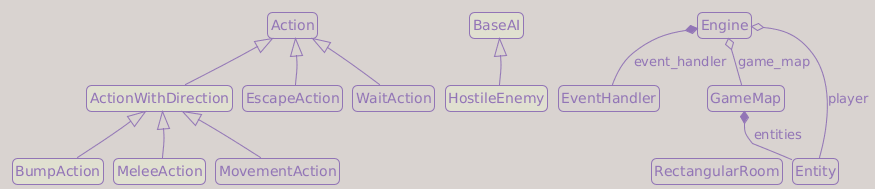

# Part 5: Enemies and the Turn System

## What You Will Build

By the end of this part, enemies will appear in the dungeon, block movement, chase the player when visible, and take their turns after the player acts.

## Learning goals

- Use entity templates (factory pattern) instead of inline creation
- Place enemies in dungeon rooms during generation
- Implement a turn system: player acts, then enemies act
- Write a basic hostile AI that pursues the player
- Use Python's `ABC` and `@abstractmethod` to enforce the `Action` contract

---

## A constants package for sprites and colors

So far our glyphs (`"@"`, `"#"`, `" "`) and colors (`(255, 255, 255)`, `(35, 35, 90)`, etc.) have been hardcoded inline. With the player plus two enemies (and items, scrolls, equipment coming in later parts), the same magic values would soon appear in many places. If we ever want to recolor the orc, change the player glyph, render floors as `"."` instead of blank spaces, or build a colorblind theme, we want **one place** to change.

We introduce a small `game/constants/` package with two modules: `sprites` for single-character glyphs and `colors` for RGB tuples.

!!! question "Why a constants package?"
    A central place for visual constants is a standard good-practice pattern. Three concrete benefits:

    1. **Discoverability**: a developer reading `game/constants/sprites.py` can see every glyph the game uses at a glance.
    2. **Theming**: changing the orc's color or the floor appearance is a one-line edit instead of a code search.
    3. **Self-documentation**: `colors.PLAYER` is easier to understand than `(255, 255, 255)` at a call site.

    We use `UPPERCASE` names because they are module-level constants (PEP 8). We give each entity its **own named constant** even when colors repeat: `colors.WHITE` would tell us *which* color, but `colors.PLAYER` tells us *who* uses it.

Create `game/constants/__init__.py` (empty file, marks the folder as a Python package):

```python
```

Create `game/constants/sprites.py`:

```python
from __future__ import annotations

# Entity sprites
PLAYER  = "@"
ORC     = "o"
TROLL   = "T"

# Map sprites
UNKNOWN = "?"
UNSEEN  = " "
FLOOR   = " "
WALL    = "#"
```

Create `game/constants/colors.py`:

```python
from __future__ import annotations

from typing import NamedTuple


class Color(NamedTuple):
    r: int
    g: int
    b: int

    def scale(self, factor: float) -> Color:
        f = max(0.0, min(1.0, factor))
        aux_r = round(self.r * f)
        aux_g = round(self.g * f)
        aux_b = round(self.b * f)

        return Color(aux_r, aux_g, aux_b)

    @property
    def grey(self) -> Color:
        grey = round(0.299  * self.r + 0.587  * self.g + 0.114  * self.b)
        return Color(grey, grey, grey)


# Generic colors
DEFAULT_FG         = Color(255, 255, 255)

# Entity colors
PLAYER             = Color(255, 255, 255)
ORC                = Color( 63, 127,  63)
TROLL              = Color(  0, 127,   0)

# Map colors: unseen
UNSEEN_FG          = Color(255, 255, 255)
UNSEEN_BG          = Color(  0,   0,   0)

# Map colors: floor
FLOOR_FG           = Color(255, 255, 255)
FLOOR_OUT_OF_FOV   = Color( 35,  35,  90)
FLOOR_IN_FOV       = Color(190, 170,  80)

# Map colors: wall
WALL_FG_OUT_OF_FOV = Color( 80,  80, 120)
WALL_BG_OUT_OF_FOV = Color(  0,   0,  70)
WALL_FG_IN_FOV     = Color(220, 210, 170)
WALL_BG_IN_FOV     = Color(110,  95,  60)
```

`Color` is a `NamedTuple` with three integer fields (`r`, `g`, `b`). Because `NamedTuple` subclasses `tuple`, `tcod` accepts any `Color` value wherever it expects a plain `(r, g, b)` tuple. Two built-in methods come along for free: `color.scale(factor)` returns a dimmed copy (used later for the fireball highlight), and `color.grey` returns a greyscale copy. Any module can use `Color(r, g, b)` as a constructor and import the type with `from game.constants.colors import Color`.

We will extend both files as the game grows: more sprites in Parts 8 (items), 9 (scrolls), 11 (stairs), 13 (equipment); more colors in Parts 6 (corpse), 7 (UI and combat messages), 8-13 (each new feature).

Now update `game/map/tile_types.py` to use those constants instead of inline visual values:

```python
from __future__ import annotations


import numpy as np

from game.constants import colors, sprites
from game.constants.colors import Color

graphic_dtype = np.dtype(
    [
        ("ch", np.int32),
        ("fg", "3B"),
        ("bg", "3B"),
    ]
)

tile_dtype = np.dtype(
    [
        ("walkable",    np.bool_),
        ("transparent", np.bool_),
        ("out_of_fov",  graphic_dtype),  # appearance when explored but outside FOV
        ("in_fov",      graphic_dtype),      # appearance when inside the player's FOV
    ]
)

# Used for tiles the player has never seen. Pure black
UNSEEN = np.array(
    (
        ord(sprites.UNSEEN),
        colors.UNSEEN_FG,
        colors.UNSEEN_BG
    ),
    dtype=graphic_dtype,
)


def new_tile(
    *,
    walkable: bool,
    transparent: bool,
    out_of_fov: tuple[int, Color, Color],
    in_fov: tuple[int, Color, Color],
) -> np.ndarray:
    return np.array((walkable, transparent, out_of_fov, in_fov), dtype=tile_dtype)


# Tile definitions
floor = new_tile(
    walkable    = True,
    transparent = True,
    out_of_fov  = (ord(sprites.FLOOR), colors.FLOOR_FG, colors.FLOOR_OUT_OF_FOV),
    in_fov      = (ord(sprites.FLOOR), colors.FLOOR_FG, colors.FLOOR_IN_FOV),
)

wall = new_tile(
    walkable    = False,
    transparent = False,
    out_of_fov  = (ord(sprites.WALL), colors.WALL_FG_OUT_OF_FOV, colors.WALL_BG_OUT_OF_FOV),
    in_fov      = (ord(sprites.WALL), colors.WALL_FG_IN_FOV, colors.WALL_BG_IN_FOV),
)
```

This keeps all visual choices in `game/constants/`: entity sprites, terrain sprites, entity colors, and terrain colors.

---

## Updating Entity

So far we create entities inline, like `Entity(0, 0, "@", (255, 255, 255))`. To turn entity types into reusable templates that we can copy into the dungeon, the `Entity` class needs to grow first. We add two new fields, `name` and `blocks_movement`, and a `spawn()` method that copies a template onto a map at a chosen position. The next section uses all three to define our monster prototypes.

If you completed the `stays_visible` exercise in Part 4, keep that field; it remains useful for entities that should stay visible after being discovered.

Update `game/entity.py`:

```python
from __future__ import annotations

import copy
from typing import TYPE_CHECKING

from game.constants import colors, sprites
from game.constants.colors import Color

if TYPE_CHECKING:
    from game.map.game_map import GameMap


class Entity:
    """A generic object: player, enemy, item, etc."""

    def __init__(
        self,
        x: int                = 0,
        y: int                = 0,
        char: str             = sprites.UNKNOWN,
        color: Color          = colors.DEFAULT_FG,
        name: str             = "<unnamed>",
        blocks_movement: bool = False,
        stays_visible: bool   = False,
    ) -> None:
        self.x = x
        self.y = y
        self.char = char
        self.color = color
        self.name = name
        self.blocks_movement = blocks_movement
        self.stays_visible = stays_visible

    def spawn(self, game_map: GameMap, x: int, y: int) -> Entity:
        """Create a deep copy of this entity and place it on the map."""
        clone = copy.deepcopy(self)
        clone.x = x
        clone.y = y
        game_map.entities.add(clone)

        return clone

    def set_position(self, x: int, y: int) -> None:
        self.x = x
        self.y = y

    def move(self, dx: int, dy: int) -> None:
        self.x += dx
        self.y += dy
```

Position defaults to `(0, 0)` so templates can be defined without coordinates.

!!! tip "`copy.deepcopy`: shallow vs deep copies"
    A *shallow* copy (`copy.copy`) duplicates the outer object but shares its inner attributes with the original. A *deep* copy (`copy.deepcopy`) walks the object recursively and duplicates everything, so the clone shares nothing with the template. We want deep copies here: each spawned enemy must be fully independent, so updating one orc never affects the template or any other orc.

!!! info "Design decision: templates vs subclasses"
    We could create `class Orc(Entity): ...` for each monster type. But once we add components (Fighter, AI), the difference between an Orc and a Troll is just their stats: same code, different numbers. Templates let us define that difference as data, not code. Adding a new monster type is then a one-liner in `game/entity_factories.py`.

---

## Entity templates

Now that `Entity` carries a `name`, a `blocks_movement` flag, and a `spawn()` method, we can define reusable *templates*: one `Entity` per type, created once and copied into the dungeon wherever we need it.

Create `game/entity_factories.py`:

```python
from __future__ import annotations

from game.constants import colors, sprites
from game.entity import Entity

player = Entity(
    char            = sprites.PLAYER,
    color           = colors.PLAYER,
    name            = "Player",
    blocks_movement = True,
)

orc = Entity(
    char            = sprites.ORC,
    color           = colors.ORC,
    name            = "Orc",
    blocks_movement = True,
)

troll = Entity(
    char            = sprites.TROLL,
    color           = colors.TROLL,
    name            = "Troll",
    blocks_movement = True,
)
```

These are *prototypes*: for dungeon entities, we call `spawn()` on them to create positioned copies. The player is a small startup special case (covered in the `main.py` section below) because they need to exist before any map does.

---

## Blocking entities and collision

Enemies block movement: the player cannot walk through an orc. Add `get_blocking_entity_at` to `GameMap`:

```diff
 class GameMap:
     ...

+    def get_blocking_entity_at(self, x: int, y: int) -> Entity | None:
+        for entity in self.entities:
+            if entity.blocks_movement and entity.x == x and entity.y == y:
+                return entity
+
+        return None
```

---

## The BumpAction pattern

When the player presses an arrow key toward an occupied tile, should they move or attack? We decide at the moment of the "bump", hitting whatever is at the destination.

Update `game/actions.py` with new action types:

```python
from __future__ import annotations

from abc import ABC, abstractmethod
from typing import TYPE_CHECKING

if TYPE_CHECKING:
    from game.engine import Engine
    from game.entity import Entity


class Action(ABC):

    @abstractmethod
    def perform(self, engine: Engine, entity: Entity) -> None:
        ...


class EscapeAction(Action):

    def perform(self, engine: Engine, entity: Entity) -> None:
        raise SystemExit()


class WaitAction(Action):

    def perform(self, engine: Engine, entity: Entity) -> None:
        pass  # Do nothing; time still passes


class ActionWithDirection(Action, ABC):
    """Base for actions that have a dx/dy direction."""

    def __init__(self, dx: int, dy: int) -> None:
        self.dx = dx
        self.dy = dy


class MovementAction(ActionWithDirection):

    def perform(self, engine: Engine, entity: Entity) -> None:
        dest_x = entity.x + self.dx
        dest_y = entity.y + self.dy

        if not engine.game_map.in_bounds(dest_x, dest_y):
            return  # Destination is outside the map

        if not engine.game_map.tiles["walkable"][dest_x, dest_y]:
            return  # Destination is blocked by a tile

        if engine.game_map.get_blocking_entity_at(dest_x, dest_y):
            return  # Blocked by an entity; cannot move here

        entity.move(self.dx, self.dy)


class MeleeAction(ActionWithDirection):

    def perform(self, engine: Engine, entity: Entity) -> None:
        dest_x = entity.x + self.dx
        dest_y = entity.y + self.dy
        target = engine.game_map.get_blocking_entity_at(dest_x, dest_y)

        if not target:
            return

        print(f"{entity.name} attacks {target.name}!")


class BumpAction(ActionWithDirection):
    """Move if the tile is free; attack if an entity is blocking it."""

    def perform(self, engine: Engine, entity: Entity) -> None:
        dest_x = entity.x + self.dx
        dest_y = entity.y + self.dy

        if engine.game_map.get_blocking_entity_at(dest_x, dest_y):
            MeleeAction(self.dx, self.dy).perform(engine, entity)

        else:
            MovementAction(self.dx, self.dy).perform(engine, entity)
```

!!! info "Abstract classes and `ABC`"
    `Action` was always intended as a blueprint, never to be instantiated directly. Python's `abc` module lets you enforce that formally:

    - `ABC` (Abstract Base Class): inheriting from it marks a class as abstract. Any attempt to instantiate it directly raises a `TypeError`.
    - `@abstractmethod`: marks a method as a contract that every concrete subclass must override, or Python will refuse to instantiate that subclass.

    `ActionWithDirection` is also abstract: it stores `dx`/`dy` but deliberately leaves `perform` to its own subclasses. Without the `ABC` marker, a linter like Pylint would warn:

    ```text
    W0223: Method 'perform' is abstract in class 'Action' but is not overridden in child class 'ActionWithDirection'
    ```

    The fix is `class ActionWithDirection(Action, ABC)`. Python allows a class to list more than one parent (multiple inheritance). Here `Action` contributes the action interface and `ABC` contributes the abstract-class machinery. Listing both tells linters and the runtime that `ActionWithDirection` is itself abstract and is not expected to implement `perform`.

!!! info "Design decision: BumpAction as dispatcher"
    The input handler does not know what is at the destination; it just knows the player pressed right. `BumpAction` resolves the ambiguity at perform-time by checking the map. This keeps the input handler simple and decouples input from game logic.

!!! info "About `WaitAction`"
    If you completed the wait-action exercise from Part 1 or Part 2, this is the canonical version: the same empty `pass` body, now formally part of the action set so the engine can route a "skip turn" intent through the same machinery as a move or an attack.

---

## Updating the input handler

Replace the individual key checks with two module-level lookups and add support for wait, numpad, and vi keys. `MOVE_KEYS` is a dictionary that maps each movement key to a `(dx, dy)` offset; `WAIT_KEYS` is a `set`, because for a wait key we only need to check membership, not retrieve a value. Update `game/input_handlers.py`:

```python
from __future__ import annotations


import tcod.event

from game.actions import Action, BumpAction, EscapeAction, WaitAction

MOVE_KEYS = {
    # Arrow keys
    tcod.event.KeySym.UP:       ( 0, -1),
    tcod.event.KeySym.DOWN:     ( 0,  1),
    tcod.event.KeySym.LEFT:     (-1,  0),
    tcod.event.KeySym.RIGHT:    ( 1,  0),

    # Numpad
    tcod.event.KeySym.KP_1:     (-1,  1), # LEFT  - DOWN
    tcod.event.KeySym.KP_2:     ( 0,  1), #         DOWN
    tcod.event.KeySym.KP_3:     ( 1,  1), # RIGHT - DOWN
    tcod.event.KeySym.KP_4:     (-1,  0), # LEFT
    tcod.event.KeySym.KP_6:     ( 1,  0), # RIGHT
    tcod.event.KeySym.KP_7:     (-1, -1), # LEFT  - UP
    tcod.event.KeySym.KP_8:     ( 0, -1), #         UP
    tcod.event.KeySym.KP_9:     ( 1, -1), # RIGHT - UP

    # Vi keys
    tcod.event.KeySym.B:        (-1,  1), # LEFT  - DOWN
    tcod.event.KeySym.J:        ( 0,  1), #         DOWN
    tcod.event.KeySym.N:        ( 1,  1), # RIGHT - DOWN
    tcod.event.KeySym.H:        (-1,  0), # LEFT
    tcod.event.KeySym.L:        ( 1,  0), # RIGHT
    tcod.event.KeySym.Y:        (-1, -1), # LEFT  - UP
    tcod.event.KeySym.K:        ( 0, -1), #         UP
    tcod.event.KeySym.U:        ( 1, -1), # RIGHT - UP
}

WAIT_KEYS = {
    tcod.event.KeySym.PERIOD,
    tcod.event.KeySym.KP_5,
    tcod.event.KeySym.CLEAR,
}


class EventHandler:

    def dispatch(self, event: tcod.event.Event) -> Action | None:
        match event:
            case tcod.event.Quit():
                return self.event_quit(event)

            case tcod.event.KeyDown():
                return self.event_keydown(event)

            case _:
                return None

    def event_quit(self, _event: tcod.event.Quit) -> Action | None:
        return EscapeAction()

    def event_keydown(self, event: tcod.event.KeyDown) -> Action | None:
        key = event.sym

        if key in MOVE_KEYS:
            dx, dy = MOVE_KEYS[key]
            return BumpAction(dx, dy)

        if key in WAIT_KEYS:
            return WaitAction()

        if key == tcod.event.KeySym.ESCAPE:
            return EscapeAction()

        return None
```

---

## AI components

Enemies need to act on their turn. We model this with an `AI` component: a class with a `perform()` method that the engine calls each enemy turn.

Create `game/components/__init__.py` (empty file, makes `components` a Python package):

```python
```

Create `game/components/ai.py`:

```python
from __future__ import annotations

from typing import TYPE_CHECKING

from game.actions import BumpAction

if TYPE_CHECKING:
    from game.engine import Engine
    from game.entity import Entity


class BaseAI:

    def perform(self, engine: Engine, entity: Entity) -> None:
        raise NotImplementedError()


class HostileEnemy(BaseAI):
    """Chases the player when visible; waits otherwise."""

    def perform(self, engine: Engine, entity: Entity) -> None:
        if not engine.game_map.visible[entity.x, entity.y]:
            return  # Enemy is not in player's FOV; it cannot see the player either

        target = engine.player
        dx = target.x - entity.x
        dy = target.y - entity.y

        # Step one tile toward the player along each axis
        # Clamp dx/dy to -1, 0, or 1 to get a unit direction
        BumpAction(
            dx = max(-1, min(1, dx)),
            dy = max(-1, min(1, dy)),
        ).perform(engine, entity)
```

!!! info "`BaseAI` uses an informal contract, not `ABC`"
    `Action` used `ABC` and `@abstractmethod` because it is a public contract: the engine creates many action types through it, so enforcing the contract at construction time pays off. `BaseAI` instead starts as an informal hook: `perform` just raises `NotImplementedError`, which documents that subclasses must override it without the extra machinery. In Part 6, `BaseAI` joins the component pattern (it inherits from `BaseComponent`), but it keeps this informal `NotImplementedError` style rather than becoming an `ABC`.

!!! question "Why reuse `BumpAction`?"
    The enemy faces the same problem the player does: at the destination tile there might be a wall, an empty floor, or another entity. `BumpAction` already resolves all three cases (no-op, move, attack). Reusing it here means enemies cannot walk through walls or through each other, and the same `MeleeAction` stub fires when they hit the player.

!!! question "Why `visible[entity.x, entity.y]`?"
    We check the *player's* FOV array, not a separate "can the enemy see" computation. This is a common roguelike simplification: if the player can see the enemy, the enemy can see the player. It is not realistic (an enemy behind you cannot see you) but it is fair and predictable for the player.

!!! warning "No pathfinding yet"
    The current AI takes one greedy step along each axis toward the player. It cannot navigate around walls: facing a corner, it tries to move into it, `BumpAction` rejects the move, and the enemy stays put. Part 6 replaces this with proper A* pathfinding. For now it is enough to verify that enemies move toward you and that the turn system works.

---

## Extending Entity with an AI slot

Entities that have AI (enemies) need an `ai` attribute. Add it to `Entity`:

```diff
 class Entity:

     def __init__(
         self,
         x: int                = 0,
         y: int                = 0,
         char: str             = sprites.UNKNOWN,
         color: Color          = colors.DEFAULT_FG,
         name: str             = "<unnamed>",
         blocks_movement: bool = False,
         stays_visible: bool   = False,
+        ai: BaseAI | None     = None,
     ) -> None:
         ...
+        self.ai = ai
```

And extend the existing `TYPE_CHECKING` imports at the top of `game/entity.py`:

```diff
 if TYPE_CHECKING:
+    from game.components.ai import BaseAI
     from game.map.game_map import GameMap
```

Update `game/entity_factories.py` to assign AI to enemies:

```python
from __future__ import annotations

from game.components.ai import HostileEnemy
from game.constants import colors, sprites
from game.entity import Entity

player = Entity(
    char            = sprites.PLAYER,
    color           = colors.PLAYER,
    name            = "Player",
    blocks_movement = True,
)

orc = Entity(
    char            = sprites.ORC,
    color           = colors.ORC,
    name            = "Orc",
    blocks_movement = True,
    ai              = HostileEnemy(),
)

troll = Entity(
    char            = sprites.TROLL,
    color           = colors.TROLL,
    name            = "Troll",
    blocks_movement = True,
    ai              = HostileEnemy(),
)
```

---

## Enemy placement in the map generator

If you added the debug marker entities from the Part 4 exercises, remove them now. They were useful to test FOV behavior, but Part 5 starts placing real enemies in rooms, and those markers would make the test output harder to read.

Add a `place_entities` function to the existing `game/map/map_generator.py`. The `RectangularRoom` class stays unchanged, and so does the `tunnel_between` function's body; it already takes the `rng` instance Part 4 introduced. The function spawns monsters from the templates we just defined, so first add `entity_factories` to the imports at the top of the file:

```python
from game import entity_factories
```

Then add the function itself:

```python
def place_entities(
    rng: random.Random,
    room: RectangularRoom,
    dungeon: GameMap,
    max_monsters: int,
) -> None:
    number_of_monsters = rng.randint(0, max_monsters)

    for _ in range(number_of_monsters):
        x = rng.randint(room.x1 + 1, room.x2 - 1)
        y = rng.randint(room.y1 + 1, room.y2 - 1)

        if not any(entity.x == x and entity.y == y for entity in dungeon.entities):
            if rng.random() < 0.8:  # 80% chance of orc
                entity_factories.orc.spawn(dungeon, x, y)

            else:
                entity_factories.troll.spawn(dungeon, x, y)
```

`place_entities` takes the same `rng` instance `generate_dungeon` already owns, instead of calling the shared `random` module. This keeps monster placement reproducible from the same dungeon seed, without reseeding anything global.

Update `generate_dungeon` to call `place_entities` and accept the new parameter:

```diff
 def generate_dungeon(
     max_rooms: int,
     room_min_size: int,
     room_max_size: int,
     map_width: int,
     map_height: int,
+    max_monsters_per_room: int,
     player: Entity,
     seed: int,
 ) -> GameMap:
     dungeon = GameMap(map_width, map_height, entities=[player])
     rooms: list[RectangularRoom] = []
     max_room_attempts = max_rooms * 2

     for _ in range(max_room_attempts):
         ...
         if not rooms:
             player.set_position(*new_room.center)
         else:
             for x, y in tunnel_between(
                rng,
                rooms[-1].center,
                new_room.center
             ):
                 dungeon.tiles[x, y] = tile_types.floor
+
+            place_entities(rng, new_room, dungeon, max_monsters_per_room)

         rooms.append(new_room)
         if len(rooms) >= max_rooms:
             break

     return dungeon
```

!!! note "If you did the Part 3 exercises"
    The tunnel line above is the main-path version (connect to the previous room with `tunnel_between(rng, rooms[-1].center, new_room.center)`). If you connected to the nearest room (Exercise 2) or used `roughly_center` as the tunnel endpoints (Exercise 3), keep your own version of that line, passing `rng` first the same way. The only additions Part 5 needs are the `max_monsters_per_room` parameter and the `place_entities(rng, new_room, dungeon, max_monsters_per_room)` call inside the `else` branch.

    ```diff
         else:
             nearest_room = min(
                 rooms,
                 key = lambda room: (
                     (room.center[0] - new_room.center[0]) ** 2 +
                     (room.center[1] - new_room.center[1]) ** 2
                 ),
             )
             for x, y in tunnel_between(
                 rng,
                 nearest_room.roughly_center,
                 new_room.roughly_center,
             ):
                 dungeon.tiles[x, y] = tile_types.floor
    +
    +            place_entities(rng, new_room, dungeon, max_monsters_per_room)
    ```

!!! tip "Why not place enemies in the first room?"
    The player starts in the first room. Spawning enemies there would mean instant combat before the player can even look around. Skipping the `place_entities` call for `rooms[0]` gives the player a safe starting area.

---

## The turn system

After the player acts, each living enemy takes one turn. Add `handle_enemy_turns` to `Engine` and call it after the player's action:

The `Iterable` and `Any` imports are already in `game/engine.py` from Part 4. We just add the new method and the call in `handle_events`:

```diff
 class Engine:
     ...

     def handle_events(self, events: Iterable[Any]) -> None:
         for event in events:
             action = self.event_handler.dispatch(event)
             if action is None:
                 continue
             action.perform(self, self.player)
+            self.handle_enemy_turns()
             self.update_fov()

+    def handle_enemy_turns(self) -> None:
+        for entity in set(self.game_map.entities) - {self.player}:
+            if entity.ai:
+                entity.ai.perform(self, entity)
```

Two things happen in `set(self.game_map.entities) - {self.player}`. First, `set(...)` takes a snapshot of the entities so we can iterate safely: from Part 6 on, enemies can die and be removed from the set during their turn, and Python raises a `RuntimeError` if a set changes size while you iterate over it. Second, `- {self.player}` removes the player from that snapshot, so the loop steps through enemies only.

!!! info "Invalid actions still consume a turn"
    `MovementAction.perform()` returns silently when the destination is a wall or a blocking entity, but `handle_events` already accepted the action and runs `handle_enemy_turns()` afterwards. So bumping into a wall costs you a turn just like a real move would. This is the most common roguelike convention (Brogue, NetHack, DCSS) and the simplest to teach. If you later want to free the player from the wall-bump tax, the usual approach is to have `perform()` raise a small `Impossible("...")` exception and have the engine skip enemy turns when it catches one. We introduce that mechanism in Part 8.

!!! warning "Holding a key may take many turns"
    Most operating systems generate repeated `KeyDown` events while a key is held. With the new turn loop in place, that means holding `→` walks the player tile by tile *and* lets enemies act on every step. This is usually what players expect (faster traversal of empty corridors), but if you want one physical key press to mean exactly one turn, filter repeats at the start of `event_keydown`:

    ```python
    def event_keydown(self, event: tcod.event.KeyDown) -> Action | None:
        if event.repeat:
            return None
        ...
    ```

    We leave repeat enabled because it makes early playtests less tedious; revisit when combat starts mattering.

!!! note "Enemies react to the player's previous position"
    `handle_enemy_turns()` runs before `update_fov()`, so the AI checks `game_map.visible` (the field of view computed at the *start* of the turn), before the player moved. An enemy the player just stepped into range of will not react until the following turn. Swapping the order (calling `update_fov()` before `handle_enemy_turns()`) fixes this, but introduces a different asymmetry: enemies would react to a position the player hasn't seen rendered yet. Both orderings are valid roguelike conventions; we keep `update_fov()` last so the rendered frame always reflects the state the player actually acted on.

---

## Updating main.py

The player is a special case: `spawn()` requires a `GameMap` to add the entity to, but at startup the map does not exist yet. We bypass `spawn()` and `copy.deepcopy` the template directly. `entity_factories.player` is a *template*, a singleton entity object never placed on a map, so deep-copying it gives us an independent instance for this run.

```python
from __future__ import annotations

import copy
import os
from pathlib import Path
import random

import tcod

from game import entity_factories
from game.engine import Engine
from game.map.map_generator import generate_dungeon


def main() -> None:
    # Part-3. Exercise 1: Reproducible dungeons
    seed = int(os.environ.get("GAME_SEED", random.getrandbits(64)))
    print(f"Game seed: {seed}")

    screen_width  = 80
    screen_height = 50

    map_width  = 80
    map_height = 44

    room_max_size = 12
    room_min_size = 7

    max_rooms = 30
    max_monsters_per_room = 2

    tileset = tcod.tileset.load_tilesheet(
        Path(__file__).parent / "res" / "dejavu12x12_gs_tc.png",
        32,
        8,
        tcod.tileset.CHARMAP_TCOD,
    )

    player = copy.deepcopy(entity_factories.player)

    game_map = generate_dungeon(
        max_rooms             = max_rooms,
        room_min_size         = room_min_size,
        room_max_size         = room_max_size,
        map_width             = map_width,
        map_height            = map_height,
        max_monsters_per_room = max_monsters_per_room,
        player                = player,
        seed                  = seed,
    )

    engine = Engine(game_map=game_map, player=player)

    title   = "Roguelike Tutorial"
    version = "0.1.0"
    app_id  = "com.tutorial.roguelike"

    tcod.lib.SDL_SetAppMetadata(
        title.encode("utf-8"),
        version.encode("utf-8"),
        app_id.encode("utf-8"),
    )
    tcod.lib.SDL_SetHint(
        b"SDL_RENDER_SCALE_QUALITY",
        b"0"  # Nearest pixel sampling
    )

    with tcod.context.new(
        columns          = screen_width,
        rows             = screen_height,
        tileset          = tileset,
        title            = title,
        vsync            = True,
        sdl_window_flags = tcod.context.SDL_WINDOW_ALLOW_HIGHDPI | tcod.context.SDL_WINDOW_RESIZABLE,
    ) as context:
        console = tcod.console.Console(screen_width, screen_height, order="F")
        engine.run(context, console)


if __name__ == "__main__":
    main()
```

!!! note "Part 4 exercise carry-overs"
    If you completed the variable torch radius or fading memory exercises in Part 4, keep passing those arguments when you build the engine here, for example `Engine(game_map=game_map, player=player, fading_memory=True)`. The listing above shows the main path without them.

---

## Testing your work

Run `python main.py`:

- [ ] Orcs (`o`, green) and Trolls (`T`, dark green) appear in rooms
- [ ] Enemies are invisible until the player enters their FOV
- [ ] Moving toward an enemy prints `"Player attacks Orc!"` in the terminal
- [ ] Enemies move toward the player when visible (they may get stuck on corners; that is fixed in Part 6)
- [ ] Pressing `.` or numpad 5 passes a turn; if a visible enemy is pursuing you, it takes one step
- [ ] When an adjacent enemy takes a turn, it prints `"Orc attacks Player!"` (the `MeleeAction` stub)
- [ ] Diagonal movement works (numpad or vi keys)

---

## Summary

Enemies are now in the dungeon and the turn system is running. Key patterns introduced:

- **Templates + spawn()**: define entity types as data, clone them into the dungeon
- **AI component**: each enemy has a `perform(engine, entity)` method called each turn
- **BumpAction**: resolves move-or-attack at runtime, keeping input handling simple
- **Turn loop**: player acts → `handle_enemy_turns()` → `update_fov()`
- **ABC + `@abstractmethod`**: make the `Action` contract explicit and linter-enforced

**Current architecture**:

- `entity_factories.py`: defines reusable player and enemy prototypes
- `Entity.spawn()`: clones prototypes into the current map
- `game/map/map_generator.py`: places enemies while generating rooms
- `components/ai.py`: gives enemies turn behavior
- `Engine`: runs player action, enemy turns, then FOV update
- `constants/`: centralizes entity and terrain sprites/colors

**Class Diagram**:



**File structure**:

```text
main.py                     ← modified
game/
├── __init__.py
├── actions.py              ← modified
├── engine.py               ← modified
├── entity.py               ← modified
├── entity_factories.py     ← new
├── input_handlers.py       ← modified
├── constants/
│   ├── __init__.py         ← new
│   ├── colors.py           ← new
│   └── sprites.py          ← new
├── components/
│   ├── __init__.py         ← new
│   └── ai.py               ← new
└── map/
    ├── __init__.py
    ├── game_map.py         ← modified
    ├── tile_types.py       ← modified
    └── map_generator.py    ← modified
```

---

## Exercises

1. **Minimum monsters per room**:

    Add a `min_monsters` parameter to `place_entities` and use `rng.randint(min_monsters, max_monsters)`. Keep it at `0` by default, then try `1` and observe how much more crowded and dangerous the dungeon feels.

2. **Weighted monster table**:

    The current 80/20 split is hardcoded. Replace it with a list of `(entity_template, weight)` tuples and use `rng.choices(population, weights)` to pick. This makes adding new monster types a one-line change.

3. **Passive blocking entities**:

    Add a `chest` entity that has `blocks_movement=True` but no AI. Verify that `BumpAction` prints an attack message when you walk into it (because it is blocking). In Part 8, items like chests will have a different interaction.
