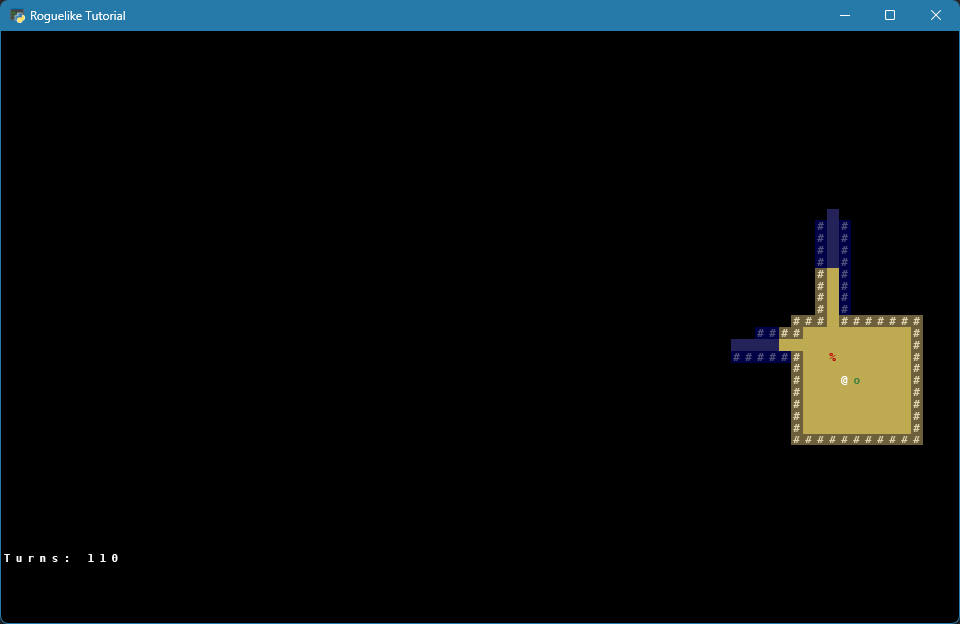
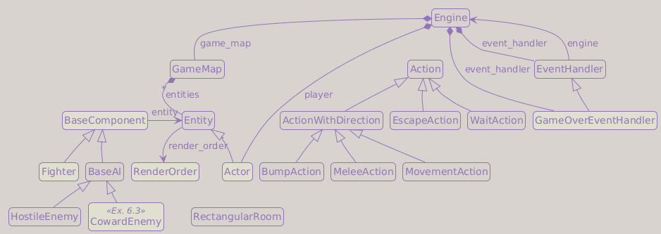

# Part 6: Combat

## What You Will Build

By the end of this part, the player and enemies will have hit points, deal melee damage, die when reduced to zero HP, and leave corpses behind in the dungeon.

## Learning goals

- Add a `Fighter` component that owns HP, defense, and attack
- Introduce the `Actor` class as an entity that can fight and can have AI
- Calculate damage and print combat messages
- Handle death: change appearance, remove blocking, disable AI
- Add proper A* pathfinding so enemies navigate around obstacles
- Lock input after the player dies

---

## Why HP lives in a component

We could add `hp`, `defense`, and `attack` directly to `Entity`. But then every entity (items, doors, corpses, stairs) would carry fields they never use.

Components keep combat data separate from the base `Entity`. In this part, entities that can fight become `Actor` instances, and each `Actor` owns a `Fighter` component. Items, doors, and other passive entities stay as plain `Entity` objects without combat data.

!!! info "Design decision: Fighter component + Actor subclass"
    This is composition-over-inheritance applied where it pays off. The alternative is an `Actor` base class with HP and a separate `Item` hierarchy with its own data: two parallel trees that grow apart over time. We keep one `Entity` base, introduce `Actor` only as the small specialization that bundles the components needed to fight, and let new systems (a `Poisoned` status, a `Trader` component) be added by writing a component class instead of editing the hierarchy.

    At a larger scale than this tutorial, many engines drop the entity class hierarchy entirely and switch to an entity-component-system (ECS) library such as [tcod-ecs](https://github.com/HexDecimal/python-tcod-ecs), where an entity is only an ID and every capability, including position and HP, is a component. That trade pays off once a project has far more entity types and cross-cutting systems than we do here; for this tutorial's scope, `Entity`/`Actor` plus components is the simpler choice.

!!! info "Pattern: Component"
    `Fighter` and `AI` are *components*: interchangeable behaviors attached to entities at construction time. The entity does not inherit capabilities; it delegates to them. This keeps the base `Entity` small and lets new systems be added as new component classes without touching the entity hierarchy. `Inventory` joins this same pattern in Part 8.

    → [Game Programming Patterns: Component](https://gameprogrammingpatterns.com/component.html)

---

## Reorganizing into `game/entities/`

Before we dive into components, we give entity-related modules a dedicated home. As the entity system grows with base classes, render ordering, components, and factories, keeping them together makes the project easier to navigate.

From this part on, everything that defines what entities *are* lives under `game/entities/`:

```text
game/entities/
├── entity.py          ← was game/entity.py
├── render_order.py    ← new this part
├── factories.py       ← was game/entity_factories.py
└── components/
    ├── base_component.py ← new this part
    ├── ai.py
    └── fighter.py        ← new this part
```

Move `game/entity.py` to `game/entities/entity.py` and `game/entity_factories.py` to `game/entities/factories.py` (the `entity_` prefix is redundant inside `entities/`). The `game/components/` folder also moves to `game/entities/components/`. Create empty `__init__.py` files in both new folders so Python treats them as packages:

```text
game/entities/__init__.py
game/entities/components/__init__.py
```

All code blocks in this part already use the new paths. `main.py`, `map_generator.py`, and `engine.py`'s import line are not otherwise touched in this part, so we fix them right now; every other file that still imports `game.entity`, `game.entity_factories`, or `game.components` (`actions.py`, `game_map.py`, and `entity.py`'s own internal import) gets its import line fixed as we reach it below.

Update `main.py`:

```diff
-from game import entity_factories
 from game.engine import Engine
+from game.entities import factories
 from game.map.map_generator import generate_dungeon
 ...
-    player = copy.deepcopy(entity_factories.player)
+    player = copy.deepcopy(factories.player)
```

Update the imports at the top of `game/map/map_generator.py`:

```diff
-from game import entity_factories
-from game.entity import Entity
+from game.entities import factories
+from game.entities.entity import Entity
 from game.map import tile_types
```

`entity_factories` renamed to `factories` too, so update every call site in `place_entities`:

```diff
         if not any(entity.x == x and entity.y == y for entity in dungeon.entities):
             if rng.random() < 0.8:  # 80% chance of troll
-                entity_factories.troll.spawn(dungeon, x, y)
+                factories.troll.spawn(dungeon, x, y)

             else:
-                entity_factories.orc.spawn(dungeon, x, y)
+                factories.orc.spawn(dungeon, x, y)
```

!!! tip "If you completed the Part 5 exercises"
    Rename `entity_factories` to `factories` in that code too, wherever you spawn from the weighted table (Exercise 2) or the chest template (Exercise 3).

`game/engine.py` also imports `Entity` at the top level (not inside `TYPE_CHECKING`, so it runs every time the game starts). Fix its path now too, even though the rest of that file is not touched until later in this part:

```diff
-from game.entity import Entity
+from game.entities.entity import Entity
```

!!! tip "Run it now"
    If you run the game at this point, you can check that nothing has changed: same dungeon, same player and enemies, same combat-free bumping into orcs and trolls as at the end of Part 5. That is exactly what success looks like here. So far this part was a *refactor*: it moved files and fixed the imports that pointed at them, without changing what the code does.

    If you get a `ModuleNotFoundError` instead, it is almost certainly a leftover `game.entity`, `game.entity_factories`, or `game.components` import somewhere outside the three files above; the traceback tells you exactly which file and line to fix.

---

## BaseComponent

Create `game/entities/components/base_component.py`:

```python
from __future__ import annotations

from typing import TYPE_CHECKING

if TYPE_CHECKING:
    from game.entities.entity import Entity


class BaseComponent:
    entity: Entity  # set by the owning Entity after creation
```

This is a lightweight base class. Its only purpose is to give type checkers a common parent for components and to document the `entity` back-reference that every component will have set on it.

---

## Updating BaseAI

In Part 5, `BaseAI` was a plain class. Now that AI is a component with an owner, make it inherit from `BaseComponent` before we wire it into `Actor`.

Update `game/entities/components/ai.py`:

```diff
 from typing import TYPE_CHECKING

 from game.actions import BumpAction
+from game.entities.components.base_component import BaseComponent

 if TYPE_CHECKING:
     from game.engine import Engine
-    from game.entity import Entity
+    from game.entities.entity import Entity


-class BaseAI:
+class BaseAI(BaseComponent):

     def perform(self, engine: Engine, entity: Entity) -> None:
         raise NotImplementedError()
```

From this point on, AI follows the same component convention as `Fighter`: the owning actor will set the component's `entity` back-reference when it is assembled. That keeps component code independent from how entities are stored in the map.

---

## Adding corpse constants

Dead enemies will turn into a `%` glyph in dark red. Following our convention from Part 5, add those values to the data package.

Extend `game/data/sprites.py` in the entity sprites section:

```diff
 PLAYER  = "@"
 ORC     = "o"
 TROLL   = "T"
+
+CORPSE  = "%"
```

Extend `game/data/colors.py` in the entity colors section:

```diff
 PLAYER             = Color(255, 255, 255)
 ORC                = Color( 63, 127,  63)
 TROLL              = Color(  0, 127,   0)
+
+CORPSE             = Color(191,   0,   0)
```

If you completed the chest exercise in Part 5 and already added `CHEST` sprite/color lines, keep them. We are only adding the corpse values here.

---

## Render order

When multiple entities occupy the same tile (e.g. a corpse and a live enemy), we need to control which one appears on top.

Create `game/entities/render_order.py`:

```python
from __future__ import annotations

from enum import Enum, auto


class RenderOrder(Enum):
    CORPSE  = auto()
    ITEM    = auto()
    ACTOR   = auto()
    UNKNOWN = auto()
```

Higher enum values render last (on top). `ACTOR` > `ITEM` > `CORPSE`, so living entities always appear above items and corpses on the same tile. `UNKNOWN` renders last of all: it is the default for plain entities that have not been assigned a specific category yet, making them visible instead of accidentally hiding them.

---

## Adding render_order to Entity

Before we introduce combat entities, every entity needs to know where it belongs in the draw stack. A chest, corpse, item, actor, or future staircase may all share a tile, so render order is a general `Entity` concern, not just an `Actor` concern.

Update `game/entities/entity.py`:

```diff
 from game.data import colors, sprites
+from game.entities.render_order import RenderOrder

 if TYPE_CHECKING:
-    from game.components.ai import BaseAI
+    from game.entities.components.ai import BaseAI
     from game.map.game_map import GameMap


 class Entity:

     def __init__(
         self,
         x: int                    = 0,
         y: int                    = 0,
         char: str                 = sprites.UNKNOWN,
         color: Color              = colors.DEFAULT_FG,
         name: str                 = "<unnamed>",
         blocks_movement: bool     = False,
         stays_visible: bool       = False,
+        render_order: RenderOrder = RenderOrder.UNKNOWN,
         ai: BaseAI | None         = None,
     ) -> None:
         self.x               = x
         self.y               = y
         self.char            = char
         self.color           = color
         self.name            = name
         self.blocks_movement = blocks_movement
         self.stays_visible   = stays_visible
+        self.render_order    = render_order
         self.ai              = ai
```

The default value for render_order is `UNKNOWN` because plain `Entity` objects have not declared what kind of thing they are yet. Rendering them last is a useful debugging default: if you forgot to assign a more specific order, the entity stays visible instead of being hidden under actors or corpses. Specialized classes and factories should still pass a deliberate render order when they know one.

---

## The Fighter component

Create `game/entities/components/fighter.py`:

```python
from __future__ import annotations

from game.data import colors, sprites
from game.entities.components.base_component import BaseComponent
from game.entities.render_order import RenderOrder


class Fighter(BaseComponent):

    def __init__(self, hp: int, defense: float, attack: float) -> None:
        self.max_hp       = hp
        self._hp: float   = float(hp)
        self.defense      = float(defense)
        self.attack       = float(attack)

    @property
    def hp(self) -> float:
        return self._hp

    @hp.setter
    def hp(self, value: float) -> None:
        self._hp = max(0.0, min(value, float(self.max_hp)))
        if self._hp == 0:
            self.die()

    def die(self) -> None:
        # Differentiate the message: the player gets a second-person line, enemies the third-person one
        if self.entity.ai:
            death_message = f"The {self.entity.name} is dead!"
        else:
            death_message = "You died!"
        print(death_message)

        self.entity.char            = sprites.CORPSE
        self.entity.color           = colors.CORPSE
        self.entity.blocks_movement = False
        self.entity.ai              = None
        self.entity.name            = f"remains of {self.entity.name}"
        self.entity.render_order    = RenderOrder.CORPSE
```

!!! question "What does `@hp.setter` do?"
    `@property` lets us read `fighter.hp` like a normal attribute even though it calls the `hp()` method. `@hp.setter` defines what happens when code assigns to that same property, like `fighter.hp -= damage`. The setter clamps the value between `0` and `max_hp`, stores it in the private backing field `_hp`, and triggers `die()` when HP reaches zero. We use `_hp` inside the setter because assigning to `self.hp` there would call the setter again forever.

    A setter that triggers `die()` is a hidden side effect: assigning to `fighter.hp` silently transforms the entity, kills it, and prints a message, none of which is visible at the call site.

    Some teams ban this on principle and require an explicit call instead, like `take_damage()` or `apply_death()`. We accept the hidden trigger here because it makes the invariant "HP 0 means dead" impossible to bypass: every code path that drains HP, present or future, gets death handling for free. Part 7 adds the explicit verb anyway, `take_damage()`, so call sites read clearly while the setter still guarantees the invariant underneath.

With that in place, combat code can reduce HP directly and let the component handle the consequences.

!!! info "Player and enemies share the same death path"
    `die()` runs for both the player and enemies: same visual change (a red `%`), same name update, same render order. The only difference is the message (`"You died!"` vs `"The Orc is dead!"`), which we pick by checking `self.entity.ai`: the player has no AI, enemies do. In Part 7 this becomes `self.entity.ai is None`, the same idea spelled out explicitly, and each branch gets its own message color. If you ever add a player-controlling AI (a "possession" scroll, an autopilot mode), this check stops working and needs to identify the player some other way.

---

## The Actor class

Entities that fight (player, enemies) share a common profile: they have a `Fighter` component, an optional `AI` component, and they block movement by default. We give this combination a name.

Now add `Actor` below `Entity` in `game/entities/entity.py`:

```diff
 if TYPE_CHECKING:
     from game.entities.components.ai import BaseAI
+    from game.entities.components.fighter import Fighter
     from game.map.game_map import GameMap


+class Actor(Entity):
+    """An entity that can fight: has a Fighter component and optional AI."""
+
+    def __init__(
+        self,
+        *,
+        x: int            = 0,
+        y: int            = 0,
+        char: str         = sprites.UNKNOWN,
+        color: Color      = colors.DEFAULT_FG,
+        name: str         = "<unnamed>",
+        ai: BaseAI | None = None,
+        fighter: Fighter,
+    ) -> None:
+        super().__init__(
+            x               = x,
+            y               = y,
+            char            = char,
+            color           = color,
+            name            = name,
+            blocks_movement = True,
+            render_order    = RenderOrder.ACTOR,
+            ai              = ai,
+        )
+        self.fighter = fighter
+        self.fighter.entity = self
+
+        if self.ai:
+            self.ai.entity = self
+
+    @property
+    def is_alive(self) -> bool:
+        return self.fighter.hp > 0
```

!!! question "Why the `*` in `Actor.__init__`?"
    The `*` forces all following arguments to be keyword-only. This prevents accidental calls like `Actor("@", (255,255,255), ...)`, which would be hard to read and easy to get wrong.

We wire both back-references the same way: `self.fighter.entity = self` and `self.ai.entity = self` (when present). Every component reaches its owner via `self.entity`, the convention `BaseComponent` declared.

!!! question "Does `deepcopy` handle those back-references?"
    Yes. `copy.deepcopy` keeps a memo of objects it has already copied. When it clones an `Actor`, then sees `fighter.entity` or `ai.entity` pointing back to that same actor, it links the copied component back to the copied actor, not to the original template. That is what lets our entity factories stay as reusable prototypes.

---

## Updating `entities/factories.py`

`player`, `orc`, and `troll` become `Actor` instances with a `Fighter` component. Update `game/entities/factories.py`:

```diff
 from __future__ import annotations

-from game.components.ai import HostileEnemy
 from game.data import colors, sprites
-from game.entity import Entity
+from game.entities.components.ai import HostileEnemy
+from game.entities.components.fighter import Fighter
+from game.entities.entity import Actor

-player = Entity(
+player = Actor(
     char            = sprites.PLAYER,
     color           = colors.PLAYER,
     name            = "Player",
-    blocks_movement = True,
+    ai              = None,  # player is controlled by the keyboard
+    fighter         = Fighter(hp=30, defense=2, attack=5),
 )

-orc = Entity(
+orc = Actor(
     char            = sprites.ORC,
     color           = colors.ORC,
     name            = "Orc",
-    blocks_movement = True,
     ai              = HostileEnemy(),
+    fighter         = Fighter(hp=18, defense=1, attack=4),
 )

-troll = Entity(
+troll = Actor(
     char            = sprites.TROLL,
     color           = colors.TROLL,
     name            = "Troll",
-    blocks_movement = True,
     ai              = HostileEnemy(),
+    fighter         = Fighter(hp=12, defense=0, attack=3),
 )
```

Orcs are harder to kill (more HP, some defense) and hit harder than trolls, yet the troll is the common spawn (80% in Part 5's `place_entities`). That is deliberate, not a mismatch: the troll is the weak enemy you meet constantly, and its real trick, fleeing at low HP and regenerating, arrives in the exercises below and gets a full role in Part 12. These starting numbers are deliberately simple so we can verify the combat system works; Part 12 rebalances them alongside the procedural difficulty tables.

`blocks_movement=True` disappeared from `player`, `orc`, and `troll` because `Actor.__init__` now passes it to `Entity` internally. Anything that can fight blocks movement by default.

!!! tip "If you completed the Part 5 exercises"
    Keep whichever exercise blocks you added, but update them to use the new actor templates. If you kept the chest, first extend the imports:

    ```diff
    -from game.entities.entity import Actor
    +from game.entities.entity import Actor, Entity
    +from game.entities.render_order import RenderOrder
    ```

    Then keep these blocks below `troll`:

    ```python
    # Part-5. Exercise 2: Weighted monster table
    monster_chances = [
        (orc,   25),
        (troll, 75),
    ]

    # Part-5. Exercise 3: Passive blocking entity
    chest = Entity(
        char            = sprites.CHEST,
        color           = colors.CHEST,
        name            = "Chest",
        blocks_movement = True,
        render_order    = RenderOrder.ITEM,
    )
    ```

    `monster_chances` still works because it stores templates, and those templates are now `Actor` objects instead of plain `Entity` objects. The chest stays a plain `Entity`: it blocks movement, has no AI, and uses `RenderOrder.ITEM` because it is a passive object, not an actor or a corpse. The `min_monsters_per_room` exercise lives in `main.py` and `map_generator.py`, so this file does not need to change it.

---

## MeleeAction does real damage

The combat formula belongs in `Fighter`, not in `MeleeAction`. The action resolves *who* is fighting; the component resolves *how much damage and what happens*. This also sets us up for `ranged_attack` later: any damage path goes through `Fighter` without touching the action layer.

Add a TYPE_CHECKING import for `Actor` to `game/entities/components/fighter.py` and add the `melee_attack` method:

```diff
 from __future__ import annotations
+
+from typing import TYPE_CHECKING

 from game.entities.components.base_component import BaseComponent
 from game.data import colors, sprites
 from game.entities.render_order import RenderOrder
+
+if TYPE_CHECKING:
+    from game.entities.entity import Actor
```

The obvious formula here is `attack - defense`: subtract one stat from the other. It reads well, but it has a structural flaw. The moment `defense` reaches `attack`, every hit deals exactly `0`, permanently, no matter how the fight got there. A troll with `attack = 3` facing a player whose `defense` has grown to `3` or more, from armor added in a later part, cannot hurt that player at all anymore: not weakened, not risky, just harmless. Subtraction has a floor, and once a matchup lands on it, that matchup is over for the rest of the game.

`melee_attack` uses a formula where defense reduces damage as a ratio of the attacker's own power instead of a flat amount subtracted from it:

```python
    def melee_attack(self, target: Actor) -> None:
        damage = (self.attack * self.attack) / (self.attack + target.fighter.defense)
        attack_msg = f"{self.entity.name.capitalize()} attacks {target.name}"

        print(f"{attack_msg} for {damage:.1f} hit points.")
        target.fighter.hp -= damage
```

`self.entity` is the attacker (`BaseComponent` always knows its owner). `die()` still triggers automatically through the `hp` setter when HP reaches zero.

Unlike `attack - defense`, this formula never reaches exactly `0` as long as `attack > 0`: `defense` can only shrink the result toward zero, it can never cross it. That is also why `melee_attack` no longer branches on `damage > 0`: there is no "no damage" case left to report, only larger or smaller hits.

The idea: instead of asking "how much defense do you have", it asks "how much defense do you have *relative to what is hitting you*". A `defense` of `2` barely matters against an attacker with `attack = 20`, but meaningfully softens a hit from an attacker with `attack = 3`. Defense still matters, it just never becomes an absolute wall.

At this chapter's numbers, the two formulas mostly agree, but the trend already shows:

| Matchup | Linear (`attack - defense`) | New (`attack² / (attack + defense)`) |
| --- | ---: | ---: |
| Player → Orc | `5 - 1 = 4` | `25 / 6 ≈ 4.2` |
| Player → Troll | `5 - 0 = 5` | `25 / 5 = 5.0` |
| Orc → Player | `4 - 2 = 2` | `16 / 6 ≈ 2.7` |
| Troll → Player | `3 - 2 = 1` | `9 / 5 = 1.8` |

If you want the full comparison (a third, simpler-to-tune variant, plus rounding rules, minimum damage, critical hits, and more), see [Appendix 1: Damage Formulas](append-1.md).

`MeleeAction` now only resolves who is fighting and delegates. It needs the `Actor` class to check that both sides can fight, so import it at the top of `game/actions.py`:

```diff
 from abc import ABC, abstractmethod
 from typing import TYPE_CHECKING

+from game.entities.entity import Actor

 if TYPE_CHECKING:
     from game.engine import Engine
-    from game.entity import Entity
+    from game.entities.entity import Entity
```

Then rewrite `MeleeAction`:

```python
class MeleeAction(ActionWithDirection):

    def perform(self, engine: Engine, entity: Entity) -> None:
        dest_x = entity.x + self.dx
        dest_y = entity.y + self.dy
        target = engine.game_map.get_blocking_entity_at(dest_x, dest_y)

        if not target:
            return

        if not isinstance(entity, Actor) or not isinstance(target, Actor):
            return  # Both attacker and defender must be Actors to fight

        entity.fighter.melee_attack(target)
```

We check `isinstance` for **both** sides. In practice today only `Actor` instances can fight, so bumping into a blocking-but-not-fighting entity (a chest, a door) does nothing instead of crashing. If you kept the Part 5 chest exercise, this changes its behavior: the chest still blocks movement, but it no longer triggers a melee attack because it is not combat-capable. Later, those entities can get their own interaction action.

!!! tip "Run it now"
    This is a good moment to run the game. Combat already works: bumping into an enemy deals real damage (watch the messages in the terminal) and an enemy reduced to 0 HP turns into a red `%`. The enemies still chase you in a greedy straight line and get stuck on corners; proper A* pathfinding is coming up next.

---

## GameMap: the actors property

Before adding the pathfinding, `GameMap` needs to expose which tiles are taken by living actors, so the pathfinder can route around them. Add an `actors` property that yields every living `Actor`.

Update `game/map/game_map.py`:

```diff
-from collections.abc import Iterable
+from collections.abc import Iterable, Iterator

+from game.entities.entity import Actor
 from game.map import tile_types

 if TYPE_CHECKING:
-    from game.entity import Entity
+    from game.entities.entity import Entity


 class GameMap:
     ...

+    @property
+    def actors(self) -> Iterator[Actor]:
+        yield from (
+            entity for entity in self.entities
+            if isinstance(entity, Actor) and entity.is_alive
+        )
```

`actors` filters `self.entities` down to the `Actor` instances that are still alive (`is_alive` comes from the `Actor` class). The AI uses it next for pathfinding, and the engine uses it right away for enemy turns.

Wire it into `Engine` now, so `handle_enemy_turns` iterates the same `Actor` instances that the pathfinding coming up next expects, instead of the raw `entities` set:

```diff
-from game.entity import Entity
+from game.entities.entity import Actor
 from game.input_handlers import EventHandler
 from game.map.game_map import GameMap


 class Engine:

     def __init__(
         self,
         game_map: GameMap,
-        player: Entity,
+        player: Actor,
     ) -> None:
         ...

     def handle_enemy_turns(self) -> None:
-        for entity in set(self.game_map.entities) - {self.player}:
-            if entity.ai:
-                entity.ai.perform(self, entity)
+        for actor in set(self.game_map.actors) - {self.player}:
+            if actor.ai:
+                actor.ai.perform(self, actor)
```

If you completed the variable torch radius or fading memory exercises in Part 4, keep the `fov_radius`, `fading_memory`, and `memory_duration` parameters and their assignments in `Engine.__init__()`. This diff only changes the player type and the enemy turn loop.

---

## Proper pathfinding for enemies

The Part 5 AI moved enemies in a straight line, causing them to get stuck on corners. Replace the movement in `game/entities/components/ai.py` with A* pathfinding:

!!! info "`BaseAI` uses the same component convention as `Fighter`"
    We already made `BaseAI` inherit from `BaseComponent` earlier in this chapter. In this version, the `perform` signature also tightens its type hint from `Entity` to `Actor`, since by definition only actors carry AI.

```python
from __future__ import annotations

from typing import TYPE_CHECKING

import numpy as np
import tcod

from game.actions import BumpAction
from game.entities.components.base_component import BaseComponent

if TYPE_CHECKING:
    from game.engine import Engine
    from game.entities.entity import Actor


class BaseAI(BaseComponent):

    def perform(self, engine: Engine, entity: Actor) -> None:
        raise NotImplementedError()

    def get_path_to(
        self,
        engine: Engine,
        entity: Actor,
        dest_x: int,
        dest_y: int,
    ) -> list[tuple[int, int]]:
        """Compute an A* path from entity to (dest_x, dest_y)."""
        cost = np.array(engine.game_map.tiles["walkable"], dtype=np.int8)

        # Increase cost of tiles occupied by other entities so the pathfinder
        # routes around them rather than through them
        for other in engine.game_map.actors:
            if other is not entity and cost[other.x, other.y]:
                cost[other.x, other.y] += 10

        graph = tcod.path.SimpleGraph(cost=cost, cardinal=2, diagonal=3)
        pathfinder = tcod.path.Pathfinder(graph)
        pathfinder.add_root((entity.x, entity.y))

        # [1:] drops the starting position (current tile)
        path: list[list[int]] = pathfinder.path_to((dest_x, dest_y))[1:].tolist()

        # pylint: disable=unnecessary-comprehension
        return [(x, y) for x, y in path]
```

Adding `10` to the cost of an occupied tile is high enough that the pathfinder prefers to route around another entity, yet it still passes through when there is truly no other way. `tcod.path.SimpleGraph` creates a weighted graph from the cost array. Cardinal moves cost 2, diagonal moves cost 3 (this approximates real distance without floating point). `pathfinder.path_to` returns the full path including the start; we drop the first element (`[1:]`) since that is the entity's current position. If the entity is already standing on the destination, that leaves an empty list and the caller simply does nothing.

If you run `pylint`, it flags the final line as `unnecessary-comprehension`, assuming `[(x, y) for x, y in path]` is just a roundabout copy of `path` you could replace with `list(path)`. That is a false positive: `path` holds `list[int]` pairs, and the comprehension turns each pair into a `tuple[int, int]`, which is what the return type promises. `list(path)` would keep the inner lists instead, silently breaking that contract. The `# pylint: disable` comment silences the check on this one line rather than leaving you hunting for a "fix" that would make the code worse.

`HostileEnemy` puts `get_path_to` to work, falling back to it only when the player is not already adjacent:

```python
class HostileEnemy(BaseAI):

    def perform(self, engine: Engine, entity: Actor) -> None:
        if not engine.game_map.visible[entity.x, entity.y]:
            return  # Out of player FOV; cannot act

        target = engine.player
        dx = target.x - entity.x
        dy = target.y - entity.y
        distance = max(abs(dx), abs(dy))

        if distance <= 1:
            BumpAction(dx, dy).perform(engine, entity)
            return

        path = self.get_path_to(engine, entity, target.x, target.y)
        if path:
            dest_x, dest_y = path[0]
            BumpAction(
                dx = dest_x - entity.x,
                dy = dest_y - entity.y,
            ).perform(engine, entity)
```

!!! note "Enemies forget you the instant you leave their sight"
    The opening `if not engine.game_map.visible[entity.x, entity.y]: return` means a monster freezes the moment it loses sight of you, even if it was chasing you a tile ago. This keeps the AI as simple as it can be while you learn the pattern, but it is not very convincing: something that just watched you round a corner should at least walk to where you were. Part 12 fixes this in its Exercise 4, *Monsters that remember*, by giving each enemy a `last_known_position` to head toward. That one change also turns breaking line of sight into a tactic, letting you lure monsters out of a room you would rather not fight in.

---

## GameMap: actor lookup and sorted rendering

Two more changes to `GameMap`. First, a small location lookup that later targeting code will use. Second, rendering should draw entities with a higher `render_order` last, so they appear on top.

`get_actor_at` and the `actors` property both scan every entity on the floor. A linear scan is fine at this scale (dozens of entities); if your game grows to hundreds of entities per floor, the standard fix is a position-keyed dict or spatial grid kept in sync on every move.

Update `game/map/game_map.py`:

```diff
+    def get_actor_at(self, x: int, y: int) -> Actor | None:
+        for actor in self.actors:
+            if actor.x == x and actor.y == y:
+                return actor
+
+        return None

     def render(self, console: Console) -> None:
         console.rgb[0 : self.width, 0 : self.height] = np.select(
             condlist   = [self.visible, self.explored],
             choicelist = [self.tiles["in_fov"], self.tiles["out_of_fov"]],
             default    = tile_types.UNSEEN,
         )

-        for entity in self.entities:
-            if self.visible[entity.x, entity.y]:
+        for entity in sorted(self.entities, key=lambda e: e.render_order.value):
+            stays_visible = entity.stays_visible and self.explored[entity.x, entity.y]
+            if self.visible[entity.x, entity.y] or stays_visible:
                 console.print(entity.x, entity.y, entity.char, fg=entity.color)
```

Sorting by `render_order.value` ensures corpses (`CORPSE=1`) render before items (`ITEM=2`), items render before living actors (`ACTOR=3`), and uncategorized entities (`UNKNOWN=4`) render on top of all. If an orc dies on the same tile as another orc, the living orc appears on top; if an entity accidentally keeps the default `UNKNOWN`, it remains visible so the mistake is easy to spot.

!!! note "If you skipped Part 4 Exercise 3 (`stays_visible`)"
    The render loop now includes `stays_visible` handling in the main path. The `stays_visible` field has been part of `Entity` since Part 5, so this compiles for everyone; if you never set `stays_visible=True` on an entity, the flag stays `False` and the extra check simply has no effect.

---

## Player death

When the player's HP hits zero, `Fighter.die()` already runs: the player turns into a red `%` and the message `"You died!"` is printed. What we still need is to **stop accepting movement input** so the player cannot keep walking around as a corpse.

!!! note "A very short-lived haunting"
    Without this fix, dying does not actually stop you: `blocks_movement=False` lets your corpse walk anywhere, and nothing in `MeleeAction` checks `is_alive`, so a dead player can still attack. If your corpse finishes off the very enemy that killed you, its corpse also stops blocking, and since both corpses share `render_order.CORPSE`, they can land on the same tile with only one `%` drawn (which one wins is not guaranteed, since `entities` is a `set`). For one confusing turn, it looks like you are dragging the body of whoever killed you around the dungeon.

Update `game/input_handlers.py`. `EventHandler` stays exactly as it is; we only add a `GameOverEventHandler` subclass below it that ignores every key except `Escape`:

```python
class GameOverEventHandler(EventHandler):
    """Handles input after the player has died."""

    def event_keydown(self, event: tcod.event.KeyDown) -> Action | None:
        if event.sym == keys.KEY_QUIT_GAME:
            return EscapeAction()

        return None  # All other keys are ignored
```

Now update `Engine` to swap the event handler after each turn if the player is no longer alive:

```diff
-from game.input_handlers import EventHandler
+from game.input_handlers import EventHandler, GameOverEventHandler

 class Engine:
     ...

     def handle_events(self, events: Iterable[Any]) -> None:
         for event in events:
             action = self.event_handler.dispatch(event)
             if action is None:
                 continue
             action.perform(self, self.player)
             self.handle_enemy_turns()
             self.update_fov()  # recompute after every action
+
+            if not self.player.is_alive:
+                self.event_handler = GameOverEventHandler()
```

We check `is_alive` **after** `handle_enemy_turns`, so a player killed by an enemy on its turn is detected before the next event is processed. After this point, only `Escape` is accepted. The player is stuck looking at their remains.

---

## Testing your work

Run `python main.py`:

- [ ] Walking into an orc prints: `"Player attacks Orc for 4.2 hit points."`
- [ ] Orcs attack back when adjacent: `"Orc attacks Player for 2.7 hit points."`
- [ ] When an enemy's HP reaches zero, it prints `"The Orc is dead!"` and its tile changes to a red `%`
- [ ] Dead enemies no longer block movement: you can walk through corpses
- [ ] Enemies navigate around corners and other entities (A* pathfinding)
- [ ] When the player's HP reaches zero, `"You died!"` appears, the `@` becomes a red `%`, and movement stops
- [ ] Corpses (`%`) render under living actors when on the same tile
- [ ] If you kept the chest exercise, walking into a chest blocks movement but does not print a combat message

!!! info "Player HP is not displayed yet"
    There is no health bar. You can track player HP by adding `print(f"HP: {engine.player.fighter.hp}")` temporarily in `handle_events`. Part 7 adds the full UI.



---

## Summary

Combat is now fully functional. Key additions:

- **Fighter component**: owns HP, defense, attack, and triggers death at 0 HP
- **Actor**: an `Entity` subclass that always has a Fighter and optionally AI
- **Damage formula**: `attack² / (attack + defense)`, scales with the attacker so defense never blocks a hit outright
- **A* pathfinding**: enemies route around obstacles via `tcod.path`
- **RenderOrder**: enum that controls draw order on shared tiles
- **GameOverEventHandler**: locks input after player death

**Current architecture**:

- `Actor`: specialized entity for anything alive and combat-capable
- `Fighter`: component that owns combat stats and death behavior
- `BaseComponent`: shared base for components with an entity back-reference
- `BaseAI` / `HostileEnemy`: enemy behavior with pathfinding
- `RenderOrder`: controls entity draw order
- `GameOverEventHandler`: replaces normal input after player death

**Class Diagram**:



**File structure**:

```text
main.py                               ← modified
game/
├── __init__.py
├── actions.py                  ← modified
├── engine.py                   ← modified
├── input_handlers.py           ← modified
├── data/
│   ├── __init__.py
│   ├── colors.py               ← modified
│   ├── keys.py
│   └── sprites.py              ← modified
├── entities/
│   ├── __init__.py             ← new
│   ├── entity.py               ← moved (game/entity.py), modified
│   ├── factories.py            ← moved (game/entity_factories.py), modified
│   ├── render_order.py         ← new
│   └── components/
│       ├── __init__.py         ← new
│       ├── ai.py               ← moved (game/components/ai.py), modified
│       ├── base_component.py   ← new
│       └── fighter.py          ← new
└── map/
    ├── __init__.py
    ├── game_map.py             ← modified
    ├── tile_types.py
    └── map_generator.py        ← modified
```

---

## Exercises

1. **Feedback for non-combat blockers**:

    If you kept the chest exercise from Part 5, bumping into the chest now blocks movement but prints nothing, because the chest is an `Entity`, not an `Actor`. Update `MeleeAction.perform()` so that when the player bumps into a blocking non-actor, it prints something like `"The Chest blocks your way."` instead of silently doing nothing.

2. **Combat effect: critical hits**:

    [Appendix 2](append-2.md) discusses combat effects in more detail. Add the simplest version of one of those effects now: a critical hit.

    Add `critical_chance: float = 0.1` and `critical_multiplier: float = 2.0` parameters to `Fighter.__init__()`, store them on the component, and update `melee_attack()` so it calculates `base_damage` first:

    ```python
    base_damage = (self.attack * self.attack) / (self.attack + target.fighter.defense)

    if random() < self.critical_chance:
        damage = base_damage * self.critical_multiplier

    else:
        damage = base_damage
    ```

    You will want a small `critical_hit` bool alongside `damage`: once the calculation is done, the number alone no longer tells you whether it was a crit. Import the function with `from random import random`, and print `"critical hit!"` whenever the crit triggers. `base_damage` is never `0` with this formula, so unlike a subtraction-based formula there is no absorbed-crit edge case to special-case.

3. **Flee behavior**:

    Add a `CowardEnemy` AI class that moves *away* from the player. Then make fleeing a per-creature property rather than hardcoded logic:

    - Add a `flee_threshold: float = 0.0` parameter to `Fighter.__init__`. A value of `0.0` means the creature never flees; `0.25` means it flees when HP drops below 25 % of max.
    - Add a `should_flee() -> bool` method to `Fighter` that returns `True` when the threshold is exceeded.
    - In `HostileEnemy.perform()`, after the FOV check (the enemy can only decide to flee if it can see the player), call `entity.fighter.should_flee()`. If it returns `True`, create a `CowardEnemy`, assign it as the entity's AI, print a flee message, and let it act immediately this turn.
    - In factories, give the troll `flee_threshold=0.3`. Orcs are brave and never flee (default `flee_threshold=0.0`). The troll's early retreat will pay off later when you add regeneration.

    Observe how orcs and trolls behave differently at low HP.
