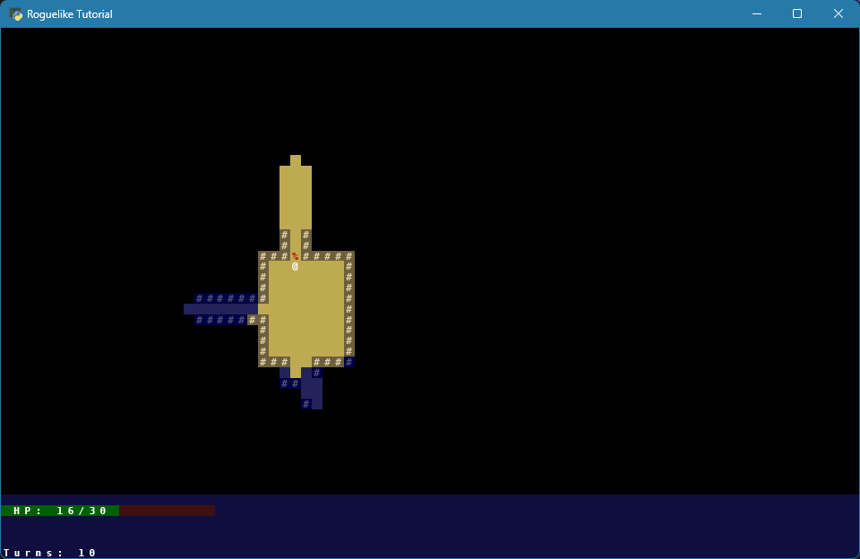
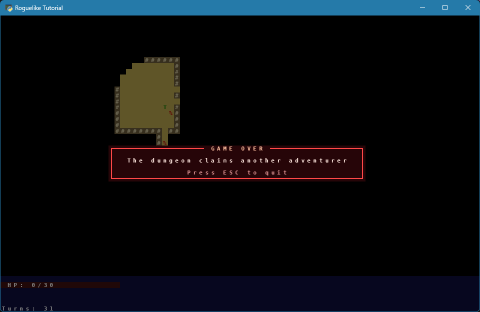
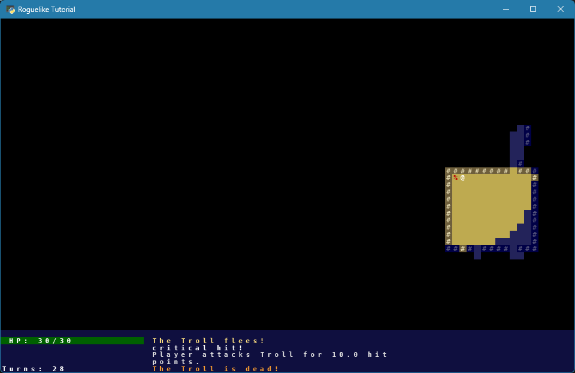
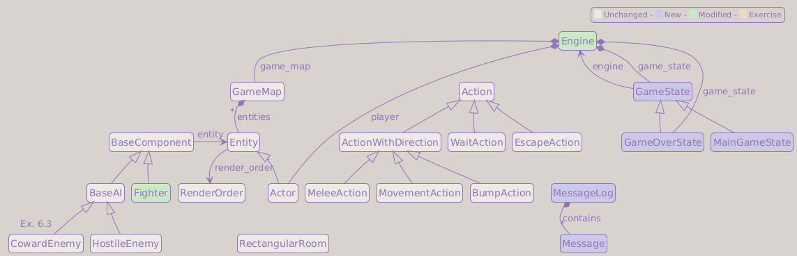

# Part 7: The User Interface

## What You Will Build

By the end of this part, your game will have a health bar, a message log, and a look cursor that lets the player inspect the map. For the first time, the game will communicate with the player through the screen rather than the terminal.

## Learning goals

- Divide the screen into a map area and a UI panel
- Add a health bar that updates in real time
- Introduce a message log that replaces `print()` calls
- Show entity names under the mouse cursor
- Refactor game states so each one owns its rendering logic

---

## What information does a player need?

A roguelike UI has one design constraint: every piece of information the player needs to make a decision must be visible *without* leaving the main screen. That means:

- **Health**: how close am I to death?
- **Recent events**: what just happened? (especially damage numbers)
- **Context**: what is this tile or entity I'm hovering over?

For now, this tutorial dedicates 44 rows to the map and 6 rows to a UI panel at the bottom. Row 44 belongs to the panel: it shows entity names under the mouse cursor, while the remaining rows hold the health bar and a short message history. Later, you can decide where to place the panel and which size makes the most sense for each part of your UI.

```text
┌──────────────────────────────────────────────────────────────────────────────┐
│                                                                              │
│                           MAP AREA  (80 × 44)                                │
│                                                                              │
├──────────────────────────────────────────────────────────────────────────────┤
│ HP: ████████░░  14/30    You attack the Orc for 3 hit points.                │
│                          The Orc attacks you for 2 hit points.               │
│ Turns: 56                The Troll is dead!                                  │
└──────────────────────────────────────────────────────────────────────────────┘
```

---

## Extending `game/data/colors.py` with UI colors

`game/data/colors.py` already holds entity colors (`PLAYER`, `ORC`, `TROLL`, `CORPSE` from Parts 5 and 6). The UI we are about to build needs more constants: combat message colors, the welcome banner, and the health bar's filled and empty states.

Add these lines to the file. `DEFAULT_FG` and the existing entity and map colors stay exactly where they are; the block below only adds new constants, split into their own sections:

```python
# Generic colors
...
WHITE               = Color(255, 255, 255)
BLACK               = Color(  0,   0,   0)

... (at the end)

# Combat message colors
PLAYER_ATTACK       = Color(224, 224, 224)
ENEMY_ATTACK        = Color(255, 192, 192)
PLAYER_DEATH        = Color(255,  48,  48)
ENEMY_DEATH         = Color(255, 160,  48)

# UI colors
HUD_BG              = Color( 15,  15,  63)
WELCOME_TEXT        = Color( 32, 160, 255)
BAR_TEXT            = WHITE
HP_BAR_FILLED       = Color(  0,  96,   0)
HP_BAR_EMPTY        = Color( 64,  16,  16)

# Game over screen colors
GAME_OVER_FRAME     = Color(255,  72,  72)
GAME_OVER_PANEL_BG  = Color( 38,   5,   8)
GAME_OVER_TITLE     = Color(255, 192, 160)
GAME_OVER_TEXT      = Color(255, 232, 224)
GAME_OVER_DIM       = Color(216, 144, 144)
```

We split the new constants into different sections (`Generic colors`, `Combat message colors`, `UI colors`, ...) to make scanning the file easier as it grows. Notice we name the death colors `PLAYER_DEATH` and `ENEMY_DEATH`, not `_die`: full words read better at every call site.

!!! note "If you kept earlier exercises"
    Extra exercise messages can get their own colors here as well. For example, the reference implementation uses `ENEMY_FLEE` and `BLOCKED` for Part 5/6 exercise feedback. They are useful, but not required for the base tutorial path.

!!! question "Why this lives in `data/`, not in `engine.py`"
    `game/data/colors.py` is imported by `hud`, `message_log`, `fighter`, and eventually every UI component. Putting colors in `game/engine.py` would force circular imports, those modules would need to import `engine` just for a tuple.

---

## message_log.py

The message log stores recent events and renders them in the panel. Two features make it feel polished: **color** (attacks are different from deaths) and **stacking** (if the same message repeats, it shows `(x3)` instead of three identical lines).

Create `game/message_log.py`:

```python
from __future__ import annotations

import textwrap

import tcod

from game.data import colors
from game.data.colors import Color


class Message:
    def __init__(self, text: str, fg: Color) -> None:
        self.plain_text = text
        self.fg = fg
        self.count = 1

    @property
    def full_text(self) -> str:
        if self.count > 1:
            return f"{self.plain_text} (x{self.count})"

        return self.plain_text


class MessageLog:
    messages: list[Message] = []

    @classmethod
    def add_message(
        cls,
        text: str,
        fg: Color   = colors.WHITE,
        *,
        stack: bool = True,
    ) -> None:
        if stack and cls.messages and cls.messages[-1].plain_text == text:
            cls.messages[-1].count += 1
        else:
            cls.messages.append(Message(text, fg))

    @classmethod
    def clear(cls) -> None:
        cls.messages.clear()

    @staticmethod
    def render(
        console: tcod.console.Console,
        x: int,
        y: int,
        width: int,
        height: int,
    ) -> None:
        wrapped_lines: list[tuple[str, Color]] = []
        for message in MessageLog.messages:
            for line in textwrap.wrap(message.full_text, width):
                wrapped_lines.append((line, message.fg))

        total = len(wrapped_lines)
        start = max(0, total - height)
        end   = start + height

        for y_offset, (line, color) in enumerate(wrapped_lines[start:end]):
            console.print(
                x    = x,
                y    = y + y_offset,
                text = line,
                fg   = color,
            )
```

`MessageLog` has no `__init__`: `messages` is a class variable shared by everyone, and the methods operate on it without needing an instance. `render` first flattens all messages into a list of `(line, color)` pairs, then takes a slice of `height` lines from the end (the most recent ones) and renders them top to bottom. `clear()` empties the list; it is called in Part 10 when starting a new game.

!!! info "@classmethod vs @staticmethod"
    A **`@classmethod`** receives the class itself as its first argument (`cls`). That is what `add_message` needs: it reads and writes `cls.messages`, the shared list. A **`@staticmethod`** receives nothing implicit (no `self`, no `cls`). `render` qualifies because it only reads `MessageLog.messages` by name; it does not need to be overridden in a subclass, and it does not modify class state.

!!! question "Why a static class instead of an instance on Engine (as in the 2019 and v2 tutorials)"
    The 2019 and v2 tutorials store a `MessageLog` instance on `Engine`. That works, but it means every component that wants to log (a `Fighter`, an AI, a consumable) must receive `engine` as a parameter just to reach `engine.message_log`. With a static `MessageLog`, any module can call `MessageLog.add_message(...)` after a one-line import, with no extra dependency on `Engine`.

!!! info "Pattern: Singleton-like global state"
    `MessageLog` acts as a globally shared resource via class-level state: no instance is ever created, and any module can reach it with a one-line import. This achieves the core benefit of a Singleton (a single, globally accessible object) without the `__new__` machinery. The trade-off is the same: it is easy to use from anywhere, and that ease can make dependencies implicit.

    The *Game Programming Patterns* chapter on Singleton is worth reading.

    → [Game Programming Patterns: Singleton](https://gameprogrammingpatterns.com/singleton.html)

    → [Refactoring Guru: Singleton](https://refactoring.guru/design-patterns/singleton) ([Python example](https://refactoring.guru/design-patterns/singleton/python/example))

---

## hud.py

Three standalone HUD helpers that the engine calls each frame.

Create `game/hud.py`:

```python
from __future__ import annotations

from typing import TYPE_CHECKING

from game.data import colors

if TYPE_CHECKING:
    from tcod.console import Console
    from game.map.game_map import GameMap


def render_panel(console: Console, y: int = 44, height: int = 6) -> None:
    console.draw_rect(
        x      = 0,
        y      = y,
        width  = console.width,
        height = height,
        ch     = ord(' '),
        bg     = colors.HUD_BG,
    )


def render_bar(
    console: Console,
    current_value: float,
    maximum_value: int,
    total_width: int,
    y: int = 45,
) -> None:
    bar_width = int(float(current_value) / maximum_value * total_width)

    console.draw_rect(
        x      = 0,
        y      = y,
        width  = total_width,
        height = 1,
        ch     = ord(' '),
        bg     = colors.HP_BAR_EMPTY,
    )

    if bar_width > 0:
        console.draw_rect(
            x      = 0,
            y      = y,
            width  = bar_width,
            height = 1,
            ch     = ord(' '),
            bg     = colors.HP_BAR_FILLED,
        )

    console.print(
        x    = 1,
        y    = y,
        text = f"HP: {int(current_value)}/{maximum_value}",
        fg   = colors.BAR_TEXT,
    )


def render_names_at_mouse_location(
    console: Console,
    x: int,
    y: int,
    mouse_location: tuple[int, int],
    game_map: GameMap,
) -> None:
    mouse_x, mouse_y = mouse_location

    if game_map.in_bounds(mouse_x, mouse_y) and game_map.visible[mouse_x, mouse_y]:
        names = ", ".join(
            entity.name
            for entity in game_map.entities
            if entity.x == mouse_x and entity.y == mouse_y
        )
        console.print(x=x, y=y, text=names)
```

`render_panel` fills the six-row HUD area with `HUD_BG` before anything else is drawn on top of it. `render_bar` draws a filled rectangle for the filled portion and an empty rectangle for the background, then overlays the text `"HP: N/M"`. `render_names_at_mouse_location` collects all entity names at the cursor position and joins them with commas. All three functions take only what they need: no `Engine` reference, no hidden dependencies.

---

## Refactor game_states.py

Rename `game/input_handlers.py` to `game/game_states.py`. The classes in this file have always implemented the *State* pattern, but the name hid that fact. Each subclass is a distinct state the game can be in: normal play, game over, and in later parts inventory management and spell targeting. The file name and class names now reflect that.

Game states need a bigger change too. Currently they return `Action` objects. In Part 10 we will need states that can return *other states* (for menus and targeting screens). We prepare for this now.

Each state:

- Takes an `engine` in its constructor
- Has a `handle_events(event)` method
- Has an `on_render(console)` method that draws anything the state needs

!!! info "Pattern: State"
    `GameState` and its subclasses implement the *State* pattern: each subclass represents a distinct game state (normal play, game over) and encapsulates both input handling and rendering for that state. `Engine` is the *context*: it holds the active state and delegates `handle_events` and `on_render` to it.

    At this point, `Engine` still performs the game-over transition. In later parts, modal states also initiate transitions themselves (`self.engine.game_state = ...`), which keeps transition logic close to the state that triggers it. Inventory and targeting states build on this same structure.

    → [Game Programming Patterns: State](https://gameprogrammingpatterns.com/state.html)

    → [Refactoring Guru: State](https://refactoring.guru/design-patterns/state) ([Python example](https://refactoring.guru/design-patterns/state/python/example))

Replace `game/input_handlers.py` with `game/game_states.py`. Note a small bonus of the Part 5 decision to keep key tables in `game/data/keys.py`: there are no key maps to carry along, so the new file contains only states and their rendering helpers. Start with the imports and the panel-drawing helper every state will share:

```python
from __future__ import annotations

from typing import TYPE_CHECKING

import tcod

from game.actions import Action, BumpAction, EscapeAction, WaitAction
from game.data import colors, keys
from game.data.colors import Color

if TYPE_CHECKING:
    from game.engine import Engine


def _draw_panel(
    console: tcod.console.Console,
    x: int,
    y: int,
    width: int,
    height: int,
    frame_color: Color,
    bg_color: Color,
    shadow: bool = True,
) -> None:
    if shadow:
        # Draw the panel shadow one tile down and to the right
        console.draw_rect(
            x      = x + 1,
            y      = y + 1,
            width  = width,
            height = height,
            ch     = ord(" "),
            bg     = colors.BLACK,
        )

    # Fill the panel interior with the selected background color
    console.draw_rect(
        x        = x,
        y        = y,
        width    = width,
        height   = height,
        ch       = ord(" "),
        fg       = frame_color,
        bg       = bg_color,
        bg_blend = tcod.constants.BKGND_SET,
    )

    # Draw the panel frame over the filled background
    console.draw_frame(
        x      = x,
        y      = y,
        width  = width,
        height = height,
        clear  = False,
        fg     = frame_color,
        bg     = bg_color,
    )
```

`_draw_panel()` is the panel workhorse; later parts reuse it for every menu and popup, so it is worth understanding once. It renders in three passes:

1. An optional **drop shadow**: a plain black `draw_rect` offset one cell right and down from the panel origin, which gives the panel a floating look.
2. A **fill** pass: `draw_rect` covers the panel area with a space character using `bg_blend=tcod.constants.BKGND_SET`, which writes the background color directly over whatever tcod previously rendered. `ch=ord(" ")` clears the character layer too, so the dungeon tiles underneath are fully hidden.
3. A **frame** pass: `draw_frame` with `clear=False` draws only the border characters, preserving the interior just filled by `draw_rect`.

Next, the base `GameState` every other state inherits from:

```python
class GameState:

    def __init__(self, engine: Engine) -> None:
        self.engine = engine

    def handle_events(self, event: tcod.event.Event) -> Action | None:
        match event:
            case tcod.event.Quit():
                return EscapeAction()

            case tcod.event.MouseMotion():
                self.engine.mouse_location = event.integer_position

            case tcod.event.KeyDown():
                return self.event_keydown(event)

        return None

    def event_keydown(self, _event: tcod.event.KeyDown) -> Action | None:
        return None

    def on_render(self, console: tcod.console.Console) -> None:
        self.engine.render(console)
```

`handle_events()` dispatches on the event type: `Quit` always ends the game no matter which state is active, `KeyDown` delegates to `event_keydown()` so each subclass decides what its own keys do, and `on_render()` just calls `engine.render()` unless a subclass overrides it, which `GameOverState` does below.

The `MouseMotion` case stores the cursor tile position in `engine.mouse_location` so `render_names_at_mouse_location` always has current data. `integer_position` is the tile-space coordinate set by `context.convert_event`; the older `event.tile` attribute is deprecated.

Then `MainGameState`, the state the engine starts in and the one play returns to once any other state closes:

```python
class MainGameState(GameState):

    def event_keydown(self, event: tcod.event.KeyDown) -> Action | None:
        key = event.sym

        if key in keys.MOVE_KEYS:
            dx, dy = keys.MOVE_KEYS[key]
            return BumpAction(dx, dy)

        if key in keys.WAIT_KEYS:
            return WaitAction()

        if key == keys.KEY_QUIT_GAME:
            return EscapeAction()

        return None
```

`event_keydown()` does exactly what `EventHandler.event_keydown` used to do before this rename: movement keys become a `BumpAction`, the wait keys become a `WaitAction`, and the quit key becomes an `EscapeAction`. Any other key falls through to `return None`, so `GameState.handle_events()` reports no action and the turn does not advance.

*Normal play, with the new HUD panel*:



Finally, `GameOverState`, the screen shown once the player dies:

```python
class GameOverState(GameState):
    TITLE    = "GAME OVER"
    FG_COLOR = colors.GAME_OVER_FRAME
    BG_COLOR = colors.GAME_OVER_PANEL_BG

    def on_render(self, console: tcod.console.Console) -> None:
        super().on_render(console)

        # Dim the map background to highlight the game-over screen
        console.fg[:] = console.fg // 2
        console.bg[:] = console.bg // 2

        title   = f" {self.TITLE} "
        message = "The dungeon claims another adventurer"
        hint    = "Press ESC to quit"
        width   = max(len(title) + 4, len(message) + 6, len(hint) + 6)
        height  = 6
        x = (console.width  - width)  // 2
        y = (console.height - height) // 2

        # Draw the game-over box
        _draw_panel(console, x, y, width, height, self.FG_COLOR, self.BG_COLOR)

        # Draw the centered game-over title over the frame
        console.print(
            x    = x + (width - len(title)) // 2,
            y    = y,
            text = title,
            fg   = colors.GAME_OVER_TITLE,
            bg   = self.BG_COLOR,
        )

        # Draw the main game-over line
        console.print(
            x         = console.width // 2,
            y         = y + 2,
            text      = message,
            fg        = colors.GAME_OVER_TEXT,
            alignment = tcod.constants.CENTER,
        )

        # Draw the quit hint at the bottom of the panel
        console.print(
            x         = console.width // 2,
            y         = y + height - 2,
            text      = hint,
            fg        = colors.GAME_OVER_DIM,
            alignment = tcod.constants.CENTER,
        )

    def event_keydown(self, event: tcod.event.KeyDown) -> Action | None:
        if event.sym == keys.KEY_QUIT_GAME:
            return EscapeAction()

        return None
```

*The finished game over screen*:



`GameOverState` declares three class variables (`TITLE`, `FG_COLOR`, and `BG_COLOR`) so subclasses can override them independently. The pattern will appear again in Part 8 for the inventory overlays.

`on_render()` starts by dimming everything already on the console: `console.fg[:] = console.fg // 2` halves every foreground color channel in place, and the matching `bg` line halves the backgrounds. The map and HUD stay visible but faded, so the player's attention moves to the panel. This dimming trick reappears in every modal screen from here on (inventory, popups, level-up).

The panel width adapts to its longest content line (title, message, or hint, each padded for the borders and a margin). The title is centered on the top border row with a separate `console.print`, overwriting the frame characters there with the padded title string. The message is centered in the interior, and the hint sits on the row just above the bottom border in a dimmer color, so it reads as secondary information.

`engine.py` still imports `from game.input_handlers import EventHandler, GameOverEventHandler`, the module you just replaced, so do not run the game yet: it would fail with `ModuleNotFoundError: No module named 'game.input_handlers'`. That is expected; the next section rewires `engine.py` to use `game_states.py` instead.

---

## Update engine.py

Five changes: new imports, updated `__init__`, updated `handle_events`, updated `render()`, and updated `run()`. All come from switching to the new `GameState` API (the `game_states.py` refactor above) and adding the UI.

Add the imports at the top of `game/engine.py`:

```diff
+from game import hud
 from game.entities.entity import Actor
-from game.input_handlers import EventHandler, GameOverEventHandler
+from game.game_states import GameOverState, GameState, MainGameState
 from game.map.game_map import GameMap
+from game.message_log import MessageLog
```

Update `__init__` to use the new state class and track mouse position:

```diff
     self.game_map = game_map
     self.player = player
-    self.event_handler = EventHandler()
+
+    self.mouse_location: tuple[int, int] = (0, 0)
+    self.game_state: GameState = MainGameState(self)
```

Update `handle_events` to call the new `handle_events()` method (replacing the old `dispatch()`), guard enemy turns so they only run while the player is alive, and pass `self` to `GameOverState`:

```diff
    def handle_events(self, events: Iterable[Any]) -> None:
        for event in events:
-            action = self.event_handler.dispatch(event)
+            action = self.game_state.handle_events(event)
            if action is None:
                continue

            action.perform(self, self.player)
-            self.handle_enemy_turns()
-            self.update_fov()  # recompute after every action
-
-            if not self.player.is_alive:
-                self.event_handler = GameOverEventHandler()
+
+            if self.player.is_alive:
+                self.handle_enemy_turns()
+
+            self.update_fov()  # recompute after every action
+
+            if not self.player.is_alive:
+                self.game_state = GameOverState(self)
```

Replace the existing `render()` method. It no longer receives `context` or controls the frame cycle; `run()` owns those steps now.

```python
    def render(self, console: Console) -> None:
        self.game_map.render(console)

        hud.render_panel(console=console)

        MessageLog.render(
            console = console,
            x       = 21,
            y       = 45,
            width   = 40,
            height  = 5,
        )

        hud.render_bar(
            console       = console,
            current_value = self.player.fighter.hp,
            maximum_value = self.player.fighter.max_hp,
            total_width   = 20,
        )

        hud.render_names_at_mouse_location(
            console        = console,
            x              = 21,
            y              = 44,
            mouse_location = self.mouse_location,
            game_map       = self.game_map,
        )
```

These coordinates map directly onto the panel layout from the start of the chapter. The HP bar fills columns `0-19` of row `45` (`total_width=20`), so the message log and the hover names start one column past it, at `x=21`. Row `44` (the panel's top row) holds the names under the cursor; rows `45-49` hold the five wrapped message lines (`y=45`, `height=5`).

!!! note "If you kept the Part 1 turn counter"
    Part 1, Exercise 3 added a `turn_count` counter, printed with `console.print(x=0, y=44, text=f"Turn: {self.turn_count}")` right after `Engine.__init__` (Part 2). Row `44` now belongs to the panel: it shows hover names, so the old print would land on top of them.

    Move it into `render()` instead, on the panel's bottom row, which stays free for the rest of this chapter:

    ```diff
             hud.render_names_at_mouse_location(
                 console        = console,
                 x              = 21,
                 y              = 44,
                 mouse_location = self.mouse_location,
                 game_map       = self.game_map,
             )
    +
    +        # Part-1. Exercise 3: Add a wait action
    +        console.print(x=0, y=49, text=f"Turns: {self.turn_count}")
    ```

    Row `49` is the panel's last row (`y=44`, `height=6`, so rows `44` through `49`). Later parts add more HUD pieces (Part 11's floor display, gold counter, and XP bar) but they all sit on rows `44`-`46`, so the counter keeps its spot without another move.

Update `run()` to delegate rendering to the active game state and to capture the result of `context.convert_event`:

```diff
    def run(self, context: Context, console: Console) -> None:
         while True:
-            self.render(console=console, context=context)
-            self.handle_events(tcod.event.wait())
+            console.clear()
+            self.game_state.on_render(console=console)
+            context.present(console)
+            for event in tcod.event.wait():
+                event = context.convert_event(event)
+                self.handle_events([event])
```

`context.convert_event(event)` returns a new event object with tile-space coordinates set. The return value must be captured; the original event object is not modified in place.

!!! info "render() vs game_map.render()"
    `GameMap.render()` draws tiles and entity sprites. `Engine.render()` composes the full frame: map first, then the UI panel on top. Keeping these separate means the map never needs to know about the UI layout.

!!! tip "Run it now"
    If you run the game now, you can check that the panel itself works: the health bar tracks your HP, and hovering the mouse over a visible entity shows its name on the panel's top row. The message log area stays empty, since nothing has posted a message to it yet, and combat and death still print to the terminal instead of the log, exactly as they did at the end of Part 6. It is a good habit to check the panel on its own like this, before wiring in the message log, so that any layout or coordinate mistake is easy to spot instead of getting mixed up with log output.

---

## Update main.py

Two small changes: two new imports and posting the welcome message.

Add the imports:

```diff
 from game.entities import factories
+from game.data import colors
 from game.engine import Engine
 from game.map.map_generator import generate_dungeon
+from game.message_log import MessageLog
```

Post the welcome message after creating the engine:

```diff
 engine = Engine(game_map=game_map, player=player)
+
+MessageLog.add_message(
+    "Hello and welcome, adventurer, to yet another dungeon!",
+    colors.WELCOME_TEXT,
+)
```

---

## Replace print() with message_log in fighter.py

All the `print()` calls from Parts 5 and 6 now route through `MessageLog.add_message()`. Because `MessageLog` is a static class, `melee_attack()` and `die()` can call it directly with no extra parameters. `die()` returns to the `hp` setter, where it always belonged.

Add the import at the top of `game/entities/components/fighter.py`:

```diff
+from game.message_log import MessageLog
```

First, add `heal()` and `take_damage()` to `Fighter` in `game/entities/components/fighter.py`. Defining them now means `melee_attack()` can call `take_damage()` right after:

```python
    def heal(self, amount: float) -> float:
        if self.hp == self.max_hp:
            return 0.0

        new_hp_value = self._hp + amount
        new_hp_value = min(new_hp_value, float(self.max_hp))

        recovered = new_hp_value - self._hp
        self.hp = new_hp_value

        return recovered

    def take_damage(self, amount: float) -> None:
        self.hp -= amount
```

`take_damage()` is a thin wrapper over `self.hp -= amount` that gives call sites a readable name; `melee_attack()` will use it next, and later damage sources reuse the same method. It still delegates to the `hp` setter, so death is triggered exactly as before. `heal()` returns the amount actually recovered; the `hp` setter clamps to `max_hp`, so you cannot overheal. `heal()` has no caller yet in this part: the healing potions in Part 8 will be its first user, but it belongs here next to the other HP methods.

Update `Fighter.melee_attack()` in `game/entities/components/fighter.py`:

```diff
 def melee_attack(self, target: Actor) -> None:
     damage = (self.attack * self.attack) / (self.attack + target.fighter.defense)
     attack_msg = f"{self.entity.name.capitalize()} attacks {target.name}"
+    attack_color = colors.PLAYER_ATTACK if self.entity.ai is None else colors.ENEMY_ATTACK

-    print(f"{attack_msg} for {damage:.1f} hit points.")
-    target.fighter.hp -= damage
+    MessageLog.add_message(f"{attack_msg} for {damage:.1f} hit points.", attack_color)
+    target.fighter.take_damage(damage)
```

`self.entity.ai is None` identifies the player: the player never has an AI component, enemies always do. Player attacks use a lighter color (`PLAYER_ATTACK`) and enemy attacks a red tint (`ENEMY_ATTACK`), so the player can scan the log quickly. Damage now goes through `target.fighter.take_damage(damage)`, the method you just added, instead of assigning to `target.fighter.hp` directly.

Update `Fighter.die()` in `game/entities/components/fighter.py` to write to the message log:

```diff
-def die(self) -> None:
-    # Differentiate the message: the player gets a second-person line, enemies the third-person one
-    if self.entity.ai:
-        death_message = f"The {self.entity.name} is dead!"
-    else:
-        death_message = "You died!"
-    print(death_message)
+def die(self) -> None:
+    if self.entity.ai is None:
+        death_message = "You died!"
+        death_message_color = colors.PLAYER_DEATH
+
+    else:
+        death_message = f"The {self.entity.name} is dead!"
+        death_message_color = colors.ENEMY_DEATH
+
+    MessageLog.add_message(death_message, death_message_color)
```

!!! note "If you kept Part 5/6 exercise code"
    Convert those messages to `MessageLog.add_message(...)` too. For example, non-combat blockers in `actions.py` should log instead of printing, and optional flee/critical-hit logic in `fighter.py` should keep the same behavior while routing its feedback through the message log.

!!! tip "Run it now"
    With the message log wired all the way through, running the game now shows the full picture: the welcome message greets you as soon as the game starts, attacking and being attacked post colored lines instead of printing to the terminal, and dying writes `"You died!"` to the log. Comparing this against the earlier checkpoint, where the same panel sat with an empty log area, is a satisfying way to see how much changed in this part.

    

---

## Testing your work

Run `python main.py`:

- [ ] The bottom panel has a dark background, visually distinct from the map area above it
- [ ] A health bar appears in the bottom-left corner showing `HP: 30/30`
- [ ] The welcome message appears in the message log panel
- [ ] Attacking an enemy adds a colored line to the message log
- [ ] When enemies attack you, the message appears in a different color
- [ ] Hovering the mouse over a visible entity shows its name on the panel's top row
- [ ] On death, `"You died!"` appears in the log and the bar shows 0 HP
- [ ] On death, the screen dims and a framed game-over panel with a drop shadow appears centered
- [ ] Repeated identical messages stack: `"Orc attacks Player for 2.7 hit points. (x3)"`

---

## Summary

The UI panel is now live. Key additions:

- **`game/data/colors.py`**: centralized color constants for the whole project
- **`MessageLog`**: static class that stores and renders recent events with stacking and color
- **`hud`**: stateless HUD helpers for the bar and mouse names
- **`_draw_panel()`**: shared shadow + fill + frame helper reused by every later menu and popup
- **`on_render()`**: each game state controls its own frame rendering
- **`mouse_location`**: engine tracks the cursor for hover tooltips

**Current architecture**:

- `Engine.render()`: composes the full frame: map, message log, HP bar, and hover text
- `GameMap.render()`: still draws only terrain and entities
- `MessageLog`: static class; any module can call `MessageLog.add_message()`
- `hud.py`: stateless HUD drawing helpers; each function takes only what it needs
- `GameState.on_render()`: lets each state control what gets drawn for its state

**Class Diagram**:



**File structure**:

```text
main.py                         ← modified
game/
├── __init__.py
├── actions.py
├── engine.py                   ← modified
├── hud.py                      ← new
├── game_states.py              ← renamed from input_handlers.py
├── message_log.py              ← new
├── data/
│   ├── __init__.py
│   ├── colors.py               ← modified
│   ├── keys.py
│   └── sprites.py
├── entities/
│   ├── __init__.py
│   ├── entity.py
│   ├── factories.py
│   ├── render_order.py
│   └── components/
│       ├── __init__.py
│       ├── ai.py
│       ├── base_component.py
│       └── fighter.py          ← modified
└── map/
    ├── __init__.py
    ├── game_map.py
    ├── tile_types.py
    └── map_generator.py
```

---

## Exercises

1. **Colored HP bar**:

    Make both the filled and empty portions of the bar change color based on the HP percentage. Define three pairs of constants in `colors.py`:

    ```python
    HP_BAR_HEALTHY_FILLED  = Color( 32, 160,  64)
    HP_BAR_HEALTHY_EMPTY   = Color( 16,  48,  24)
    HP_BAR_INJURED_FILLED  = Color(216, 168,  32)
    HP_BAR_INJURED_EMPTY   = Color( 58,  42,   8)
    HP_BAR_CRITICAL_FILLED = Color(200,  48,  48)
    HP_BAR_CRITICAL_EMPTY  = Color( 58,  16,  16)
    ```

    In `render_bar`, compute the HP ratio and select the pair before calling `draw_rect`:

    - HP > 70% → healthy colors
    - HP > 30% → injured colors
    - HP ≤ 30% → critical colors

2. **Scroll the message panel**:

    The message log shows only the five most recent wrapped lines. Add `Page Up` / `Page Down` bindings that shift which portion of the log is visible. Define them in `game/data/keys.py` like every other binding (`SCROLL_UP = tcod.event.KeySym.PAGEUP`, `SCROLL_DOWN = tcod.event.KeySym.PAGEDOWN`). Store the current scroll value in `MessageLog`. When rendering, wrap all messages first, clamp `scroll` between `0` and `max(0, total - height)`, then use it to offset the visible slice: `start = max(0, total - height - scroll)` and `end = start + height`. Reset `scroll` to `0` when a new message is added.

3. **Entity details**:

    When hovering over an entity, show full combat stats if it is an `Actor`: `"Player (HP: 30.0/30.0, ATK: 5.0, DEF: 2.0)"` (one decimal place). Plain entities (items, corpses) still show just their name. Modify `hud.render_names_at_mouse_location` to iterate with an explicit loop, check `isinstance(entity, Actor)`, and format the stats line accordingly. Remember to import `Actor` in `hud.py`: `from game.entities.entity import Actor`.
