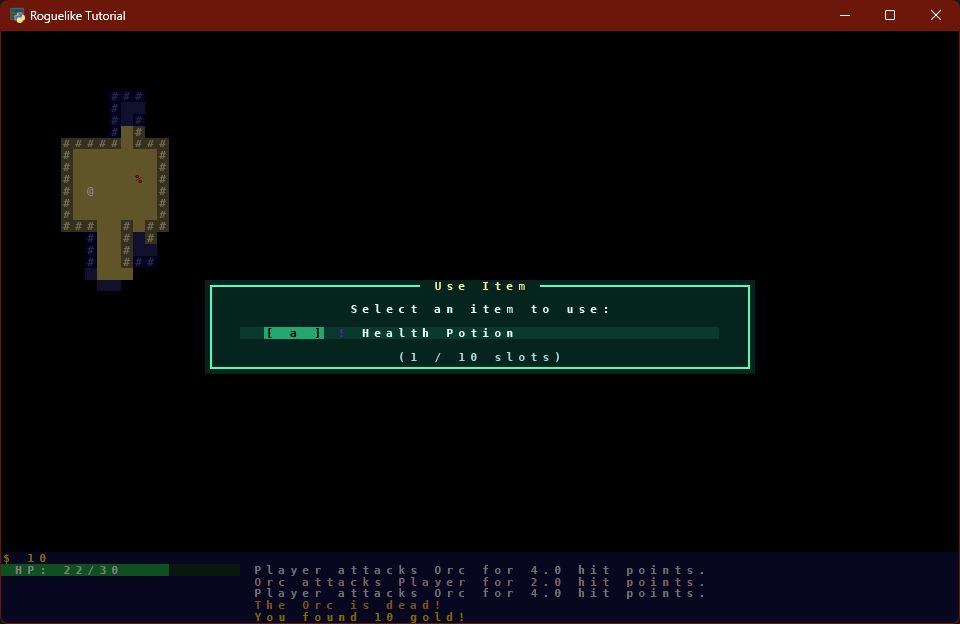
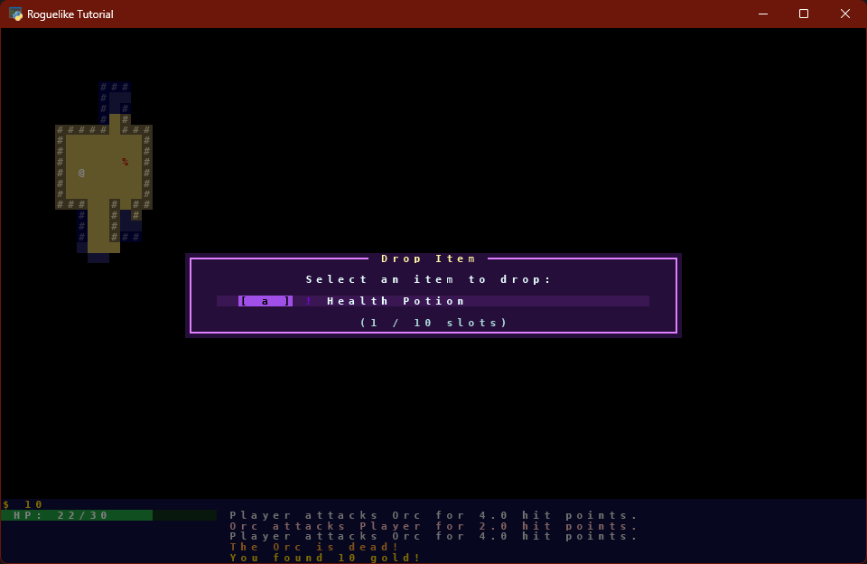
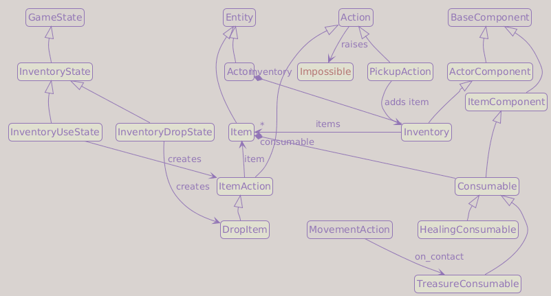
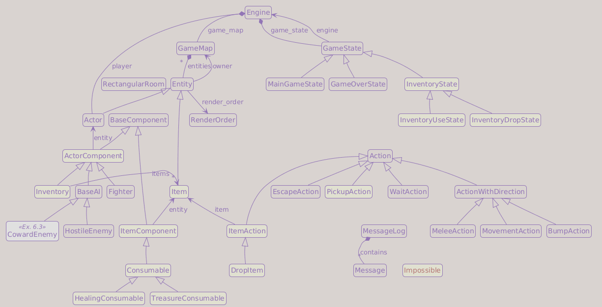

# Part 8b: Inventory

In Part 8a we built the item data model: items exist in the dungeon, and can be seen but not touched. This part adds the player-facing side: actions, keyboard bindings, and the inventory overlay.

## What You Will Build

By the end of Part 8b, the player can pick up health potions with `G`, browse the inventory with `I`, use items by letter, drop items with `D`, and collect treasure chests by walking over them. A gold counter appears below the HP bar.

## Learning goals

- Implement `PickupAction`, `ItemAction`, and `DropItem`
- Refactor `GameState` so each state controls its own post-action flow
- Build the inventory overlay using the modal state pattern
- Add treasure chests as auto-collected items with a gold counter

---

## Update `game/actions.py`

Add the three new action classes and two new imports at the top of the file:

```diff
+from game.entities.entity import Actor, Item
+from game.exceptions import Impossible
 from game.message_log import MessageLog
```

```python
class PickupAction(Action):

    def perform(self, engine: Engine, entity: Entity) -> None:
        assert isinstance(entity, Actor)
        inventory = entity.inventory

        for item in engine.game_map.items:
            if entity.x == item.x and entity.y == item.y:
                if not inventory.add_item(item, game_map=engine.game_map):
                    raise Impossible("Your inventory is full.")

                MessageLog.add_message(f"You picked up the {item.name}!")
                return

        raise Impossible("There is nothing here to pick up.")


class ItemAction(Action):

    def __init__(self, item: Item) -> None:
        super().__init__()
        self.item = item

    def perform(self, engine: Engine, entity: Entity) -> None:
        assert isinstance(entity, Actor)
        self.item.consumable.activate(self, engine, entity)


class DropItem(ItemAction):

    def perform(self, engine: Engine, entity: Entity) -> None:
        assert isinstance(entity, Actor)
        entity.inventory.drop_item(self.item, engine.game_map)
        MessageLog.add_message(f"You dropped the {self.item.name}.")
```

`PickupAction` iterates `engine.game_map.items` (the new property) looking for an item at the player's position. If found, it delegates to `inventory.add_item()`, which removes the item from the map's entity set, transfers ownership to the inventory, and appends it to `inventory.items`. Both trailing `raise Impossible` statements ensure the player always gets feedback.

`ItemAction` delegates to `consumable.activate()`. `DropItem` extends `ItemAction` because dropping also needs the item reference, but calls `inventory.drop_item()` instead.

The `assert isinstance(entity, Actor)` calls enforce a design contract: `Action.perform` is declared with `entity: Entity`, but these three actions require an `Actor` (only actors have `inventory`). The asserts make that constraint explicit at runtime and narrow the declared type, so a type checker can verify the subsequent attribute accesses without casts.

Since `Actor` is now imported at the top of the file, remove the local import that was inside `MeleeAction.perform()`:

```diff
-        from game.entities.entity import Actor
-
         if not isinstance(entity, Actor):
```

Also add `PickupAction` to the import list at the top of `game/game_states.py`:

```diff
-from game.actions import (
-    Action,
-    BumpAction,
-    EscapeAction,
-    WaitAction,
-)
+from game.actions import (
+    Action,
+    BumpAction,
+    EscapeAction,
+    PickupAction,
+    WaitAction,
+)
```

Now that `ItemAction` exists, add `get_action()` to `Consumable` in `game/entities/components/consumable.py` and tighten the `_action` annotations to `ItemAction`:

```diff
 if TYPE_CHECKING:
-    from game.actions import Action
+    from game.actions import Action, ItemAction
```

```diff
 class Consumable(ItemComponent):
+
+    def get_action(self, _consumer: Actor, _engine: Engine) -> Action | None:
+        """Return the action this consumable produces when used."""
+        from game.actions import ItemAction
+
+        return ItemAction(item=self.entity)
+
-    def activate(self, _action: Action, _engine: Engine, _consumer: Actor) -> None:
+    def activate(self, _action: ItemAction, _engine: Engine, _consumer: Actor) -> None:
```

```diff
-    def activate(self, _action: Action, _engine: Engine, consumer: Actor) -> None:
+    def activate(self, _action: ItemAction, _engine: Engine, consumer: Actor) -> None:
```

```diff
-    def activate(self, _action: Action, engine: Engine, consumer: Actor) -> None:
+    def activate(self, _action: ItemAction, engine: Engine, consumer: Actor) -> None:
```

`get_action()` returns the action produced by using this item. The base implementation returns a plain `ItemAction`, but future consumable types can override it to request additional input before acting, for example a targeting scroll that needs a destination tile. The local import inside `get_action()` avoids a module-level circular import between `consumable.py` and `actions.py`.

---

## Move action execution into `GameState`

So far `Engine.handle_events()` ran the action returned by the active game state. That worked with only one state, but modal states (the inventory overlay) need to switch the active state *after* an action completes. Only the state knows which state it should return to; the engine does not.

!!! info "Why move execution into the state?"
    `Engine.handle_events()` currently does: get action from state, perform it, run enemy turns, update FOV. That is fine with one state. But when the inventory overlay is open, pressing `a` should use the item *and then close the overlay* (returning to `MainGameState`). The engine cannot make that switch because it does not know which state to return to. The state does: it opened the overlay, so it knows to close it.

    Moving the execution loop into `GameState.handle_events()` gives each state control over what happens after an action.

Update `game/engine.py`. The `handle_events` signature changes from `Iterable[Any]` to `Iterable[tcod.event.Event]`, so `Any` is no longer needed. `GameOverState` also moves out of `engine.py` (it is now referenced from inside `GameState.handle_events` in `game_states.py`):

```diff
-from typing import Any

 import tcod.event
 ...
-from game.game_states import (
-    GameState,
-    GameOverState,
-    MainGameState
-)
+from game.game_states import GameState, MainGameState
```

Then simplify `handle_events()` to a one-line dispatch:

```diff
-def handle_events(self, events: Iterable[Any]) -> None:
+def handle_events(self, events: Iterable[tcod.event.Event]) -> None:
     for event in events:
-        action = self.game_state.handle_events(event)
-        if action is not None:
-            action.perform(self, self.player)
-            self.handle_enemy_turns()
-            self.update_fov()
+        self.game_state.handle_events(event)
```

Also add `INVALID` to `game/data/colors.py`, since the rewritten `handle_events` uses it for rejection messages:

```diff
 WELCOME_TEXT = Color(0x20, 0xA0, 0xFF)
 ...
+INVALID      = Color(0xFF, 0xFF, 0x00)
```

`INVALID` is yellow: it is used for every rejection the player should read, from a full inventory to an already-healed condition.

Now rewrite `GameState.handle_events()` in `game/game_states.py` to own the full execution cycle. `from game.data import colors` was already imported in Part 7; only `Impossible` is new:

```diff
+from game.exceptions import Impossible
 from game.message_log import MessageLog
```

```python
def handle_events(self, event: tcod.event.Event) -> None:
    action: Action | None = None

    match event:
        case tcod.event.Quit():
            action = EscapeAction()

        case tcod.event.MouseMotion():
            self.engine.mouse_location = event.integer_position

        case tcod.event.KeyDown():
            action = self.event_keydown(event)

    if action is not None:
        try:
            action.perform(self.engine, self.engine.player)

        except Impossible as ex:
            MessageLog.add_message(str(ex), colors.INVALID)
            return

        if self.engine.player.is_alive:
            self.engine.handle_enemy_turns()

        if not self.engine.player.is_alive:
            self.engine.game_state = GameOverState(self.engine)

        elif isinstance(self.engine.game_state, (InventoryUseState, InventoryDropState)):
            self.engine.game_state = MainGameState(self.engine)

        self.engine.update_fov()
```

Key differences from the old engine code:

- `except Impossible as ex:` catches any rejection, logs it with `colors.INVALID`, and returns early so enemies do not take their turn on a failed action.
- After a successful action, if the current state is an inventory state, it switches back to `MainGameState`. Opening the inventory does not advance time; using or dropping an item does.

!!! note "What Impossible is for"
    `Impossible` is reserved for rejections that are worth telling the player about: a full inventory, an already-healed condition, nothing to pick up. Low-level movement failures (bumping into a wall, trying to walk off the map) are not raised as `Impossible`. Those actions still cost a turn (the player pressed a key and something was attempted), but generating a log message for every wall collision would be noise. The convention is: if the player needs to read why an action failed, raise `Impossible`; if the failure is self-evident from the game state, return silently.

The return type of `handle_events` changes from `Action | None` to `None`. Update the method signature line accordingly.

---

## Trim movement keys

Vi keys (`b`, `h`, `j`, `k`, `l`, `n`, `u`, `y`) have been part of roguelikes since the original *Rogue* (1980), which ran on VT100 terminals with no arrow keys. On a modern keyboard, arrow keys and the numpad cover the same directions with less ambiguity, and freeing those letters matters here: this chapter adds `G`, `I`, and `D` as action keys, and Exercise 3 assigns the remaining letters to items for direct use from the map.

Remove the vi keys block from `MOVE_KEYS` in `game/data/keys.py`:

```diff
-    # Vi keys
-    tcod.event.KeySym.B:     (-1,  1),
-    tcod.event.KeySym.J:     ( 0,  1),
-    tcod.event.KeySym.N:     ( 1,  1),
-    tcod.event.KeySym.H:     (-1,  0),
-    tcod.event.KeySym.L:     ( 1,  0),
-    tcod.event.KeySym.Y:     (-1, -1),
-    tcod.event.KeySym.K:     ( 0, -1),
-    tcod.event.KeySym.U:     ( 1, -1),
```

!!! info "Numpad vs. regular number keys"
    `tcod.event.KeySym.KP_1`–`KP_9` are distinct key codes from `tcod.event.KeySym.N1`–`N9`. Numpad keys continue to work for movement. Regular number keys (`1`–`9`, `0`) remain free for future use, such as equipment slots in Part 13.

---

## Update `MainGameState`

The three new actions get named bindings in `game/data/keys.py` first, like every key since Part 5. Add them just above `KEY_QUIT_GAME`:

```diff
+KEY_PICKUP    = tcod.event.KeySym.G
+KEY_INVENTORY = tcod.event.KeySym.I
+KEY_DROP      = tcod.event.KeySym.D
 KEY_QUIT_GAME = tcod.event.KeySym.ESCAPE
```

Then add the three checks at the end of `event_keydown`:

```diff
         if key == keys.KEY_QUIT_GAME:
             return EscapeAction()

+        if key == keys.KEY_PICKUP:
+            return PickupAction()
+
+        if key == keys.KEY_INVENTORY:
+            self.engine.game_state = InventoryUseState(self.engine)
+
+        if key == keys.KEY_DROP:
+            self.engine.game_state = InventoryDropState(self.engine)
+
         return None
```

`G` returns a `PickupAction`; the action system handles the rest. `I` and `D` do not return actions; they switch the active state immediately. The overlay then handles the next key press.

---

## Inventory states

Three new state classes go at the bottom of `game/game_states.py`.

Add the inventory overlay colors to `game/data/colors.py`:

```diff
 INVALID = Color(0xFF, 0xFF, 0x00)
+
+# Inventory overlay colors
+INVENTORY_MENU_TITLE = Color(255, 245, 160)
+INVENTORY_MENU_TEXT  = Color(232, 255, 255)
+INVENTORY_MENU_DIM   = Color(168, 216, 216)
+INVENTORY_MENU_KEY   = BLACK
+
+INVENTORY_USE_FG     = Color( 80, 255, 184)
+INVENTORY_USE_BG     = Color(  5,  36,  30)
+INVENTORY_USE_ACCENT = Color( 32, 168, 112)
+INVENTORY_USE_ROW_BG = Color( 10,  58,  44)
+
+INVENTORY_DROP_FG     = Color(224, 128, 255)
+INVENTORY_DROP_BG     = Color( 38,  14,  58)
+INVENTORY_DROP_ACCENT = Color(160,  80, 232)
+INVENTORY_DROP_ROW_BG = Color( 58,  22,  82)
```

The inventory overlay uses two distinct color schemes: green tones for item use (activation) and purple tones for item dropping. At a glance, the player always knows which overlay is open. The `INVENTORY_MENU_*` constants are shared by both schemes: title, text, and dim shades that look the same in either overlay, plus the key badge foreground.

!!! tip "Modal states"
    An inventory state follows exactly the same pattern as `GameOverState` from Part 7: it overrides `on_render()` to draw an overlay on top of the map, and `event_keydown()` to handle its own key set. The overlay closes when the player selects a valid item (an action executes, then `GameState.handle_events` switches back to `MainGameState`) or presses `Escape` (handled explicitly in `event_keydown`, which sets the state directly without returning an action). Any other unrecognised key does nothing. This pattern composes cleanly: any state can open any other state, and the "stack" is simply `self.engine.game_state` with no state stack to maintain.

Item names come from data, so a very long name could overflow the panel. A small helper trims text to a maximum width and marks the cut with `...`. Add it to `game/game_states.py`, next to `_draw_panel` from Part 7:

```python
def _trim_text(text: str, max_width: int) -> str:
    if len(text) <= max_width:
        return text

    if max_width <= 3:
        return text[:max_width]

    return f"{text[:max_width - 3]}..."
```

One more binding before the states themselves: the overlay closes with `Escape`, and that gets its own name in `game/data/keys.py`, right after `KEY_QUIT_GAME`:

```diff
 KEY_QUIT_GAME = tcod.event.KeySym.ESCAPE
+KEY_EXIT      = tcod.event.KeySym.ESCAPE
```

!!! question "Two names for the same key?"
    `KEY_QUIT_GAME` and `KEY_EXIT` both map to `ESCAPE`, on purpose. The name records *intent*: `KEY_QUIT_GAME` ends the program, `KEY_EXIT` closes an overlay and returns to the map.

    Today they happen to share a physical key. If you later decide overlays should close with `Q` or `Backspace` instead, that is a one-line remap in `keys.py`; with a single shared constant, the two meanings would be tangled together and the change would need a code hunt.

Now the three state classes:

```python
class InventoryState(GameState):
    """Base class for inventory screens (use and drop share the same UI)."""

    TITLE        = "<missing title>"
    PROMPT       = "<missing prompt>"
    EMPTY_TEXT   = "Your pack is empty."
    FG_COLOR     = colors.WHITE
    BG_COLOR     = colors.BLACK
    ACCENT_COLOR = colors.WHITE
    ROW_BG_COLOR = colors.BLACK

    def on_render(self, console: tcod.console.Console) -> None:
        super().on_render(console)  # draws the map behind the overlay

        # Dim the map background to highlight the inventory
        console.fg[:] = console.fg // 2
        console.bg[:] = console.bg // 2

        inventory = self.engine.player.inventory
        number_of_items_in_inventory = len(inventory.items)

        slot_count   = f"({len(inventory.items)} / {inventory.capacity} slots)"
        max_height   = console.height - 4
        height       = min(max(8, number_of_items_in_inventory + 7), max_height)
        visible_rows = min(number_of_items_in_inventory, max(0, height - 7))

        item_width = max((len(item.name) for item in inventory.items), default=0) + 14
        width = min(
            console.width - 4,
            max(
                46,
                len(self.TITLE) + 4,
                len(self.PROMPT) + 6,
                len(slot_count) + 6,
                item_width,
            ),
        )

        x = (console.width  - width)  // 2
        y = (console.height - height) // 2

        # Draw the inventory box
        _draw_panel(console, x, y, width, height, self.FG_COLOR, self.BG_COLOR)

        title = f" {self.TITLE} "
        # Draw the inventory title over the frame
        console.print(
            x    = x + (width - len(title)) // 2,
            y    = y,
            text = title,
            fg   = colors.INVENTORY_MENU_TITLE,
            bg   = self.BG_COLOR,
        )

        # Draw the main help text
        console.print(
            x         = console.width // 2,
            y         = y + 2,
            text      = self.PROMPT,
            fg        = colors.INVENTORY_MENU_TEXT,
            alignment = tcod.constants.CENTER,
        )

        row_x = x + 3
        row_width = width - 6
        if visible_rows > 0:
            name_width = max(1, row_width - 12)
            for i, item in enumerate(inventory.items[:visible_rows]):
                item_key = chr(ord("a") + i)
                row_y = y + 4 + i

                # Draw the background for one item row
                console.draw_rect(
                    x      = row_x,
                    y      = row_y,
                    width  = row_width,
                    height = 1,
                    ch     = ord(" "),
                    bg     = self.ROW_BG_COLOR,
                )

                # Draw the key that selects this item
                console.print(
                    row_x + 2,
                    row_y,
                    f"[ {item_key} ]",
                    fg = colors.INVENTORY_MENU_KEY,
                    bg = self.ACCENT_COLOR,
                )

                # Draw the item glyph using its own color
                console.print(
                    row_x + 8,
                    row_y,
                    item.char,
                    fg = item.color,
                    bg = self.ROW_BG_COLOR,
                )

                # Draw the item name, trimmed if it does not fit
                console.print(
                    row_x + 10,
                    row_y,
                    _trim_text(item.name, name_width),
                    fg = colors.INVENTORY_MENU_TEXT,
                    bg = self.ROW_BG_COLOR,
                )

        else:
            row_y = y + 4

            # Draw the empty row when there are no items
            console.draw_rect(
                x      = row_x,
                y      = row_y,
                width  = row_width,
                height = 1,
                ch     = ord(" "),
                bg     = self.ROW_BG_COLOR,
            )

            # Draw the empty-inventory message
            console.print(
                x         = console.width // 2,
                y         = row_y,
                text      = self.EMPTY_TEXT,
                fg        = colors.INVENTORY_MENU_DIM,
                bg        = self.ROW_BG_COLOR,
                alignment = tcod.constants.CENTER,
            )

        # Draw the used-slots counter after the item list
        console.print(
            x         = console.width // 2,
            y         = y + height - 2,
            text      = slot_count,
            fg        = colors.INVENTORY_MENU_DIM,
            bg        = self.BG_COLOR,
            alignment = tcod.constants.CENTER,
        )

    def event_keydown(self, event: tcod.event.KeyDown) -> Action | None:
        player = self.engine.player
        key = event.sym
        index = key - tcod.event.KeySym.A

        if 0 <= index <= 25:
            try:
                selected_item = player.inventory.items[index]
            except IndexError:
                MessageLog.add_message("Invalid entry.", colors.INVALID)
                return None

            return self.on_item_selected(selected_item)

        if key == keys.KEY_EXIT:
            self.engine.game_state = MainGameState(self.engine)
            return None

        return super().event_keydown(event)

    def on_item_selected(self, item: Item) -> Action | None:
        raise NotImplementedError()
```

```python
class InventoryUseState(InventoryState):
    TITLE        = "Use Item"
    PROMPT       = "Select an item to use:"
    FG_COLOR     = colors.INVENTORY_USE_FG
    BG_COLOR     = colors.INVENTORY_USE_BG
    ACCENT_COLOR = colors.INVENTORY_USE_ACCENT
    ROW_BG_COLOR = colors.INVENTORY_USE_ROW_BG

    def on_item_selected(self, item: Item) -> Action | None:
        return item.consumable.get_action(self.engine.player, self.engine)
```

**The use inventory overlay looks like this**:



```python
class InventoryDropState(InventoryState):
    TITLE        = "Drop Item"
    PROMPT       = "Select an item to drop:"
    FG_COLOR     = colors.INVENTORY_DROP_FG
    BG_COLOR     = colors.INVENTORY_DROP_BG
    ACCENT_COLOR = colors.INVENTORY_DROP_ACCENT
    ROW_BG_COLOR = colors.INVENTORY_DROP_ROW_BG

    def on_item_selected(self, item: Item) -> Action | None:
        from game.actions import DropItem

        return DropItem(item=item)
```

**The drop overlay shares the same layout**:



!!! info "Pattern: Template Method"
    `InventoryState` defines the complete algorithm (render the overlay, map keys to items, call `on_item_selected`) but leaves the final step as an abstract hook that each concrete subclass fills in. `InventoryUseState` uses the item; `InventoryDropState` drops it. The skeleton of the algorithm lives in the base class; the variation lives in the subclasses.

    The same structure appears with `on_index_selected` in `SelectIndexState` (Part 9).

    → [Refactoring Guru: Template Method](https://refactoring.guru/design-patterns/template-method) ([Python example](https://refactoring.guru/design-patterns/template-method/python/example))

`on_render()` renders the map first via `super()`, dims it with the same `// 2` trick introduced in Part 7 for the game-over screen, and then draws the box with `_draw_panel()` (shadow, fill, frame). Nothing new there: the overlay reuses the exact machinery the game-over panel taught us.

The panel layout is fixed at the top and grows downward with the item list. Row `y` carries the frame and the centered title; `y+2` prints the `PROMPT` help text; item rows start at `y+4`. The used-slots counter (`(3 / 10 slots)`) sits on the row above the bottom border, like a status line, and doubles as capacity feedback now that the inventory can fill up.

Each item row is drawn in four pieces: a one-row `draw_rect` with `ROW_BG_COLOR` that makes the row read as a single unit, the selection key as a badge (`[ a ]`, dark text over `ACCENT_COLOR`), the item sprite in its own color at `row_x + 8`, and the name at `row_x + 10`, passed through `_trim_text()` so a long name cannot break the layout. The badge-over-accent style makes the actionable keys pop out from the text around them.

`width` adapts to the longest content line (title, prompt, counter, or item name plus its prefixes) with a floor of 46 cells, and is clamped to `console.width - 4` so the panel always leaves a margin. `height` follows the item count, with `visible_rows` recomputed from the clamped height so the loop never draws past the bottom border. When the inventory is empty, a single dim row prints `EMPTY_TEXT` instead of the item list.

`TITLE`, `PROMPT`, and the four color class variables follow the same class-variable pattern introduced in Part 7 for `GameOverState`. Each subclass overrides them: green tones for activation, purple tones for dropping, so the player always knows which overlay is open at a glance.

`event_keydown()` converts the pressed key to an index: `a → 0`, `b → 1`, and so on. The range `0 <= index <= 25` covers exactly the 26 letters `a`-`z`. If the index falls outside the item list, it logs "Invalid entry." and returns `None`. Otherwise it calls `on_item_selected()`, which the two subclasses implement differently. `Escape` closes the overlay immediately by switching back to `MainGameState` without returning an action (so enemies do not take a turn).

`InventoryUseState` asks the item's consumable for an action; `InventoryDropState` returns a `DropItem`. The action is then executed by `GameState.handle_events()` and, because the current state is an inventory state, it automatically switches back to `MainGameState` after the action completes.

You will notice that `InventoryUseState` and `InventoryDropState` are referenced in `GameState.handle_events()`, which is defined earlier in the same file. This is fine in Python: method bodies are only executed when called, at which point all classes in the module are already defined.

Also add `Item` to the imports at the top of `game_states.py` so that `on_item_selected` can use it as a type annotation:

```diff
 if TYPE_CHECKING:
     from game.engine import Engine
+    from game.entities.entity import Item
```

---

## Treasure chests

Part 8a defined both consumable types and spawned chests on the floor. The chest template and `auto_activate = True` are already in place. This section adds the three pieces that make chests actually work: the `GameMap` helper, the contact method on `Consumable`, and the HUD element that shows the accumulated gold.

### Auto-collect in `MovementAction`

`PickupAction` is triggered by the `G` key. Treasure should also be collected automatically when the player steps on it. This requires three additions.

First, add a `GameMap.items_at(x, y)` helper that returns all items at a given position:

```python
def items_at(self, x: int, y: int) -> list[Item]:
    from game.entities.entity import Item
    return [e for e in self.entities if isinstance(e, Item) and e.x == x and e.y == y]
```

Second, add an `on_contact` method to `Consumable`. It activates the item if `auto_activate` is set, using the standard `ItemAction` path:

```diff
 class Consumable(ItemComponent):
     auto_activate: bool = False

+    def on_contact(self, engine: Engine, consumer: Actor) -> None:
+        from game.actions import ItemAction
+
+        if self.auto_activate:
+            ItemAction(item=self.entity).perform(engine, consumer)
```

`TreasureConsumable` overrides `on_contact` so that only the player collects a chest; a wandering monster that steps on it leaves it untouched. Add the override in `game/entities/components/consumable.py`:

```diff
 class TreasureConsumable(Consumable):
     auto_activate = True

     def __init__(self, value: int) -> None:
         self.value = value

+    def on_contact(self, engine: Engine, consumer: Actor) -> None:
+        if consumer is engine.player:
+            super().on_contact(engine, consumer)
+
     def activate(self, _action: ItemAction, engine: Engine, consumer: Actor) -> None:
```

Third, after `entity.move()` in `MovementAction.perform()`, trigger contact for every item on the new tile:

```diff
         entity.move(self.dx, self.dy)
+
+        if isinstance(entity, Actor):
+            for item in engine.game_map.items_at(entity.x, entity.y):
+                item.consumable.on_contact(engine=engine, consumer=entity)
```

The `isinstance(entity, Actor)` check satisfies the type checker: `on_contact` expects an `Actor`, and `entity` in `MovementAction` is annotated as the wider `Entity` type. In practice any entity that moves will be an actor.

`items_at()` returns a fresh list, so `activate()` can safely modify `game_map.entities` during iteration. The `MovementAction` wiring has no player check: it fires `on_contact` for every actor that steps on the tile. The decision to react lives in the consumable: `TreasureConsumable` only acts when the consumer is the player (so a wandering monster cannot scoop up a chest), while a different consumable could choose to react to anyone.

### `render_gold` in `hud.py`

Add a one-line gold display below the HP bar:

```python
def render_gold(
    console: Console,
    gold: int,
    y: int = 44,
) -> None:
    console.print(
        x    = 0,
        y    = y,
        text = f"$ {gold}",
        fg   = colors.GOLD,
    )
```

Call it from `Engine.render()`:

```diff
     hud.render_bar(...)
+
+    hud.render_gold(
+        console = console,
+        gold    = self.player.inventory.gold,
+    )
```

---

## Testing Part 8b

Run the game and verify the following:

- Health potions (`!`) appear on the dungeon floor.
- Walking over a potion and pressing `G` adds it to the inventory and shows "You picked up the Health Potion!".
- Pressing `G` on an empty tile shows "There is nothing here to pick up." in yellow.
- Pressing `I` opens the "Use Item" overlay: the map dims, a framed panel with a drop shadow appears, and carried items are listed as rows with `[ a ]`-style key badges.
- The overlay shows the used-slots counter (for example `(2 / 10 slots)`) at the bottom of the panel.
- Pressing the letter for a potion when injured heals the player and shows a green message.
- Pressing the letter for a potion at full health shows "Your health is already full." in yellow.
- Pressing `D` opens the "Drop Item" overlay in purple tones; selecting an item drops it at the player's feet.
- Pressing an out-of-range letter in the inventory overlay shows "Invalid entry." in yellow.
- Enemies still act on their turn after the player successfully uses or drops an item.
- Enemies do *not* act when the player tries to pick up from an empty tile (a failed action costs no turn).
- Chests (`$`) appear on the dungeon floor. Walking over one shows "You found 10 gold!" and the `$` symbol disappears.
- The gold counter below the HP bar increments each time a chest is collected.

---

## Summary

Items are now a first-class part of the game. Key additions:

- **`game/exceptions.py`**: `Impossible` exception carries a rejection reason; one `except` in `handle_events` covers every case
- **`ActorComponent` / `ItemComponent`**: narrowed base classes so type annotations match the actual runtime type
- **`Entity.owner`**: single source of truth for whether an entity is on the floor or in an inventory
- **`Item` / `Inventory`**: new entity subclass and actor component; pickup, use, and drop are modelled as actions
- **`HealingConsumable`**: first consumable component; knows how to apply its effect independently of the action layer
- **`TreasureConsumable`**: second consumable; collected on contact rather than through the inventory; `auto_activate = True` triggers pickup on walk
- **`InventoryState`**: modal overlay base class; subclasses override `TITLE`, `PROMPT`, the four color class variables, and `on_item_selected()`
- **`Inventory.gold`**: running treasure total stored in the `Inventory` component; read as `player.inventory.gold`; keeping all player-held state in one place simplifies future serialization

**Current architecture**:

- `Entity.owner`: set to `GameMap` on spawn, changed to `Inventory` on pickup, back to `GameMap` on drop; never `None` while the entity is active on the map or carried in an inventory
- `Inventory`: component on `Actor`; holds items up to `capacity`, enforces the limit, and handles drop logic
- `Consumable.auto_activate`: class-level flag; `Consumable.on_contact()` checks it and activates the item via `ItemAction` when the player steps on the tile
- `HealingConsumable.activate()`: applies healing and calls `self.consume()` to remove the item from inventory
- `TreasureConsumable.activate()`: adds gold, logs the message, and removes the item from the map directly; it never enters inventory
- `Impossible`: raised anywhere in the action chain; `handle_events` catches it and shows the message in the log
- `InventoryState`: subclasses provide `on_item_selected()` and override the title, prompt, and color class variables; `GameState.handle_events()` automatically switches back to `MainGameState` after an inventory action
- `ActorComponent` / `ItemComponent`: `entity` annotation narrows from `Entity` to the actual holder type, so type checkers can verify component attribute access correctly

**Local Class Diagram**:



**Full Class Diagram**:



**File structure**:

```text
main.py                         ← modified
game/
├── __init__.py
├── actions.py                  ← modified
├── engine.py                   ← modified
├── exceptions.py               ← new
├── hud.py                      ← modified
├── game_states.py              ← modified
├── message_log.py
├── data/
│   ├── __init__.py
│   ├── colors.py               ← modified
│   ├── keys.py                 ← modified
│   └── sprites.py              ← modified
├── entities/
│   ├── __init__.py
│   ├── entity.py               ← modified
│   ├── factories.py            ← modified
│   ├── render_order.py
│   └── components/
│       ├── __init__.py
│       ├── ai.py               ← modified
│       ├── base_component.py   ← modified
│       ├── consumable.py       ← new
│       ├── fighter.py          ← modified
│       └── inventory.py        ← new
└── map/
    ├── __init__.py
    ├── game_map.py             ← modified
    ├── tile_types.py
    └── map_generator.py        ← modified
```

---

## Exercises

!!! tip "Exercises 1 and 2 together make the game noticeably more fun"
    Stacking keeps the inventory list clean, and the backpack gives the player a reason to seek scrolls. Exercises 3 and 4 polish the user interface.

1. **Item stacking**:

    When the inventory shows items, group identical ones into a single row with a count, `[ h ] Health Potion (x3)`, instead of three separate lines. Items with the same `name` form a stack. This is a display-layer change: the underlying `Inventory.items` list is untouched, so dropping still removes one instance at a time and the stack just shrinks by one.

    ??? note "Reference implementation"
        Add two static helpers to `InventoryState`. `stack_items(items) -> list[list[Item]]` groups items by name (`dict.setdefault`); each stack is a `list[Item]` whose first element is used for display and selection (after Exercise 3, also sort the stacks here: `stacks.sort(key=lambda s: s[0].key or 0)`). `stack_name(stack) -> str` returns `"Health Potion (x3)"` when `len(stack) > 1`, else just the name.

        Then `on_render()` calls `stack_items()` and iterates over stacks, computing the panel width from `stack_name()` so the frame fits the longest entry. The alphabetical letter-to-index system is replaced by Exercise 3's key-based selection. (`Inventory.drop_item()` already removes the first matching item, so dropping needs no extra logic.)

2. **Backpack growing scroll**:

    Add a scroll that permanently grows the player's backpack, up to a ceiling. Make `max_capacity: int` a **required** parameter of `Inventory.__init__` (no default): that forces every `Actor` in `factories.py` to declare its ceiling (monsters get `max_capacity=0`, so they never expand), and a forgotten actor fails loudly at startup instead of silently inheriting 26. Each scroll is a permanent, irreversible upgrade (the player starts at `capacity=10`, gains `+4` per scroll, up to 26), so finding one is meaningful.

    ??? note "Reference implementation"
        `BackpackConsumable(amount: int)` raises `capacity` by `amount`, capped at `max_capacity`. Use `min()` for the actual gain, and raise `Impossible` if already at the cap before touching anything:

        ```python
        actual = min(self.amount, consumer.inventory.max_capacity - consumer.inventory.capacity)
        consumer.inventory.capacity += actual
        ```

        Add the visual constants: `BACKPACK_SCROLL = "?"` in `sprites.py` and a parchment `BACKPACK_SCROLL = Color(255, 224, 160)` in `colors.py`. After growing the capacity, log the gain in that color and `self.consume()`:

        ```python
        MessageLog.add_message(
            f"Your backpack grows by {actual} slots.",
            colors.BACKPACK_SCROLL,
        )
        self.consume()
        ```

        Finally wire a `backpack_scroll` item in `factories.py` (`sprites.BACKPACK_SCROLL`, `colors.BACKPACK_SCROLL`, name `"Backpack Growing Scroll"`) and add it to `item_chances` alongside the health potion and chest.

3. **Persistent item keys**:

    Right now the inventory letter for each item shifts whenever a preceding item is used or dropped: after consuming the first potion, what was `b` becomes `a`. Give each item type a **fixed hotkey**, assigned by the programmer in `factories.py`, that never changes regardless of inventory order (and `None` for auto-collected items like the chest, which need no shortcut). Because the key lives on the template object, `spawn()` copies it for free: no per-instance bookkeeping on pickup, consume or drop. The wiring touches a handful of places: the `Item` itself, the factories, the inventory render, the inventory's key handling, the main-game key handling (so a hotkey works without opening the inventory), and the pickup message.

    ??? note "Reference implementation"
        `Item.__init__` (`entity.py`): add `key: tcod.event.KeySym | None` as a required parameter, alongside `consumable`. The `| None` supports auto-collected items (the chest) that need no shortcut. Import `tcod.event` under `TYPE_CHECKING` (the annotation is a string at runtime thanks to `from __future__ import annotations`).

        `factories.py`: assign a mnemonic key per keyboard-interactive item, `None` for auto-collected ones. After Exercise 4 these raw values become `keys.*` constants:

        ```python
        health_potion   = Item(..., key=tcod.event.KeySym.H)   # becomes keys.HEALTH_POTION after Ex 4
        backpack_scroll = Item(..., key=tcod.event.KeySym.B)   # becomes keys.BACKPACK_SCROLL after Ex 4
        chest           = Item(..., key=None)
        ```

        `InventoryState.on_render()`: show the letter in the badge with `chr(item.key) if item.key is not None else "-"` (`KeySym` is an `IntEnum` whose letter values equal their ASCII codes, so `chr(KeySym.H)` is `'h'`). Add the key-based sort (`stacks.sort(key=lambda s: s[0].key or 0)`) inside `stack_items`, not here, so the order stays stable everywhere the stacks are used.

        `InventoryState.event_keydown()`: replace the index computation with a loop checking `stack[0].key is not None and stack[0].key == key`. After it (and the escape check), add a fallback for stray letters: if `ord("a") <= int(key) <= ord("z")`, log `"Invalid entry."` in `colors.INVALID` and return `None`.

        `MainGameState.event_keydown()`: add a fallback at the end that scans the inventory for an item whose `key` matches `event.sym` and calls `item.consumable.get_action()`. Same effect as opening the inventory and selecting it; if it needs targeting (Part 9), the targeting UI opens just the same.

        `PickupAction`: after the `"You picked up the ..."` message, if `item.key is not None`, log a second line. Import `from game.data.keys import key_label` and write `MessageLog.add_message(f"Press {key_label(item.key)} to use it.")` (`key_label` makes a badge like `[ H ]`; you add it in Exercise 4).

        With vi keys removed, `a`–`z` minus `g`, `i`, `d` gives 23 conflict-free hotkey slots.

4. **Item hotkey constants and `key_label`**:

    Exercise 3 wired the item hotkeys as raw `tcod.event.KeySym` values in `game/entities/factories.py`; they are the only bindings left outside `game/data/keys.py`. Bring them home as named constants (`HEALTH_POTION`, `BACKPACK_SCROLL`), and add a small `key_label` helper that formats a key as a badge like `[ H ]` or `[ Esc ]` (the pickup hint from Exercise 3 renders through it, and the Part 10 main menu will use it too).

    !!! tip "How `key_label` picks a name"
        Three rules, in order: an entry in `_SPECIAL_KEY_NAMES` wins first (`ESCAPE` becomes `Esc`); otherwise, a printable ASCII code (32 to 126) becomes `chr(v).upper()`, so the period key reads `.` instead of the verbose `"PERIOD"`; everything else falls back to `sym.name` (`"F1"`, `"KP_8"`, `"UP"`).

    ??? note "Reference implementation"
        Additions to `game/data/keys.py`. The helper goes near the top of the file, after the `tcod.event` import; the hotkey constants go at the end. The `SCROLL_*` block appears as context: it comes from Part 7 Exercise 2, not from this one:

        ```python
        # Part-8. Exercise 4: Item hotkey constants and key_label
        _SPECIAL_KEY_NAMES = {
            tcod.event.KeySym.ESCAPE: "Esc",
        }

        def key_label(sym: tcod.event.KeySym) -> str:
            v    = int(sym)
            name = _SPECIAL_KEY_NAMES.get(sym) or (chr(v).upper() if 32 <= v <= 126 else sym.name)
            return f"[ {name} ]"
        ```

        ```python
        # Part-7. Exercise 2: Scroll the message panel
        SCROLL_UP   = tcod.event.KeySym.PAGEUP
        SCROLL_DOWN = tcod.event.KeySym.PAGEDOWN

        # Part-8. Exercise 4: Item hotkey constants and key_label
        HEALTH_POTION   = tcod.event.KeySym.H
        BACKPACK_SCROLL = tcod.event.KeySym.B
        ```

        In `game/entities/factories.py`, import `keys`, drop the now-unused `import tcod.event`, and point the item hotkeys at the constants:

        ```diff
        -from game.data import colors, sprites
        +from game.data import colors, keys, sprites
        -import tcod.event
        ```

        ```diff
        -    key        = tcod.event.KeySym.H,
        +    key        = keys.HEALTH_POTION,
        ...
        -    key        = tcod.event.KeySym.B,
        +    key        = keys.BACKPACK_SCROLL,
        ```
