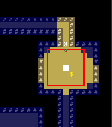
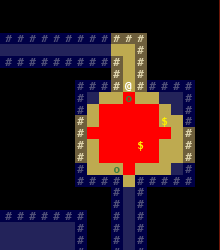
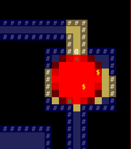
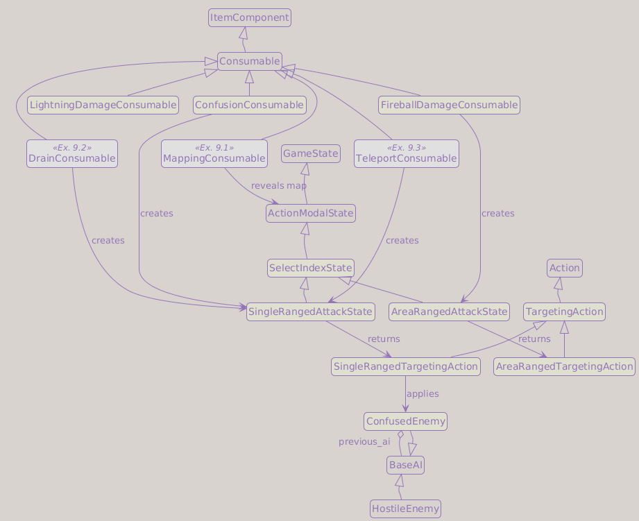
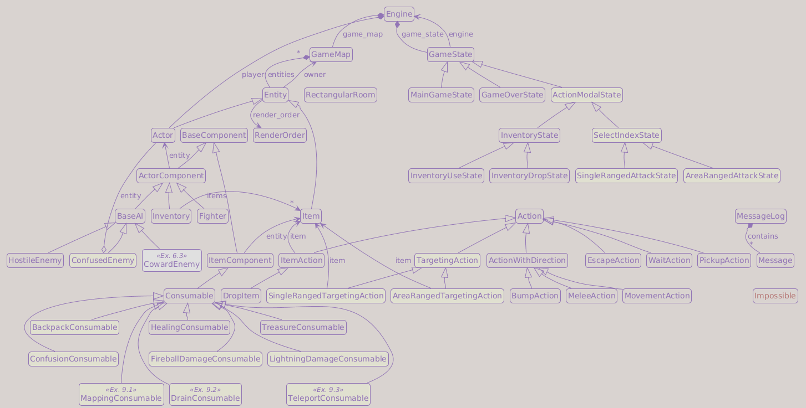

# Part 9: Spells and Targeting

## What You Will Build

By the end of this part, the player will be able to use scrolls with targeted effects, including lightning, confusion, and fireball spells.

## Learning goals

- Add a targeting cursor the player moves with keyboard or mouse
- Implement three spell scrolls: lightning bolt (auto-target), confusion (cursor), fireball (Area of Effect)
- Show a visual radius ring for Area of Effect (AoE) targeting
- Add a `ConfusedEnemy` AI that wanders randomly

---

## Targeting as a game state

So far, every keypress either moves the player or triggers an action. Spells that require targeting need a different mode: the player moves a cursor around the map and confirms a target, or presses Escape to cancel.

This fits naturally into the game-state pattern from Part 8. When the player uses a targeting scroll, we push a new game state. That state:

1. Intercepts all keyboard and mouse input
2. Draws the cursor (and for AoE, the radius ring) on every frame
3. On confirm, runs the action and returns to `MainGameState`
4. On Escape, cancels and returns to `MainGameState`

```text
MainGameState
  │  player presses i → use scroll
  ▼
InventoryUseState
  │  scroll.consumable.get_action() returns TargetingAction
  ▼
GameState.handle_events()
  │  isinstance dispatch: installs targeting state
  ▼
SingleRangedAttackState  (or AreaRangedAttackState)
  │  player confirms target
  ▼
MainGameState  (back to normal play)
```

---

## Add entity.distance()

The spell code needs a reusable way to measure the distance from an entity to a map coordinate. Add to `Entity`:

```python
import math

...

def distance(self, x: int, y: int) -> float:
    return math.hypot(self.x - x, self.y - y)
```

`entity.py` did not need `math` before this chapter, so add the import at the top of the file.

!!! tip "`math.hypot` vs manual sqrt"
    `math.hypot(a, b)` computes `sqrt(a² + b²)` in one call. It is more readable than `math.sqrt(a*a + b*b)` and numerically stable. Performance is equivalent. When you only need to *compare* a distance against a threshold, you can skip `sqrt` entirely: `dx*dx + dy*dy <= r*r` is equivalent to `hypot(dx, dy) <= r` but avoids any floating-point root. We will use that trick later in `get_aoe_tiles_in_radius` (aoe -> Area of Effect).

---

## ActionModalState: a marker for auto-closing states

Some states (inventory screens, targeting cursors, ...) should return the player
to normal gameplay automatically after a successful action. In Part 8,
`handle_events` identified these states by listing them explicitly:

```python
elif isinstance(self.engine.game_state, (InventoryUseState, InventoryDropState)):
    self.engine.game_state = MainGameState(self.engine)
```

Adding targeting states would mean extending that tuple every time. Instead,
we are going to introduce a shared base class that expresses the intent once:

```python
class ActionModalState(GameState):
    """State that returns to the main game after a successful action."""
```

Any state that inherits from `ActionModalState` will be closed automatically on finish.

Update `InventoryState` from Part 8 to inherit from it:

```diff
-class InventoryState(GameState):
+class InventoryState(ActionModalState):
```

And update the isinstance check in `GameState.handle_events`:

```diff
-elif isinstance(self.engine.game_state, (InventoryUseState, InventoryDropState)):
+elif isinstance(self.engine.game_state, ActionModalState):
     self.engine.game_state = MainGameState(self.engine)
```

Adding a new modal state in the future requires no changes to `handle_events`.

---

## SelectIndexState: cursor base class

This part builds two targeting states: `SingleRangedAttackState` (single-tile cursor) and `AreaRangedAttackState` (AoE radius ring). Both share cursor movement, keyboard shortcuts, and mouse-click logic. `SelectIndexState` extracts that common behavior so each concrete state only needs to implement `on_index_selected`:

Before writing the class, add the cursor navigation constants to `game/data/keys.py`:

```diff
 KEY_QUIT_GAME = tcod.event.KeySym.ESCAPE
 KEY_EXIT      = tcod.event.KeySym.ESCAPE
+KEY_SELECT    = {tcod.event.KeySym.RETURN, tcod.event.KeySym.KP_ENTER}
+
+CURSOR_FAST   = tcod.event.Modifier.LSHIFT | tcod.event.Modifier.RSHIFT  # ×5
+CURSOR_FASTER = tcod.event.Modifier.LCTRL  | tcod.event.Modifier.RCTRL   # ×10
```

`KEY_EXIT` already exists from Part 8 and covers any modal overlay (menus, cursors, dialogs), so there is nothing to rename here; we only add the cursor-navigation keys `KEY_SELECT`, `CURSOR_FAST`, and `CURSOR_FASTER`.

Now add to `game/game_states.py`:

```python
class SelectIndexState(ActionModalState):
    """Base for states that ask the player to select a map tile."""

    def __init__(self, engine: Engine) -> None:
        super().__init__(engine)
        player = self.engine.player
        engine.mouse_location = player.x, player.y

    def on_render(self, console: tcod.console.Console) -> None:
        super().on_render(console)

        x, y = self.engine.mouse_location
        if self.engine.game_map.in_bounds(x, y):
            console.bg[x, y] = colors.WHITE
            console.fg[x, y] = colors.BLACK

    def event_keydown(self, event: tcod.event.KeyDown) -> Action | None:
        key = event.sym
        if key in keys.MOVE_KEYS:
            modifier = 1
            if event.mod & keys.CURSOR_FAST:
                modifier *= 5
            if event.mod & keys.CURSOR_FASTER:
                modifier *= 10

            x, y = self.engine.mouse_location
            dx, dy = keys.MOVE_KEYS[key]
            x = max(0, min(x + dx * modifier, self.engine.game_map.width - 1))
            y = max(0, min(y + dy * modifier, self.engine.game_map.height - 1))
            self.engine.mouse_location = x, y

            return None

        if key in keys.KEY_SELECT:
            return self.on_index_selected(*self.engine.mouse_location)

        if key == keys.KEY_EXIT:
            self.engine.game_state = MainGameState(self.engine)
            return None

        return super().event_keydown(event)

    def event_mousebuttondown(self, event: tcod.event.MouseButtonDown) -> Action | None:
        x, y = event.integer_position
        if self.engine.game_map.in_bounds(x, y):
            if event.button == 1:
                return self.on_index_selected(x, y)

        return None

    def on_index_selected(self, x: int, y: int) -> Action | None:
        raise NotImplementedError()
```

The cursor starts at the player's position. Holding Shift multiplies movement speed by 5; holding Ctrl multiplies by 10, handy on large maps. Enter or left-click confirms the selection.

Escape cancels targeting and returns to normal gameplay.

---

## SingleRangedAttackState

```python
class SingleRangedAttackState(SelectIndexState):
    """Asks the player to select a single target tile."""

    def __init__(
        self,
        engine: Engine,
        callback,
    ) -> None:
        super().__init__(engine)
        self.callback = callback

    def on_index_selected(self, x: int, y: int) -> Action | None:
        return self.callback((x, y))
```

The `callback` is a function that accepts `(x, y)` and returns an `Action`. The consumable provides the callback when it creates the state.

---

## AreaRangedAttackState

`AreaRangedAttackState` extends `SelectIndexState` and asks the player to pick an explosion center. It highlights the affected area on every frame so the player sees exactly which tiles will be hit.

The state does not hardcode a color. Different spells may want different highlight colors, so `color` is passed as a parameter alongside `radius`. The calling consumable decides which color to use. Add `FIREBALL_AOE` to `game/data/colors.py`:

```python
FIREBALL_AOE = Color(255, 0, 0)
```

Keep it as its own constant rather than reusing the scroll's item color, so the blast highlight can diverge from the glyph later.

Add the class to `game/game_states.py`:

```python
class AreaRangedAttackState(SelectIndexState):
    """Shows an Area of Effect (AoE) radius and asks the player to confirm."""

    def __init__(
        self,
        engine: Engine,
        radius: int,
        color: Color,
        callback,
    ) -> None:
        super().__init__(engine)
        self.radius   = radius
        self.color    = color
        self.callback = callback

    def on_index_selected(self, x: int, y: int) -> Action | None:
        return self.callback((x, y))
```

The `on_render` method handles the highlighting. We will build it in three steps.

### Step 1: Square outline

The simplest approach draws a rectangular frame around the cursor:

```python
def on_render(self, console: tcod.console.Console) -> None:
    super().on_render(console)

    x, y = self.engine.mouse_location
    diameter = self.radius * 2 + 1
    console.draw_frame(
        x      = x - self.radius,
        y      = y - self.radius,
        width  = diameter,
        height = diameter,
        fg     = self.color,
        bg     = None,
        clear  = False,
    )
```

`draw_frame` draws a rectangle outline. `clear=False` leaves the tiles inside untouched.



The square is quick to implement, but misleading: corner tiles are further from the center than the stated radius, and the outline ignores walls. Let's replace it with a real circle.

### Step 2: True circle

To highlight exactly the tiles within radius we need a few helper methods in `GameMap`.

First add small tile-query helpers. They keep the AoE code readable and give us one place to define what counts as blocking:

```python
def is_transparent(self, x: int, y: int) -> bool:
    if not self.in_bounds(x, y):
        return False

    return bool(self.tiles["transparent"][x, y])

def is_opaque(self, x: int, y: int) -> bool:
    return not self.is_transparent(x, y)

def is_walkable(self, x: int, y: int) -> bool:
    if not self.in_bounds(x, y):
        return False

    return bool(self.tiles["walkable"][x, y])

def is_blocking(self, x: int, y: int) -> bool:
    return not self.is_walkable(x, y)
```

Now add two straight-line checks. They share the same shape, but answer different gameplay questions:

- **`has_line_of_sight`** asks whether vision can pass along the line, so it uses `is_opaque`.
- **`has_line_of_movement`** asks whether a straight-line path can be traversed, so it uses `is_blocking`.

The fireball AoE will use `has_line_of_sight`. That keeps this targeting rule tied to what the map currently knows about visibility: opaque tiles stop the blast preview, transparent tiles do not. We add `has_line_of_movement` now as its deliberate companion: the same Bresenham shape, but answering the *traversal* question (is the straight path blocked by a non-walkable tile?) rather than the *vision* one. Part 9 never calls it, yet it is exactly what a later straight-line movement effect needs, such as a charge or dash spell that must stop at the first wall. Writing the pair together keeps the two questions, vision via `is_opaque` and traversal via `is_blocking`, side by side.

```python
import math
import tcod

...

def has_line_of_sight(self, origin_x: int, origin_y: int, target_x: int, target_y: int) -> bool:
    if not self.in_bounds(origin_x, origin_y) or not self.in_bounds(target_x, target_y):
        return False

    if self.is_opaque(origin_x, origin_y):
        return False

    if self.is_opaque(target_x, target_y):
        return False

    path = tcod.los.bresenham((origin_x, origin_y), (target_x, target_y))
    for x, y in path[1:-1]:
        if self.is_opaque(x, y):
            return False

    return True

def has_line_of_movement(self, origin_x: int, origin_y: int, target_x: int, target_y: int) -> bool:
    if not self.in_bounds(origin_x, origin_y) or not self.in_bounds(target_x, target_y):
        return False

    if self.is_blocking(origin_x, origin_y):
        return False

    if self.is_blocking(target_x, target_y):
        return False

    path = tcod.los.bresenham((origin_x, origin_y), (target_x, target_y))
    for x, y in path[1:-1]:
        if self.is_blocking(x, y):
            return False

    return True
```

!!! info "`tcod.los.bresenham`"
    `tcod.los.bresenham((x0, y0), (x1, y1))` returns a numpy array of `(x, y)` integer pairs tracing the straight line from `(x0, y0)` to `(x1, y1)`, endpoints included. It uses the [Bresenham line algorithm](https://en.wikipedia.org/wiki/Bresenham%27s_line_algorithm): integer arithmetic only, no floating-point rounding. We slice `path[1:-1]` to skip origin and target since both line helpers already verified those tiles above; only the intermediate cells determine whether the line is clear.

**`get_aoe_tiles_in_radius`** returns a boolean numpy mask of every tile within radius that has line of sight to the center:

```python
def get_aoe_tiles_in_radius(self, center_x: int, center_y: int, radius: float):
    area = np.zeros((self.width, self.height), dtype=bool, order="F")

    if not self.in_bounds(center_x, center_y):
        return area

    if radius < 0:
        return area

    if self.is_blocking(center_x, center_y):
        return area

    min_x = max(0,           math.floor(center_x - radius))
    max_x = min(self.width,  math.ceil( center_x + radius) + 1)
    min_y = max(0,           math.floor(center_y - radius))
    max_y = min(self.height, math.ceil( center_y + radius) + 1)

    radius_sqr = radius * radius
    for y in range(min_y, max_y):
        dy = y - center_y
        dy_sqr = dy * dy
        for x in range(min_x, max_x):
            dx = x - center_x
            if dx * dx + dy_sqr > radius_sqr:
                continue

            if self.has_line_of_sight(center_x, center_y, x, y):
                area[x, y] = True

    return area
```

The circle test is `dx² + dy² <= r²`. Comparing squared distances is mathematically equivalent to comparing distances, but avoids `math.sqrt` entirely. The line-of-sight check then cuts out tiles that an opaque wall would shield.

Rewrite `on_render` to highlight the matching tiles:

```python
def on_render(self, console: tcod.console.Console) -> None:
    super().on_render(console)

    x, y = self.engine.mouse_location
    aoe = self.engine.game_map.get_aoe_tiles_in_radius(x, y, self.radius)
    console.bg[aoe] = self.color
```

`console.bg` is a numpy array of shape `(width, height, 3)`. Indexing it with a boolean mask sets the background color of every `True` tile in one operation.

!!! note "Shorthand aliases"
    `console.bg` and `console.fg` are shorthand for `console.rgb["bg"]` and `console.rgb["fg"]`. You may see either form in tcod documentation or other tutorials.



### Step 3: Antialiased circle

The circle above has a hard edge: each tile is either fully highlighted or not. Tiles right at the boundary look jagged. We can soften this by giving edge tiles a fractional weight.

`get_aoe_weights_in_radius` is the antialiased upgrade of `get_aoe_tiles_in_radius`: the same circle-and-line-of-sight logic, but it returns graded weights instead of a hard yes/no mask. We keep both on purpose. The boolean version stays as the cheaper primitive for any code that only needs to know *whether* a tile is in the blast (no float weights to carry); the weighted version is what the fireball uses, because it drives the smooth preview and the damage falloff from the same numbers.

Add `get_aoe_weights_in_radius` to `GameMap`. It returns a `float32` array where interior tiles carry `1.0` and edge tiles carry a value between `0.0` and `1.0`:

```python
def get_aoe_weights_in_radius(self, center_x: int, center_y: int, radius: float):
    weights = np.zeros((self.width, self.height), dtype=np.float32, order="F")

    if not self.in_bounds(center_x, center_y):
        return weights

    if radius < 0:
        return weights

    if self.is_blocking(center_x, center_y):
        return weights

    min_x = max(0,           math.floor(center_x - radius - 1.0))
    max_x = min(self.width,  math.ceil( center_x + radius + 1.0) + 1)
    min_y = max(0,           math.floor(center_y - radius - 1.0))
    max_y = min(self.height, math.ceil( center_y + radius + 1.0) + 1)

    for y in range(min_y, max_y):
        dy = y - center_y
        for x in range(min_x, max_x):
            dx = x - center_x
            dist = math.hypot(dx, dy)

            if dist > radius + 1.0:
                continue

            if not self.has_line_of_sight(center_x, center_y, x, y):
                continue

            if dist <= radius:
                alpha = 1.0
            else:
                alpha = max(0.0, 1.0 - (dist - radius))

            weights[x, y] = alpha

    return weights
```

Unlike Step 2's `get_aoe_tiles_in_radius`, which only needed a yes/no threshold and so compared squared distances to avoid `math.sqrt`, here we need the *actual* fractional distance to compute the edge fade, so `math.hypot(dx, dy)` is the right tool (the same one we used in `Entity.distance`). Tiles within `radius` get `alpha = 1.0`. Tiles in the one-unit border zone get a linear fade down to `0.0`. Tiles beyond `radius + 1` are skipped.

Update `on_render` to scale the highlight color by each tile's weight. Add this import to `game/game_states.py`:

```python
import math
```

Then the final `on_render`:

```python
def on_render(self, console: tcod.console.Console) -> None:
    super().on_render(console)

    x, y = self.engine.mouse_location

    weights = self.engine.game_map.get_aoe_weights_in_radius(x, y, self.radius)
    width  = self.engine.game_map.width
    height = self.engine.game_map.height
    min_x = max(0,      math.floor(x - self.radius - 1.0))
    max_x = min(width,  math.ceil( x + self.radius + 1.0) + 1)
    min_y = max(0,      math.floor(y - self.radius - 1.0))
    max_y = min(height, math.ceil( y + self.radius + 1.0) + 1)

    for grid_y in range(min_y, max_y):
        for grid_x in range(min_x, max_x):
            alpha = weights[grid_x, grid_y]
            if alpha > 0:
                console.bg[grid_x, grid_y] = self.color.scale(alpha)
```

The bounds `min_x/max_x/min_y/max_y` are precomputed to avoid iterating the entire map on every render frame. `Color.scale(factor)` multiplies each RGB channel by `factor` and rounds to the nearest integer; it is the method we added to `Color` back in Part 5. At `factor = 1.0` the color is unchanged; at `factor = 0.5` it is half as bright.



---

## Adding scroll constants

Three new sprites and three new colors. All scrolls share the same `~` glyph but each gets its own named constant so they can be retextured independently.

Extend `game/data/sprites.py`:

```diff
 HEALTH_POTION = "!"
+
+CONFUSION_SCROLL = "~"
+FIREBALL_SCROLL  = "~"
+LIGHTNING_SCROLL = "~"
```

Extend `game/data/colors.py`:

```diff
 HEALTH_POTION = Color(127, 0, 255)
+
+CONFUSION_SCROLL = Color(207,  63, 255)
+FIREBALL_SCROLL  = Color(255,   0,   0)
+LIGHTNING_SCROLL = Color(255, 255,   0)
```

---

## TargetingAction: separating model from UI

The most direct approach to targeting is to override `get_action()`, install the cursor state as a side effect, and return nothing:

```python
# naive approach: side effect, no return value
def get_action(self, _consumer, engine):
    from game.game_states import SingleRangedAttackState
    engine.game_state = SingleRangedAttackState(...)
    # returns None implicitly; the method appears to do nothing
```

Two problems with this:

- `get_action()` is declared `-> Action | None` but uses `None` as a signal for "I already handled it." A caller reading the signature has no idea a state was just installed.
- `consumable.py` (model layer) imports from `game_states.py` (UI layer), which already imports from `actions.py`. That creates a dependency cycle at the module level.

The fix is a thin data class in `game/actions.py`. `get_action()` returns it; `GameState.handle_events()` reads its fields and creates the state. The model layer never imports from the UI layer.

Add to `game/actions.py`, after `DropItem`. Also add this import at the top of the file:

```python
from game.data.colors import Color
```

```python
class TargetingAction(Action):
    """Data container: GameState dispatches to the appropriate targeting state."""
    prompt: str

    def perform(self, _engine: Engine, _entity: Entity) -> None:
        pass  # satisfies ABC; GameState does the real work


class SingleRangedTargetingAction(TargetingAction):

    def __init__(self, item: Item, prompt: str = "Select a target.") -> None:
        self.item     = item
        self.prompt   = prompt
        self.callback = lambda pos: ItemAction(item=item, target_pos=pos)


class AreaRangedTargetingAction(TargetingAction):

    def __init__(
        self,
        item: Item,
        radius: int,
        color: Color,
        prompt: str = "Select a target location.",
    ) -> None:
        self.item     = item
        self.radius   = radius
        self.color    = color
        self.prompt   = prompt
        self.callback = lambda pos: ItemAction(item=item, target_pos=pos)
```

`perform()` is a no-op that satisfies the abstract base class. The real work happens in `handle_events()` after `perform()` returns: it checks `isinstance(action, TargetingAction)`, reads `prompt` and `callback`, and installs the correct state. `actions.py` never imports `game_states`.

`callback` is a lambda built at construction time. When the player confirms a target, the targeting state calls `callback((x, y))` and the result becomes the next action. The same pattern works for chained targeting: a callback that returns another `TargetingAction` would chain into a second cursor, handled automatically by the next loop iteration.

Note that `callback` uses `ItemAction(item=item, target_pos=pos)`. The `target_pos` parameter does not exist in `ItemAction` yet; you will add it shortly in the `ConfusionConsumable` section.

`prompt: str` is a class-level annotation without a value. It tells the type checker that every `TargetingAction` subclass provides a `.prompt` attribute, without forcing a default. Python does not enforce this at runtime; the subclass `__init__` is what actually sets the value.

!!! info "Pattern: Strategy-shaped callback"
    `TargetingAction` carries a `callback` that the targeting state calls once the player picks a target. From the state's point of view, this is the *Strategy* idea: the state manages cursor input, but the variable behavior (what action to produce from `(x, y)`) is injected as a callable.

    The consumable chooses which targeting action to return; the targeting action supplies the callback, and the item's `activate()` method still owns the actual effect.

---

## ConfusedEnemy AI

Add to `game/entities/components/ai.py`:

```python
import random

from game.message_log import MessageLog
```

```python
class ConfusedEnemy(BaseAI):

    def __init__(
        self,
        entity: Actor,
        previous_ai: BaseAI | None,
        turns_remaining: int,
    ) -> None:
        super().__init__()
        self.entity = entity
        self.previous_ai = previous_ai
        self.turns_remaining = turns_remaining

    def perform(self, engine: Engine, entity: Actor) -> None:
        if self.turns_remaining <= 0:
            MessageLog.add_message(
                f"The {entity.name} is no longer confused."
            )
            entity.ai = self.previous_ai

        else:
            direction_x, direction_y = random.choice(
                [
                    (-1, -1), (0, -1), (1, -1),
                    (-1,  0),          (1,  0),
                    (-1,  1), (0,  1), (1,  1),
                ]
            )
            self.turns_remaining -= 1
            BumpAction(direction_x, direction_y).perform(engine, entity)
```

A confused enemy picks a random direction each turn. It can still accidentally attack the player if it bumps into them; this is a feature, not a bug. When the confusion expires it restores its previous AI.

!!! info "Why does `ConfusedEnemy` receive `entity` in `__init__`?"
    Every other component gets its `entity` set externally after creation (`component.entity = self` in `Actor.__init__`). `ConfusedEnemy` is different because it is created at runtime during gameplay, not at game initialisation. The target actor is already known at construction time, so passing `entity` directly and assigning `self.entity = entity` in `__init__` is the right approach here.

!!! tip "Part 6 Exercise 3: update CowardEnemy to use this pattern"
    If you implemented the flee behavior from Part 6 Exercise 3, `CowardEnemy` currently has no way to revert when the enemy recovers HP. Apply the same `previous_ai` pattern here: give `CowardEnemy` a `previous_ai` parameter in `__init__`, and at the start of `perform()` check `entity.fighter.should_flee()`. If it returns `False`, restore `previous_ai` and act normally. Pass `previous_ai=entity.ai` when constructing `CowardEnemy` in `HostileEnemy.perform()`.

---

## Three new consumables

### LightningDamageConsumable (auto-target nearest)

```python
class LightningDamageConsumable(Consumable):

    def __init__(self, damage: float, maximum_range: int) -> None:
        self.damage = damage
        self.maximum_range = maximum_range

    def activate(self, _action: ItemAction, engine: Engine, consumer: Actor) -> None:
        target = None
        closest_distance = float(self.maximum_range)

        for actor in engine.game_map.actors:
            if actor is not consumer and engine.game_map.visible[actor.x, actor.y]:
                distance = consumer.distance(actor.x, actor.y)
                if distance <= closest_distance:
                    target = actor
                    closest_distance = distance

        if target:
            MessageLog.add_message(
                f"A lightning bolt strikes the {target.name} for {self.damage:.1f} damage!",
                colors.PLAYER_ATTACK,
            )
            target.fighter.take_damage(self.damage)
            self.consume()

        else:
            raise Impossible("No enemy is close enough to strike.")
```

`LightningDamageConsumable` finds the nearest visible actor within `maximum_range` and damages it directly, with no player input. If nothing is in range, it raises `Impossible` and the scroll is not consumed.

### ConfusionConsumable (cursor targeting)

Update the imports at the top of `consumable.py`. The targeting classes now come from `actions.py`, so the local `import game.game_states` disappears:

```diff
-from game.actions import ItemAction
+from game.actions import (
+    AreaRangedTargetingAction,
+    ItemAction,
+    SingleRangedTargetingAction,
+)
+from game.entities.components.ai import ConfusedEnemy
```

Add the targeting colors to `game/data/colors.py` (used by the confusion message below and, shortly, by the targeting prompt in `handle_events`):

```python
NEEDS_TARGET          = Color(63, 255, 255)
STATUS_EFFECT_APPLIED = Color(63, 255, 63)
```

```python
class ConfusionConsumable(Consumable):

    def __init__(self, number_of_turns: int) -> None:
        self.number_of_turns = number_of_turns

    def get_action(self, _consumer: Actor, _engine: Engine) -> Action:
        return SingleRangedTargetingAction(
            item   = self.entity,
            prompt = "Select an enemy.",
        )

    def activate(self, action: ItemAction, engine: Engine, consumer: Actor) -> None:
        if action.target_pos is None:
            raise Impossible("You need to select a target")

        target = engine.game_map.get_actor_at(*action.target_pos)

        if not target:
            raise Impossible("You must select an enemy to target.")

        if not engine.game_map.visible[target.x, target.y]:
            raise Impossible("You cannot target an area you cannot see.")

        if target is consumer:
            raise Impossible("You cannot confuse yourself!")

        MessageLog.add_message(
            f"The eyes of the {target.name} look vacant, as it starts to stumble around!",
            colors.STATUS_EFFECT_APPLIED,
        )
        target.ai = ConfusedEnemy(
            entity          = target,
            previous_ai     = target.ai,
            turns_remaining = self.number_of_turns,
        )
        self.consume()
```

`get_action()` now returns a value. `_engine` becomes genuinely unused and is underscored. `GameState.handle_events()` reads the returned `SingleRangedTargetingAction`, installs the state, and shows the prompt; the consumable does none of that work.

`ItemAction` needs a `target_pos` parameter. Add it to `__init__` in `game/actions.py`:

```diff
 class ItemAction(Action):

-    def __init__(self, item: Item) -> None:
+    def __init__(self, item: Item, target_pos: tuple[int, int] | None = None) -> None:
         super().__init__()
         self.item = item
+        self.target_pos = target_pos
```

`perform` is unchanged from Part 8: it still asserts `isinstance(entity, Actor)` before calling `activate`.

### FireballDamageConsumable (AoE cursor)

```python
class FireballDamageConsumable(Consumable):

    def __init__(self, damage: float, radius: int) -> None:
        self.damage = damage
        self.radius = radius

    def get_action(self, _consumer: Actor, _engine: Engine) -> Action:
        return AreaRangedTargetingAction(
            item   = self.entity,
            radius = self.radius,
            color  = colors.FIREBALL_AOE,
            prompt = "Select a target location.",
        )

    def activate(self, action: ItemAction, engine: Engine, _consumer: Actor) -> None:
        if action.target_pos is None:
            raise Impossible("You need to select a target")

        target_pos = action.target_pos

        if not engine.game_map.visible[target_pos]:
            raise Impossible("You cannot target an area you cannot see.")

        x, y = target_pos
        target_area = engine.game_map.get_aoe_weights_in_radius(x, y, self.radius)
        targets_hit = False
        for actor in engine.game_map.actors:
            weight = float(target_area[actor.x, actor.y])
            if weight > 0.0:
                damage = self.damage * weight
                MessageLog.add_message(
                    f"The {actor.name} is engulfed in a fiery explosion,"
                    f" taking {damage:.1f} damage!",
                    colors.PLAYER_ATTACK,
                )
                actor.fighter.take_damage(damage)
                targets_hit = True

        if not targets_hit:
            raise Impossible("There are no targets in the radius.")

        self.consume()
```

`FireballDamageConsumable.get_action()` returns an `AreaRangedTargetingAction`; `handle_events()` installs the `AreaRangedAttackState`. On confirm, `activate()` uses the same weight grid that drives the visual preview (the same `get_aoe_weights_in_radius` call). Actors at the center receive full `damage`; actors in the outer ring receive a fraction proportional to their weight (between 0.0 and 1.0). It raises `Impossible` only if the tile is not visible or no actor was hit.

!!! note "Damage falloff at the edges"
    Using `get_aoe_weights_in_radius` instead of `get_aoe_tiles_in_radius` ties the damage model directly to the visual one: the gradient the player sees on screen is the same gradient that determines how hard each actor is hit. Actors fully inside the radius take `damage × 1.0`; actors in the antialiased outer ring take proportionally less. This makes the radius ring a meaningful indicator rather than a decorative effect.

---

## game/entities/factories.py: add scrolls

!!! note "If you skipped Part 8 Exercises 2, 3 or 4"
    This section reuses optional Part 8 exercises. **Exercise 2** added `BackpackConsumable` and the `backpack_scroll` template: if you skipped it, omit the `BackpackConsumable` import and the `backpack_scroll` line in `item_chances`. **Exercise 3** added the `key` parameter to `Item`: if you skipped it, omit the `key=` lines on each scroll and the `keys.py` hotkey additions below. **Exercise 4** gave those hotkeys named constants: if you did Exercise 3 but not 4, write raw values (`key=tcod.event.KeySym.C`) instead of the `keys.*` constants.

Add the scroll hotkeys to `keys.py`:

```diff
 HEALTH_POTION    = tcod.event.KeySym.H
 BACKPACK_SCROLL  = tcod.event.KeySym.B  # Part-8. Exercise 2: Backpack growing scroll
+CONFUSION_SCROLL = tcod.event.KeySym.C
+FIREBALL_SCROLL  = tcod.event.KeySym.F
+LIGHTNING_SCROLL = tcod.event.KeySym.L
```

```python
from game.data import colors, keys, sprites
from game.entities.components.consumable import (
    BackpackConsumable,  # Part-8. Exercise 2: Backpack growing scroll
    ConfusionConsumable,
    FireballDamageConsumable,
    HealingConsumable,
    LightningDamageConsumable,
    TreasureConsumable,
)

confusion_scroll = Item(
    char       = sprites.CONFUSION_SCROLL,
    color      = colors.CONFUSION_SCROLL,
    name       = "Confusion Scroll",
    consumable = ConfusionConsumable(number_of_turns=10),
    # Part-8. Exercise 3: Persistent item keys
    key        = keys.CONFUSION_SCROLL,     # Part-8. Exercise 4: Item hotkey constants and key_label
)

fireball_scroll = Item(
    char       = sprites.FIREBALL_SCROLL,
    color      = colors.FIREBALL_SCROLL,
    name       = "Fireball Scroll",
    consumable = FireballDamageConsumable(damage=12, radius=3),
    # Part-8. Exercise 3: Persistent item keys
    key        = keys.FIREBALL_SCROLL,       # Part-8. Exercise 4: Item hotkey constants and key_label
)

lightning_scroll = Item(
    char       = sprites.LIGHTNING_SCROLL,
    color      = colors.LIGHTNING_SCROLL,
    name       = "Lightning Scroll",
    consumable = LightningDamageConsumable(damage=20, maximum_range=5),
    # Part-8. Exercise 3: Persistent item keys
    key        = keys.LIGHTNING_SCROLL,      # Part-8. Exercise 4: Item hotkey constants and key_label
)
```

Each scroll pairs a sprite and color constant with its consumable. The parameters set the default difficulty values: confusion lasts 10 turns, fireball deals 12 damage over radius 3, lightning deals 20 damage up to range 5.

`item_chances` already exists from Part 8 with `health_potion`, `chest`, and `backpack_scroll`. Extend it with the three new scroll types:

```diff
 item_chances = [
     (health_potion,    40),
     (chest,            60),
     (backpack_scroll,  20),
+    (confusion_scroll, 15),
+    (fireball_scroll,  15),
+    (lightning_scroll, 15),
 ]
```

Because `place_entities` already reads `factories.item_chances` via `zip`, the map generator picks up the new items without any changes.

---

## Update GameState.handle_events

Two changes are needed to `handle_events()` in this part.

### MouseButtonDown dispatch

The targeting states respond to mouse clicks. Add the `MouseButtonDown` case to the `match` block and a default stub method to `GameState`:

```diff
         case tcod.event.MouseMotion():
             self.engine.mouse_location = event.integer_position

+        case tcod.event.MouseButtonDown():
+            action = self.event_mousebuttondown(event)

         case tcod.event.KeyDown():
             action = self.event_keydown(event)
```

```python
def event_mousebuttondown(self, _event: tcod.event.MouseButtonDown) -> Action | None:
    return None
```

### TargetingAction dispatch

The second change happens after `action.perform()` succeeds. If the result is a `TargetingAction`, install the correct state and return early, without advancing enemy turns or updating FOV:

```diff
         if action is not None:
             try:
                 action.perform(self.engine, self.engine.player)

             except Impossible as ex:
                 MessageLog.add_message(str(ex), colors.INVALID)
                 return
+
+            if isinstance(action, TargetingAction):
+                MessageLog.add_message(action.prompt, colors.NEEDS_TARGET)
+
+                if isinstance(action, SingleRangedTargetingAction):
+                    self.engine.game_state = SingleRangedAttackState(
+                        self.engine,
+                        callback = action.callback,
+                    )
+
+                elif isinstance(action, AreaRangedTargetingAction):
+                    self.engine.game_state = AreaRangedAttackState(
+                        self.engine,
+                        radius   = action.radius,
+                        color    = action.color,
+                        callback = action.callback,
+                    )
+
+                return

             if self.engine.player.is_alive:
                 self.engine.handle_enemy_turns()
```

Import the new classes at the top of `game_states.py`:

```diff
 from game.actions import (
     Action,
+    AreaRangedTargetingAction,
     BumpAction,
     EscapeAction,
     PickupAction,
+    SingleRangedTargetingAction,
+    TargetingAction,
     WaitAction
 )
```

The `return` is placed after the `try/except`, not before. If a `TargetingAction.perform()` override ever raises `Impossible` (for example "you cannot target while stunned"), the existing `except` already catches it. Placing the targeting check before the try would bypass that protection.

!!! tip "Why `perform()` is a no-op"
    The alternative is to do the import and state creation inside `perform()`. It runs correctly, but pylint still flags `consumable.py → game_states.py → actions.py → consumable.py` as a cycle, even with a local import. With the current design, `actions.py` has zero imports from `game_states.py`; the dependency is strictly one-way.

---

## Testing your work

Run `python main.py`:

- [ ] `~` scrolls appear on the floor in different colors (purple, red, yellow)
- [ ] Picking up a lightning scroll and pressing `i → l` strikes the nearest enemy
- [ ] Picking up a confusion scroll opens a targeting cursor (white highlight on player tile)
- [ ] Moving the cursor to an enemy and pressing Enter confuses it; it wanders randomly for ~10 turns
- [ ] A fireball scroll opens AoE targeting with a red circle highlight
- [ ] The fireball damages all actors (including the player!) within the radius
- [ ] Pressing Escape during targeting cancels and returns to normal play
- [ ] Using a scroll removes it from the inventory

!!! danger "Fireball can hit you"
    The fireball does not exempt the player from its AoE, this is intentional. Don't stand in the blast radius.

---

## Summary

The targeting system is now in place. Key additions:

- **`SelectIndexState`**: cursor movement + confirm/cancel
- **`SingleRangedAttackState`** and **`AreaRangedAttackState`**: targeting states
- **`TargetingAction`** / **`SingleRangedTargetingAction`** / **`AreaRangedTargetingAction`**: data classes returned by `get_action()`; carry `prompt`, `callback`, and (for AoE) `radius` and `color`
- **`ConfusedEnemy`**: temporary AI swap with countdown
- Three scroll types covering auto-target, single-target, and AoE

**Current architecture**:

- Targeting states are temporary input states layered on top of normal gameplay
- Targeting consumables return a `TargetingAction`; `handle_events()` installs the state and shows the prompt, with no involvement from the consumable
- `ItemAction` carries both the selected item and optional target position
- AI can be swapped at runtime, as with `ConfusedEnemy`
- Dependency direction is strictly one-way: `game_states` → `actions` ← `consumable`

**Local Class Diagram**:



**Full Class Diagram**:



**File structure**:

```text
main.py
game/
├── __init__.py
├── actions.py                  ← modified
├── engine.py
├── exceptions.py
├── hud.py
├── game_states.py              ← modified
├── message_log.py
├── data/
│   ├── __init__.py
│   ├── colors.py               ← modified
│   ├── keys.py                 ← modified
│   └── sprites.py              ← modified
├── entities/
│   ├── __init__.py
│   ├── entity.py               ← modified
│   ├── factories.py            ← modified
│   ├── render_order.py
│   └── components/
│       ├── __init__.py
│       ├── ai.py               ← modified
│       ├── base_component.py
│       ├── consumable.py       ← modified
│       ├── fighter.py
│       └── inventory.py
└── map/
    ├── __init__.py
    ├── game_map.py             ← modified
    ├── tile_types.py
    └── map_generator.py
```

---

## Exercises

1. **Scroll of mapping**:

    Add a `MappingConsumable` that reveals the whole floor's layout. The design catch is *what* to reveal: `explored[:] = True` would also expose the uninitialised tiles at the map edges. Instead, track which tiles were actually **carved** during generation, in a boolean array filled as rooms and tunnels are dug, and reveal only those. Make the reveal persist under Part 4's fading-memory system, so the mapped area does not fade back to black.

    ??? note "Reference implementation"
        A carved-tiles array in `GameMap.__init__` (`game/map/game_map.py`):

        ```diff
        self.explored = np.full((width, height), fill_value=False, order="F")
        +self.mapped_tiles = np.full((width, height), fill_value=False, order="F")
        ```

        An `outer` property on `RectangularRoom` (`game/map/map_generator.py`), the room's bounding box including its surrounding walls:

        ```python
        @property
        def outer(self) -> tuple[slice, slice]:
            """The room's bounding box including surrounding walls as numpy slices."""
            return slice(self.x1, self.x2 + 1), slice(self.y1, self.y2 + 1)
        ```

        Fill `mapped_tiles` as `generate_dungeon` carves. When a room is dug:

        ```diff
        dungeon.tiles[new_room.inner]        = tile_types.floor
        +dungeon.mapped_tiles[new_room.outer] = True
        ```

        ...and in the tunnel loop:

        ```diff
        dungeon.tiles[x, y] = tile_types.floor
        +dungeon.mapped_tiles[x-1:x+2, y-1:y+2] = True
        ```

        The consumable in `game/entities/components/consumable.py`: reveal with `|=` and refresh `memory` so the reveal survives the fading-memory system. No targeting is needed, so the base `get_action()` works as-is:

        ```python
        # Part-9. Exercise 1: Scroll of mapping
        class MappingConsumable(Consumable):

            def activate(self, _action: ItemAction, engine: Engine, _consumer: Actor) -> None:
                engine.game_map.explored |= engine.game_map.mapped_tiles

                # Part-4. Exercise 4: Fading memory
                engine.game_map.memory[engine.game_map.mapped_tiles] = max(1, engine.memory_duration)

                MessageLog.add_message(
                    "The scroll reveals the layout of this floor!",
                    colors.STATUS_EFFECT_APPLIED,
                )
                self.consume()
        ```

2. **Drain scroll**:

    Add a `DrainConsumable(damage: float, maximum_range: int)` that returns a `SingleRangedTargetingAction` from `get_action()` with prompt `"Select a target to drain."`. The scroll drains HP from the target and transfers the same amount to the player. Compute the actual amount once, capped at what the target has left so a dying enemy cannot over-heal you, and reuse it on both sides: read the target's HP before the hit and set `amount_drained = min(self.damage, target.fighter.hp)`. Apply it with `target.fighter.take_damage(amount_drained)` and `consumer.fighter.heal(amount_drained)` (heal is itself capped at max HP). Show two messages: one for the damage dealt and one for the HP recovered.

    In `activate()`, combine target validation into a single guard (this also prevents targeting corpses with `ai is None`):

    ```python
    if not target or target is consumer or target.ai is None:
        raise Impossible("You must select an enemy to target.")
    ```

    Enforce range explicitly after the visibility check: `consumer.distance(target.x, target.y) > self.maximum_range`. This mirrors how `LightningDamageConsumable` uses its own `maximum_range`.

3. **Teleport scroll**:

    Add a `TeleportConsumable` that returns a `SingleRangedTargetingAction` from `get_action()` with prompt `"Select a destination."`. The destination must be in bounds, explored, and walkable. Also check that no blocking entity (another actor) occupies the tile:

    ```python
    blocking_entity = game_map.get_blocking_entity_at(x, y)
    if blocking_entity is not None and blocking_entity is not consumer:
        raise Impossible("You cannot teleport onto another actor.")
    ```

    Once the destination passes every check, move the player there with `consumer.place(x, y, game_map)` and log the teleport.

!!! tip "Auto-collect and teleport"
    `TeleportConsumable` calls `consumer.place()` directly, which bypasses the `on_contact` check in `MovementAction`. A player who teleports onto a chest will not pick it up automatically unless you add the same call after `consumer.place()`:

    ```diff
         consumer.place(x, y, game_map)
    +    for item in engine.game_map.items_at(consumer.x, consumer.y):
    +        item.consumable.on_contact(engine=engine, consumer=consumer)
         MessageLog.add_message("You teleport!", ...)
    ```

    The message is logged *after* the contact loop so that "You found X gold!" appears before "You teleport!" in the log.
